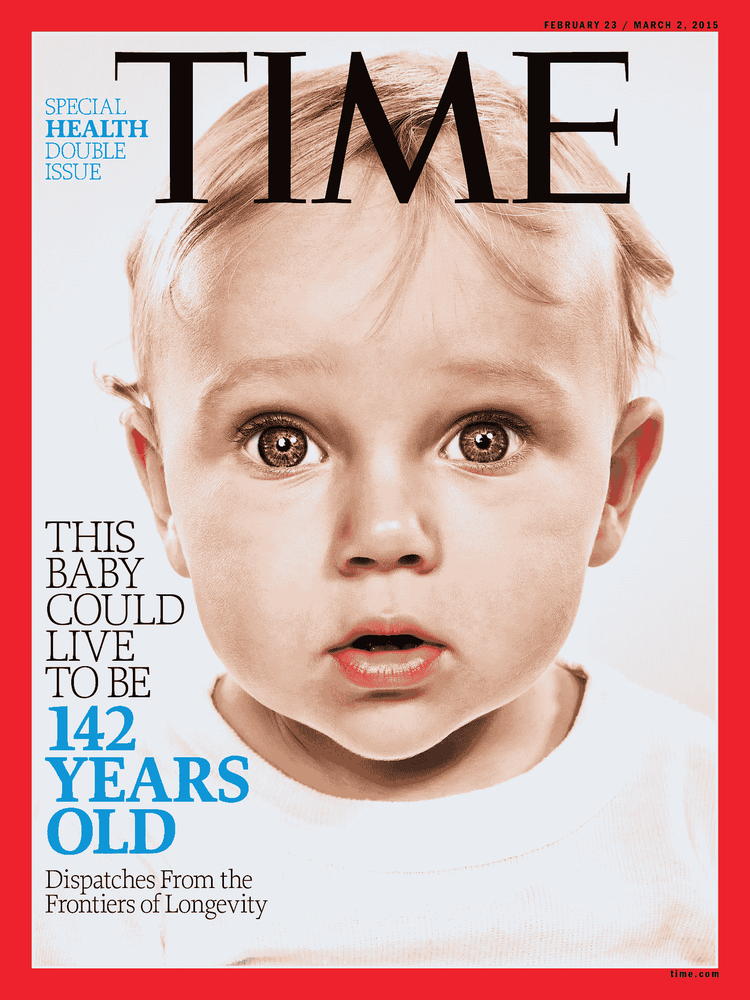

# 如何投资下一个世纪

> 原文：<https://medium.datadriveninvestor.com/how-to-invest-in-the-next-century-d8c542108fe1?source=collection_archive---------7----------------------->

关于美国人的健康，我们看到了两种趋势的融合。千禧一代和 Z 世代意识到他们食物的伦理和生态来源，但与此同时，他们外出就餐和购买熟食的比例比前几代人更高。到目前为止，这一领域的先行者之一 Blue 围裙的首次公开募股基本上不成功。在这个领域，有没有你正在关注的玩家，他们可能是这个领域的未来？

随着人们越来越富裕，他们的健康意识也越来越强。很明显，在过去的 50 年里，预期寿命提高了，人们进入了退休生活。因此，我认为我们将经历医疗保健从反应医学到预防医学的转变。我们习惯于认为药物可以帮助我们解决紧急问题，给骨折的手臂打石膏或者注射流感疫苗。我们将超越这一点，并试图在这些问题开始之前阻止它们，而你的营养肯定是其中的一部分。

同样，服务经济的出现也将在其中发挥作用。我个人在英国使用的一项服务是“用心厨师”。这家公司的有趣之处在于，它不是一顿随意的饭。这是为特定人群量身定制的。他们的膳食不含任何精制碳水化合物，重点是一顿好的、新鲜的膳食。

Blue Apron, the delivered-to-your-door meal kit brand that parses out ingredients for you

当讨论这些公司时，比如用心厨师和蓝色围裙，重点通常放在送货上，这些是送餐公司。我会说他们从事餐饮设计行业。有很多送餐服务，但与众不同的是，他们为你设计了一顿饭，并给你适量的正确配料。所以这也将消除浪费。我们大多数人现在在商店里买了我们需要的 120%的东西。

**彼得·泰尔说人类能够永生的日子已经不远了。也许他是夸大其词，但是，预期寿命预计将稳步增加。这将对医疗保健、退休、投资和总体工作产生深远影响。你认为延长寿命的哪些方面最重要？**

我认为当讨论寿命延长时，你基本上有两个年龄组:85 岁以上的人，和 85 岁以下的人。原因很简单，很多人都活到了 85 岁以上，但是到了这个年龄，就真的很难了。

显然，寿命远远超过 85 岁的人对退休、医疗保健、政府支出、个人理财和投资有着深远的影响。就在大约五十年前，人们在退休后不久就去世了。现在，人们必须将他们的退休储蓄延长 20 年或更长时间。

曼彻斯特正在做一些有趣的工作，他们正在质疑医学的传统智慧。他们说“我不确定当一个 85 岁的老人走进医院时，他们应该得到六种不同的药片。一个测量血压，一个测量心脏，等等。”他们正在寻找这些健康缺陷的根本原因，所以这些人可以服用一片，限制你需要服用的药物数量。这是一个将对制药业产生深远影响的想法，制药业已经处于一个有趣的阶段。由于人口老龄化，政府在医疗保健上花费更多，并将给这些制药公司带来压力。

为老年人提供住宿和监护的设施数量有限，需要增加。我认为目前还没有一个发达国家能正确对待这个问题，所以这里有很多机会。

如果你想玩一个残酷的世界观，经济学人最近发表了一篇关于吸烟者如何使经济受益的文章:他们支付高税收，早死，并且没有使用大量政府资金来治疗他们的老年。吸烟正在消亡，取而代之的是由糖分驱动的肥胖。然而，糖的消费者不会死得太早，也不会付那么多额外的税，而且通常对医疗系统来说更贵。

你如何看待“影响力”或“道德”投资的兴起？批评者指出，当谈到投资时，金融是第一位的，而支持者反驳说，他们投资的公司拥有更可持续的商业模式，并为长期增长做好了准备。你认为这将继续成为华尔街的一个利基市场，还是投资的未来？

我认为，这种上升可以部分归因于这样一个事实，即机构不希望被卷入有损其声誉的事情。他们越来越有品牌意识。例如，最大的主权财富基金是挪威，其资产超过 1 万亿美元，投资符合道德规范。所以我希望它能慢慢渗透。

当你离开品牌问题，你质疑这是不是好生意时，我认为是的。我认为避免公司卷入不道德行为可以帮助投资者躲避子弹。

**早在 2018 年 5 月，美国最高法院推翻了一项禁止体育博彩的联邦禁令。这是一个大数据可以颠覆的行业吗？传统上，体育博彩依赖于经营者比博彩市场更好地模拟事件的能力。正确的技术能让一款体育用品大幅超越市场上的其他产品吗？**

管理风险是体育博彩的重要组成部分。与银行的交易大厅不同，在那里他们可以对冲他们所做的大多数交易，这在体育博彩领域并不简单。当一只大鲸鱼进来，想在某一方下注时，他的分析可能比你的好。所以技术和数据当然是解决方案。

谈到制造业的未来，以及混合现实和机器人等技术的应用，你认为这一领域的明显赢家会有哪些不同？你认为是现有的公司适应气候并投资新技术，还是初创公司破坏了这个行业？现有企业如何做好准备？

我认为在最近的历史中，科技公司似乎是不可阻挡的，他们做任何事情都比别人做得好。我认为我们必须小心这种想法。

我们现在在汽车行业看到了这种情况。当谈到汽车生产时，像宝马和奥迪这样的德国公司有着惊人的控制力。例如，像特斯拉这样的公司有一辆很棒的汽车，但是他们有很多生产问题。所以你只要想一想，如果他们从宝马雇了一个高级人员来管理生产，他们现在就会杀了它。

当谈到将技术应用于制造过程时，看看当前的形势，你不得不假设一些现有的汽车公司会做得很好。我认为宝马最终会做得很好，因为他们真的很擅长制造汽车，他们知道制造。回到特斯拉，观察他们的制造问题，有一个重要的教训。颠覆者(特斯拉)并不总是做得更好。他们可能会改变一些事情。

这是一个你在很多行业都会遇到的问题:比如，科技公司会取代银行吗？看看亚马逊，他们没有进入这个领域并说“我们是这些技术人员，我们要颠覆你们的行业，并且做得比你们更好。”很简单，你买的时候他们就印好了。我们认为亚马逊是一家令人惊叹的技术公司，但这本书背后的技术从未改变，直到 Kindle 问世。他们改变了我们买书的方式，而不是书的制作方式。

**每十年我们都会看到一些行业消亡。你认为未来 10 年哪些行业会消亡？现在世界上的黄页和电话亭是什么？**

我认为大麻很有可能在很大程度上取代烟草。香烟已经奄奄一息，而 vaping 正在取而代之。一旦大麻完全被文化和法律取代，我认为从长远来看，烟草业很有可能收缩。

随着可再生能源的出现，石油和天然气开采行业崩溃的速度可能比我们想象的要快。

