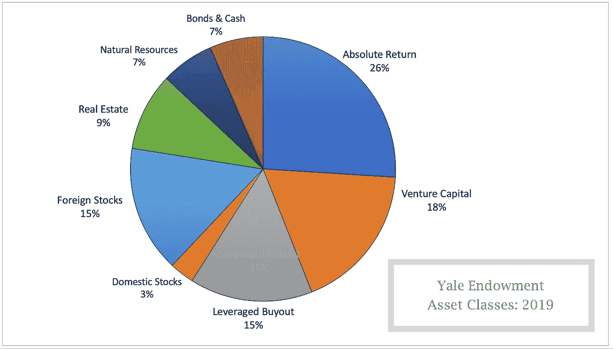
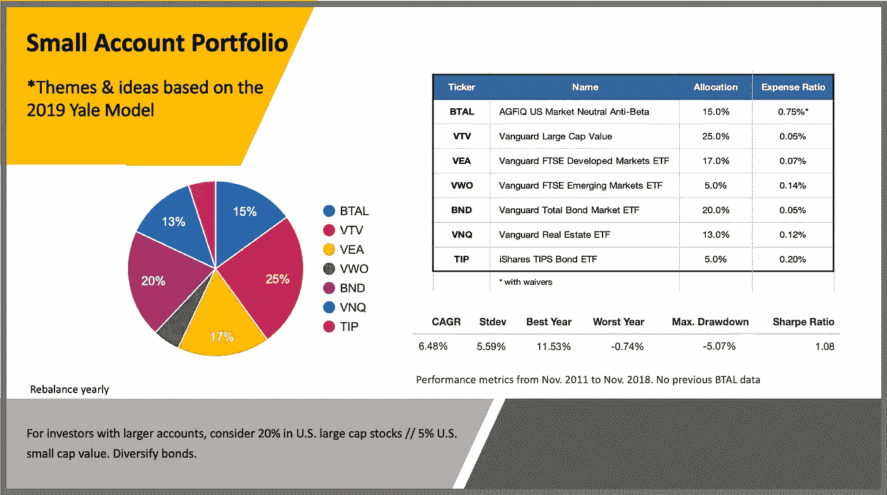
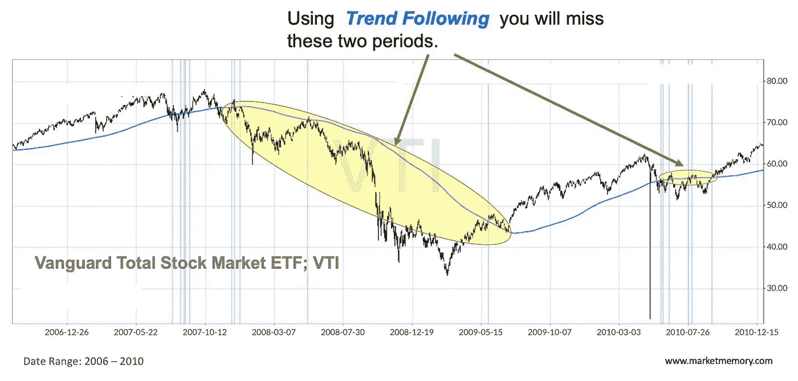
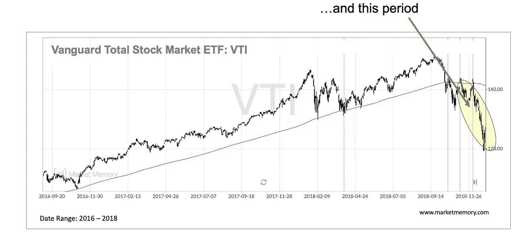

# 如何像耶鲁一样投资，即使你只有 25000 美元

> 原文：<https://medium.datadriveninvestor.com/how-to-invest-like-yale-even-if-you-have-only-25-000-fdd81a4918ff?source=collection_archive---------1----------------------->

对大多数投资者来说，股票市场的极端波动是令人焦虑的。但如果你是投资新手，账户规模很小，它们会让你痛不欲生。你用新婚夫妇的所有希望投资的钱不见了，或者至少是一部分。你的股票会像过去一样反弹吗？大概吧。但是没有人能百分百确定。

你开始问自己， ***“我现在做什么？”***

即使是最好的投资策略也不能保护你免受偶尔的损失，但是如果你的账户是随机股票和共同基金的集合，你可能会通过一个深思熟虑的策略做得更好。

现在，你面临一个新的困境: ***公布的这么多宣称高收益低亏损的投资策略，你怎么选择？***

耶鲁大学的捐赠基金是一个投资组合，20 年平均年回报率高达 11.8%，只有一年(2009 年)下跌。

耶鲁捐赠基金每年都在表现最佳的大型捐赠基金中排名第一或第二。

多年来，纽黑文的元老们改变了许多基金经理和大型投资者管理自己资金的方式。

考虑到这一点，你决定像耶鲁一样投资。

*但是你能吗？……大概不会:-(*

管理着 294 亿美元的资产，耶鲁的投资团队拥有你所没有的投资选择。他们雇佣了一批顶级基金经理，并协商低费用。他们不纳税，并且可以等待 20-40 年，等待某些投资开花结果。

你不能这么做。

然而，你可以做的还有很多。

在本帖中，我们将看看耶鲁是如何投资的，然后借鉴一些相同的想法和主题，精心设计一个适合小投资者的计划。

你可以这样做，即使是 25，000 美元左右的小额账户。

我会告诉你怎么做。

# **为什么你可以(也应该)效仿耶鲁捐赠基金的做法**

对于金融专业人士来说，“像耶鲁一样投资”已经成为一个受欢迎的主题。但并不总是这样。

1985 年以前，耶鲁投资于美国股票和债券，仅有少量外国股票和房地产。当大卫·斯文森(1980 年获得博士学位)被雇佣来管理这个投资组合时，情况发生了变化。早在这个概念流行之前，他就开始转向不同的投资(或资产类别)。他第一个将对冲基金风格的“绝对回报”基金作为一个独立的资产类别。(这些基金是为了赚钱而设计的，不管股市走向如何。)

耶鲁的投资组合回报攀升。

包括麻省理工学院、哈佛大学和普林斯顿大学在内的其他捐赠基金现在都遵循耶鲁捐赠基金的模式。除了 acadamia，基金经理和精明的个人投资者也注意到了来自康涅狄格州纽黑文的投资思路。

斯文森在《投资组合管理的先驱:机构投资的非常规方法》一书中发表了他的捐赠投资模型(自由出版社，2000 年)。他的第二本书，*标新立异。成功:个人投资的基本方法*(自由出版社，2005 年)是个人投资者的指南。两本书都强调多样化、长期视野和低费用。

> *尽管阅读茶叶来预测市场几乎是不可能的，但费用是个人投资者可以控制的一个领域。*

# 耶鲁现在在做什么？

大卫·斯文森和他的副手们认为，任何投资组合 90%的回报都可以用[资产配置](https://en.wikipedia.org/wiki/Asset_allocation)来解释(根据你的风险/回报承受能力投资不同的资产类别)。

*考虑到这一点，让我们看看耶鲁在 2019 年是如何投资的:*

## **另类投资(占总额的 59)**

*   **26% |绝对回报基金:**
    (这些是对冲基金风格的投资组合，试图在所有市场条件下取得正回报)
*   **18% |风险投资:**
    (耶鲁贷款给具有高增长潜力的早期公司。上世纪 90 年代，获奖公司包括谷歌和亚马逊。最近，耶鲁早期投资了脸书和 LinkedIn)
*   **15.0% |杠杆收购:**
    (这些基金借钱给一家企业的管理者，这样他们就可以回购该公司的控股权)

## **股票、债券、实物资产(占总量的 41)**

*   **3.0% |国内股票:**
    (包括被大量研究的美国大公司股票，股价流动性高)
*   **15.5% |外国股票:**
    (包括发达市场和新兴市场股票，以及基金经理选择的精选机会)
*   **9.5% |房地产:**
    (商业地产的投资为大学提供收入。作为 [*的真实资产*](https://www.investopedia.com/terms/r/realasset.asp) ，它们是对通货膨胀的对冲)
*   **6.5% |自然资源:**
    (对石油、天然气、林地、金属和矿业的投资提供现金流。作为一种全球性的真实资产，这些是对全球通货膨胀的对冲)
*   **6.5% |固定收益和现金:**
    (这些投资包括商业和政府债券的利息收入)

# **使用耶鲁主题的小账户投资组合**

现在，让我们看看你如何利用这一点来改善你的投资组合。我们首先列出你可以采用的耶鲁模式的主题:

*   **将投资分散到** [**【不相关】**](https://www.thebalance.com/what-is-asset-correlation-2894312) **资产类别**(这些是不同时上下波动的资产类别)
*   **包括长期投资**
*   **增加*实物资产*** (土地或房地产等硬、实物资产)作为对冲通胀的手段
*   **添加外国股票(股票)**因为从[许多指标来看，美国股票相对于外国股票都很贵](https://www.starcapital.de/en/research/stock-market-valuation/)，而更便宜的市场往往有更大的上涨潜力。
*   **包括一种** [**绝对回报**](https://www.putnam.com/individual/mutual-funds/absolute-return-funds/)**型基金，其目标是赚钱，不管股市走向如何。**
*   ****尽量减少费用****

**你的基金不能精确匹配耶鲁饼图，因为小投资者不可能投资杠杆收购或风险资本。**

**不管怎样，有了 25，000 美元，你会想把你的投资简化到三到六只基金。(如果你计划定期增加资金，拥有更少的资金更容易实现再平衡和增加。)以下是小客户在使用耶鲁的理念和主题时需要考虑的几点:**

*   **新兴市场股票和房地产可以作为你的长期投资。另外，这些投资与美国股市无关，所以你的资金不会同时上下波动。**
*   **与房地产(以房地产投资信托基金或 REITs 的形式)一样，[国债通胀保值证券](https://www.thebalance.com/how-do-tips-work-417128) (TIPS)也可以作为对冲通胀的工具。因此，您可能不需要添加自然资源基金。**
*   **为了最大限度地降低费用，可以考虑专门使用交易所交易基金(ETF)。这些是低成本、被动的基金，像股票一样交易。**

****每个类别都有数不清的交易所交易基金可供选择。对于你的投资组合，寻找高流动性(交易频繁)和低成本的 ETF。一个好的经验法则是寻找费用率(这是你的成本)低于 0.5%的基金。***

*   **对于绝对回报基金来说，所有市场都有许多为正回报而设计的 ETF。目前运作良好的一个选择是 AGFiQ 美国市场中性反贝塔基金(股票代码 BTAL)。BTAL 投资低波动性股票，做空高波动性股票。它是每年进行再平衡的成本较低的对冲基金类型的基金之一。这有助于你“低买高卖”。**
*   **考虑到所有这些，这里有一个小账户投资组合，它借鉴了耶鲁的理念和主题:**

**注意与耶鲁使用的资产类别的相似之处。然而，耶鲁大学的捐赠基金仍然会超过 ***，而且不小。*****

****

**你无法复制拥有数十亿美元的耶鲁的优势，但你可以利用市场时机技巧帮助缩小差距。**

**这将在下面讨论。**

****一种提高投资业绩的可选市场时机技巧****

# **任何经历过熊市的人都知道，当你的投资组合价值下跌 20%、30%甚至 40%时，袖手旁观是多么痛苦。许多投资者忍不住认输，并在错误的时间卖出。面对令人沮丧的损失，他们可能永远不会重新进入市场。**

**添加我们的定量(基于数据的)市场择时技术可以在熊市周期较长时减少损失，大多数熊市周期较长。**

> **择时策略已经存在了几十年，现在有几十种，也许几百种模型在使用。下面我们将重点介绍最简单也是最受欢迎的 [*趋势跟随* ***。***](https://www.trendfollowing.com/whitepaper/CMT-Simple.pdf)**

**使用趋势跟踪，你可以在“趋势”上升时买入或持有你的投资，在“趋势”下降时退出。**

> **每月只需要几分钟。以下是如何做到这一点:**

********

## **在这个月的最后一个交易日，对比你的每只基金的 [200 天简单移动平均线](https://investinganswers.com/financial-dictionary/technical-analysis/200-day-moving-average-1222) (200 天移动平均线)，检查它们的价格。*关于使用雅虎财经制作价格与 200 天均线图表的分步指南，请参见本文档***。****

*   *****买卖规则:*****

***当收盘价高于 200 天均线时，你将**买入**或**持有*****

*   ***当收盘价低于 200 天均线时，你将卖出你的股票，并兑现***
*   ***在指定的日子里，对你的每只交易所交易基金使用这种技术。一个月中的任何一天都是可以接受的，但应该是每月一次。*(一些投资者立即将收益转入高收益货币市场账户或债券基金，以赚取额外回报)****
*   *****一个月后重复**的过程***
*   *****忽略**中间的一切***
*   ***由于买卖的想法与你反复听到的标准的“买入并持有”投资建议相反，一些投资者无法理解。这太不一样了；太奇怪了。***

***如果这是你，*为什么不试驾一下呢？****

***试着在纸上交易几个月。或者，当模型发出“卖出”信号时，只卖出你一半的股票。(卖一半是梅班·费伯在 [*三位一体投资组合*](http://www.cambriainvestments.com/wp-content/uploads/2016/07/Trinity_DIGITAL_final.pdf) (2013，坎布里亚投资管理)中提出的手法。***

***应纳税帐户和递延税款帐户的趋势跟踪。***

## ***使用这里描述的方法，每年的购买和出售周期的数量是最少的，平均每只基金不到一次。这使得趋势跟踪适用于应税和免税帐户。*然而，出售可以引发资本收益，所以如果你有选择的话，将股票等波动性较大的资产放在一个延税账户中。在你的应税账户中持有波动性较小的资产，如房地产和固定收入。***

***Tim Fortier 已经证明了 160 日均线比 200 日均线更有利于收益最大化。其他专业投资者使用结合多个时间段和因素的算法。***

*   ***产生长期投资收益的最重要因素是资产类别的选择和多样化，所以首先使用这里模拟的投资组合或类似的投资组合。趋势跟随是其次。***

*****华尔街唯一的“免费午餐”*****

# ***资产配置被称为华尔街唯一的“免费午餐”。通过跟随多元化投资的领导者，耶鲁大学，你会了解到这个国家的一些顶级投资头脑在想什么。然后，你可以借用一两个想法，将它们应用到你的投资组合中。***

***使用*趋势跟踪*可以减少损失，让你更有可能坚持你的投资计划。不“认输”，你就能更快实现财务独立。***

***你将更少担心制造新闻的头条，花更多的时间追求你的梦想。你甚至可能开始期待打开那些季度账目报表。***

***重新开始投资你不兴奋吗？***

***Aren’t you excited to start investing again?***