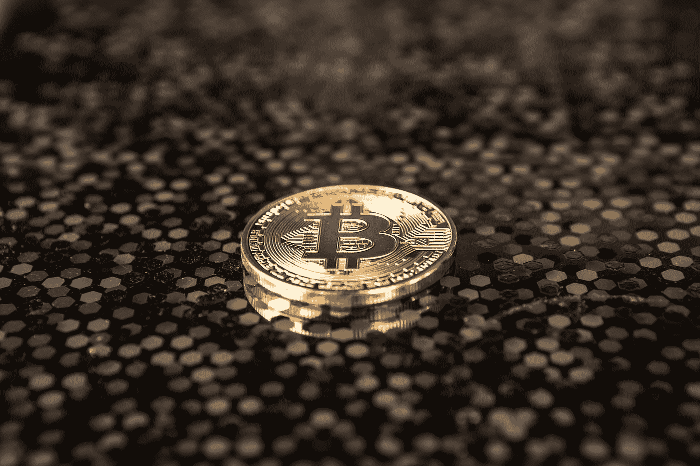

# 当你还是一文不名时，如何投资

> 原文：<https://medium.datadriveninvestor.com/how-to-invest-when-you-are-still-broke-fb6c35aa0209?source=collection_archive---------8----------------------->

Photo by [André François McKenzie](https://unsplash.com/@silverhousehd?utm_source=medium&utm_medium=referral) on [Unsplash](https://unsplash.com?utm_source=medium&utm_medium=referral)

> 破产了。

这个词最适合我们的财务状况。从薪水到薪水的生活真的很糟糕，我明白。我们拿到钱，然后有人走过来把钱抢走了。支付，支付和更多的支付。是的，这就是我们大多数人所说的“梦想成真”。

我也经历了同样的事情，认为我应该租一间一居室的公寓，开一辆破旧的车，过简单的生活。但不知何故，每当我试图存钱时，总会有一些事情出现，但我最终还是花掉了大部分薪水。

 [## 数据驱动投资的兴起|数据驱动投资者

### 当 JCPenney 报告其 2015 年 2Q 的财务结果时，市场感到非常震惊。美国零售巨头…

www.datadriveninvestor.com](https://www.datadriveninvestor.com/2019/02/28/the-rise-of-data-driven-investing/) 

## 费用是不可避免的

> 当你的薪水只够支付账单时，储蓄几乎不是一个选择。

对于任何从事普通工作的人来说，工资只够支付我们的账单。如果我们继续责备我们的花费，它将永远不会停止。赚钱和支付账单是生活的连续体。摆脱困境的唯一方法就是投资一些东西。

Photo by [Emre Gencer](https://unsplash.com/@reo?utm_source=medium&utm_medium=referral) on [Unsplash](https://unsplash.com?utm_source=medium&utm_medium=referral)

你买了一杯咖啡，付了账单。你买杂货，哦——有一个大的！你加了油，你的信用卡就要花掉一大笔钱。每月的保险费，水电费，哦，天哪，那辆破车在你下班回家的路上抛锚了！账单，到处都是！

但是在你几乎不能储蓄的时候，你怎么能投资呢？这似乎是一个没有答案的问题。这可能需要冒一些风险，有时甚至会让你的银行账户余额变成负数，但最终，这是值得的。

## 明智地花钱

既然费用无法避免，为什么不将其转化为投资呢？从技术上讲，大企业也是这样做的。如果一个企业买了一台巨大的数控机床，却让它呆在一栋大楼里，这是一笔开支。但是，如果机器运行并生产出有利可图的零件，这就不再是一项支出，而是一项投资。

把同样的原则应用到你的生活中。我说的‘花’，不仅仅是钱的方面，还有时间。当你为你的钱努力工作时，你值得花它。但与其花在咖啡、彩票和房租上，还不如投资点什么。

Photo by [Priscilla Du Preez](https://unsplash.com/@priscilladupreez?utm_source=medium&utm_medium=referral) on [Unsplash](https://unsplash.com?utm_source=medium&utm_medium=referral)

买一辆更好的车，它会带你去很多地方。投资买房；它会给你带来公平。投资像书这样的小东西。投入你的时间去创造一些东西；它会给你的生活增添意义。在旅游上投入时间和金钱；它会给你一次无价的经历。

## 重视你自己

我们大多数人不想为自己投资的原因是因为我们不重视自己。你可能是一个做着简单工作挣着微薄收入的人。但那不是你的价值所在。

今天世界上最富有的人在以前没有那么值钱。但他更看重自己，开始投资自己。那也是你必须做的！

Photo by [Riccardo Annandale](https://unsplash.com/@pavement_special?utm_source=medium&utm_medium=referral) on [Unsplash](https://unsplash.com?utm_source=medium&utm_medium=referral)

不要让别人决定你的价值。永远不要满足于你认为自己的价值。继续从下往上构建。这应该足够让你开始了。

## 不要期望立即得到回报

你知道有多少投资了数百万美元的企业仍然没有盈利吗？这些企业在亏本经营，在企业界，这很常见。我们只看营业额，不看利润。

Photo by [Roberto Nickson](https://unsplash.com/@rpnickson?utm_source=medium&utm_medium=referral) on [Unsplash](https://unsplash.com?utm_source=medium&utm_medium=referral)

如果我们把这一点应用到我们的个人生活中，我们就会理解投资的重要性，即使我们最初没有获得利润。这需要时间，但永远记住，投资比花钱更好。

你可以投资，但最终还是会破产，但这是值得的！