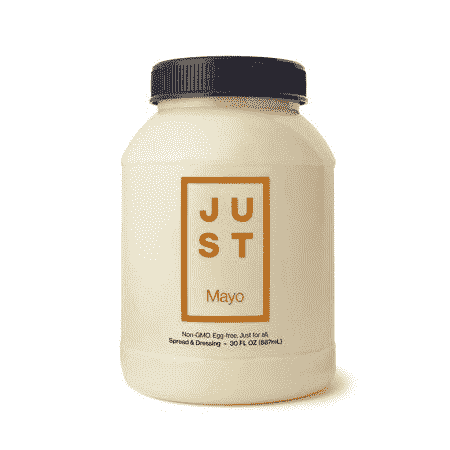
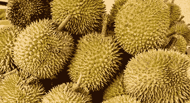
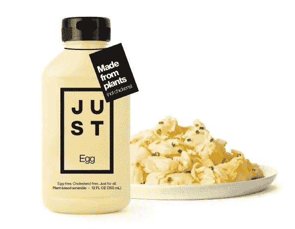
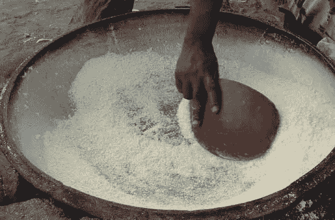
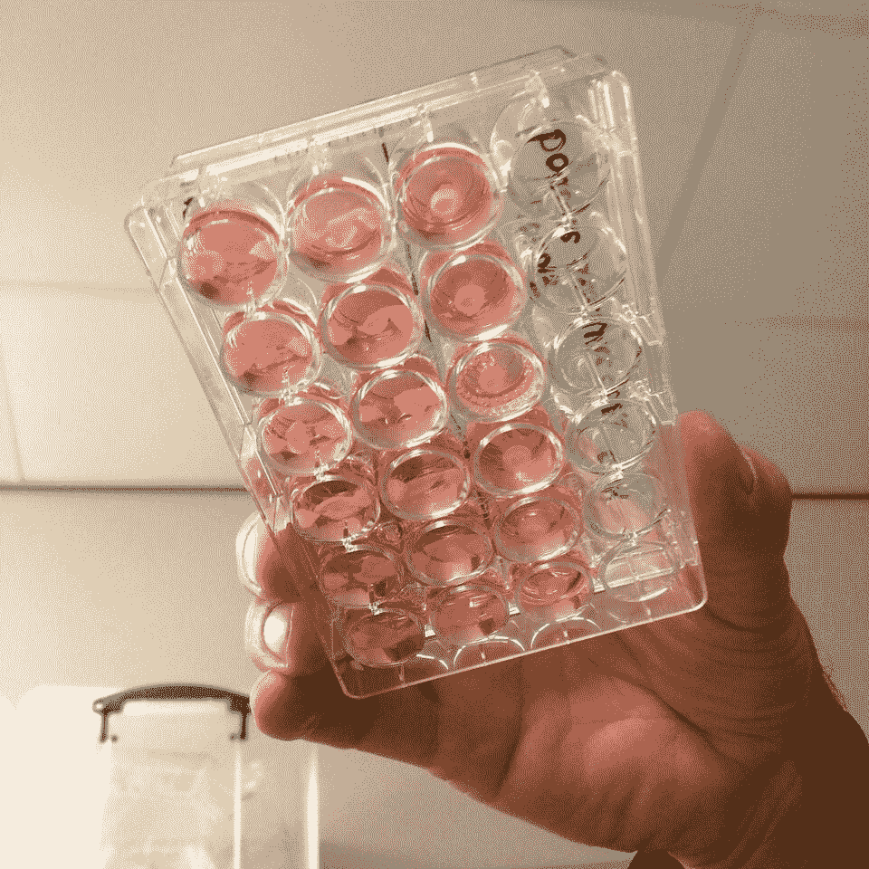

# 如何改变世界制造食物的方式

> 原文：<https://medium.datadriveninvestor.com/how-to-just-change-the-way-the-world-makes-food-33e1fa83a5f4?source=collection_archive---------23----------------------->

如果你没听过，我再说一遍:我们需要**改变**我们的饮食方式，因为我们目前的食物系统是**不道德的**、**对环境有害的**、**不健康的、浪费资源的**和**抗生素。**

想要理由吗？

畜牧业产生的温室气体比所有飞机、汽车、火车、卡车、直升机、游轮和摩托车的总和还要多。

饲养动物使用了我们 80%的抗生素。人类只使用我们自己生产的 20%的抗生素，然而这些抗体在农场动物身上的传播正在产生抗生素耐药性。

我们喂给动物的 97%的食物在它们的最终产品中都找不到。鸡是生产食物效率最高的动物。他们有 800%的浪费率。**我们最高效的肉类来源有 800%的浪费率。**

每年，光是奶牛就需要 2.56 亿个奥林匹克规格的水池来为我们生产牛奶。

自 1970 年以来，90%的亚马逊森林因牲畜生长而被砍伐。你的汉堡必须非常美味才能弥补整个地理区域的损失。

地球上 30%的土地被分配给生长中的牲畜。全球有 10 亿人住在贫民窟，但至少我们的牛和猪有家。

别担心。他们的家没那么好。事实上，它们在工厂化农场被养肥，超过了它们的自然肥胖率，然后被关在一个小笼子里几个月，最后，当它们出去玩耍，和它们的家畜伙伴一起呼吸新鲜空气时，它们正在去屠宰场的路上！培根牛肉！

统计数据还在继续。一句话:这是一个糟糕的系统。这就是像这样的公司存在的原因。

# JUST 的任务是打破目前的饮食方式。

JUST 是一家寻找植物性食物替代品的公司。世界上有成千上万种未被探索的植物，我们正致力于利用技术来了解这些未被探索的植物的蛋白质结构。

他们的使命是**改变我们的饮食方式**，就像湾区的其他创业公司一样。而且让每个人都能获得健康的植物性食物。

目前，我们主要使用大豆和玉米作为食物替代品。世界上有超过 300，000 种植物有可能比玉米或大豆更好。有无数种植物，但我们只会用玉米和大豆来制作替代食物？

# JUST 正在利用人工智能探索所有植物，寻找可能的食物替代品

他们正在做的是收集植物数据，并将其存储在一个平台上，以比较不同的植物。

在对凝胶化和 T2 发泡等特性进行测试后，研究人员能够建立一个平台来了解这些植物，并找到它们的潜在用途。他们在分子水平上研究植物的功能，并寻找利用它们的机会。

他们有一个人工智能系统，研究不同植物样本的特性，并能够根据它们的特性和潜在用途对植物进行分类。人工智能根据植物在不同分子测试中的表现将它们分为不同的类别。基本上创建了一个关于所有植物蛋白质结构的**植物字典。**

有了这本字典，他们就能够寻找这些植物可以替代的可能用途。例如，绿豆是一种像鸡蛋一样胶凝和烹饪的豆类，被用来代替鸡蛋。

Just is trying to develop a food library of the protein information of the all the plants on earth.

# 这些外来植物已经改变了我们制作蛋黄酱等简单食物的方式。

他们开始只用蛋黄酱。一种蛋黄酱的替代品，使用黄豌豆和柠檬，味道像真的一样。他们的普通蛋黄酱已经演变成墨西哥卷饼、辣酱、大蒜、松露和超赞的酱蛋黄酱。所有的蛋黄酱都是基于黄色的加拿大豌豆，只是添加了不同的口味。

他们还演变成炒鸡蛋的替代品，只有鸡蛋是由绿豆(行为和烹饪像鸡蛋)和姜黄制成的味道。只是鸡蛋可以用在很多方面:三明治、法式吐司、煎蛋卷等。

**Just Power Gari**

Just 最有趣的产品之一是他们的**动力加里**。这是利比里亚使用的一种负担得起的燕麦片替代品。它完全以植物为基础，来自利比里亚的植物，旨在成为穷人的可持续和低成本的食物选择。

此外，他们的植物图书馆允许他们探索替代沙拉(和其他)调料选择和饼干面团。

# 没有脚的肉——刚刚加入养殖肉运动

Just 决心在未来构建一个更大的图景，让我们的世界在一个以植物为基础的食物系统中茁壮成长。他们已经开始探索植物选择。

但是食品系统中最大的炒作之一是**养殖肉**。如果你没听说过(说真的，怎么会？)[在这里看我对它的研究。](https://medium.com/@igrandic03/meat-from-petri-dishes-instead-of-animals-373d2d83ed38)干净的肉是未来我们吃肉的方式，但是**这项技术最大的挫折之一是在可持续的培养基中培养细胞。**

Cell cultures are grown in a serum (pink) that essentially “grazes” the cells.

现在的过程是取一个细胞样本，放在有培养基的培养皿中，培养细胞…收获到肉中。(…零件更复杂)。目前，唯一能让细胞快速生长的有效培养基是 T2 胎牛血清，小牛血清。从字面上打败了没有肉的肉。胎牛血清为细胞生长提供了完美的营养。然而，这种血清来自一种动物，而且超级贵。

为了让干净的肉冲击和扰乱市场，它需要是负担得起的。而这正是我们用胎牛血清无法实现的。我们需要一种基于植物的替代营养培养基…嗯，一个植物图书馆会很好，这样我们就可以了解适合的植物…

哦，等等！

正在研究清洁的绞肉机。但是他们正在利用他们的植物蛋白知识来发现一种可以利用植物培养肉细胞的培养基。每天都有成千上万的科学家和研究人员研究这些细胞行为，寻找食物替代品，因为他们希望有一天**能改变这个系统。**

在食品工业领域，JUST 是一家非常酷的公司。毫无疑问，在一些其他创业公司的帮助下，他们将影响食品行业，创造可持续的植物技术。查看它们:

 [## 只是|任务

### 我们的使命是帮助建立一个食物系统，让每个人都能享用美味、营养的食物。

www.justforall.com](https://www.justforall.com/en-us/stories/mission) 

如果你喜欢阅读这篇文章，请点击我的 [Linkedin！](https://www.linkedin.com/in/isabella-grandic-000b25172/)