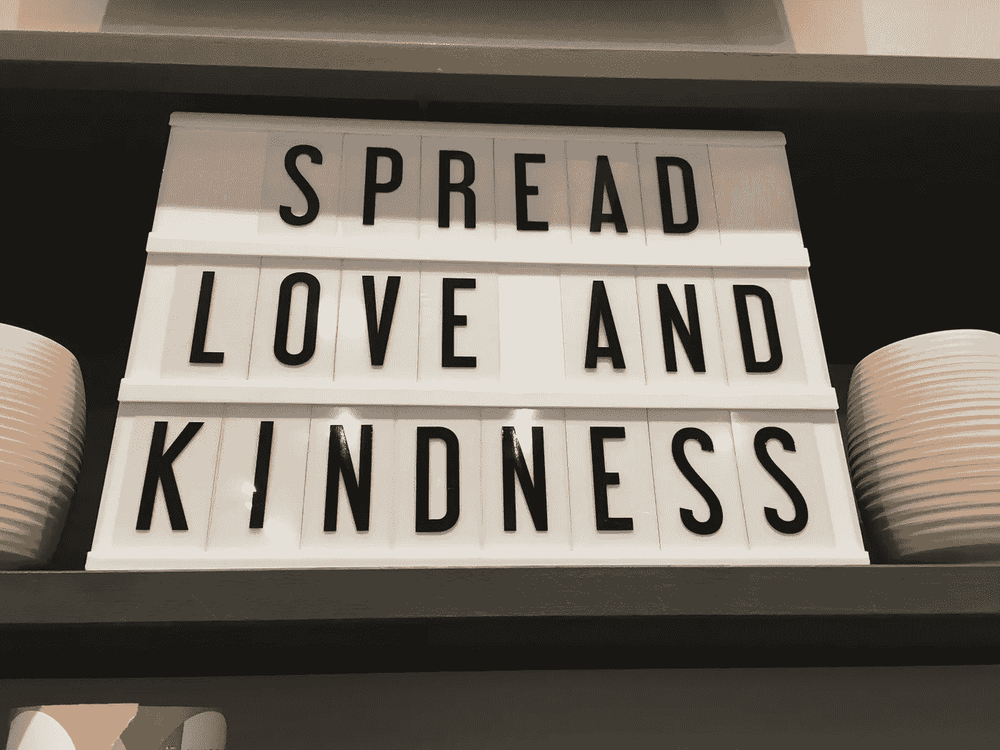

# 当事情分崩离析时，如何继续前进

> 原文：<https://medium.datadriveninvestor.com/how-to-keep-moving-forward-when-things-fall-apart-46b117e80ff5?source=collection_archive---------2----------------------->

Love and honour yourself. Spread love. Thank you to [Silk Road Tea](http://silkroadteastore.com/) for this pretty sign!

当事情不像我们期望的那样发展时，会发生什么？我们对自己感觉不好。有时我们猛烈抨击别人，但通常我们会发泄在自己身上。

我们没有记住，作为人类，我们都有情感，有这些情感是正常的。作为社会动物，我们寻求确认和认可我们的归属。引用布琳·布朗的新书中的话，她说*“不要在这个世界上寻找你不属于这个世界的证明。你总会找到它，因为你已经把它当成了你的使命。不要在人们的脸上搜寻你不够格的证据。”*

**寻求建设性的反馈**

当反馈可能是负面的或者是你不想听到的事情时，寻求反馈是很有挑战性的。换个角度想想，如果是信息让你变得更好呢？保持开放的观点，相信别人真的想帮助你，这将使询问和接受反馈的过程更容易。

根据[托尼·罗宾斯，](https://www.tonyrobbins.com/) *“优质问题创造优质生活。成功人士会提出更好的问题，结果，他们会得到更好的答案。”与其问自己“为什么这总是发生在我身上？”，我用“我能从这次经历中学到什么？”当然，这种转变并不总是自动发生的，有时需要一段时间才会发生。不过，我练习得越多，就越容易；就像生活中的任何事情一样。*

**向前推，就这么做**

根据[布莱恩·特雷西，](https://www.amazon.ca/Eat-That-Frog-Great-Procrastinating/dp/1576754227) *“如果你必须吃两只青蛙，先吃最丑的那只。这是另一种说法，如果你面前有两项重要任务，先从最大、最难、最重要的任务开始。”*

做一天中你需要首先做的最难的事情，以获得动力和快速的胜利。早上，我的大脑自动想要检查电子邮件和社交媒体，所以我必须不断挑战自己“吃青蛙”遵循一贯的早晨惯例是我一直在努力做的事情，以便为一天中发生的任何事情做好准备。我一直在关注 Hal Erod 的《奇迹的早晨》。早晨的例行公事包括肯定、冥想、身体运动、阅读、写作和肯定。

**尊重你所在的地方**

学习新技能需要时间和练习。这甚至可能是一个具有挑战性和重复性的过程。想想你小时候学走路的时候。你摔倒了多少次，才开始轻松不费力的走路？作为成年人，我们变得害怕尝试新事物，因为我们以前被烧伤过。尊重你所在的地方；接受并欣赏你生活中的一切，你会遇到更多美好的事情。

A reminder that you are enough! Thank you [Urban Outfitters](https://www.urbanoutfitters.com/en-ca/?matchtype=e&network=g&utm_campaign=Google&utm_term=CA%20-%20Urban%20-%20Brand&utm_content=urban_outfitters&adpos=1t1&rkg_id=h-ab557425543201470011ff9cffabfaa2_t-1522370298&utm_medium=paid_search&mrkgcl=609&device=c&creative=259340714796&mrkgadid=2988638076&cm_mmc=SEM-_-Google-_-CA%20-%20Urban%20-%20Brand-_-urban_outfitters&gclid=EAIaIQobChMImoP5peeS2gIVRmB-Ch1RKQtLEAAYASAAEgLQ-_D_BwE&utm_source=SEM) in the Marina, San Francisco for this great display window!