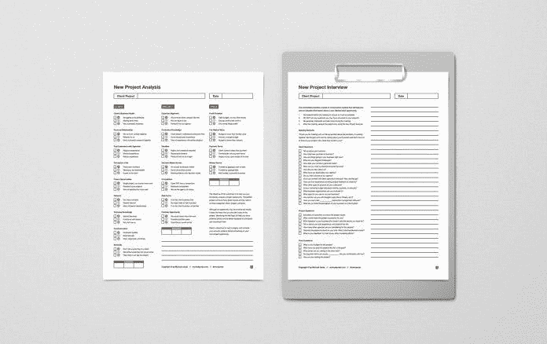

# 如何知道你的价格是正确的

> 原文：<https://medium.datadriveninvestor.com/how-to-know-your-price-is-right-78ee160a8a32?source=collection_archive---------7----------------------->

## 当你是一家计算价值的企业时，挑战会成倍增加

你收多少钱？这对初创企业和自由创业者来说都是一个难题。什么叫合理？谦虚是你的败笔吗？

[迈克尔·詹达](https://twitter.com/morejanda)和[索尼娅·哈里斯](https://twitter.com/harrisonia)每天都在思考这些问题。

Janda 是创意专业人士、设计师的商业教练，也是“[烧掉你的投资组合](http://michaeljanda.com/burnyourportfolio/)”的作者他“分享[系统和策略](https://www.youtube.com/channel/UCMtMijHO1MVzw_Mjkh7_amw)来帮助有创造力的自由职业者和代理公司充满信心地经营他们的生意，赚更多的钱。”

哈里斯是广告设计机构和视频制作公司 [Vizbrandent](https://twitter.com/Vizbrandent) 的独立策划人、活动经理、展览经理和首席运营官。她擅长领导、沟通和会员。

 [## 零工经济如何改变未来的就业前景|数据驱动的投资者

### 随着自动化的发展和 Z 世代的出现，劳动力的构成和动态正在发生变化…

www.datadriveninvestor.com](https://www.datadriveninvestor.com/2018/12/19/how-is-the-gig-economy-changing-the-future-jobs-landscape/) 

在《我们谈生意》的一次对话中，Janda 和 Harris 权衡了自由职业者在给作品定价的同时保持盈利的方法。

“这一切都始于了解你的生产成本，”詹达说。“我称之为‘生产成本’"

他依靠这个简单的计算:

*   理想情况下，你知道做生意的成本。把你每个月的管理费用加起来——办公空间、你的工资、软件成本——所有你需要的运营成本。
*   用这个数字除以你一个月的工作时间。假设您的业务每月成本为 5，000 美元，您可以每周完成 30 小时的计费工作时间。用 5000 除以 120(30x 4 周)。这产生每小时 41.60 美元。
*   现在你知道你每小时的成本了。你可以计算生产成本。取每小时 41.60 美元，然后用它乘以您预计项目需要的小时数。
*   如果你估计这个项目将花费你 20 个小时，用 41.60 美元乘以 20，就是 832 美元。这是你的成本，而不是你向客户收取的费用。
*   为了盈利，你必须知道你的生产成本，在这里是 832 美元。现在你可以向客户提出一个有利可图的价格。例如，收费 1500 美元、1700 美元或任何你想加在你的项目上的价格。

# 没有幸运的猜测

简达说:“关键是，如果你不了解作品的*制作成本*，你就不能为你的作品定价盈利。"你做这个项目要花多少钱？"

 [## 商务攀登者拥抱他们的夏尔巴人

### 教练让人们和团队更上一层楼

medium.com](https://medium.com/datadriveninvestor/business-climbers-hug-their-sherpas-ab2f431041e) 

例如，教练可能会考虑对他们贡献的价值而不是时间收费。

“我不主张按小时收费，”詹达说。“你需要了解你的*生产成本*，这样你才能为这个项目出价高于这个价格。许多自由职业者不了解他们的成本，这使得盈利成为一种侥幸的猜测。”

对咨询师来说，他们应该了解客户的财务状况，并询问他们的预算是多少。这决定了它是否值得谈判或走开。

“这是一个很好的策略，”詹达说。“了解他们的预算。知道你做这个项目要花多少钱，市场价格是多少——市场价值。如果那些数字找不到和谐，你就走。”

根据制作成本给作品定价是一个很好的开端。

哈里斯说:“根据生产成本计算价格是一个组成部分。"其他因素包括你的经验，你独特的品质和你服务的平均价格."

这有助于关注竞争。

“如果你的所有竞争对手都要价 2000 美元，你就不会想设计 200 美元的商标——即使你能获利 200 美元，”Janda 说。“你必须知道自己作品的市场价值。

“根据对三个变量的分析给自己定价:生产成本、市场价值和客户预算，”他解释他的过程时说:

*   计算你的生产成本，这样你就知道你的盈利底线。你永远不可能以低于生产成本的价格来盈利。你首先需要知道那个变量。如前所述，假设我们的生产成本是 832 美元。
*   接下来你需要知道市场价值——其他人为你提供的服务收取的费用。假设你正在设计一个标志，而你的竞争对手要价 1500 美元。这就变成了市场价值。
*   最后，我们有客户预算。在项目的发现阶段询问客户他们的预算。比方说，你问客户，他们说他们已经拨出 1400 美元的标志设计。
*   接下来你用这三个变量来决定你的价格。记住，832 美元是你的生产成本，所以你不能低于这个价格。如果客户预算是 1400 美元，你可以试着卖得更高，但这是他们希望的范围。1500 美元是市场价值。

# 市场价值的变量

“在这种情况下，我可能会把这个项目的价格定在客户预算 1400 美元左右，”Janda 说。“我知道它们离市场价值不远了。我也知道我的生产成本是 832 美元。因此，我将在 1400 美元的基础上赚取可观的利润。

“知道了这三个变量，你就可以充满信心地给作品定价，”他说。“例如，如果你制作作品的成本是 2000 美元，而客户的预算是 1500 美元，你知道如果你按照他们的预算进行项目，你会赔钱。”

 [## 尽情享受你一天中的每一分钟

### 自由职业者拥有完全自由的力量

medium.com](https://medium.com/datadriveninvestor/feel-free-to-enjoy-every-minute-of-your-day-cae2b4ec2655) 

Janda 给出了其他比较:如果市场价值是 10，000 美元，客户预算是 5，000 美元，但生产成本是 4，000 美元，即使客户远低于市场价值，也要考虑做这个项目。

“在这种情况下，你可能需要工作，但仍能盈利，”他说。“这三个变量——生产成本、市场价值和客户预算——成为您自信定价的指南。

“记住成本是我们盈利的决定性因素，”Janda 说。"成本包括运输费、电话费和材料费，再乘以 1%就等于利润."

伟大的战略需要大量的精神资源和大量以人为中心的设计。在对产品收费时，有经验的企业家会警惕过度承诺。

“要非常小心地保证结果，”詹达说。“这是有风险的。我个人从不保证结果。你控制不了的变量太多了。”

考虑到核心因素，他一头扎进了价值定价。

Janda 说:“价值定价的理念是，你根据你为客户创造的价值来定价。“这个想法是好的，但执行起来往往很糟糕。

“你为客户提供战略服务，并假设你的想法将在下一年为他们带来 10 万美元的利润，”他说。“价值定价的理念是收取一定比例的费用，比如 2 万美元或 20%。”

# 菜单上的费用

在 Janda 看来，这导致了许多问题:

*   你怎么知道这项工作会产生什么结果？在项目实施时，这只是各方的猜测。
*   很多项目类型没有切实的回报。假设你为一家餐馆设计了一份新菜单。那一年对公司有多少“价值”？这很难说，也许投资回报为 0 美元，但这并不意味着企业不需要它。
*   当你说你的想法将产生 100，000 美元的业务，并提议向客户收取 20，000 美元——但这项工作的*市场价值*是 10，000 美元——是什么阻止了客户去找竞争对手以节省 50%的成本？大多数人都会这么做。

Janda 说:“对我来说，我的 iPhone 每年可能值 20 万美元的 T4 价值。“然而，苹果不能通过向我收取 4 万美元的价格来评估我的价值。我会换成三星手机，每年节省 39500 美元。

“并不是所有东西都可以定价，但许多创意者很少尝试，”他说。

 [## 为一生的自由职业生涯做好准备

### 自由职业者可以最大化公司的生产力

medium.com](https://medium.com/datadriveninvestor/brace-for-the-freelancing-ride-of-a-lifetime-5ae72ea07c6e) 

企业家不需要坚持市场价值价格。

“有时你可以收取比市场价值高得多的费用，但前提是你是基于声誉来销售的，”Janda 说。“客户肯定在想，‘没有人能比你更好地解决这个问题。’

“当他们那样想的时候，你就可以收取很高的费用，”他说。

哈里斯冷眼看待基于价值的定价的变量。

“虽然你想根据别人对你的产品或服务价值的看法来定价，但 T2 人是善变的，”她说。“每个人都不会对相同的独特物品赋予统一的价值。

哈里斯说:“顾客可能某一天非常喜欢某样东西，但过后不久就改变了。”。“如果没有‘其他条件不变’——所有条件都相同——在营利性企业中使用基于价值的定价是一种冒险的策略。”

她说，在提案中包含价格选项显示了几件对你有好处的事情:

*   已准备
*   您了解客户在合同时间对捆绑产品的需求，以及定期单点产品的需求。
*   客户看到你愿意和他们一起工作，同时自信地展示你的价值。

Janda 说:“*永远，永远，永远*提出你的建议和价格。”。永远不要，永远不要，永远不要给他们发一个号码。

“生意就是关系，”他说。“与你的客户建立个人关系。生意是关于信任的。你必须向客户解释你将为他们做什么。提出你的建议。解释你对他们问题的解决方案。然后谈价格。”

# 销售解决方案

从理解客户有问题开始。

“你的提议概述了你将如何解决他们的问题，”詹达说。“在你的客户接受了你对他们问题的解决方案后，通过你的建议书，你就可以告诉他们合作的代价了。

“问题。解决方案。价格，”他说。“当你在这个流程中提出你的建议时，客户应该说，‘是的，这就是我的问题。哇，我想要那个解决方案。我会不惜一切代价找到解决方案。如果你做对了一个提议，这就是结果。"

 [## 合理的价格让你物超所值

### 计算出你的价值的黄金地带

medium.com](https://medium.com/datadriveninvestor/smart-prices-pay-you-the-best-value-4ceafe0bdf8b) 

Janda 然后解释了价格选项。

“这使用了两种销售技巧:价格分类和价格锚定，”他说。“简而言之，通过向客户展示更高的价格选项—价格锚—他们认为中低档选项更实惠。

“试着说服你的客户增加他们的项目预算，”他说，用了三个价格等级:

*   选项 1:他们所要求的，或者最低的预算。
*   选项 2:物有所值。
*   选项 3 是你的价格锚，让别人看起来更便宜。

“通过使用括号和价格锚，你可以帮助客户决定中间包，”Janda 说。“他们认为，‘我花不了多少钱就能得到更多。’"

哈里斯说，与客户的合作远在第一次价格讨论之前就开始了。

她说:“在我们与潜在客户进行定价对话之前，我们必须确定我们想要的客户的类型。“我愿意放弃那些不理解为*质量和价值*付费的潜在客户。”

以下是 Harris 掌握与潜在客户进行定价对话的关键:

*   使用并坚持清晰沟通的透明度。
*   解释一下“双赢”这是你需要的，这是我能提供的。简单明了。
*   包括年中采购的单品选项。

# 数字的力量

“了解你的数字，”詹达说。“你必须了解生产成本、市场价值和客户预算。这些数字让你在定价对话中更有力量。

“给自己写一份定价对话脚本，”他说。“写下你将在定价对话中使用的短语。然后*练习*剧本。就像任何事情一样，你可以通过练习来提高。”

 [## 关系是你最大的投资回报

### 商业和个人投资不仅仅是金钱

medium.com](https://medium.com/datadriveninvestor/relationships-are-your-greatest-return-on-investment-8b0c254281b5) 

最后一步可能是最关键的。

“不要害怕客户，”詹达说。“在谈论定价时，你必须鼓起信心和自尊。了解你的数字和练习对话可以帮助你做到这两点。

“许多人把时间浪费在探索会议上，提出建议，把工作推销给那些一开始就负担不起的客户，”他说。“你必须在第一次探索会议上询问预算。这将为您节省时间和金钱。”

**关于作者**

吉姆·卡扎曼是拉戈金融服务公司的经理，曾在空军和联邦政府的公共事务部门工作。你可以在[推特](https://twitter.com/JKatzaman)、[脸书](https://www.facebook.com/jim.katzaman)和 [LinkedIn](https://www.linkedin.com/in/jim-katzaman-33641b21/) 上和他联系。

*原载于 2019 年 12 月 5 日*[*https://www.datadriveninvestor.com*](https://www.datadriveninvestor.com/2019/12/05/how-to-know-your-price-is-right/)T22。