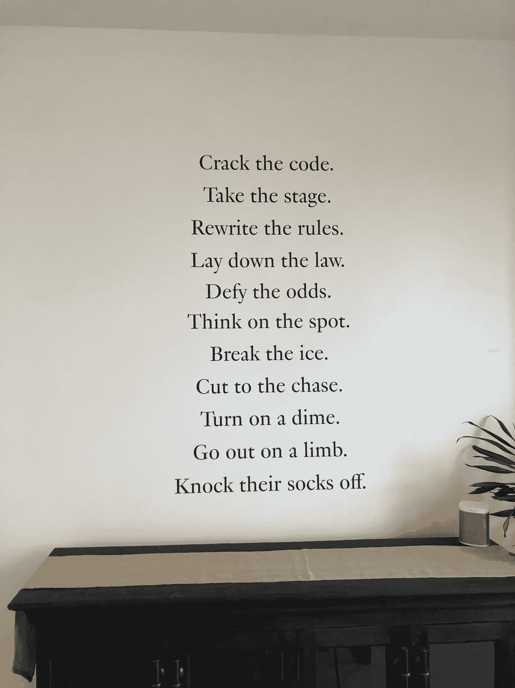

# 如何与你喜爱的品牌建立合作关系的 5 大技巧

> 原文：<https://medium.datadriveninvestor.com/how-to-land-partnerships-with-brands-you-love-7ab3a96e51b9?source=collection_archive---------31----------------------->

Quote from [MM.LaFleur](https://mmlafleur.com/)

有几个人找到我，问我如何与品牌打交道。我想与真正让我兴奋的人和品牌联系一直是我的一种激情。这篇文章是基于我个人的经验和对我有用的教训。

当我开始写我的健康博客时，我写博客的目的是激励自己和他人找到健康的想法来改善我的身体健康。然后，博客发展了——从[采访 SoulCycle](https://lovehealthandwellness.wordpress.com/2016/07/07/soulcycle-in-the-castro/) 的一名讲师到评论[的产品/服务](https://lovehealthandwellness.wordpress.com/2018/12/04/simple-snacking-with-rxbar/)。

随着我开始更频繁地建立关系网，和更多的人交谈，我意识到了联系和把人们聚集在一起的力量。不管一个人看起来有多成功，每个人在生活的某个方面都需要支持。如果你在生活的某个领域真的成功了，很有可能，你生活中还有其他领域需要改进。这种情绪是托尼·罗宾斯的好意。

> “如果你不成长，你就要死了。”—安东尼·罗宾

值得注意的是，伙伴关系可以发生在许多不同的层面。可以有付费的合作关系，也可以有免费的产品赠送给你(以换取评论，有时甚至没有评论)。因此，如果你没有获得令人兴奋的付费合作伙伴关系，所有令人兴奋的免费产品与你梦想的品牌，这一切都很好。只要坚持行动，记得要感激这段经历。

以下是我关于如何与品牌打交道的 5 大技巧:

1.  真实:做你自己。对我来说，我喜欢问问题，以了解对方来自哪里，并了解我如何才能最好地提供帮助。我喜欢把做类似事情的人联系起来，通过分享他们的想法和他们正在做的事情来进行协作和创造更大的协同效应。如果可能的话，我要求通过电话而不是电子邮件与个人联系，进行真正的人际互动。我喜欢事先在 LinkedIn 上对这个人进行调查，以了解我在和谁说话。
2.  反馈:我们总能改进。品牌正在寻找变得更好的方法。研究对反馈持开放态度的品牌，并与他们建立联系。我自己也接触过一些品牌，看看能否测试他们的产品并给出反馈。在很多情况下，我得到了一个免费的产品。
3.  积极主动:我追随我所热爱领域的影响者(例如健康与保健、个人发展、科技、时尚)，并从他们的 [Instagram](https://www.instagram.com/) 订阅源中了解新品牌。我喜欢接触那些与众不同的品牌。我知道，当你没有很多粉丝或者觉得你在[脸书](https://www.facebook.com/)的页面上没有足够的“喜欢”时，接触品牌有时可能会令人生畏，尽管这一切都是为了让你自己去尝试一下。看看这家公司是否有你可以申请的[代销商/合作者页面](https://well.ca/affiliates)。
4.  采取行动:小行动成就大事。我喜欢杰夫·奥尔森的书《边缘》。例如，发送冷冰冰的电子邮件，对你喜欢的公司进行调查，与脸书团队中的人联系，询问并关注你想要什么，这些都是推动你向梦想的方向前进的动力的好例子。想想你每天可以采取的小行动。这些行动将如何推动你前进并让你保持动力？
5.  跟进:人们都很忙，所以邮件被错过或收不到回复是很常见的。提醒自己这不是针对个人的(即使当你感到沮丧，并且你做了所有正确的事情)。如果第一次没有得到回复，继续询问并跟进。种下种子，知道只要一问，你就在朝着你的欲望前进(尽管感觉上并不总是这样！).这个星期我已经被提醒了几次“生活是一次旅行”，所以如果你没有得到你希望的结果，也许可以想一些有趣和有创造性的方法来改变你的状态。一直坚持，直到得到你想要的。我知道面对每天的挑战，我必须不断地告诉自己这一点！

我们在一起更好。感谢阅读！祝你度过美好的一周！