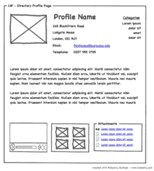

# 如何发布软件测试版

> 原文：<https://medium.datadriveninvestor.com/how-to-launch-a-software-beta-519625ff5f88?source=collection_archive---------4----------------------->

“laptop computer beside coffee mug” by [Alex Knight](https://unsplash.com/@agkdesign?utm_source=medium&utm_medium=referral) on [Unsplash](https://unsplash.com?utm_source=medium&utm_medium=referral)

## 我们最近向公众推出了我们的 [SpotSense](http://www.spotsense.io) 测试版，并为任何希望推出测试版软件的人整理了一些原则。

啊，贝塔。这是你第一次把产品放在顾客面前。这是一个非常令人兴奋/伤脑筋的时刻。

我们的公司 [SpotSense](http://www.spotsense.io) 刚刚发布了它的第一个测试版。经过几个月的努力，我们终于可以在目标市场(这里是 iOS 开发者)面前推出我们的定位平台版本了。测试版发布前的这段时间充满了经验教训，我想把这些经验教训留给那些试图发布自己的测试版的人。请注意，我们并没有遵循所有这些原则(它们是在我们经历了整个过程后放在一起的)。我们必须等到下一次发射时才能对它们进行全面测试。我邀请你在评论中分享你的经历/想法，这些绝不是一成不变的。

Beta 测试是一个非常好的机会，不仅可以获得对你产品的反馈，更重要的是，可以看到你的团队是如何工作的，以及如何以最有效的方式把你的宝宝放在别人面前。以下是我认为在计划和发布你的测试版(或任何产品/功能)时应该采取的步骤。

# 首先，与团队会面，详细列出需要开发的内容。

这似乎是显而易见的。但通常在创业初期，你倾向于在没有具体计划的情况下开始开发一些东西。这可能会让你走上无尽的道路，因为每个人似乎都知道你应该建造什么。有一个计划让你保持专注。

在这一点上，你应该已经做了广泛的市场调查，表明你正在解决一个问题(这个阶段对我们来说持续了一年多)。你现在可以开始考虑如何组装一个产品供人们测试。

**但是你怎么计划呢？**

项目规划可能非常令人兴奋。这是你的产品第一次开始成形。不管你做什么，不要从“懒惰的矩形”开始。(线框)。

我对 Golden Krishna 的书谈得太多了，最好的界面是没有界面，但他提出了一些非常惊人的观点。其中之一就是在设计产品解决问题时开始绘制屏幕界面的倾向。它源于屏幕和用户界面可以解决所有问题的信念。我仍在努力克服这种心态。

**流程流程流程**

不要画屏幕，而是与潜在客户交谈，**写下一步一步的过程，** **你的客户现在采取的解决问题的方法**。在你考虑画一个屏幕之前，先这样做。这背后的原因是，它允许您识别当前流程中潜在的低效之处，您可以用您的产品自动化这些低效之处(然后在以后利用这些低效之处进行营销……)。寻找和自动化这些步骤不需要添加另一个屏幕。

在你写下客户当前采用的流程后，写下他们对你的产品采用的流程。这里的目标是让他们采取更少的步骤来实现比他们现在做的事情好 100 倍的事情。如果你为你的产品写下的步骤比他们现在正在做的要多，那就细化它，直到它不再多。这是建立*用户体验。*

**移至界面**

此时，您可以开始将不同的原型和您内心渴望的所有屏幕放在一起，只要它符合您在最后一步中创建的流程。这将需要大量的迭代，并且您永远不会完全“完成”它。产品总能变得更好。

# 设置一个内部到期日，即“预发布”到期日的前一周

现在你有了一个需要发展的计划，你可以为它设定一个完成的截止日期。这部分真的很棘手，因为你的团队以前可能没有生产过产品。你不知道开发需要多长时间，也没有任何关于你们工作速度的可靠数据。你只能即兴发挥，相信对方的话。

我的建议是不要把发布日期定在未来 3 个月以上。任何更长的时间都可能让您构建太多您的客户可能需要也可能不需要的功能。**你希望用户通过测试让你知道他们需要什么，所以尽快把产品送到用户手中是很重要的。**

一旦你在内部确定了发布日期，**承诺**在发布日期前一周完成测试。你可以称之为“预发布”或“alpha”或其他什么，但基本上它给了你一周的缓冲期来解决产品中的任何问题。假装这是截止日期。这是我们没有做的事情，所以我们仍然在最后一刻挤压错误。不好玩。

# 定期执行 CKT(完整的知识传授)

当开发一个产品时，很容易让某些任务落在一个人身上，从而导致漏斗的形成。在我们的案例中，我们都远程工作了几个月，我们的一个开发人员比任何人都了解正在构建的软件。当团队的其他成员发现错误时，我们会直接将它们发送给开发人员进行修复。这是创建漏斗的可靠方法。随着 bug 被发送给开发人员，他/她对产品的细微差别了解得越来越多，并有望在将来修复所有的 bug。

我们没有让漏斗形成，而是开始执行我们称之为 CKT 的(完全知识转移)。这些是为了让每个人都快速了解软件的一切，希望当软件出问题时，团队中的每个人都知道如何修复它。在未来，我们都希望能一起工作，这样我们就不用经常做 CKTs 了。但不管怎样，这是让每个人都快速上手的好方法，也是未来让新员工加入的好方法。

# 如何格式化登录页面

为测试者创建一个登陆页面来获取信息并注册你的测试版显然是非常重要的一步。这是你的潜在用户看到你的第一件事。它应该很容易跟进，并有明确的目标，试图让观众用他们的名字和电子邮件注册测试版(测试版注册是一个主要的跟踪指标)。

**下面是我们的分解方式**

顶截面

产品的简要说明，注册测试版的行动号召，以及三张展示潜在使用案例的旋转照片，这些案例可以用我们的平台构建，我们认为会引起用户的反响。

第二节

倒计时钟再次号召大家行动起来，报名参加测试。我不推荐这一部分，因为我们错过了发布日期。

第三节

用花哨的术语概述产品，解释为什么我们的软件是蜜蜂的膝盖，还有产品截图，当然还有“注册测试版”的行动号召

第四节

一个简单的动画，展示了开发人员使用 SpotSense 可以完成的工作。这个按钮将他们引向我们的文档。

第五节

这是一个实验性的功能，我们认为它会引起很多人的兴趣，这是另一个号召注册测试版的行动。

第六节

一个“准备开始”部分，引导他们到测试注册页面。

第七节**重要的**

“加入 Slack 社区”行动号召

每次用户注册测试版，我们都会把他们引导到一个感谢页面，要求他们注册 Slack 社区。所有的 beta 测试者都被添加到了 Google 电子表格中(通过 IFTTT ),并发送了一封跟进邮件(通过 Zapier ),邀请他们加入 Slack 社区。

# 为你的目标市场建立一个社区(Slack 是很好的选择)。

建立一个松散的渠道是与用户保持联系的一种免费且简单的方式。随着测试人员开始注册，他们将加入社区。然后你的工作就是让他们参与进来。寻找话题让每个人都参与进来，并尽快回答每个问题。参与的人越多，他们就越愿意给你关于测试版的反馈。使用 Slack 比电子邮件等较慢的交流方式更吸引人。

# 找到你的目标市场在哪里，然后狠狠地打击他们。

你已经在小范围内做了市场调查，但是现在是时候对你的目标市场进行猛烈攻击了。我们主要使用 LinkedIn 进行外联。连续一个月，我们每天向不同类型的 iOS 开发者发送数百条消息，邀请他们测试测试版。

**分析你的营销活动**

在这一点上**请利用谷歌分析。**直到我遇到一个朋友，他向我展示了这个漂亮的工具(Kevo)的使用方法，我才真正看到它的价值。GA 上最未被充分利用的特性之一是标记某个时刻的能力(称为注释)。当你开始一个推广活动，或切换你的人物角色的搜索过滤器时，进行注释，这样你就可以知道你的活动的起点和与之相关的所有数据。

每次你开始一个活动，你应该“希望”看到你的网站流量激增。有了像谷歌分析这样的工具，你可以看到这些活动是如何进行的，并相应地调整你正在做的事情。我可以写几千篇关于市场营销细微差别的文章，但我还有很多东西要学。但最重要的是坚持不懈地接触客户(不要让人觉得你在发垃圾邮件),重复你的活动，尽可能找到合适的位置。

**真诚待人。人们可以闻到 BS**

我经历过的最好的啊哈时刻之一是，如果你完全诚实并真诚地从测试人员那里寻求帮助，他们通常会做出非常积极的回应。开发人员特别喜欢帮忙，如果他们不想帮忙，通常会非常礼貌地拒绝。如果你真的相信你的产品最终会帮助他们，真诚应该不成问题。

# 让公众知道你计划推出产品的月份，而不是确切的日期。

好吧，所以我还在玩这个。对于我们的测试版，我们提前 2 个月设定了一个具体的发布日期，并且非常公开。这在我们下面点了一把火，让我们按时把它弄出来(顺便说一句，我们没有按时把它弄出来)。因此，当到期日来了又去，我们在社交上完全沉默，让我们的测试人员想知道我们什么时候真正发布测试版。

事实是，开发一个新软件就像一座冰山，在它的表面下隐藏着大量的开发挑战、错误和测试。当发布的那一天到来时，我们仍然有大量的开发工作要做，我们无法按时推出(这就是为什么我建议在实际发布前一周设定一个具体的完成日期)。

当你错过了一个发布日期，这种情况*将会*发生，对团队来说，完全诚实并尽快通过电子邮件或 Slack 通知所有测试人员是很重要的。没有必要把这个发布到你的社交网络上让每个人和他们的妈妈看到。只是你和测试者之间的秘密。然后尽最大努力尽快推出测试版。

这就引出了下一点…

# 如果你要给出一个确切的日期，等到发布前 1 周。

这一步更多的是为了挽回面子。与其提前几个月公开确定日期，不如等到产品几乎 100%完成后再让公众知道确切的日期。一周的时间应该给市场足够的时间来产生一些关于测试版的讨论。

# 在您的测试产品中构建反馈循环

这是我们在发展的最后阶段发现的。测试版首先用来产生反馈，使你的产品更好。不要依赖你的用户发邮件或者拖延你的反馈，而是把有助于发现问题的东西放在适当的位置。

**错误监控软件**允许你在你的一个用户发生错误时得到提醒。这样，您可以快速修补错误，让用户回到正轨。

当然，**在空闲时间参与社区活动**。尝试有趣的比赛，寻求新的想法，并从中获得乐趣。测试是令人兴奋的。

# 最后，重新思考“推出”一个产品意味着什么。

推出一个产品，测试版，功能并不需要这么大。这是一位(导师)告诉我们的事情，真的减轻了一些压力。如果你真的想一想，所有的测试版都是一个在用户面前得到你想要的东西的机会，这样你就可以得到他们的反馈。如果产品令人尴尬或笨重也没关系。只要听听用户怎么说，让他们的想法来指导你应该做什么。在这一点上，你不必表现得像苹果或特斯拉一样，尤其是当你只是一家小型初创公司时。只需要把你产品的核心功能放在用户面前让他们测试。这是我们直到测试版发布前才真正了解到的。

# 我突然想起一些最后的事情。

**跟踪开发测试版**所花费的时间，并在构建未来产品时使用这些数据。这是一个测量你的团队生产力和设定更好的发布日期的惊人方法。

**使用团队维基**来保持事情有序(我们使用[概念](http://www.notion.so)

**记下你拍的所有过程**。如果你已经做了两次，很可能你还会再做一次。写下你必须做的所有简单的小设置，并将它们放入知识库。这样，团队的其他成员就可以去那里，而不是自己去想办法。

**不要把所有东西和厨房水槽都放进测试版。保持简单，让反馈回路引导未来的功能开发。这有助于去掉多余的东西，让用户了解你的产品。**

**如果这是你第一次发布，可能会是这样的……**

总而言之，发布你的第一个测试版对你和你的团队来说是一次令人惊奇的学习经历。你所需要做的就是走出去，开始建设，并愿意从你的错误中学习。就像我在一开始说的，这些步骤绝不是一成不变的，这只是我们从经验中学到的。如果你有任何想法，我们很乐意倾听！如果您有兴趣测试我们的下一款产品，请查看我们并注册下一阶段的 [SpotSense beta](http://www.spotsense.io) 。我们将定期发布新功能供您测试！