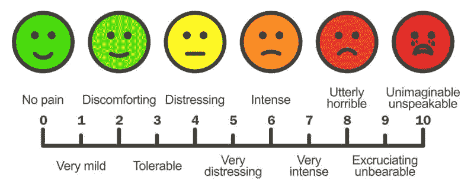
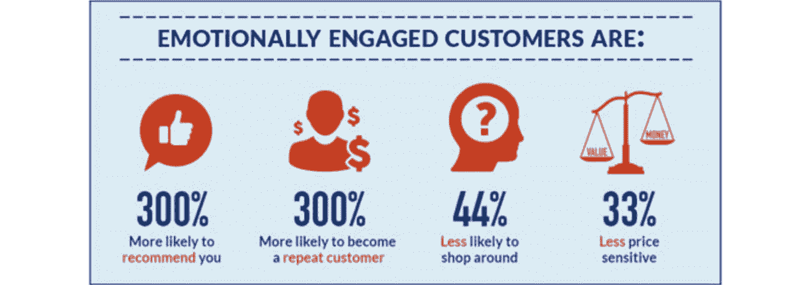

# 如何为你的创业公司制定一个完美的客户维系策略？

> 原文：<https://medium.datadriveninvestor.com/how-to-make-a-perfect-customer-retention-strategy-for-your-startup-d7327748aa3d?source=collection_archive---------13----------------------->

“找到一个客户需要几个月，失去一个只需要几秒钟”——文斯·隆巴迪

有一个好主意固然很好，但执行起来更不简单。

所以，你在看这篇文章。

为什么？

可能是因为你脑子里有一些惊人的想法，你已经执行了，或者你正期待着执行它。

这篇文章是给你的。

Customer retention is necessary!

首先，让我们了解一下为什么这篇文章对你很重要？

在企业家的世界里，如果你是一个有着颠覆性想法的新创企业，那么吸引不同的利益相关者加入你的企业是很自然的。

 [## 金融科技初创公司正在颠覆全球银行业|数据驱动的投资者

### 传统的实体银行从未真正从金融危机后遭受的重大挫折中恢复过来…

www.datadriveninvestor.com](https://www.datadriveninvestor.com/2018/10/20/fintech-startups-are-disrupting-the-banking-industry-around-the-world/) 

你的想法、产品、品牌和营销策略的吸引力会吸引大量的顾客。

但是，每个初创公司创始人都渴望解决的百万美元难题是，如何吸引客户，让他们对你的品牌忠诚？

让我们现实一点。

问自己一个问题。谁管理你的创业公司？

嗯……你可能会认为被称为“投资者”的生物……
科技团队……
我……

还有谁？

你忘了最重要的人。你的顾客。付钱给你的人。

如果你忘记了他，你不是唯一一个。大多数创业公司的创始人在做商业决策时也会忘记它们。

然后他们惩罚你。你猜怎么着？

你的创业公司的成长曲线变成了一条递减的曲线。

所以，现在你知道你的客户对你有多重要了。

让我再问你几个问题:

# I .)您是否解决了客户的难题？

Address your customer’s pain points effectively

你知道顾客总是在寻找解决他们问题的方法。但是在这一点上你必须有点聪明。你需要给他们额外的东西。有些不同寻常。

你拿到了吗？是啊。与众不同的是他们觉得自己很特别。一些让他们感到被欣赏的东西。让他们觉得被赋予了力量。

如果你这样做了，你知道他们通过使用你的产品/服务得到了什么吗？他们得到了‘价值’。这就是你开始创造“影响”的地方。

# 二。)首先影响一个细分市场，而不是整个市场:

Choosing your niche is important

另一个大多数初创公司创始人都忽略的要点是，他们希望对整个世界产生“持久”的影响。

但是它们最终没有任何影响。为什么？

因为要有效地服务你的顾客，你必须为自己选择一个合适的位置。你不能影响这个星球上的每一个人。相反，你可以为地球上的一些人创造“价值”,这也可能对其他人产生影响。

如果你能够为哪怕是一个细分市场创造“价值”，他们就会成为你的忠实客户。

# 三。)兑现对客户的承诺:

Live up to your promises

承诺是你促销活动的一部分，也是必要的。但是你知道实现你的承诺是创业的关键。

不要过度承诺。

人类喜欢诚实的人。顾客也一样。他们希望你对他们说清楚。如果你对他们很清楚，这将增加你的可信度，最终导致客户的保留。

# 四。)客户情绪化:

Emotionally engaged customers are your win

根据哈佛大学教授杰拉尔德·扎特曼的说法，95%的购买决定都是基于情感。

虽然，如果你是在给一些人创造影响，那么你已经把你的产品/服务和他们的情绪联系起来了。但是还有一点。你也应该在你的整个商业策略中反映出来。

你的营销策略应该着眼于你的产品/服务如何与你的客户的情感相关联。如果你这样做了，顾客会感觉到与你的品牌有某种程度的“亲近”。这就是你在所有竞争者中胜出的地方。

# 动词 （verb 的缩写）)提供最好的客户服务:

Best customer service is key to customer retention

客户服务是留住客户的关键。如果你是一家基于服务的初创公司，那么你和客户之间应该有一个适当的沟通渠道。

但是，如果你有一些硬件产品，那么你应该有一个明确的更换，保修或维修指南，以及服务中心。

如果你做到了这一点，你就能赢得他们的心，最终让他们忠于你的品牌。