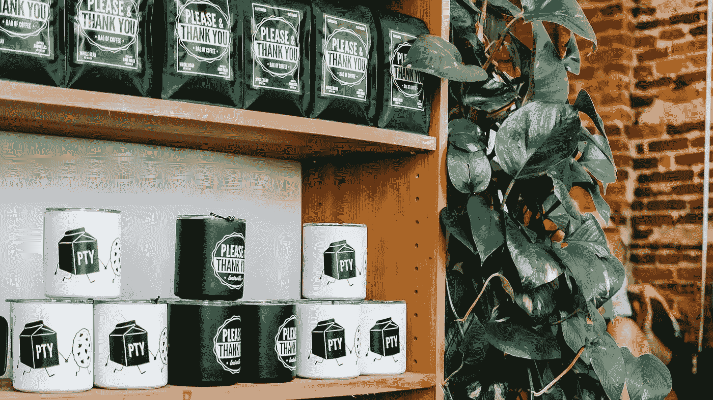

# 如何做一个赚钱的产品，作为创业者如何取胜？

> 原文：<https://medium.datadriveninvestor.com/how-to-make-a-profitable-product-and-win-as-an-entrepreneur-64971f03758?source=collection_archive---------26----------------------->

Photo by [Kyle Nieber](https://unsplash.com/photos/LtzZy-sTOBI?utm_source=unsplash&utm_medium=referral&utm_content=creditCopyText) on [Unsplash](https://unsplash.com/search/photos/product?utm_source=unsplash&utm_medium=referral&utm_content=creditCopyText)

嘿大家好，

在进入今天的文章之前，我有几个问题要问你。

你能提供什么别人不愿意提供的东西？

你能利用你的知识和专长来盈利吗？

我将在今天的帖子中回答这两个问题以及更多问题，所以请务必继续阅读。

# 企业家、产品和服务。

我会把自己归类为企业家，但我缺少所有企业家都有的一个重要方面，即销售产品或服务。

成为一名企业家就是要创办公司，销售产品或服务，并最终获得利润。那么，如果我们没有产品可卖，我们如何确定自己是企业家呢？

就我而言，我只是一个没有最终目标的博主，只是一个为了写作而写作的人。而且，在某种程度上，我对此没意见，虽然钱很好，对吗？

首先，我们需要明白自己目前是谁。我们目前是否试图出售任何东西？我们有目的或目标吗？或者，我们只是想知道生活中发生了什么？

如果你属于最后一类，你愿意在那里呆多久？

# 第一步。

成为成功企业家的第一步是了解你的专业技能和特质，以及如何利用它们来盈利。

我们都有一项专业技能；只是发现它的问题，因为任何说我没有的人；我回答说“再努力看看”，因为我不相信这个星球上有任何一个人没有专业技能。

一旦你找到了你的技能；这是一个不断磨练的问题，直到你变得比你周围的大多数人更有知识，比你分享的知识更多。

# 制造产品。

曾经，你有足够的知识量；你可以开发针对受众的产品，希望在该主题上有所改进。

例如，如果你已经接受培训成为一名网络开发人员，你可以开始制作为潜在客户量身定制的产品。在这种情况下，你可以开始建立一个品牌来营销自己。

如果你是一名插花师，你可以为不同的活动设计不同的套餐，比如生日、婚礼、葬礼等等。

但是，成为一名成功的企业家不仅仅是制造一种产品，而是制造一种满足市场需求的产品，这样你就成为了该产品的市场领导者。

按照下面的三个步骤，你可以很快做出适合市场的产品。

1.  找到你的技能，并成为该技能的专家。
2.  观察当前市场，寻找任何被竞争对手错过的机会。
3.  设计一个填补空白的产品。

# 货币化和赚钱。

你可以想象，赚钱的最后一步是赚钱。

一旦你有了你的产品，是时候赚钱了。但是，首先，你需要知道在把你的产品卖给别人之前，你将如何销售你的产品。

如果你在没有定价结构或对如何销售你的产品没有预先设想的想法的情况下匆忙进入商业领域；比如最高价和最低价，当谈判开始时，你会发现自己在挣扎。

相信我；我去过那里。

我开了一家设计公司，和客户开了几次会，但不知道该怎么定价。因此，客户会问我，这要花多少钱，我必须给出一个我头脑中听起来大致正确的任意数字。但是，在很多情况下，我只是不知不觉地把自己挤出了市场。

所以，在推销你的产品和与客户谈判之前，确保你有一个稳定的价格结构；所以当这个问题出现时，它会出现；你很清楚该怎么回答。

当然，随着时间的推移，随着你的产品和技能的提高，你可以更新你的价格，但要确保你总是在你的市场内，所以你不会像我一样高估自己。

现在，坐好，看着钱滚滚而来…

# 最后。

诚然，作为一名企业家，除了制造和销售产品，还有很多东西，但这是它的纯粹本质，如果你能做到这一点，那么其余的事情就会自然而然地发生。这只是一个耐心和毅力的问题，因为像许多事情一样，不幸的是，作为一个企业家，除了坚持下去，没有什么秘诀。

至于我的设计业务，如果你想知道的话，在它成为博客之前就在这个网站上了，但我确实计划很快再次开始这项业务，所以如果你有兴趣做一些设计工作，请务必打电话给我。

在下次之前，我很想知道你的下一个产品会是什么，以及你将如何在 Twitter 上把它推向市场。

感谢阅读。

下次见。

谢谢你，

康纳。

【Conermurphy.com】*******本帖原载**

**如果你喜欢这篇文章，那么请分享这篇文章。|如果其他人也能读到这封信，对我来说意义重大。**

**想讨论这篇文章？或者，说声嗨:**

**[网站](https://conermurphy.com/) | [简讯](https://www.getrevue.co%2Fprofile%2Fconermurphy/) | [推特](https://twitter.com/ConerMMurphy) | [Instagram](https://www.instagram.com/conermurphy/) | [脸书](https://www.facebook.com/ConerMMurphy/) | [Quora](https://www.quora.com/profile/Coner-Murphy) | [媒体](https://medium.com/@conermurphy)**