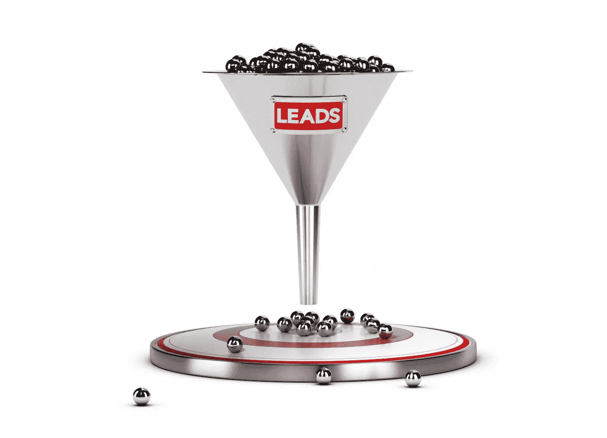

# 如何让销售漏斗为你的品牌服务

> 原文：<https://medium.datadriveninvestor.com/how-to-make-a-sales-funnel-work-for-your-brand-49e68845f180?source=collection_archive---------12----------------------->

作为一名企业家，你今天能得到的最糟糕的建议是“把它做好，他们就会来。”仅仅因为你建立了一个企业，并不意味着顾客会在大门打开的第一天蜂拥而至。大多数网上商店的工作方式都是一样的，它们往往比实体店更糟糕，因为它们没有实体存在。

如果你目前的销售漏斗不起作用，这意味着流程有问题。基本上，你必须与潜在客户建立联系，让他们信任你，并证明你的服务或产品令人惊叹。

 [## 2019 年需要关注的 20 个数字营销趋势和技术——数据驱动的投资者

### Faisal 在加拿大工作，拥有金融/经济和计算机方面的背景。他一直积极从事外汇交易…

www.datadriveninvestor.com](https://www.datadriveninvestor.com/2019/02/04/20-digital-marketing-trends-techniques-to-watch-out-for-in-2019/) 

听起来简单，但远非如此。

要了解如何改进这个漏斗，也许是时候对它有一个新的看法了。也被称为转换漏斗，这是一个潜在的客户通过网站的路径，最终应该导致销售。然而，他们中的大多数人在这个过程中的不同点上放弃了，只有一小部分人成功地转化或转化为销售。

虽然退学是正常的，但如果退学率太高，背后可能有许多原因。越多人在到达终点前放弃漏斗，你的反弹率就越高。这反过来会降低你的转换率，但这些漏洞可以修复，以确保更多的潜在客户成为忠诚的客户。

做到这一点的最佳方法是问自己一些与该漏斗的每个级别相关的问题，例如:

*   你如何用优惠吸引顾客？
*   你如何提高对企业的认知度？
*   为什么客户不采取令人满意的行动，您能做些什么来解决这些问题？
*   你如何预测客户的需求并识别他们？

这些问题一开始看起来很难回答，但如果你把它们分解开来，一次解决一个，就不会了。

例如，今天吸引客户的关键不在于你的产品，而在于你能在多大程度上让他们了解这些产品。换句话说，你需要优先考虑质量而不是数量。

如果你试图尽可能快地用有问题的或低质量的线索填充漏斗，你会花更多的时间剔除不活跃的访问者，而不是花更少的时间为真正的客户创造价值。这包括创建内容营销解决方案，即使是中等质量的线索也会转化为固定客户。

要做到这一点，你需要确切地知道你的观众想要什么，而不是你想卖给他们什么。以下是你需要问自己的一些问题:

*   与你相比，你的竞争对手在哪些方面做得更好？
*   你忽略了哪些客户需求？
*   怎样才能胜过竞争对手？
*   你有什么可以利用的东西吗？

在漏斗的这个阶段，您需要寻找能够让您的客户整体受益的解决方案。记住，每个人对你的品牌都有不同的观点。这意味着他们将从销售漏斗中的不同点着手。通过多管齐下的吸引策略，你可以吸引更多的潜在客户。

这比通过人们可能关注也可能不关注的 vlog 系列来撒下一张大网要好得多。换句话说，你的销售漏斗应该包括几个可以吸引不同类型线索的元素，而不是几个可能会或可能不会转化的类型。这是提高转化率和品牌知名度的最佳方式。

换句话说，大多数企业主在漏斗顶端遇到的主要问题与他们获得的销售线索的质量和数量有关。不管你使用什么工具，要么你的获取策略没有产生足够的线索，要么你得到的质量太低而不起作用。

要了解是什么阻碍了你的努力取得成果，你需要检查销售漏斗，看看这些线索来自哪里。例如，像 Kissmetrics 这样的程序可以帮助你做到这一点，也可以帮助你可视化所述线索的总价值。

一旦你确定了问题是在于转换还是缺乏线索，你就可以着手解决这个问题。例如，如果主要问题是潜在客户的质量，比较你为获得他们所花费的成本和他们为你带来的长期收益。你可能会把钱浪费在无用的线索上，而这些线索可以被重新引导到有效的线索上。

如果问题在于缺乏线索，那么问题可能在于你的品牌缺乏影响力，或者你可能是[点击欺诈](https://www.webopedia.com/TERM/C/click_fraud.html)的受害者。如果是这种情况，你应该采取措施，通过投资 ClickCease 等解决方案来确保你获得有机线索，这些解决方案也可以帮助你扩大影响力。这是获得销售漏斗投资回报的更好方式。当高质量的销售线索开始滚滚而来，低质量的销售线索停止堵塞渠道时，你总能赚回那些钱。

**总之……**

一旦你的销售漏斗开始吸引优质线索，你的工作还没有完成。你需要通过有针对性的营销努力来培养这种流动，在个人层面上与你的客户交谈。这就是 Smartcut 营销可以提供帮助的地方。我们总部设在新泽西州，专门为在线企业提供战略营销解决方案。[今天就和我们联系](https://www.smartcutmarketing.com/contact)。