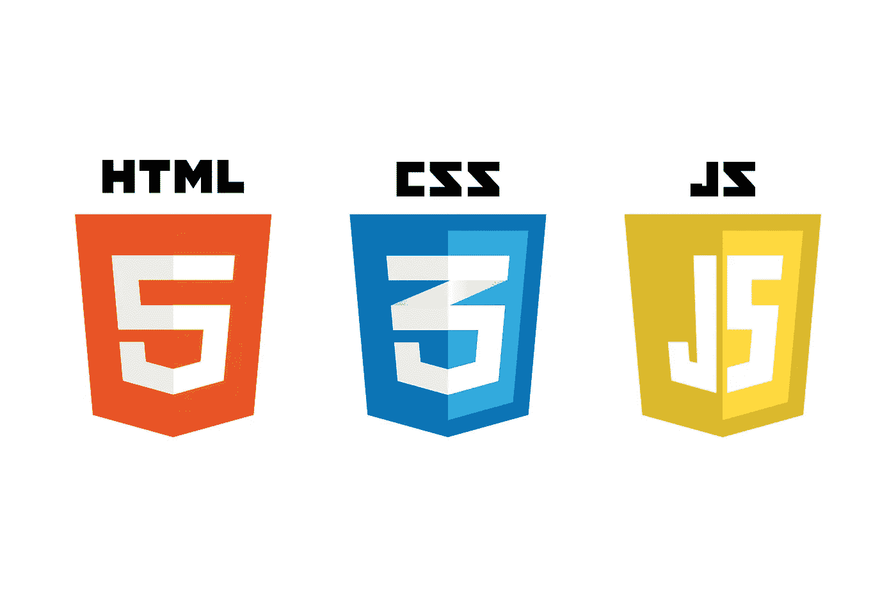

# 如何用 Javascript，HTML 和 CSS 制作一个网站

> 原文：<https://medium.datadriveninvestor.com/how-to-make-a-website-with-javascript-html-and-css-781cd037c074?source=collection_archive---------17----------------------->

用 JavaScript 或其他任何东西来构建一个网站看起来是一项艰巨的任务。很多人总是梦想着学习编程的细节，但在现实生活中，他们最多只是上传一张照片到社交媒体，他们的网络互动到此为止。所以，如果你不太懂技术，不要担心。如果你没有任何编码经验，这个概念看起来就像火箭科学，但实际上它是可行的。很多时候，为了在就业市场上保持竞争力或实现其他个人目标，我们必须能够掌握新的技能，学习编码是一项非常有用的技能，你可以用它来吸引潜在的客户或雇主。最好把它想象成学习一门你并不流利的语言。这就是标题中提到的技术被称为编程语言的原因。它们中的每一个都有自己特定的语法规则，你需要逐渐学习，它们向计算机发送命令，告诉它做什么。如果我们更深入地研究，它们会告诉浏览器当用户执行某个命令时该做什么。

在本文中，我们用外行的术语解释每种语言的用途，但是在我们深入了解每种语言的各种细微差别以及如何用 HTML、CSS 和 JavaScript 制作网站之前，让我们更好地了解一些必须掌握的基本思想和概念。

# 编程基础

如果我们思考语言是什么，我们会注意到它是一种获取我们头脑中的东西并以一种采取必要行动的方式表达出来的方法。编程是非常相似的，因为它是我们如何告诉计算机它需要执行哪些功能，我们希望某个东西看起来是什么样子，当你点击某个东西和无数其他命令时会发生什么。如果你输入了一些没有意义的东西，我们会得到一个错误信息，就像现实生活中有人会胡言乱语一样。因此，遵守所有的规则是非常重要的，开始的时候，这是最基本的规则，但是后来，你必须掌握所有的细节。

# Web 开发应用程序

每当你给一个网页设计师一个任务去创建一个包含你挑选的特定标题、字体、图片等的网页。他们将接受这个大想法，并开始将其分解成小块，然后将这些小块转换成指令供计算机执行。所有这些指令都需要用必要的语法输入，这样计算机就不会返回错误信息。不管你是用 HTML 还是其他语言建立一个网站，它都需要包含一系列不间断的命令。所有的网络浏览器都扮演着重要的角色，它们把输入的代码转化成一种可见的东西，一种我们可以接触到的东西。

如果没有浏览器，代码就只是一个文本文件。每当打开一个网页，浏览器就会检索 JavaScript 或其他任何用于解码的内容。事实上，HTML 和 CSS 并不是真正的编程语言。它们更像是网页风格的页面结构信息。然而，为了推进到真正的编程语言，如 javasсscript，了解这两种语言的基础是很重要的，因为它们通常构成应用程序的前端。虽然[雇佣网站开发者](https://skywell.software/web-development/)可以为你简化事情，但这里有一个基本的概述:

*   HTML——网站的基本方面，由其他技术完善
*   CSS —用于调整演示、格式和布局
*   JavaScript —指导各种元素操作的方法

# JavaScript vs HTML vs CSS

当我们比较这三种技术时，我们注意到它们中的每一种在网页开发中都有其特定的作用。无论网站有多复杂，超文本元语言(HTML)都将是它的核心。与编程语言相反，HTML 使用标签来识别所有不同类型的内容，以及它们在每个网页上扮演的角色。例如，如果你看一篇报纸文章，你会识别标题、副标题、正文和文章包含的其他内容。HTML 以完全相同的方式来标记网页上的所有内容，除了它使用代码或更具体的 HTML 标签。

每个网页，甚至是 JavaScript 网页，都由对应于网页上每个元素的 HTML 标签组成，并且每个内容类型也被捆绑到 HTML 标签中。

CSS 决定了所有的 HTML 元素如何出现在前端。HTML 为你提供了构建网站所需的所有原始工具，而 CSS 允许你对所有东西进行样式化，这样它就会以你想要的方式呈现给用户。把 HTML 想象成干墙，把 CSS 想象成颜料可能会有所帮助。CSS 网站看起来会更吸引人。

就 JavaScript 而言，我们之前提到过，它更先进，但所有现代浏览器都支持它，而且，几乎每个网站都使用它来获得更多的功能和能力。如果你想知道 JavaScript 在网页设计中的用途，答案是它主要用于网站内容的调整，并使网站根据用户的动作做出特定的行为。此外，它还可以用于创建行动号召按钮、确认框以及为当前信息添加新的细节。

我们在大多数网站上观察到的动态行为在很大程度上要归功于 JavaScript，它极大地改进了浏览器的默认操作和控制。在 HTML 中使用 JavaScript 在布局方面很重要，因为有一些方法可以将 JavaScript 包含在 HTML 文件中，但是这需要更高级的编程知识。

总而言之，学习编程最难的部分可能是入门。一旦你开始这个过程，你就能在旅途中快速学习。一旦掌握了基础知识，熟悉更高级的编程技术就容易多了，但重要的是要记住，在你能跑之前，你必须会走。所以，走出去，开始犯错，并在过程中学习。如果你感到不知所措，有大量的资源可以帮助你。

*最初发表于*[*sky well . software*](https://skywell.software/blog/how-to-make-a-website-with-javascript-html-and-css/)*。*