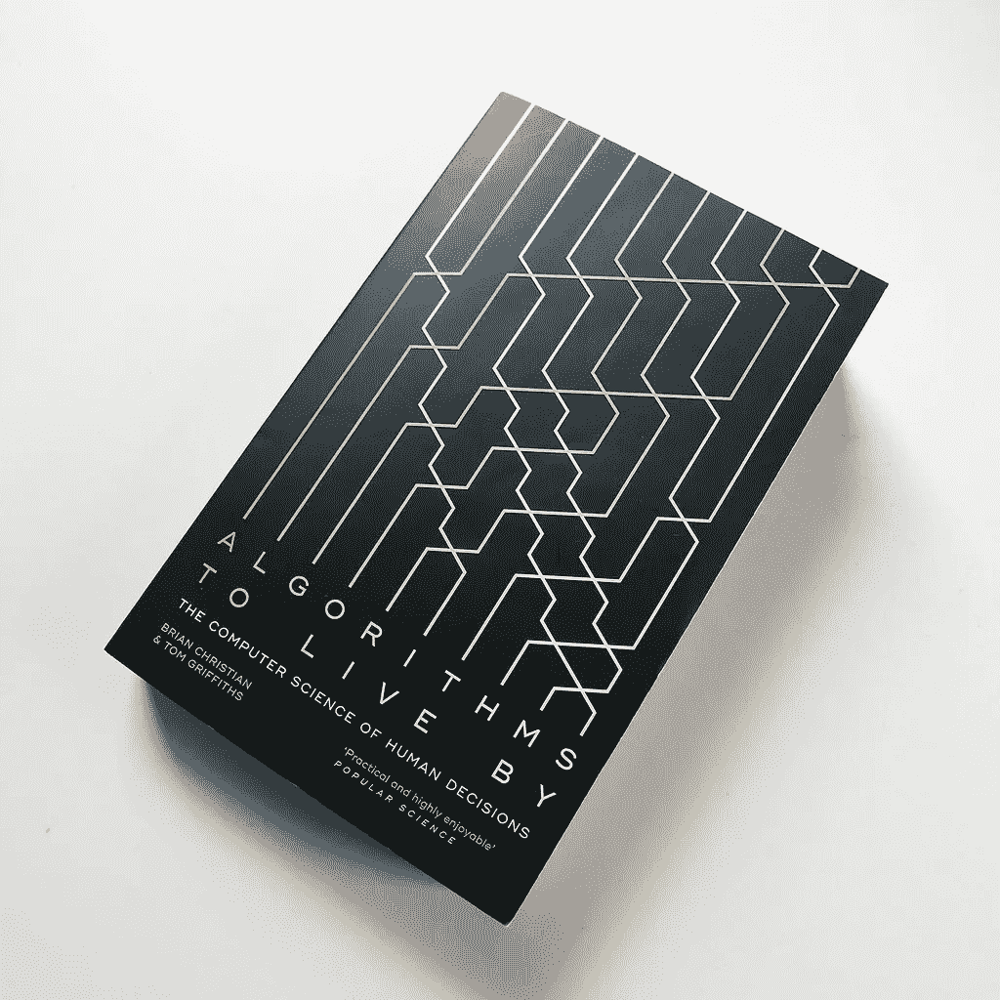
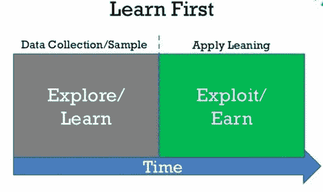
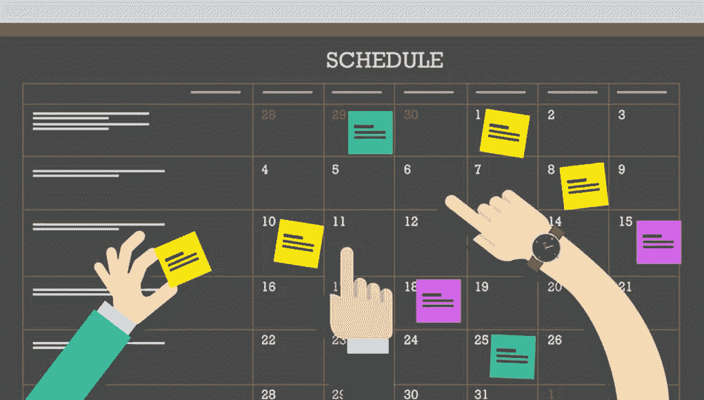
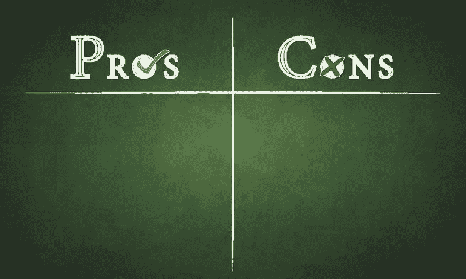
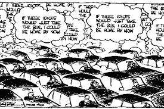

# 在计算机的帮助下做出更好决策的艺术(没有技巧)

> 原文：<https://medium.datadriveninvestor.com/how-to-make-better-decisions-with-the-help-of-computers-524a177ddfe3?source=collection_archive---------3----------------------->

## 赖以生存的算法——布莱恩·克里斯蒂安和汤姆·格里菲斯

## 注意:这个博客可能不会提高你对决策的直觉。但它有助于如何走向它。

几个月前，我来到印度班加罗尔，几天之内，我面临的第一个问题是 ***【搜房间/PG/公寓】***

公司给了一周时间去寻找和安顿下来。幸运的是，在 ***2 天*** 内，我在办公室附近找到了一个不错的住处。但是我想到了一个小问题，

> **“考虑到 PGs 或公寓的竞争，我需要搜索多长时间才能找到房间？”—有没有什么安全的方法来搜索和获得一个好房间！！！**

几个月之内，我找到了这个问题的答案(或数学解释)。(虽然是不小心！！！)

 [## 决策的移情设计方法如何工作|数据驱动的投资者

### 移情设计是一种产品设计方法，首先由多萝西·伦纳德和杰弗里·雷波特在哈佛大学提出

www.datadriveninvestor.com](https://www.datadriveninvestor.com/2018/07/18/how-the-empathic-design-method-of-decision-making-works/) 

# 计算机要教我们什么？

你有没有过 ***“这有什么用？”*** 或 ***“我在哪里可以实际应用这个？”*** (研究某一特定理论时)。这本书提供了计算机科学算法(或数学)如何应用于我们日常世界问题并提高我们决策技能的优秀应用。

Coverpage of Algorithms to live by

在深入研究内容之前，我想提几点。

1.  **这不是教材(虽然可以作为参考)。**
2.  这不仅仅是针对计算机科学的学生，也不仅仅是针对工程师。任何想在生活中做出更好决定的人，如果遇到了下面列出的任何问题/想法，建议阅读一下。
3.  我试图给出一些常见问题的一瞥(更多细节见本书)。

# 最佳停止——何时停止寻找

**外观和跳跃权衡**

An illustration of secretary problem (Source: Google)

你曾经有过下列情况之一吗

1.  寻找公寓→您的需求与竞争
2.  寻找一个女孩/男孩结婚→资格 vs 竞争/稀缺(约会问题)
3.  找工作→套餐/工作满意度 vs 竞争
4.  寻找潜在员工(由管理层)→失去最佳员工的风险与以平庸告终的风险(秘书问题)

这些问题可以被最好地描述为拥有**“有限的资源”**但是你渴望拥有最好的(或者更好的)。因为一旦你拒绝了希望更好的东西，你最终可能会也可能不会实现它。

数学提供了一个解决方案，即“*从你的总时间*，*花*，*大约 37%的时间去搜索(观望阶段)，然后做出决定(跳跃阶段)。”*

这个 37%规则(看然后跳跃规则)可以应用于任何资源有限(但有竞争)的潜在问题，如何时停车，何时出售房屋，何时退出等。作者提到了这一规则的变体及其应用。

> **注意:在我搜索 PG/flat 的例子中，一周的 37%大约是两天半，所以我的决定非常好(尽管这只是一个巧合，因为我以前不知道最佳停车)。**

# 探索/利用—最新的与最棒的

**尝试新事物，坚持最佳折衷方案**

Example stating the time factor for explore/exploit tradeoff

1.  我应该去一家知名的餐馆还是去一家新的？
2.  我应该看我喜欢的同一类型的电影还是尝试一种新的类型？
3.  我应该去通常最喜欢的地方还是尝试一个新的地方？
4.  鉴于世界上有太多的书，我应该读越来越多的新书还是重读我读过的书？

或者想过

1.  一种新药如何进入市场？(临床试验)
2.  谷歌/亚马逊如何推出新功能？(A/B 测试)

作者提出了一些策略，如赢-留、输-移、吉芬指数、置信上限、考虑时间间隔和数据量等

# 分类-制作订单

**搜索和排序权衡**

如果你是计算机专业的学生，你可能会觉得 ***“鉴于 MergeSort 的效率，人们会使用 BubbleSort 还是 InsertionSort？”*** *。*嗯，这本书给出了现实世界中前者算法优于后者的情况。除此之外，它还讨论了许多决策问题，包括

1.  IBM 的故事
2.  谷歌的搜索引擎如何给出准确的结果？
3.  各种锦标赛(IPL，NFL，奥运会等)的赛程是如何准备的？

# 缓存—忘了它吧

**可访问性和存储折衷**

***在我们智力的实际运用中，遗忘和记忆一样重要——威廉·詹姆斯***

An example office desk where unknowingly we cache files (Source: Getty images)

1.  如何清理你的衣柜/橱柜，以便最有用的东西可以轻松取用？
2.  网飞是如何以及为什么根据地理位置分发数据的？
3.  为什么年轻人比老年人更容易回忆？(据计算机科学家！！)
4.  如何整理你的办公桌？(不知不觉中，我们每一个人都在不知不觉中进行着组织。)——(野口归档系统)

作者深入浅出地讨论了 FIFO(先进先出)、LRU(最近最少使用)、随机驱逐、Belady 算法(千里眼算法)等各种算法。

# 日程安排——最重要的事情先做

**重要和紧急的权衡**

***“易则难，小则大”——老子***

An example image suggesting the importance of scheduling in real-world (for important and urgent works to be done) (Source: Gettingsmart)

1.  如何处理截止日期？我应该做最简单的还是紧急的
2.  鉴于食物的保质期，如何减少食物浪费？
3.  关于如何清理贷款的建议
4.  为什么探路者(火星上的第一个漫游者)被拖延了，科学家们如何使用调度算法来解决它？

作者对约翰逊算法、最早交货期、摩尔算法、最短加工时间等各种策略进行了直观的解释。

# 贝叶斯法则——预测未来

**用较少的数据预测(非常规机器学习)**

***“人类所有的知识都是不确定的、不精确的和片面的”——伯特兰·罗素***

Humor example talking about Bayes’s rule (Source: xkcd)

1.  如何预测下一班车什么时候来？
2.  如何更清晰地理解新闻中呈现的统计数据？
3.  如何预测电影的票房收入？
4.  如何预测建筑物的寿命？(数学上！！)
5.  如何确定你是否中了彩票，或者是否被给予了一些机会？

它讨论了各种规则，如拉普拉斯定律，哥白尼原理，贝叶斯规则，乘法规则，平均规则，加法规则等

# 过度适应——何时应该少思考

**概括比完美更重要**

***“你能做的任何事我都能做得更好；我做什么都比你好”——安妮拿起你的枪***

Charles Darwin, just made a list of pros and cons, gave a glance and without further in-depth analysis proposed his cousin and had a happy life (Source: Google)

1.  为什么我们只喜欢一种特定的食物或一种特定的流派？
2.  查尔斯·达尔文是如何在不知情的情况下避免向他的表妹求婚的？
3.  他们为什么改变警察射击训练的形式？
4.  为什么学校的考试模式需要经常改变？
5.  我们需要花多长时间才能让一件事情变得完美？(比如报道等)
6.  为什么因“均值-方差投资组合优化”而获得诺贝尔经济学奖的哈里·马科维茨在谈到他的资金管理时更喜欢简单的投资组合管理？
7.  为什么有些创业者在项目初期更喜欢用粗笔而不是尖笔？

它提供了一些来自深度学习文献的建议，如正则化、早期停止、交叉验证、启发式、奥卡姆剃刀原理等…

# 放松——顺其自然

**有时候找到一个解决方案比最好的方案更重要**

***“完美是好的敌人”——伏尔泰***

Sometimes, it’s important to relax and free our constraints rather than worrying about the best solution (Source: Headspace)

1.  考虑到过多的城市和时间、距离、预算的限制，如何计划一次旅行？—(旅行推销员问题)
2.  如何办一个邀请人数较少的聚会？—(派对邀请问题)
3.  考虑到宾客之间的关系限制，如何安排宾客入座(不是每个参加婚礼的宾客都知道对方是对的。所以，我们想最后坐在我们认识的人旁边)？—(喜帖问题)
4.  工程师/建筑师如何规划城市，让一辆应急车辆可以到达城市的每一个角落？—(消防车问题)
5.  政治竞选经理或企业市场经理如何更有效地传播他们的信息？
6.  如何挑选一群人接种疫苗，防止疫情扩散？

它提供了一些方法，如蛮力，最小生成树，约束松弛，离散优化，连续松弛，拉格朗日松弛等等…

# 随机性——什么时候听天由命。

***“河流蜿蜒，因为它不会思考”——理查德·肯尼***

An example image demonstrating how to calculate pi by dropping needles/toothpicks on a ruled paper (Source: Exploratorium)

1.  如何用针落在一张画纸上求圆周率( **π)** 的值？(取样)
2.  随机化算法如何帮助判断一个给定的数(非常大，因为伊拉斯托特尼斯筛不可行)是否是质数？(米勒-拉宾素性检验)
3.  多项式同一律测试是如何工作的(通俗地说就是在多个选项中代入，得到正确答案)？
4.  还是那句话，如何用各种指标更高效地规划行程？(爬山及其变体)
5.  关于计划，水晶的冷却对我们有什么启示？—(模拟退火)

# 网络——我们如何联系

***“现在总比没有好。尽管永远也不会比现在更好”python 的禅宗***

1.  当电话网络繁忙时，为什么您在服务器繁忙时收听等待铃声，为什么页面加载缓慢？(电路交换和分组交换)
2.  当你有一个朋友破坏了整个计划，你该怎么办？(指数补偿)
3.  为什么我们不能通过尝试每一个可能的单词来入侵任何系统呢？(指数补偿)
4.  雇佣员工和给予晋升/解雇是如何从一些网络协议中获得灵感的？(Cravath 系统)
5.  **为什么承认他人(如“是”、“哦”、“嗯”)很重要？(TCP，ack)**
6.  排长队对顾客(以及管理层)有什么影响？(Bufferbloat)

# 博弈论——他人的思想

**竞争与合作的权衡**

我是一个乐观主义者，因为我相信人类是高尚和可敬的，他们中的一些人非常聪明。我对群体中的人有一种更悲观的看法”——史蒂夫·乔布斯

An example image depicting the Tragedy of commons (Source: Google)

1.  如何在你的自身利益与我们的成长之间做出抉择？(囚徒困境)
2.  自动驾驶汽车如何处理提前到达(个人兴趣)和减少事故(社会兴趣)？
3.  当管理层发出绿色信号时，员工为什么犹豫要不要多休假？
4.  像 Target、Kmart 这样的美国公司是如何在感恩节期间利用这些策略实现最大销售额的？
5.  为什么有些树比如树冠最后会那么高？(从数学角度来说！！)
6.  站在大多数人一边会有什么可怕的后果？(公地悲剧)
7.  “英式拍卖”、“荷兰式拍卖”、“维克瑞式拍卖”等不同类型的拍卖如何影响拍卖人的决策？(信息级联)

感谢您阅读本文。请务必阅读这本书，以获得更多关于计算机算法如何帮助我们对日常世界问题做出决策的直觉。

> 最后，如果你真的喜欢它，一定要鼓掌以示感谢！！！(联网→反馈)

**个人网站:**[namburisrinath . github . io](https://namburisrinath.github.io)

**中号手柄:**[namburisrinath.medium.com](https://namburisrinath.medium.com)

**领英:**[https://www.linkedin.com/in/namburi-gnvv-satya-sai-srinath/](https://www.linkedin.com/in/namburi-gnvv-satya-sai-srinath/)