# 如何做一个数字版的你！

> 原文：<https://medium.datadriveninvestor.com/how-to-make-digital-version-of-you-2a29cf823e85?source=collection_archive---------8----------------------->

*使用 RNNs 的拟人化生成聊天机器人(LSTM)&tensor flow 中的注意力*

> “在未来的几十年里，随着我们继续创造我们的数字足迹，千禧一代将产生足够的数据，使'**'数字不朽'**'可行'**——麻省理工科技评论，2018 年 10 月。**

如果有‘死后的生命’或者你可以和你爱的人说话，甚至在他们离开你之后，会怎么样？在*电影《超越》(2014)* 中，人工智能研究员伊芙琳在丈夫即将死亡之前，将他的意识上传到量子计算机中。虽然死后与丈夫的数字互动仍然是科幻小说，但今天，创造一个你的数字印记是可行的，你可以像你一样说话！

数字“你”可能看起来像基于文本的聊天机器人，或者像 Siri 一样的音频声音，或者数字编辑的视频，或者三维动画角色，甚至是嵌入式人形机器人。但是最大的挑战是将我们每个人的多重性格人格化！是的，当我们和不同的人说话时，我们是不同的，对吗？这就是为什么“**增强的永恒”**平台从多个来源获取数据——脸书、Twitter、消息应用等。

你的演讲由你个人的声音和话语组成。最先进的深度学习技术，即**序列对序列建模和注意力模型**被广泛用于

1.  克隆个人声音
2.  复制谈话风格和语言

语音克隆的努力，如[**三星 Bixby**](https://www.samsung.com/in/microsite/voice-forever/) **，**旨在保留我们所爱的人的声音，或者**百度的“深度语音”人工智能系统** ( [音频样本](https://audiodemos.github.io/))解决了问题的前半部分。在这篇博客中，我们将专注于后半部分，即制作一个基于文本的拟人化聊天机器人，作为你的数字化身。

有两种类型的对话模型:

1.  **基于检索:**他们使用预定义响应的存储库和某种试探法来挑选适当的响应。
2.  基于机器翻译技术，它们从头开始生成新的响应。他们更强大，但很难完美。他们更加聪明和先进，但可能会犯语法错误，因为它不知道语言的规则。

目前，大多数系统使用简单的基于检索的方法，因为在生产系统中犯语法错误或令人不快的反应是非常昂贵的。但是由于我们的目标是制造一个更像人类的系统，我们会选择制造更强大的生成模型。

# 生成对话式建模架构

会话是对话的交流。每个对话都是一个单词的“序列”，对它的响应将是另一个单词序列。**但是经典的机器学习方法如线性回归、KNN、SVM &深度学习方法如 CNN、MLP 等需要固定大小的输入。**这是一个很大的限制，因为在像对话代理、翻译或语音识别这样的任务中，**我们无法事先知道输入的大小。**此外，**我们希望生成动态长度的响应。** **为了允许这样的灵活性，Seq2Seq 模型被用于**生成对对话的响应。

*序列建模示例:*

> **人类:**你好？你这个机器人:我很好

这是一个复杂的问题，因为机器既不知道语言或语法来组成句子，也不知道上下文或情感来产生合适的响应。**递归神经网络是解决 Seq2Seq 问题的首选架构，**其他文本特征化技术，如 **BOW、TF-IDF、Word2Vec 等，完全丢弃了序列信息。**

当**rnn 用你的个人信息**进行训练时，比如 Messenger 聊天、FB/ Twitter 评论、SMS 对话等，那么模型就会开始像你一样行动。数据越多，就越相似。

# **递归神经网络& LSTMs**

人类不是每秒钟都从零开始思考。当你阅读这篇文章时，你是根据上下文来理解每个单词的，也就是周围的单词和句子。你的思想有持久性，它定义了你的学习。

由于传统神经网络无法做到这一点，因此使用**递归神经网络(RNN)**。它们是有环路的网络，允许信息持续存在。rnn 可以被认为是同一个网络的多个副本，每个副本都向后继者传递消息。

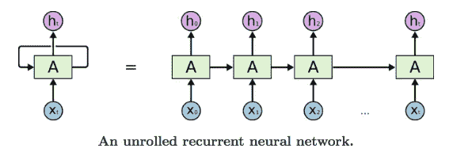

rnn 的链状结构与序列相关，可以是单词、音频或图像的序列。因此，它们在语言建模、翻译、语音识别等方面取得了惊人的成功。

但是，当相关信息和需要它的地方之间的差距增大时，rnn 很难连接信息。**长短期记忆网络**(**lstm**)**是一种特殊的 RNN，能够学习长期依赖关系。**

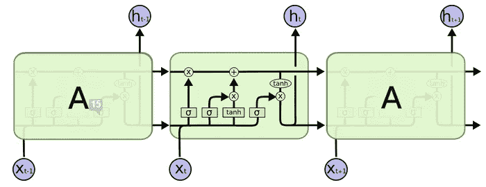

**Repeating module in LSTM has 4 layers, compared to a single tanh layer in RNNs**

在序列到序列模型(多对多 RNN)中，当输入和输出序列的大小不同时，使用**编码器-解码器架构**。解码器仅在编码器完成后启动。**例如**:机器翻译、文本摘要、会话建模、图像字幕等等。

**General Purpose Encoder-Decoder LSTM Architecture**

**编码器**单元帮助**“理解”输入顺序**(“你明天有空吗？”)和**解码器对‘思维向量’**进行解码，生成输出序列(是的，怎么了？").思维向量可以被认为是输入序列的**神经表征，只有解码器才能看到其内部并产生输出序列。**

**为了进一步提高序列对序列模型的性能**，在上述架构中使用了**注意机制**。

# 注意机制

一个人**聚焦于图像的特定部分**以获得图片的整体本质。这本质上就是注意力机制的工作方式。

这个想法是**让 RNN 的每一步从一些更大的信息集合中挑选信息**。为了说明，对于图像字幕问题，通过使模型聚焦于图像的特定部分而不是整个图像来生成合适的字幕。

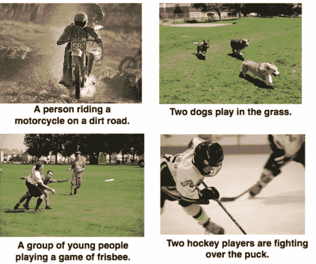

**Image Captioning Samples**

对于语言翻译，我们**从编码器的每个时间步长获取输入，**但权重取决于该时间步长对解码器的重要性，以最佳方式生成序列中的下一个单词，如下图所示:

**Attention Mechanism for Language Translation (Chinese to English)**

有了上述技术，我们现在可以构建一个端到端的序列对序列模型来执行个性化的对话建模。

# **数据集**

我发现**只用两个人之间的真实聊天对话进行训练不会产生稳定的结果**。聊天消息通常包含缩写词(如“brb”、“lol”等)、速记、网络俚语和错别字，以混淆神经网络训练。因此，我结合了现实世界的聊天信息和人机交互来进行训练。

1.  来自 Whatsapp 和 Telegram 的个人聊天对话(下载为 **HTML 文件)**
2.  在 NIPS (NeurIPS) 2018 大赛 **(JSON 文件)**范围下进行的对话智能挑战赛 2 (ConvAI2) [对话数据集](http://convai.io/data)
3.  [Gunthercox](https://github.com/gunthercox/chatterbot-corpus/tree/master/chatterbot_corpus/data/english) 会话式对话引擎基于已知对话的集合生成响应，以训练通用对话，如问候、GK、个人资料等。 **(YML 文件)**
4.  [157 次聊天和 6300+条信息与虚拟伴侣](https://www.kaggle.com/eibriel/rdany-conversations) **(CSV 文件)**

第三和第四个数据集做了一些修饰，以适应博客的要求。

# **数据准备&清洗**

俗话说，**模型只有数据好。**因此，在输入模型之前过滤和清理数据非常重要。

输入的数据有多种格式，即 JSON、HTML、YML 和 CSV。由于 YML 文件是纯 ASCII 格式，所有其他格式都被转换成文本格式的 YML。

**a) JSON 解析**

使用 Python 解析作为 3 个 JSON 文件下载的 ConvAI2 数据集。

***解析器输入&输出:***

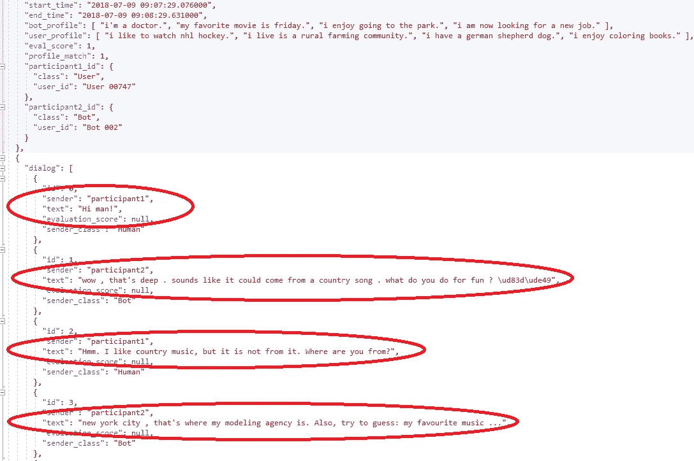

**Sample JSON Input**

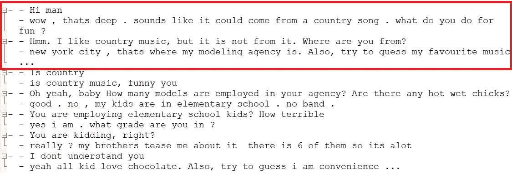

**Sample YML Output**

**b) HTML 解析器**

从 Telegram 和 Whatsapp 下载的 messenger 数据被保存为 HTML 和文本文件。所有的 HTML 文件都使用下面的 Python 函数进行解析。使用用户名标记处理文本文件更加简单。

***解析器输入&输出:***

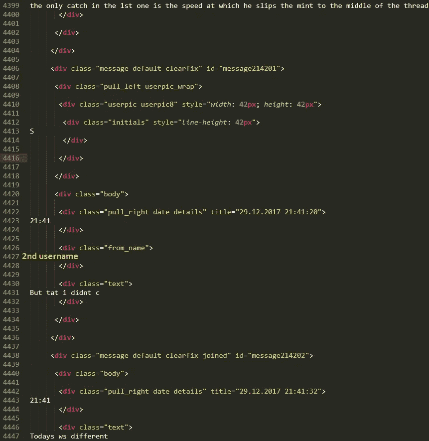

**Sample HTML Input**

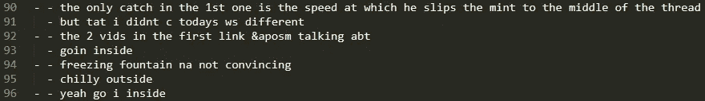

**Sample YML Output**

**的对话中两个人都用不同的符号来标记**到**指示输入的&目标序列。**特殊字符、网页链接、日期、时间、机器人专用标记&表情符号被过滤。CSV 文件使用 Excel 进行处理。

**c) YML 解析器**

在(a)和(b)之后，所有的文件都被转换成 YML 格式。因为这个特定的 YML 数据集只包含“列表”符号，所以我们使用一个简单的文件解析器来接收数据。序列的最大长度是固定的，并且对单词进行计数以过滤掉罕见的单词。下面的函数用于解析整个数据集。

# 数据预处理

在过滤掉罕见的单词后，我们将创建字典为每个单词提供一个唯一的整数。**创建 Word2Index 和 Index2Word 转换的正向和反向映射字典**。

使用 **Word2Index** 将输入序列(字)转换为索引，并填充至相同长度，用于编码器的批量输入。使用**索引 2 字**映射将编码器的输出从整数转换为字。在所有目标数据前添加一个特殊的标记来通知解码器。

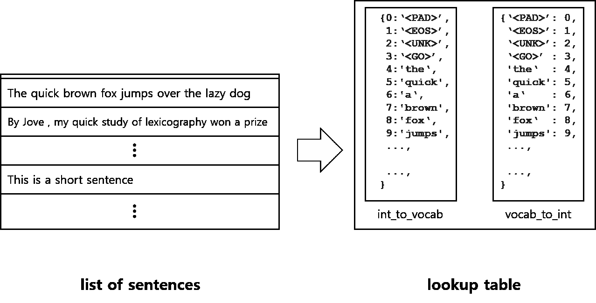

**Word2Index and Index2Word Dictionary (Special Token = <GO>)**

# 构建 sequence 2 序列模型

为了**训练**模型，来自上面步骤的填充输入和输出序列(索引)被馈送到下面的 S2S 架构。嵌入层将单词转换成索引(已经在上面完成了),这些索引被**馈送到隐藏层中堆叠在一起的多个 LSTM 单元。**

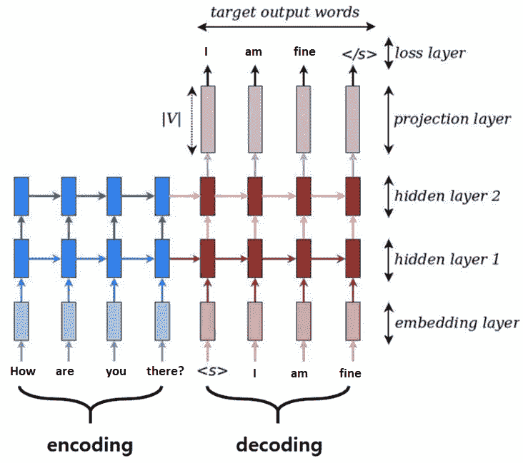

**Encoder-Decoder LSTM Architecture for Conversation Modelling**

**解码**模型可以认为是两个独立的过程，**训练和推理。**在训练阶段，输入作为目标标签提供，但在推理阶段，每个时间步的输出将是下一个时间步的输入。下图描述了进给策略的差异:

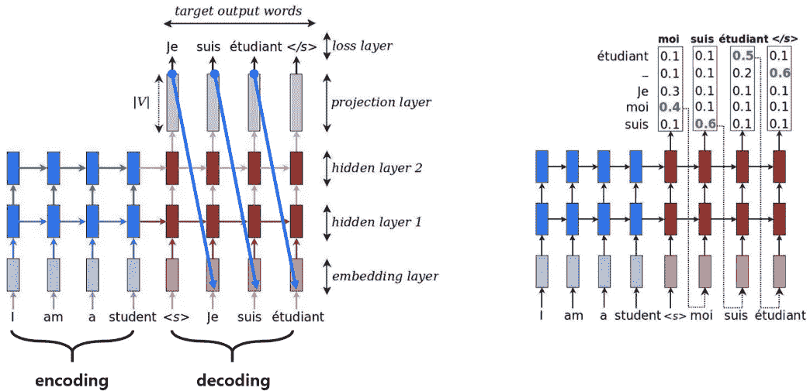

**Shared Decoding Model: Training (Left) and Inference phase (Right)**

输入占位符中的`None`表示批量大小，批量大小未知，因为用户可以设置。填充后，每个输入的大小为 input_seq_length。使用 RMSProp 优化器，因为它比 Adam 更好。

**在推理阶段，相同的模型可重复使用**并带有前馈机制来预测响应序列(设置 feed_previous=True)

*对应于步数的损失如下:*

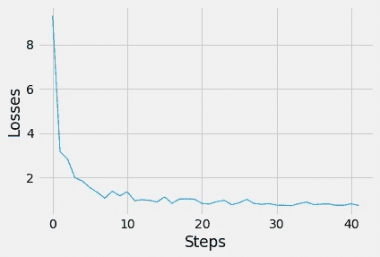

**Loss vs Steps Plot (Steps = 500X)**

**学习率、批量和步骤数的超参数调整**基于上述图完成。对于某些学习率，训练损失在损失值最初下降后会上升。因此**在学习速度和步数之间找到平衡很重要。**

# 人机界面

为了与机器人交互，使用 Python 中的 *Tkinter* 模块构建了一个简单的接口

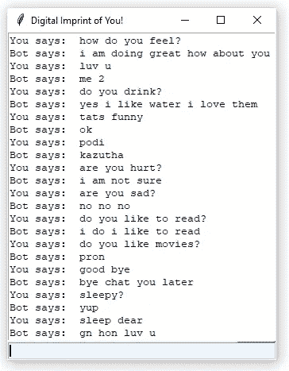

**Snapshot of Chat-bot Interaction**

有趣的是，聊天机器人被发现给出与用于训练的个人数据风格相似的**响应。尽管如此，还是有一些语法错误，典型的生成模型。但是随着我们添加越来越多的训练数据&调整超参数以最小化损失值，发现机器人行为越来越稳定。为了使响应更加合理，我们可以使用**双向 RNNs，因为它可以利用过去和未来的上下文来做出更好的预测，**尽管它们在计算上更加昂贵。**

**项目的源代码可以在** [**Github 这里**](https://github.com/AdroitAnandAI/LSTM-Attention-based-Generative-Chat-bot#lstm-attention-based-generative-chat-bot) **找到。**

# **关闭思路**

我们还没到那一步。首席执行官的数字化身可能只是一个**“决策支持工具”**，但它没有能力运营公司。**公众人物可以外包一些公共互动。**例如，咨询著名律师、名人或政治家**对公众来说将变得更加可行和实惠，**如果我们能够复制他们的数字化身。你可以代表你的头像参加商务会议。然而，谨慎的做法是承认一个真正智能的图灵测试机器人就像技术奇点乐观主义者预见的时代一样遥远。

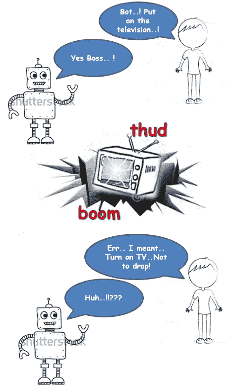

***Inspired from famous Indian Tamil movie, ‘Enthiran’***

# **参考文献**

1.  [https://github . com/adroitandai/LSTM-注意力-基础-生成-聊天-机器人](https://github.com/AdroitAnandAI/LSTM-Attention-based-Generative-Chat-bot) **(完整源代码)**
2.  [https://www . technology review . com/s/612257/digital-version-after-death/](https://www.technologyreview.com/s/612257/digital-version-after-death/)
3.  [https://towards data science . com/seq 2 seq-model-in-tensor flow-ec0c 557 e 560 f](https://towardsdatascience.com/seq2seq-model-in-tensorflow-ec0c557e560f)
4.  [https://www . analyticsvidhya . com/blog/2017/12/introduction-to-recurrent-neural-networks/image-captioning/](https://www.analyticsvidhya.com/blog/2017/12/introduction-to-recurrent-neural-networks/image-captioning/)
5.  [https://github.com/Nemzy/language-translation](https://github.com/Nemzy/language-translation)
6.  [https://guillaumegenthial . github . io/sequence-to-sequence . html](https://guillaumegenthial.github.io/sequence-to-sequence.html)
7.  [http://colah.github.io/posts/2015-08-Understanding-LSTMs/](http://colah.github.io/posts/2015-08-Understanding-LSTMs/)
8.  [https://www . analyticsvidhya . com/blog/2018/03/essentials-of-deep-learning-sequence-to-sequence-modeling-with-attention-part-I/](https://www.analyticsvidhya.com/blog/2018/03/essentials-of-deep-learning-sequence-to-sequence-modelling-with-attention-part-i/)
9.  [*https://github.com/farizrahman4u/seq2seq*](https://github.com/farizrahman4u/seq2seq)
10.  [https://www.appliedaicourse.com/](https://www.appliedaicourse.com/)