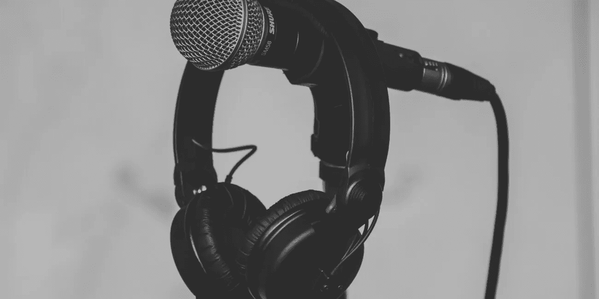
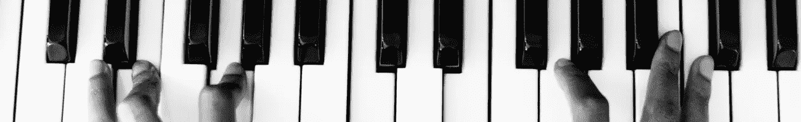
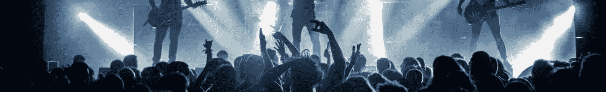
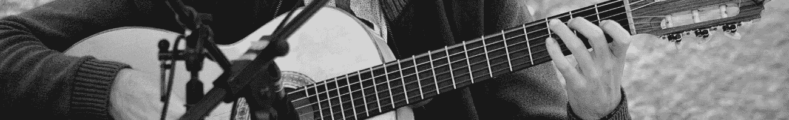
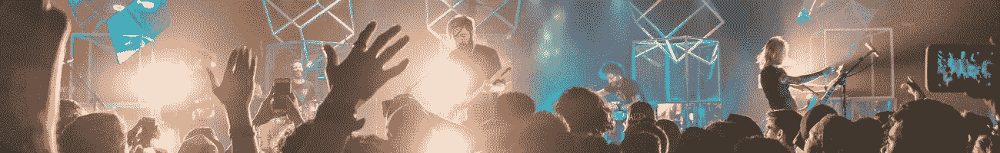

# 如何从你的音乐中赚钱

> 原文：<https://medium.datadriveninvestor.com/how-to-make-money-from-your-music-56a887bc5e6c?source=collection_archive---------19----------------------->

## 在当前的行业环境下，作为一名音乐艺术家很难赚钱，这是毫无疑问的…

*最初发表于*[*【millennialmoderator.com】*](https://millennialmoderator.com/how-to-make-money-from-your-music)*。*

首先，你必须接受这样一个事实，有很多其他艺术家试图做和你完全一样的事情，我是说很多。无论哪种流派、风格、国家、年龄等，市场都是饱和的。了解并接受这一事实将有助于你成长为一名艺术家，因为你现在明白你不可能和其他人一样——你必须挑战极限。所以让我们来看看作为一个音乐艺术家赚钱的几个实用方法。

# 表演节目

让我告诉你，从行业经验来看，顶级音乐人才从表演中赚取难以想象的巨额金钱。对于你在大型音乐节上看到的一些一线艺术家来说，100 万美元的演出费不是不可能的。现在乘以他们每年表演的次数(想象一次巡演)——这个数字令人震惊。毫无疑问，表演是赚钱的，但问题是你如何从中获利？

你必须建立信誉和一个好的音乐产品。最终，推广者会付钱给艺人，因为他们的音乐/名字能卖座。你必须做出真正好的音乐(或者真正*独特的*音乐，基于市场的饱和程度),并建立一个拥有忠实追随者的社区。你还必须有令人难以置信的表演，为观众创造记忆——所以他们会把你推荐给他们的朋友。对于 DJ 来说，这可能意味着拥有独特而强大的混音能力，对于乐队来说，这可能意味着舞台上难以置信的团队能量。你必须让人们想看你表演——这取决于你如何去发现如何做到这一点，获得创造性。

# 出售您的音乐/流媒体

音乐分销行业已经不是过去的样子了——艺术家们可以刻录 CD/磁带，并从人们在 iTunes 上购买他们的音乐中获利。如今有了 Spotify、Apple Music 等，情况就大不一样了。简单明了，音乐购买者是一个难以开拓的市场。购买音乐的人要么是 DJ(他们需要这些文件来表演)，要么是收藏家，也就是铁杆支持者，他们希望音频文件成为自己的个人收藏/支持艺术家——这意味着如果你希望获得可观的利润，你必须已经拥有一批忠实的追随者。

如今，流媒体音乐对普通听众来说更为普遍，但按流付费的费率如此之低(0.006 美元/流)，以至于许多新手甚至不愿尝试。你必须有大量的信息流才能赚到大钱。简单算一下——一月份，我收到了大约 89，000 条关于我的歌曲 [Distance](https://open.spotify.com/track/26xQTAvqwej9Ud131sMNmv) 以及其他一些内容的流量，总计为**534.00 美元**。这可能看起来很多，但请相信我，我花了几年时间才走到这一步。

让听众听到你的音乐也需要大量的推广，这对一些人来说是一个痛苦的话题。我发现有两种方法可以让我的音乐获得更多的宣传和流量:

*   发行有固定标签的音乐。通过这样做，你在向他们的追随者和粉丝推广你的音乐，这可能意味着大量听众/流量涌入你的方向。我的唱片公司 StoryTime 经常开展营销活动，并与各种电子音乐艺术家合作发行唱片。我们一直在寻找新的艺术家，所以如果你的音乐属于电子/流行类别，请随时在我们的[网站](http://storytimemusic.com/)提交给我们考虑。我们还开展各种社交媒体宣传活动，如果这对你更有意义的话。
*   获取流媒体播放列表。就像唱片发行一样，如果你上了一个有很多听众的 Spotify 播放列表，你的音乐会有更多的播放——这意味着更多的流媒体收入。虽然一些播放列表服务是免费的，但许多需要付费或会员才能加入——这就是商业运作的方式。Spotlist Player 是我过去用过的一个效果不错的服务。网上有很多其他的选择，用谷歌搜索吧。

# 从你的品牌中赚钱

随着你粉丝群的增长，人们对你这个人的兴趣也会增加。想想你最喜欢的音乐人/乐队，他们的音乐一开始就让你着迷(可能)，但过一段时间后，你就会喜欢上他们的性格——他们是什么样的人。这一点，加上大量的追随者，使他们成为广告产品/服务的主要候选人。

如果你是一个非常著名的吉他手，芬德很有可能会直接给你发信息，给你 10，000 美元，让你在你的 Instagram 上发布一张抱着他们最新吉他的照片。他们知道你的粉丝在看着你，所以他们利用这种信任，付钱给你让你告诉其他人购买他们的产品。在我的 [Instagram](https://instagram.com/loshmusic) 上，已经有几个产品品牌联系过我(我也联系过他们)寻求赞助机会，并且已经收到了免费产品和宣传费。你必须充满自信，并有[良好的参与度](https://millennialmoderator.com/how-to-increase-social-media-engagement)。我写了一个关于作为艺术家使用 Instagram 的深度课程，你可以在[我的网站](http://loshmusic.com/learn#industry)购买。

品牌和企业之间的这种协议被称为联盟计划，每天都有大量这样的事情发生。这是一个非常有利可图的商业模式。关于联盟网络和联盟计划之间的区别，以及在哪里可以找到它们的更多信息，这里有一篇我写的[独立文章](https://millennialmoderator.com/whats-the-difference-between-affiliate-programs-and-networks)。

# 教

就像这篇文章一样，你可以把你的经验和教训传授给其他正在攀登音乐职业阶梯的人。如果你受过适当的音乐训练，为什么不考虑去音乐学校当老师呢？或者也许你热爱声音设计，并创造了一些令人难以置信的样本包——在像 [Fiverr 这样的网站上出售它们！](https://track.fiverr.com/visit/?bta=41333&brand=fiverrcpa)

教学意味着以知识的形式给予他人价值，虽然它当然可以为你赚钱，但它也是帮助他人的一个好方法。例如，我有一个[私人简讯](http://smarturl.it/LOWSH_NEWSLETTER)，在那里我发送有价值的音乐制作技巧、嘉宾名单赠品、免费 DJ 编辑包等等。我这样做是免费的，因为我想和别人分享我学到的东西。

作为一名音乐人赚钱需要创造力、营销和大量的奉献，但是机会就在那些认真对待它的人面前。音乐是我的热情所在，也是我每月额外获得 1000 美元额外收入的几个项目之一[。我每天都在努力推进我的音乐事业，你也必须如此。无论你做什么，都不要放弃。](http://alekseyweyman.com/story)

如果你觉得这篇文章有用，请考虑与其他有抱负的艺术家分享！有任何问题或意见吗？在[推特](https://twitter.com/alekseyweyman)上让我知道。

标记为:[生活音乐](https://millennialmoderator.com/how-to-make-money-from-your-music#)

*最初发表于*[*millennialmoderator.com*](https://millennialmoderator.com/how-to-make-money-from-your-music)