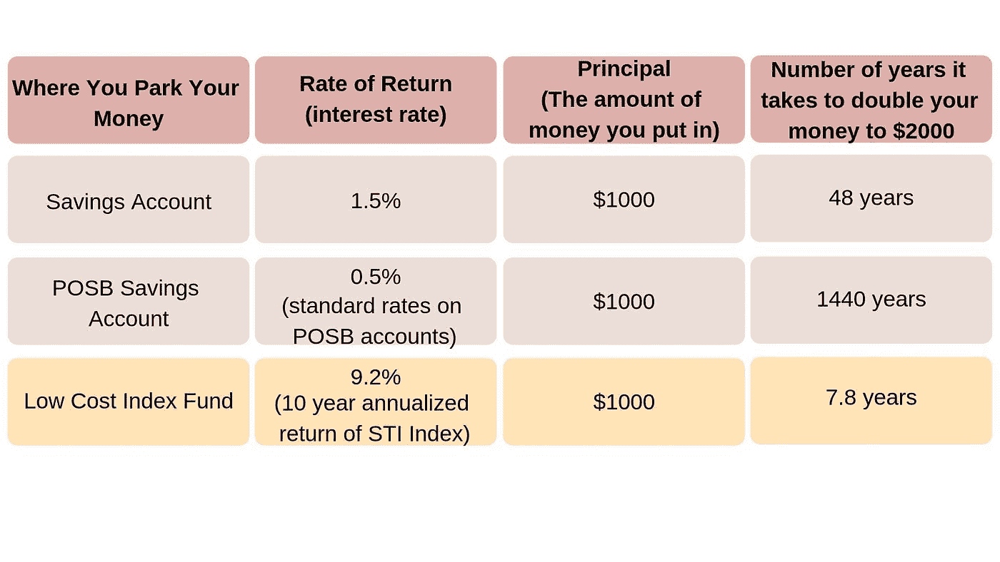
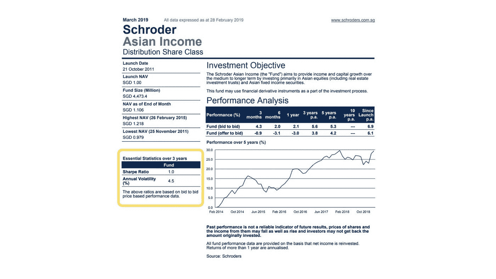

# 如何在睡觉的时候赚钱

> 原文：<https://medium.datadriveninvestor.com/how-to-make-money-while-you-sleep-587c7b209a0?source=collection_archive---------4----------------------->

Photo by Fabian Blank on Unsplash

女性投资比男性少 40% 。

尽管女性[在投资时获得的回报](https://www.nbcnews.com/better/business/why-women-invest-40-percent-less-men-how-we-can-ncna912956)一直高于男性(40 个[基点](https://www.investopedia.com/terms/b/basispoint.asp)或 1%的 40/100，即 0.40%)。

自从开始我的经济独立和扫盲之旅，我就一直在教育自己如何通过投资让我的钱增值。

这也是我的网站存在的原因。以简单易懂且有趣的方式解释金钱概念，让忙碌的职业女性也能理解。

本周，我学到了以下两个概念，它们可能有助于我们消除对投资金融市场的恐惧。

*   复利的力量
*   夏普比率

 [## 股票市场投资的机器学习——数据驱动的投资者

### 当你的一个朋友在脸书上传你的新海滩照，平台建议给你的脸加上标签，这是…

www.datadriveninvestor.com](https://www.datadriveninvestor.com/2019/01/30/machine-learning-for-stock-market-investing/) 

# 复利的力量

我们经常听说复利的力量。

复利是利用时间帮助我们的钱以越来越快的速度增长的想法。

我们的本金或初始金额会产生利息。

那笔原始金额或本金加上我们当年赚到的利息会累积成一笔金额，然后在第二年赚取利息。

换句话说，你在你的利息上赚取利息。

随着时间的推移，这种复合效应可以让你的钱大幅增长。

那么，通过复利效应，你的钱到底增长了多少？

# 72 法则(或者 69.3，如果你喜欢精确的话)

一个很好的经验法则是 72 法则。

72 法则告诉我们大约需要多长时间我们的原始资金才能翻倍。

这个很大程度上取决于利率。利率越高，我们的钱翻倍的时间就越短。

为了计算出我们的钱翻倍需要多长时间，我们用 72 除以利率。

假设你有 1000 美元，把它投入一项年收益率为 3%的投资。

根据 72 法则，1000 美元变成 2000 美元需要 24 年。

72/3 = 24 年

为了稍微精确一点的计算，我们也可以用 [69.3](https://www.investopedia.com/ask/answers/what-is-the-rule-72/) 代替 72。

72 只是一个更容易记住的数字。

# 为什么你应该关心复利

但是谁想要那无聊的复合谈话。

我想知道这在现实生活中意味着什么。

对我来说，复利是忙碌的妈妈们每月留出一笔钱，让时间为你赚钱的最简单的方法。

你不需要额外加班，最棒的是你睡觉的时候你的钱还在继续为你工作！

因此，与其把它存入能为你赚取 1.5%利率的储蓄账户，不如把它投资于指数基金，这是一种低风险、无压力的方式，可以利用复利和时间让你的钱为你更努力地工作。

随着通货膨胀率达到 2%，你储蓄账户中的钱实际上正在失去购买力。

这里有一个例子。

# 如何降低投资金融市场的风险

我知道你们有些人在想什么。

但是如果我在股票市场上失去了所有辛苦赚来的钱怎么办？

看看雷曼兄弟的遭遇吧！

这就是理解夏普比率派上用场的地方。

# 夏普比率

夏普比率有助于投资者了解其投资回报与其风险的对比。

换句话说，根据投资的风险水平进行调整后，你的投资回报率是多少。

你做的任何投资都有风险。

就像生活一样，没有 100%的保证。

然而，你可以使用夏普比率来确定你所承担的风险与你所期望的投资回报之间的关系。

你是最好的判断者，知道这种程度的风险是否值得你投资。

这因人而异，取决于我们的风险偏好和投资目标。

为了计算夏普比率，我们将你感兴趣的投资的回报率减去无风险利率(通常是风险最低的国债的回报率)。

这给了你调整后的投资回报。

然后我们用这个数字除以该投资的标准差或波动率。

波动等于风险。

理想情况下，你希望找到一个相对分子很小的分母。

这意味着你想投资一些风险尽可能低(最小分母)的东西，以获得最高的调整后回报。

你几乎永远也不需要自己计算夏普比率，因为这将在基金情况说明书上提供。

# 投资购物时如何运用夏普比率

查看夏普比率是我们如何降低投资风险的方法。

夏普比率越高，投资越安全。

当我们比较同行之间的夏普比率时，例如持有类似资产的类似 ETF，我们希望查看 10 年期夏普比率，并投资于夏普比率最高的基金。

你可以点击查看 Investopedia 解释夏普比率[的视频。](https://www.investopedia.com/terms/s/sharperatio.asp)

# 结论

我希望更多的女性开始学习如何投资。

记住，投资不等于交易，这是我们可能有的误解。

说到“投资”或“金融市场”，我们会想到赌博或交易，通过预测他们的行为来“战胜市场”。我们可能会想到必须花所有的时间来监控股票和图表，当我们看到图表变化时，就点击“买入”或“卖出”。

交易员倾向于在更短的时间内持有资产，以利用短期趋势。

另一方面，投资者往往有更长的时间跨度。我们已经经历了 20、30 年，市场有足够的时间自我调整，收复失地。

在这样的长期范围内，我们的资金在股票和债券上的回报率通常在 8%到 10%之间。

不过，在投资之前，首先要确保你有一些小金库，以备生活中的意外事件。

阅读更多关于为什么我认为在你如何分配你的储蓄以避免陷入债务背后有一个序列[在这里](http://www.mommymakesthemoney.com/forget-saving-for-emergency-funds/)。

我希望这有助于消除你对投资和金融市场的恐惧和犹豫。

是什么阻止了你投资？在下面的评论里分享吧！

*原载于 2019 年 3 月 23 日*[*www.mommymakesthemoney.com*](http://www.mommymakesthemoney.com/make-money-while-you-sleep/)*。*

[*下载*](https://pages.convertkit.com/5144f465db/c5d05fe31c)*‘每个女人的 14 条建议&妈妈需要过上财务自由的生活’现在就控制好你的钱，这样你就能过上你想要的生活。*