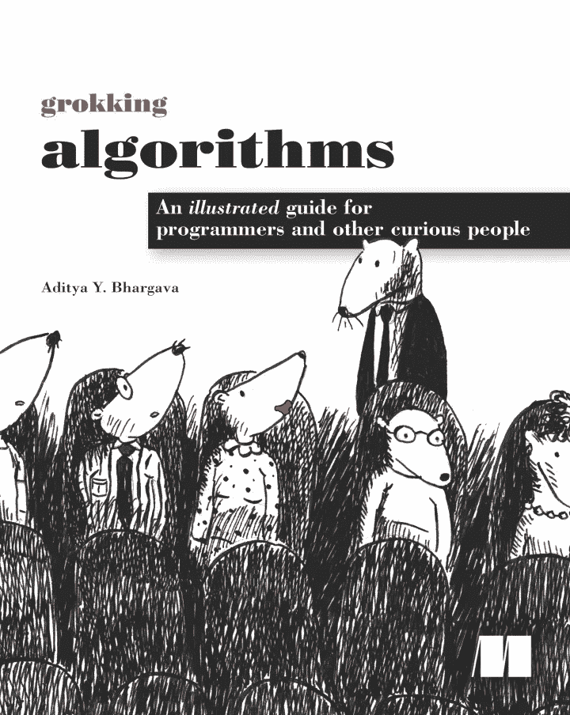
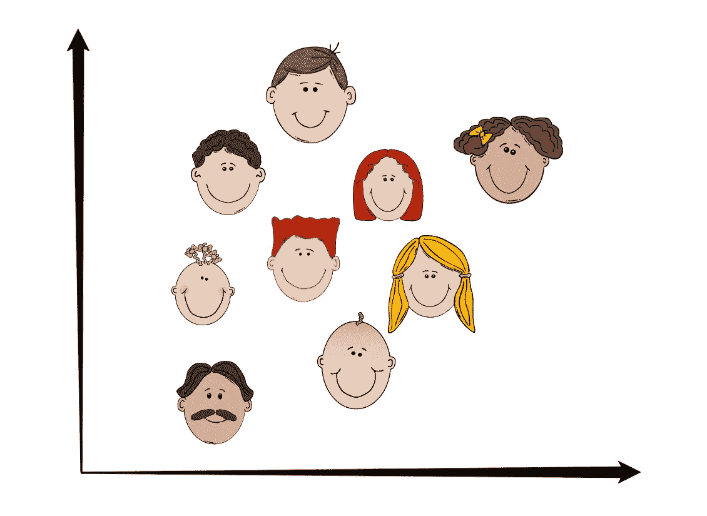
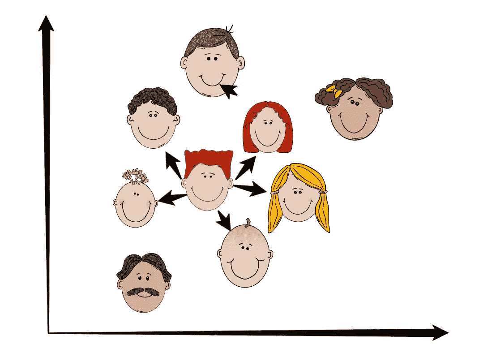
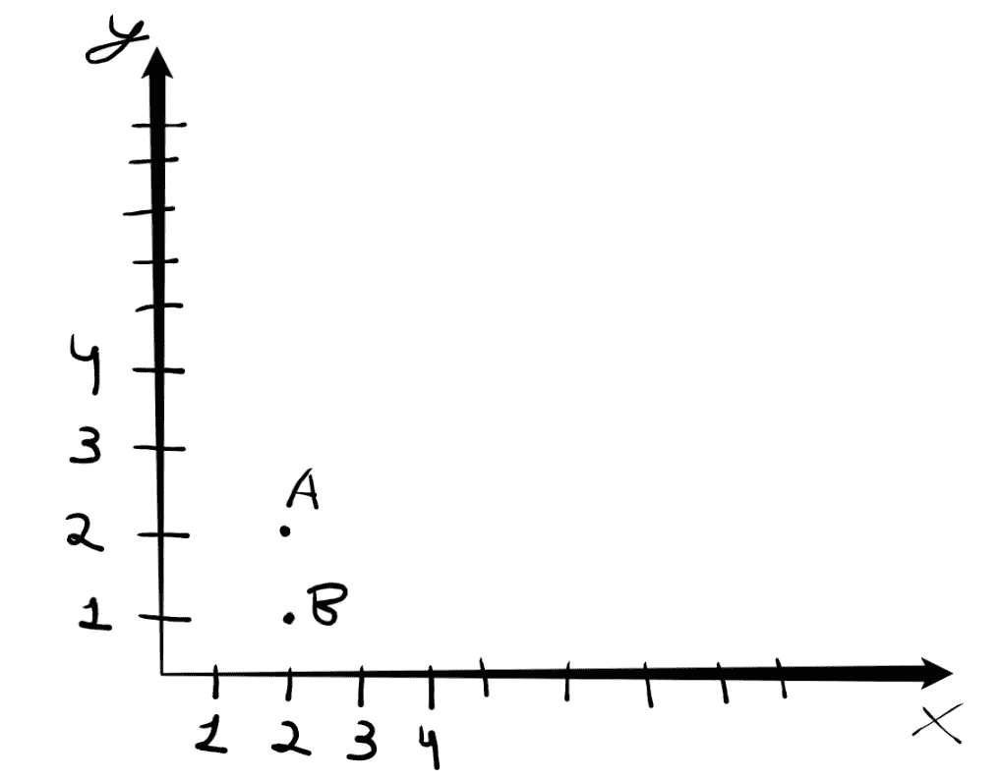
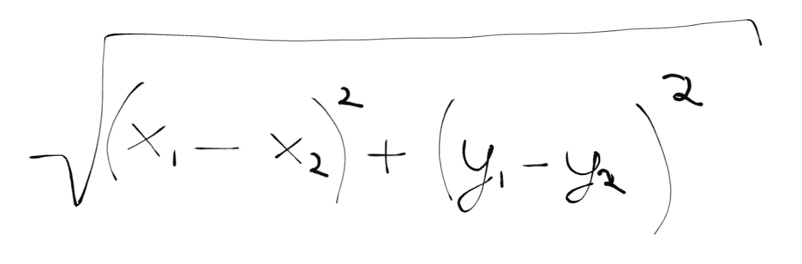
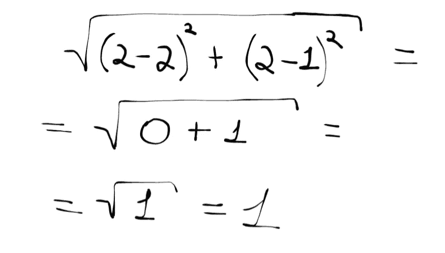
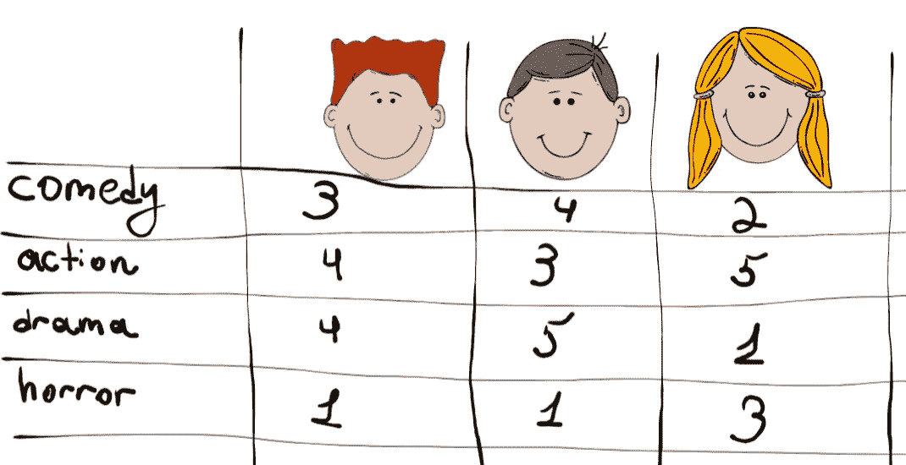
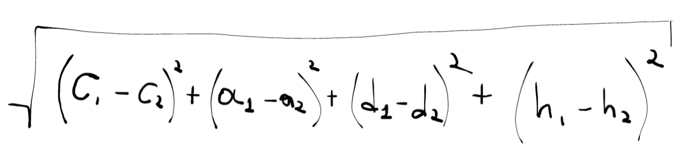
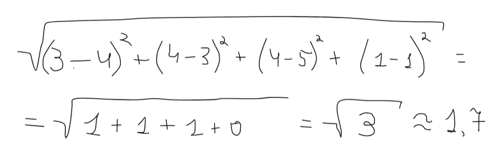
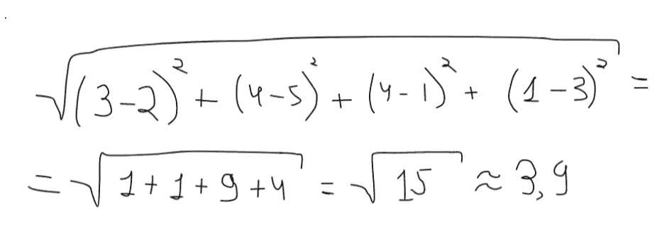

# 虚拟物体的 k 近邻算法

> 原文：<https://medium.datadriveninvestor.com/how-to-make-predictions-using-k-nearest-neighbors-algorithm-6f6f5e4455f?source=collection_archive---------9----------------------->

这篇文章是受这本书的启发。此外，我在文章中给你的大部分信息都来自这本书。对我来说，这是一次既有意义又有趣的经历。所以，我强烈推荐你读这本书。

# K 近邻算法简介

假设你在网飞工作，你的任务是建立一个推荐系统，向用户推荐电影。首先，我们需要弄清楚我们将如何做这件事。像这样在图上显示所有用户怎么样？

利用用户在电影中的喜好来定义用户的位置，并且由于具有相似喜好的用户彼此相邻。假设你想给汤姆推荐几部电影。找出离汤姆最近的五个用户。

这五个用户和汤姆的口味相似。不就意味着这五个用户喜欢的电影有机会符合汤姆的喜好吗？很有道理，不是吗？尽管我们的计划很完美，我们仍然有一些问题。你评估用户使用你的分析能力有多接近，但是你怎么能把这些能力用到你的电脑上呢？*机器如何确定用户有多接近*？

# 用于分析的标志

让我们停一会儿，回到数学上来。如何计算 A 和 B 这两点之间的距离？

为了计算两点之间的距离，你应该使用毕达哥拉斯公式

例如，计算 A 和 B 之间的距离如下:

这里我们有 X 轴和 Y 轴，但是*我们如何在我们的网飞应用*中表示用户呢？首先，我们需要找出用户的口味，并把它们表示为坐标。让用户从 0 到 5 评价电影的类型怎么样？

在 points-task 中坐标用两个数字表示，和我们电影-task 中的一样，但是我们的坐标不是两个数字，而是四个数字表示:(喜剧，动作，戏剧，恐怖)。因此，我们计算用户之间距离的公式将如下所示:

如你所见，尽管数量更多，我们的公式保持不变。不管你有多少个数字，这个公式是通用的，不管我们有 4 个数字还是 10 万个数字。

此时你可以问*用四个数计算距离有什么用？它显示了什么？*它显示了这四组数字是如何相互接近的。在我们的例子中，它显示了用户是否有相似的品味。让我们试试我们的新公式:

Distance between Tom and Michael

这是汤姆和迈克尔之间的距离。看起来汤姆和迈克尔的品味相似，是吗？现在让我们对汤姆和卡罗尔的口味做同样的事情:

Distance between Tom and Carol

正如我们现在看到的，汤姆和迈克尔有相似的品味，不像卡罗尔。完美！现在我们可以很容易地向汤姆推荐一些电影:当迈克尔欣赏一部电影时，我们会向汤姆推荐它。

# 要回答的问题

## 1.网飞有数百万用户。在我们的例子中，推荐系统建立在五个最近的用户上。五个太少还是太多？

五个不够。如果我们的算法适用于少量的最近邻，预测可能会不准确。有一个很好的经验法则:对于 *N* 个用户，你应该选择 *sqrt(N)* 个邻居。

## 2.在我们的例子中，我们有四种电影类型，够了吗？

答案是——还不够。和上一个问题的情况一样:我们的预测可能不准确。尽可能多的选择类别来比较(在我们的例子中是电影的类型)用户。

# 结论

如果你是网飞的用户，网飞会经常提醒你尽可能多地评估电影。你评估的电影越多，你得到的推荐就越好，现在你知道为什么了吧！

***感谢阅读这篇文章，拍拍我的文章帮助我成长我的社区。看看我其他关于编程和算法的文章:***

 [## 假人的大 O 符号

### 如果你对算法感兴趣，你一定听说过“大 O 符号”。这件事比想象的要容易…

medium.com](https://medium.com/@stalonadsl948/big-o-notation-for-dummies-999a7e3fa1ec)