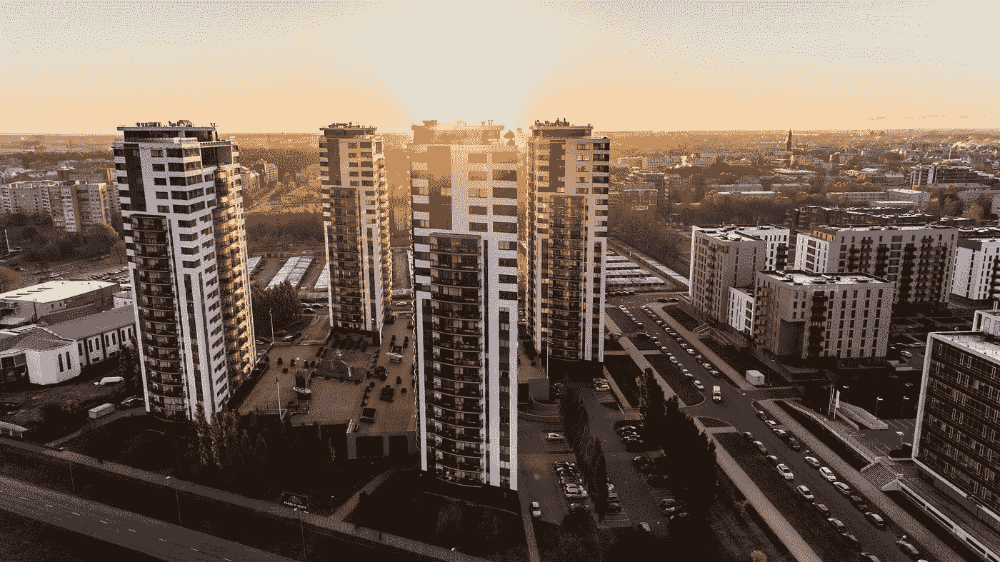

# 如何确保你的投资不受衰退影响？

> 原文：<https://medium.datadriveninvestor.com/how-to-make-sure-your-investment-is-recession-proof-b80bf13481ab?source=collection_archive---------9----------------------->

房地产市场欣欣向荣，似乎每个人都过得不错。破产很少见，尤其是在多家庭领域。但是这个天堂不会永远存在。我们正处于一个最长的经济周期中，尽管没有人知道它什么时候会改变，但购买正确的投资是很重要的；一个在经济衰退期间依然稳固的公司。市场现在非常宽容，但有几种方法可以确保你的投资——无论你是主动还是被动投资者——在市场逆转时仍然稳健。

以下是如何确保你的投资不受衰退影响的方法:

**不要指望升值，关注现金流** [我写了一篇关于计算房地产投资未来回报时升值的权重](https://www.linkedin.com/pulse/5-key-deal-components-passive-investors-must-examine-closely-yogev/)。在考虑潜在回报时，密切关注升值因素，它对你的投资有重大影响。问题是升值是一个有根据的猜测——你无法确切知道你的房产将来会升值多少，而且当经济发生变化时——出售获利会变得更加困难；市场上将会有更少的买家，因为许多人损失了钱，贷款人也开始拖欠贷款。这正是 2008 年发生的事情。因此，如果你需要在经济不景气的时候卖掉一项看起来很有前景、升值系数很高的投资，它可能会变成一笔亏本买卖。

然而，保守的方法可以告诉你你的投资是否可靠。当考虑升值因素时，对于退出上限(您的房产将被出售给新买家的上限利率)，我使用的上限利率比我购买房产的上限利率高 0.5%到 1%。更高的上限意味着更低的购买价格。基本上，我假设当我需要卖出时(从现在起的 5-7 年内)，我们将处于下跌市场。这种方法得到了经济学家预测的支持，这些预测显示未来上限税率将会提高。如果你的投资在市场下跌时仍有不错的回报，那么你最有可能在经济衰退时表现良好。这样，你关注的是房地产产生的现金流，而不是未来的升值，因为未来的升值并不是完全确定的。

对被动投资者的可行建议:请承销商分享他们的退出上限假设和购买上限比率，并比较两者——如果退出上限高于或等于购买上限，请询问他们原因，并利用你对市场的了解和你的判断来确定这是否有意义。

**看看最坏的情况——租金上涨 0%**

任何房地产交易的一个重要部分，尤其是多户住宅和写字楼，都是租金上涨。在不需要改善物业的交钥匙交易中，租金会有一定的上涨，这反映了市场趋势，通常为 2%-4%。也就是说，投资者相信，由于市场上的租金上涨，他/她也能够这样做。一些市场的租金涨幅惊人，比如奥兰多(与去年相比，租金涨幅约为 7%)。在增值交易中，租金上涨是基于投资者对装修后租金上涨的假设。对于多家庭房产来说，每个单元每月租金上涨 75-150 美元是很常见的。

租金上涨会显著影响任何交易的预期回报。然而，你应该考虑租金已经见顶并且不再上涨的情况，这是经济衰退中很可能出现的情况。我相信，对许多投资者来说，这将是一个残酷的现实，尤其是因为我们已经开始看到美国各地租金增长的下降。抗衰退房产是指即使租金稳定，仍有现金流的房产。当我的团队分析一笔交易时，他们会运行多个场景，包括租金增长= 0%的场景。对我来说，重要的是看到租金增长不足如何影响回报，如果它仍然是积极的，那么我知道这是一个好的投资。

针对被动投资者的可行建议:要求银团贷款者进行租金增长率为 0%的敏感性分析，并观察这种情况下的回报。

**看看历史——2008 年该地区和房产的表现如何？**

没有人知道下一次衰退会是什么样子，希望下一次循环不会像上次衰退那样严重，但看看任何投资的历史书都会让我们对未来的表现有更好的了解。

给被动投资者的可行建议:在投资某个领域之前，查找一下 2008 年的相关信息(甚至谷歌搜索也会有所帮助)。此外，请尝试了解该物业在 2008 年的表现；询问辛迪加，他/她对 2008 年的房产表现了解多少，并要求查看那段时间的财务报告。你不需要成为一个专家就能注意到 P&L 的亏损，在你决定投资之前了解一下亏损情况是很重要的。

**总结**

为了确保您的投资不受衰退影响，请确保:

-现金流正在影响回报，而不是高升值因素

-即使租金没有增长，投资仍然稳固

*   即使在上次经济衰退期间，房地产也表现良好