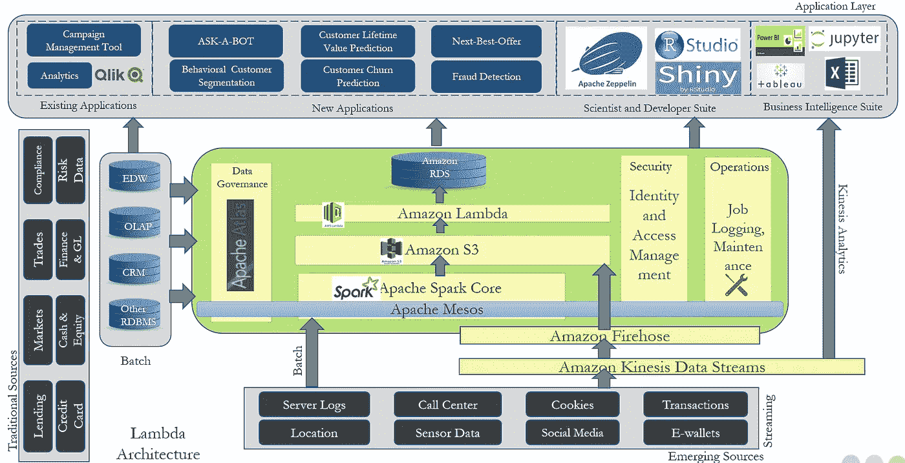

# 如何让大象唱歌！

> 原文：<https://medium.datadriveninvestor.com/how-to-make-the-elephant-sing-7ad2a89f0aaa?source=collection_archive---------44----------------------->

“two brown elephants near body of water” by [Archie Fantom](https://unsplash.com/@archiefantom?utm_source=medium&utm_medium=referral) on [Unsplash](https://unsplash.com?utm_source=medium&utm_medium=referral)

最近，我与一些亚洲银行业思想领袖就大数据项目如何失去动力进行了一次有趣的讨论。据报道，许多项目很少或根本没有创造价值。最近 Hadoop 发行商 Cloudera 和 Hortonworks 的合并是否也是这方面的一个领头羊？也许吧。

但是，Hadoop 有望在未来产生强劲增长的预测怎么了？2016 年为 76.9 亿美元，据[预测](https://www.zionmarketresearch.com/news/hadoop-market)2022 年将增长至 871.4 亿美元，CAGR 为 50%。

2017-2018 年肯定发生了一些变化。大数据技术的早期采用者(2013 年至 2014 年)在 2017 年前完成了他们庞大而昂贵的实施。他们构建了巨大的数据湖，能够可靠地存储来自不同来源的数据。“以后架构”方法使转储数据变得更容易，但是如何使这些数据可用于报告呢？这仍然是昂贵的，高技能的，并需要传统的方法，如商业智能工具。简单的“即插即用”数据检索选项在这一点上是不可行的。

那些立即行动也为时已晚的场景呢？在机器、设备或网站发生故障之前需要预测的情况下，将日志存储在数据湖中，无法用于预测建模是没有价值的。

托马斯·达文波特曾有一句名言“数据是新的石油”。但是，如果石油留在炼油厂而不能用于汽车和工厂的运转，它有用吗？

那么，我们如何确保大数据投资能够产生价值呢？

## 简单的数据检索

PySpark 和其他库提供了使用 python 直接从 HDFS 读取的能力。除非您是具备这些技能的数据科学家，否则将数据用于分析可能需要几周或几个月的时间。

一个即插即用的平台从 HDFS 提取数据进行潜在分析肯定有市场空间。

## 实时分析

使用亚马逊 Kinesis 等流处理技术以及 Kinesis Analytics 来处理、聚合和可视化流数据，有助于实现即时的可操作情报。

Typical Real-Time Analytics Architecture

Apache Kafka 也是流处理中的主导力量，但由于开源技术的生产率问题，公司可能更喜欢 Amazon Kinesis 而不是 Kafka。

在下一篇博客中，我们将深入探讨如何构建实时流应用程序