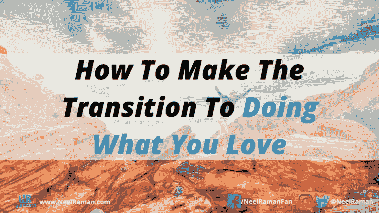
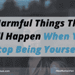
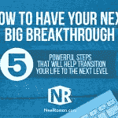
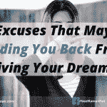
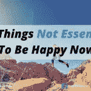

# 如何过渡到做自己喜欢的事情

> 原文：<https://medium.datadriveninvestor.com/how-to-make-the-transition-to-doing-what-you-love-eacaf5984ebd?source=collection_archive---------29----------------------->

我相信我们喜欢做的事情是我们人生目标的线索。我们都有自己喜欢做的事情，这些事情都是我们从小就养成的。

可悲的现实是，大多数人已经把他们真正喜欢做的事情推迟到“某一天”或者“某一天”已故的史蒂夫·乔布斯有一句名言:“做伟大工作的唯一方式是热爱你所做的事情。如果你还没找到，继续找。不要和解。”

当我们热爱生活中所做的事情时，我们的伟大才能得到最好的体现。当我们没有表达我们的天赋和才能时，我们内心的一部分会感到停滞、窒息和困顿。当我们经历这样的情绪时，它可以:

*   从身体上影响我们。
*   打击我们的积极性。
*   降低我们的绩效和效率水平。
*   影响我们的心情和快乐。

当我从事企业职业时，我知道这不是我长期要做的事情。我隐约感觉到我被召唤去做一些不同的事情，但是我首先必须发现我真正喜欢的事情是什么。事实是，我喜欢做的事情总是在我心里——我只需要再次与它们联系起来。

当我从企业职业转型为企业主时，不幸的是，我犯了很多错误，导致我难以满足自己最基本的需求。这不是一个好地方，幸运的是，我已经学到了一些有价值的经验教训，我将与大家分享，这样如果你正在考虑做出类似的改变，你就不会犯我犯的同样的错误。

当你开始从目前正在做的事情过渡到你想做的事情时，这里有五件事需要考虑。尽管这不是一份完整的清单，但这些是我希望在踏入创业世界之前就已经完成的事情。

**1。明确你选择的是新职业还是新爱好。**做自己喜欢的事情并不一定意味着你会开创新的事业或创造新的收入机会。比如有些人爱画画，只为了好玩而乐于画画。另一方面，一些艺术家希望能够出售他们的画作，并从他们的艺术品中谋生。

这就是为什么知道你想做什么是至关重要的。弄清楚的一个方法是回答这个问题:*“如果时间和金钱不是问题，我很乐意……”*列出至少 20 件事情。

**2。不要太早辞职。如果我们最基本的需求得不到满足，我们无法支付我们的开销，那将会产生很大的压力。如果我们不小心，很快我们就会为了生存而努力赚钱。这不是一个好的地方，这是我希望我能以不同的方式做的主要事情之一。**

最初，会有一段时间，你会觉得自己有两份职业——你的正常工作和你正在过渡的职业。如果你想从你喜欢的事情中获得收入，确保你开始从你正在做的新事情中获得足够的收入，这样你就可以支付你的日常开支。一旦你的生活费用有了保障，你就可以开始减少你在工作上投入的时间，把更多的时间花在你喜欢做的事情上。

**3。在市场中寻找需求。仅仅因为我们喜欢做某事并不意味着我们有权从中赚钱。如果我们想通过做我们喜欢的事情来谋生，它必须满足市场的需求，并且应该是人们想要的东西。需要考虑的一些问题包括:**

*   对于我喜欢做的事情，市场上是否有未满足的需求？
*   人们愿意为我喜欢做的事情付费吗？
*   我的市场目前面临的一些棘手问题是什么？
*   我能做些什么来提供独一无二或与众不同的东西？
*   我能做些什么来从我喜欢做的事情中获得长期可持续的收入？

**4。早点开始建立关系网。**你可能不知道上述问题的所有答案，所以找到这些答案的最好方法是开始结识来自不同社交网络的人。它可以是在商业网络活动，研讨会，研讨会，贸易展览，博览会，会见小组等。你越早能够建立新的关系，让人们知道你在做什么，当你迈出这一步，开始做你完全热爱的事情时，你会过得越好。

**5。建立一个支持网络或者有值得信任的顾问。当我们过渡到做自己喜欢的事情时，挑战就会出现。这就是为什么让我们可以寻求建议和指导的人会非常有帮助。这可以是与教练的正式关系，也可以是与导师或你尊敬和信任的人的非正式关系。**

重要的是要指出，我们总会做一些不一定喜欢的事情。虽然我们不应该接受它作为一个不可改变的现实，但同时，我们也不应该有一个错误的想法，认为我们只会做我们喜欢的事情。是的，有时会感觉像是一种折磨，但是我们必须清楚我们为什么要这样做，回报会是什么。

当我们做自己喜欢的事情时，那就是我们真正体验到生活的全部乐趣的时候，这在我们所做的每一件事情中都有所体现。最棒的是，我们会激励周围的人也去做他们喜欢的事情。

**行动步骤:**通过回答以下问题，列出至少 20 件事情:*“如果时间和金钱不成问题，我很乐意…”*

***问题:目前你在做什么，让自己做更多自己喜欢做的事情？***

您可以通过[点击此处](https://www.neelraman.com/how-to-make-the-transition-to-doing-what-you-love/#respond)发表评论。

## 相关职位

*   [当你不再做自己时会发生的 5 件有害的事情](https://www.neelraman.com/5-harmful-things-that-will-happen-when-you-stop-being-yourself/)

*   [如何实现你的下一个重大突破](https://www.neelraman.com/how-to-have-your-next-big-breakthrough/)

*   [遭遇重大挫折后如何东山再起](https://www.neelraman.com/how-to-make-a-comeback-after-a-major-setback/)

*   [10 个可能阻碍你实现梦想的借口](https://www.neelraman.com/10-excuses-that-may-be-holding-you-back-from-living-your-dreams/)

*   [现在快乐不必要的 10 件事](https://www.neelraman.com/10-things-not-essential-to-be-happy-now/)

*   [将改变你生活方式的 10 个真相](https://www.neelraman.com/10-truths-that-will-change-how-you-live-your-life/)

# 喜欢这个帖子？

注册我的博客更新，不要错过任何帖子。我还会寄给你我的电子书，名为[“如何让你的一周达到最大效果”](https://neelraman.mykajabi.com/p/best-week-ever-book)作为感谢。

*原载于 2015 年 5 月 25 日 neelraman.com**T21*[。](https://neelraman.com/how-to-make-the-transition-to-doing-what-you-love/)