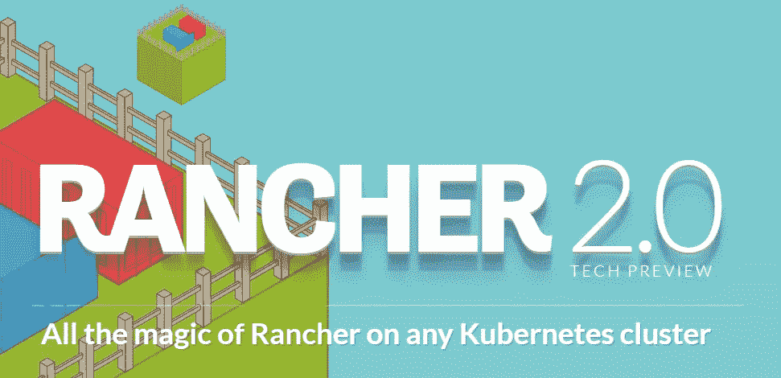
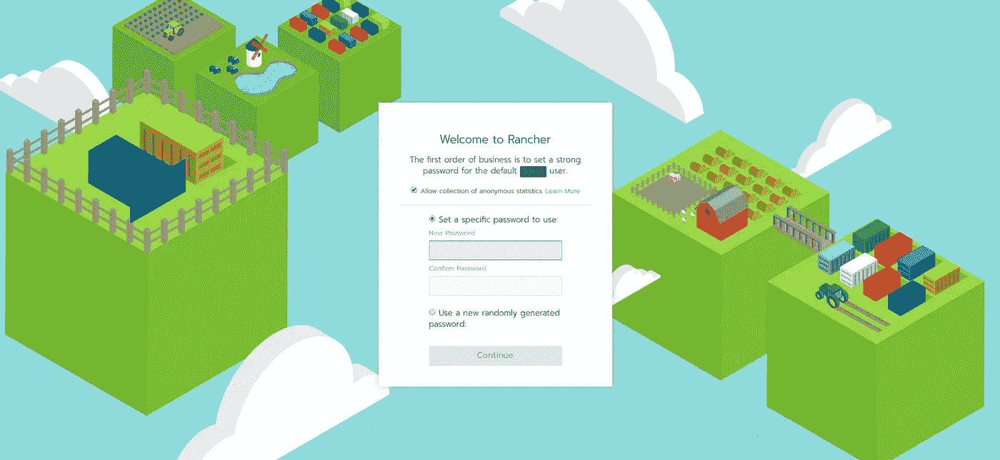
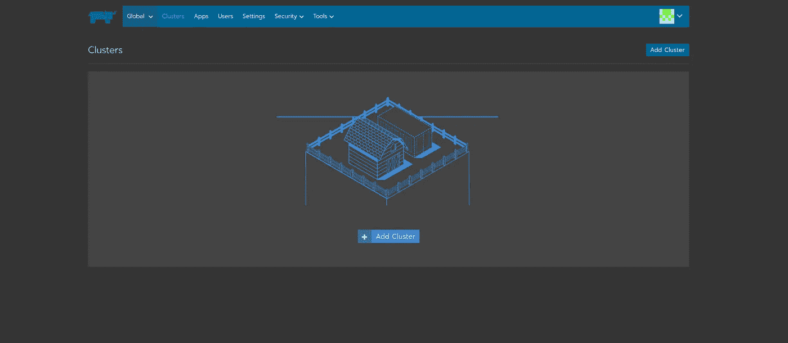
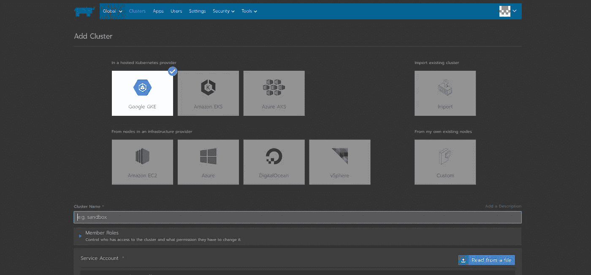
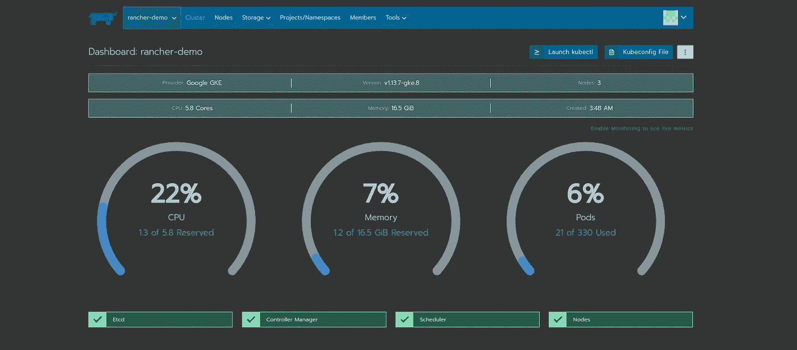
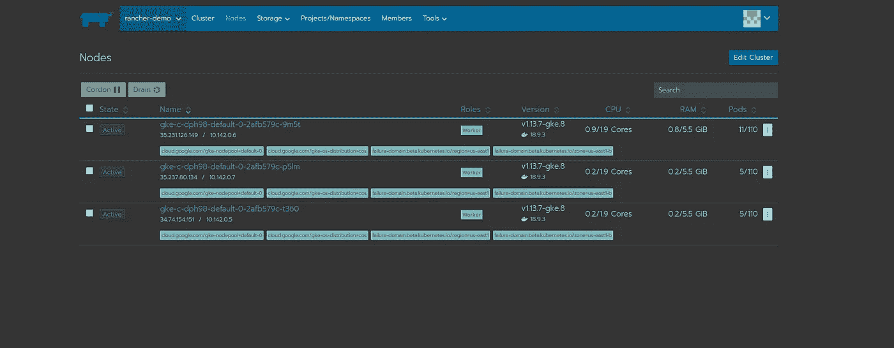
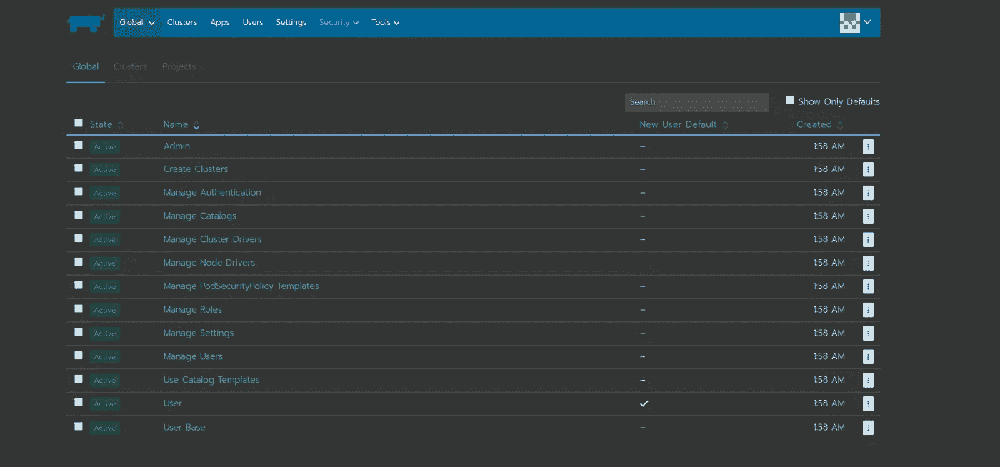
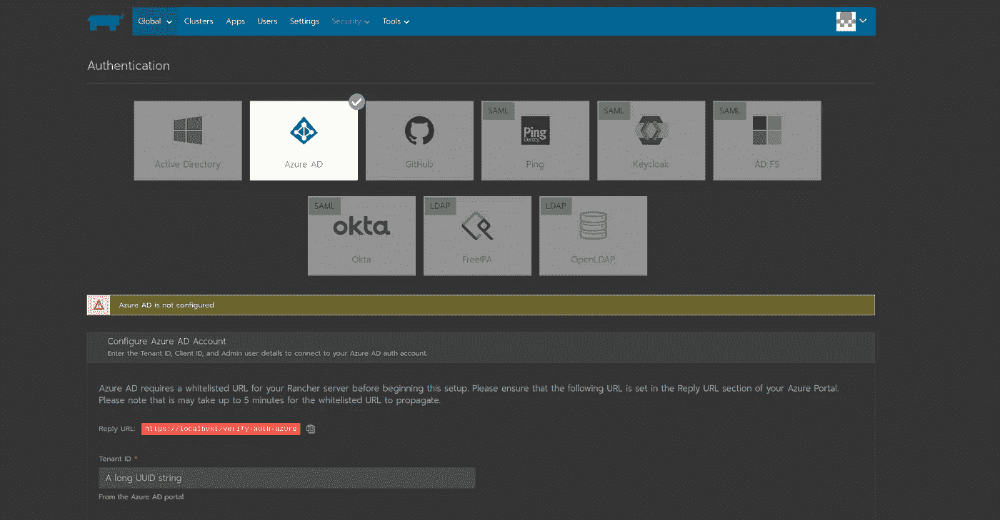

# 如何通过 Rancher Labs 管理的 K8s 平台让您的容器争论更加高效…

> 原文：<https://medium.datadriveninvestor.com/how-to-make-your-container-wrangling-more-efficient-with-rancher-labs-managed-k8s-platform-65b009dd97cb?source=collection_archive---------8----------------------->



# 为什么要管理 K8 氏症？

作为一项技术，Kubernetes 现已在各行各业广泛采用。显然，这种采用在很大程度上是由技术“S 曲线”后端的早期采用者推动的。然而，在这一点上，许多大玩家已经接受 Kubernetes 作为一种技术和容器编排领域的领导者。

处于 S 曲线的后端，许多早期采用者是在生态系统有像 Helm 或 Operators 这样的东西使建立 Kubernetes 更容易之前涉足 K8 的用户。对于任何被采用的技术来说，这都是可以预期的，然而，我们现在看到 Kubernetes 被更广泛地采用，因此对易用性等期望有了更高的要求。随之而来的是一系列托管解决方案，如 Rancher！

托管解决方案基本上消除了 K8 基础设施建设的跑腿工作。您仍然可以按照自己的意愿定制它，并且拥有完全的`kubectl`控制权，但是 Rancher 基本上处理 TLS 证书供应之类的事情。

托管解决方案适合所有人吗？可能不会，但对于那些尝试过的人来说，在 YAML 编写 Kubernetes 清单是不可原谅的，如果你弄错了的话。有了 Rancher，您可以立即从 Kubernetes 中受益，而不用担心 YAML。相对于自己动手，把 YAML 写作的乏味方面留给一个解决方案是有道理的。

此外，Rancher 非常适合多云架构。Rancher 不仅在任何地方、任何提供商上部署 Kubernetes 集群，而且还将它们统一在集中的身份验证和访问控制之下。对于依赖正常运行时间和可用性的公司来说，这可能是天赐之物。

# 让我们看看它的实际效果

现在，我将带大家通过一个小演示来了解如何使用 Docker 和 Rancher UI 来启动 Rancher。

安装 Docker 后，输入以下命令启动一个 Rancher 容器:

```
sudo docker run -d --restart=unless-stopped -p 80:80 -p 443:443 rancher/rancher
```

要访问 Rancher 服务器 UI，请打开一个浏览器并转到安装容器的主机名或地址。将指导您设置第一个集群。

它应该是这样的:



Rancher Login UI

设置好您的`admin`密码并运行初始设置步骤后，您将被引导至`clusters`页面:



在这里，您可以通过以下四个选项调配 K8 的资源:



1.  托管的 Kubernetes 提供商
2.  基础设施提供者中的节点
3.  导入预先存在的 K8 集群
4.  您自己的现有节点

你需要通过导入一个 JSON 私钥在 GCP 创建一个服务帐户，关于这样做的信息可以在这里的[文档中找到。在开始之前，您可能还需要启用一些 API。](https://cloud.google.com/compute/docs/access/create-enable-service-accounts-for-instances)

完成所有这些后，您将在`clusters`页面看到您的集群配置，如果您单击显示的集群，您将被带到如下所示的页面:



在这里，您可以做各种事情:

1.  启动 kubectl
2.  查看/编辑 Kubeconfig 文件
3.  观察指标

如果您导航到`nodes`页面，您将会看到一个显示您的节点的页面，如果需要的话，带有 GUI 选项来封锁和排空:



接下来转到安全选项卡，看看 Rancher 提供的一些功能。Rancher 为用户的所有 Kubernetes 集群和用户提供了一个集中的身份验证解决方案。用户可以使用自己选择的身份验证服务，通过一组凭据连接到任何群集。

以下是“安全”选项卡的 GUI 外观:



和“身份验证”选项卡:



现在我们已经向你展示了所有的东西，我们可以回到`clusters`部分，开始使用浏览器内的`kubectl`控制台。继续安装一些舵图或操作符，在您观察资源在您想要的基础设施上旋转时，感受一下它是如何工作的。


## 就是这样！

至此，我已经向您介绍了使用 Rancher 构建基础设施的基本知识。我希望你在阅读这篇文章时有很好的体验，我也希望你能阅读我以后的文章！

一定要点击下面按钮，这样你就可以及时了解我未来的帖子。

在 GitHub 上找我:https://[www.github.com/jdbohrman](http://www.github.com/jdbohrman?source=post_page---------------------------)
在 LinkedIn 上找我:[https://www.linkedin.com/in/jdbohrman](https://www.linkedin.com/in/jdbohrman)
在 Twitter 上找我:[https://www.twitter.com/jdbohrman](https://www.twitter.com/jdbohrman)