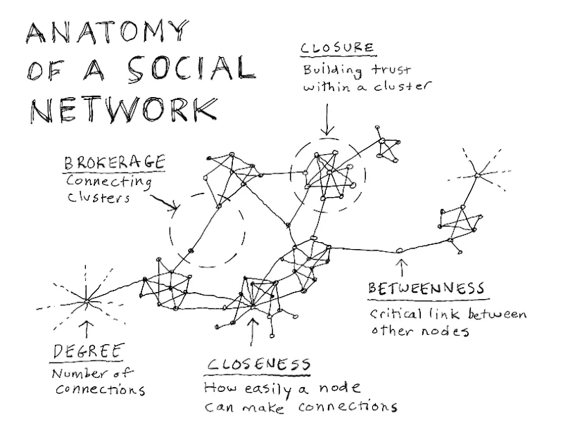

# 如何让你的人际网络更有效(更愉快)

> 原文：<https://medium.datadriveninvestor.com/how-to-make-your-networking-more-effective-and-more-enjoyable-316f45852f2?source=collection_archive---------33----------------------->

“time lapse photography of square containers at night” by [Federico Beccari](https://unsplash.com/@federize?utm_source=medium&utm_medium=referral)

最近，我一直在通过猎头公司找工作。我进入最后几轮面试的命中率一直很低；虽然最初很沮丧，但我意识到不仅仅是他们，我也是。对我来说，从事一份有意义、有前途的工作意味着很多事情，但最重要的是为我喜欢的人工作。

这让我想到了我的名片夹，并联系了那些有可能雇佣我从事充实职业的人。我必须承认，在几年前，我从未真正主动地想过“管理”我的网络和朋友/熟人圈子。作为一个天秤座(被归类为更外向的星座之一)，我几乎对大多数邀请和社交聚会都说好。然而，正如生活不可避免的那样，随着责任的增加，时间变得越来越短，留给课外交往的空间也越来越少。

随着年龄的增长，我们的社交圈开始停滞，如果我们不在繁忙的日程中积极腾出空间来保持联系，最终甚至会缩小。

# 因此，在我们仅有的一点时间里，我们如何确保我们的网络尽可能的广泛和相关，同时让它变得令人愉快而不那么乏味？

[https://plus.google.com/+DaveGray/posts/CQRVeKEsUvF](https://plus.google.com/+DaveGray/posts/CQRVeKEsUvF)

为了拥有一个有效的广泛的人际网络，我努力花时间和身边朋友圈子之外的人在一起。根据芝加哥大学的一项研究，这些被称为你的“强关系”。然而，这些“强关系”不太可能给你提供一个你以前没有探索过的新线索。很多时候，你的亲密关系会和你有很多相同的经历或观点。相反，集中精力发展你的熟人圈子——朋友的朋友，另一个部门的同事，你在课外活动中遇到的导师。这些是你的“弱关系”——与它的标题相反，可以提供新的机会或者打开一扇你以前不知道的门。

当然，发展“弱关系”需要相当多的时间和真正的努力。虽然有些人对人际关系网完全是外科手术式的，也许把它看得太重了，但试着把人际关系网当作一门艺术来对待。有些人只想和房间里最重要的人或有决策权的人交往；这可能是最直接利用时间的方式，但如果你表现得过于强势，或者将自己置于一个尴尬的境地，试图强行与听众建立联系，这可能会有风险。认识到房间里的人，花更多的时间和更可能对你有益的人在一起是常识；然而，当想要了解一个人的愿望是真诚的时候，整个过程可能会更愉快！因此，带着实际联系的目的去建立关系网可能会给你带来意想不到的好处。

是的，说起来容易做起来难。你如何接近一个比你旁边的人更“真实”的人？！

有时，我会参加招聘或社交活动，在这些活动中，年轻一些的人会开始与我交谈。在这种情况下，你可以假设我是他们最终提出要求的目标。当有人试图超越肤浅的闲聊时，我总是能看出来——但这并不总是房间里最雄辩或最外向的人。我最有收获的经历是在一次聚会和交流活动中遇到了一名大学生。她有兴趣了解更多关于我们公司暑期实习的情况，但通过我们的交谈，我发现她真正的热情是在艺术方面。我们进行了一次关于巴洛克艺术、她最喜欢的荷兰大师以及生活如何改变她的阿姆斯特丹之行的附带交谈，以看到她研究的绘画变成现实。

# 直到今天，她给我留下了持久的印象，因为她的热情是显而易见的，尽管我们有年龄差距，以及我们对艺术的不同品味，这是我能理解的东西。

> 我发现的另一个避开客套话的方法是提供你已经有的见解，而不是偏离一个可能与情况更相关的话题。

当你交往的人在知识或经验上占优势，而你觉得很难给人留下深刻印象时，这种情况经常发生。你开始把谈话引向一个你力所不及的领域。例如，一位在交易市场有 20 多年经验的投资经理可能会令人生畏，在一次尴尬的长时间停顿中，你提出了你匆忙研究的股票推介。很明显，当他或她开始盘问你的推理时，你并没有花太多时间去思考问题。(是的，以前也有过……)相反，你可以考虑提供一些见解，谈谈如今课堂上教授选股的学术方法。

# 随着时间的推移，我意识到我可以贡献我独特的经历——尽管是更加绿色的经历——这可能会令人耳目一新，即使仅仅是因为它的坦率。

> 简而言之，社交就是认识新的人，并建立一座桥梁，让这种关系超越最初的互动。 **建立和维护一个强大的人际网络最重要的方面可能不是战略性的或过于算计的——本质上，人际关系的艺术可能会在这个过程中迷失。** *与不属于你的领域或没有“牢固关系”的人建立关系网是扩大社交范围的一种非常有效的方式。即使它们可能对你的近期目标没有直接的帮助，不要目光短浅也是明智的。最终，一切都归结于联系。越是发自内心的，越是真实的将会打开以前看不到的可能性。*