# 如何管理您的加密产品组合

> 原文：<https://medium.datadriveninvestor.com/how-to-manage-your-crypto-portfolio-b86de00489f?source=collection_archive---------0----------------------->

随着比特币在过去几年达到前所未有的高度，世界正在迅速意识到加密货币的投资潜力。但随着有吸引力的机会不断出现，新加密货币项目的数量继续迅速增加。事实上，CoinMarketcap 列出了目前存在的近 1500 种可交易货币。由于其中很大一部分提供了惊人的回报，交易员、投资者和长期“HODL 人”正越来越多地寻求在许多不同的项目上分散投资。

但是，如何有效地构建和管理加密货币投资组合呢？嗯，假设来说，一个人可以把他们的购买留在他们各自的交易所，并简单地依靠这些交易所对整体投资组合价值的计算。但是这绝对是*而不是*推荐的解决方案，原因有几个。

首先，交易所提供的估值往往不是特别准确。第二，也许是最重要的，你的资产并不安全；大多数交易所没有分散化，这意味着它们仍然容易受到黑客的攻击，正如我们在过去几年中多次看到的那样。最后，在不同的交易所，每种资产的定价往往存在巨大差异。这意味着，如果你在某个特定时刻套现，在某个特定交易所持有的资产价格可能会与它的真实价值大相径庭。(当然，这也意味着套利机会仍然普遍存在，而且可能相当可观)。

因此，很难跟踪你的所有投资，因为它们总是分散在众多的交易所。令人欣慰的是，现在有越来越多的基于网络、基于手机和基于电子表格的工具来有效地跟踪和管理你的投资组合。我们在这里概述一些最受欢迎的:

# 使用电子表格

鉴于 CoinMarketCap 已经成为需要查看最新价格的加密货币交易者的*事实上的*参考页面(但不是唯一的一个)，现在可以将该页面上发布的数据导入到电子表格中，如 Microsoft Excel 和 Google Sheets，以供进一步分析。这可以使用 CoinMarketCap 的 [API](https://coinmarketcap.com/api/) (应用程序编程接口)来完成。

用于将数据导入 Excel 的 API 在功能方面正在稳步发展。到目前为止，可以实现多种功能，允许:

根据您的 Excel 版本，您可以使用**“超级查询→来自 Web”**选项卡或**“获取数据→来自 Web”**选项来导入适当的数据。后一个选项如下所示:

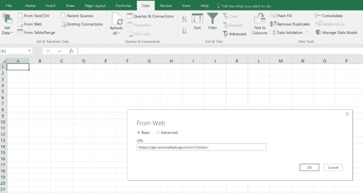

进入 [CoinMarketCap API 地址](https://api.coinmarketcap.com/v1/ticker/)，如上图。这将使 Excel 能够获取网站上列出的所有硬币的所有数据，并生成以下列表:

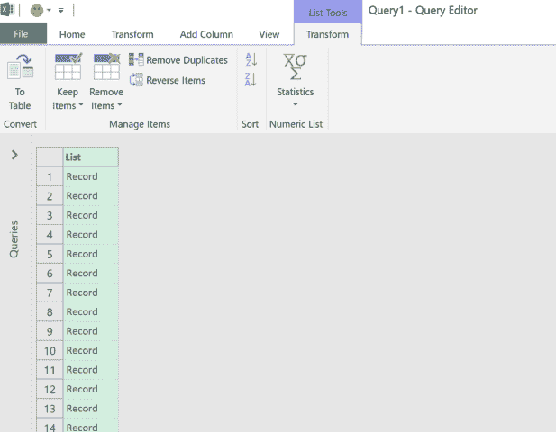

然后需要将该列表转换为可读的 to 表，因此选择左侧的**‘To 表’**按钮，然后按**‘确定’**。

如下所示，选择“列 1”旁边带有两个箭头的按钮，这将显示将包含在最终表格中的条目(另外，确保取消选中“使用原始列作为前缀”复选框)。然后按确定:

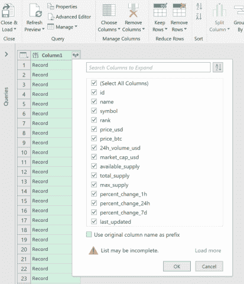

我们现在有了 CoinMarketCap 上提供的每枚硬币的详细信息，包括符号、价格、体积等。我们现在也有了我们的查询，可以将其重命名为合适的名称，例如“实时加密数据”，如下所示:

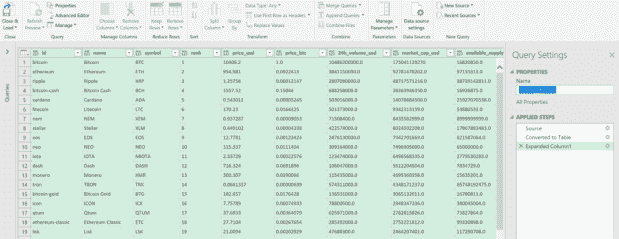

完成后，选择“**关闭&加载**”按钮(在上图的左上角)，这将把最终的表格加载到 Excel 中:

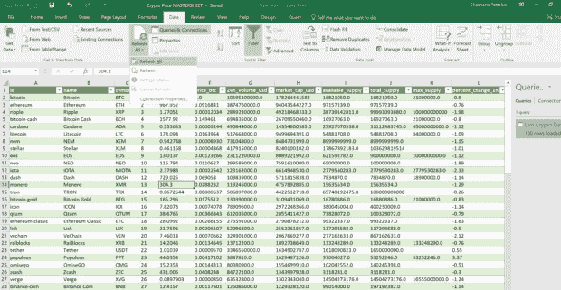

如上图所示，为了刷新表格，以便拉入最新的数字，选择**‘数据→全部刷新’**。

正如 [CoinMarketCap 的 API 站点](https://coinmarketcap.com/api/)目前所显示的，一系列特定的数据可以从该站点获取，也可以转换成不同的货币(例如，[https://api.coinmarketcap.com/v1/ticker/?convert=EUR](https://api.coinmarketcap.com/v1/ticker/?convert=EUR))。

# 引入历史数据

当然，作为一个精明的投资者，你也希望有能力分析一枚硬币之前的价格走势和趋势，以洞察其未来可能的表现。这就是其历史价格数据将被证明有用的地方。

但是用于“历史数据”的 CoinMarketCap API 仍然处于“即将到来”的模式，这意味着不可能提取每天都会不断更新的历史数据。*是*，但是，仍然可以将历史价格导入 Excel，然后执行定期的、较小的手动更新，以刷新价格，从而包含最新数据(即昨天的收盘数据)。

假设我们对以太的历史数据感兴趣。要在 CoinMarketCap 上查看，我们可以选择[历史数据选项卡](https://coinmarketcap.com/currencies/ethereum/historical-data/)，如下所示:

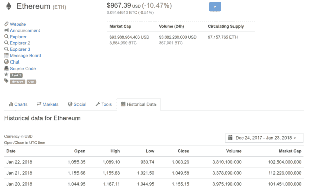

此外，定制日期给了我们一个包含数据范围的网址；所以如果我们选择我们的日期范围为‘所有时间’，那么对应的网址就是[https://coinmarketcap . com/currences/ether eum/historical-data/**？start = 2013 04 28&end = 2018 01 23**。](https://coinmarketcap.com/currencies/ethereum/historical-data/?start=20130428&end=20180123)

因此，网址为我们提供了数据的开始日期和结束日期。因此，我们可以使用这个地址将历史数据导入 Excel。实际上，这是使用与我们提取实时价格的方法类似的方法完成的，如上所述。同样，我们使用**“超级查询→来自网络”**选项卡或**“获取数据→来自网络”**选项，但这一次，我们将我们的新网站添加到“来自网络”对话框。

一旦连接，导航器对话框将出现。如果您从左栏选择“表 0 ”,并在顶部选择“表视图”,您将能够看到历史乙醚价格表:

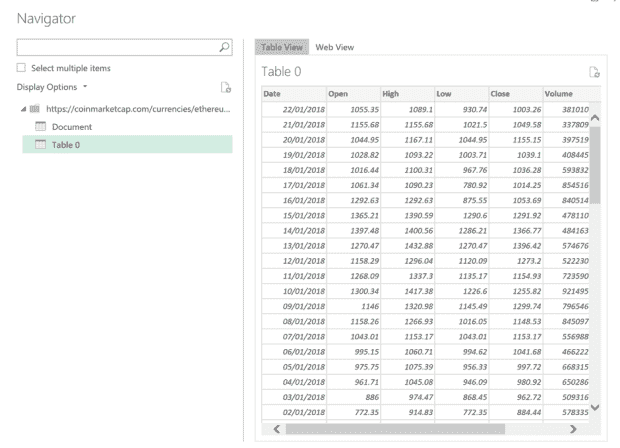

现在的问题是，要将历史数据刷新到最近的可用日期，您需要执行手动更新。首先，在电子表格上启动查询编辑器，如下所示:

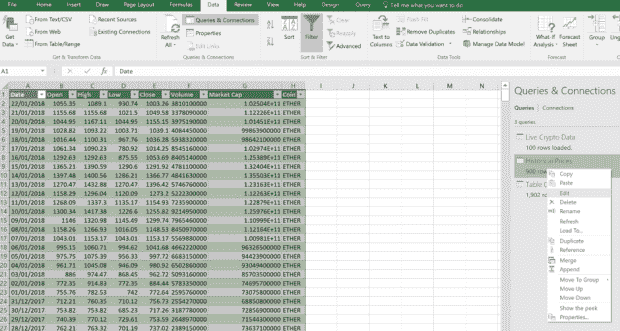

在查询编辑器的顶部，选择**‘高级编辑器’**，之后您可以进入并手动更新最后日期，最后日期将反馈到数据中。

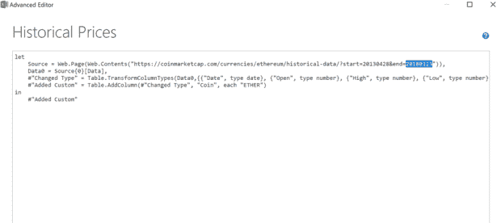

— — — — — — — — — — — — — — — -

在基于电子表格的投资组合管理工具方面，Google Sheets 被证明和 MS Excel 一样有用。特别是作为 [Google Sheets 插件](https://chrome.google.com/webstore/detail/cryptofinance/bhjnahcnhemcnnenhgbmmdapapblnlcn?hl=en)提供的 CRYPTOFINANCE()函数，使您的电子表格能够访问 CoinMarketCap API，以返回每种加密货币的大量重要数据，包括实时汇率、价格变化百分比、市值、交易量和流通令牌供应量。

例如:

=CRYPTOFINANCE("COINMARKETCAP ")将所有的 COINMARKETCAP 数据返回到一张表中

=CRYPTOFINANCE("COINMARKETCAP "，" EUR ")以 Euos 显示价格

=CRYPTOFINANCE("COINMARKETCAP "，" ETH ")以以太的形式显示价格

=CRYPTOFINANCE("COINMARKETCAP "，100)仅显示前 100 个硬币

= crypto finance(“NEO/GBP”)仅显示 NEO 的英镑价格。

正如附加页所指定的，根据指南页，可以执行一整套附加功能。此外，该插件还提供了一些访问最新历史数据的功能。

# 移动应用

如果你不想处理通常与基于电子表格的程序相关的复杂性或消耗内存的问题，那么越来越多专注于投资组合管理的便捷移动应用程序可能会更好地满足你的需求。

目前市场上最流行的监控你的加密组合的移动应用是 [**Blockfolio**](https://www.blockfolio.com/) 。它有一个易于使用的界面，使跟踪您的投资组合成为一个相对简单的过程:

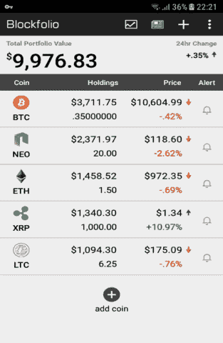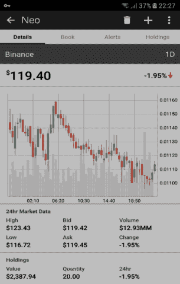

这种布局使得在手机上查看你的作品集非常容易。但不要搞错，这绝不是一个有限的应用程序；事实上，有几个有用的工具让大宗交易在新手和老练的交易者中都大受欢迎。

例如，你可以设置**【提醒】**，当你的一枚或多枚硬币达到某个价格水平时让你知道:

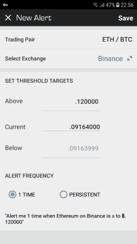

这是非常有用的，特别是考虑到加密货币市场可能一周 7 天、一天 24 小时都非常具有流动性，所以你不想在睡觉的时候错过这个重要的反弹。正如你在上面看到的，你可以选择你的硬币交易的实际交易所，这意味着如果你想买或卖，你会得到最准确的价格。

此外，通过点击屏幕顶部的报纸类型图标，您将获得来自各种流行加密货币出版物的最新加密货币新闻的 RSS 提要，包括 CoinDesk、CoinTelegraph、BitCoinist 和 Reddit。

如果所有这些都不能说服你，只需查看一下该应用在 Google Play 上的评分，目前该应用在不到 6 万(大多数)满意用户中的评分为 4.7/5。

然而，对于更严肃的投资者来说， [**CoinTracking**](https://cointracking.info/) 应用程序可能是最受尊敬的。它巧妙地结合了移动平台和基于网络的平台，包含了许多广受欢迎的功能。

首先，你可以通过上传的方式导入你之前在某个交易所进行的交易。CSV 文件从 exchange 导出，或者使用 API 自动导出(尽管这需要付费版本的产品才能执行)。

鉴于当局可能会更加关注确保投资者适当缴纳加密货币收入的税收，CoinTracking 为您准备税务报告提供了独特的能力；事实上，有了几个可定制的选项来考虑不同的会计方法和定价选项，您可以构建一个详细的、高度定制的报告。

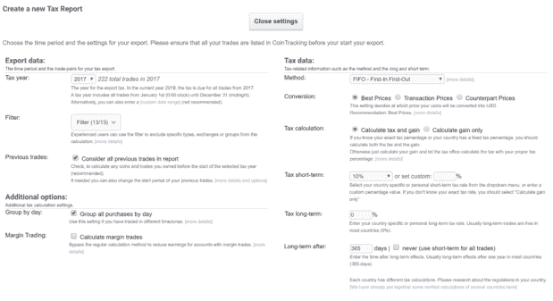

CoinTracking 用户还可以使用大量的附加功能，尤其是在“Dashboard”上，它包括一个时间表功能，可以显示您第一次购买特定硬币的时间、每个月的交易次数，以及您的投资组合分别达到最低和最高价值的具体日期。“平衡报告”也可以显示您的投资组合在过去一小时、24 小时、一周和一个月的趋势。还可以访问贸易统计数据和一些基本的贸易分析:

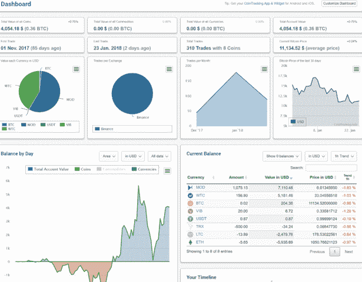

# 其他工具

如果你正在寻找一系列只与一种特定货币相关的指标，那么“XXX-price.org”网站(其中 XXX =货币名称)格式良好，信息一目了然，特别是对于那些使用移动设备的人。所提供的信息包括当前市场价格、历史价格和图表、代币供应统计数据、不同货币交易的各种实时价格，以及与该货币相关的最新加密货币新闻。目前几乎所有最高价值的项目都有这样的网站，包括[比特币](https://bitcoin-live.net/)、[以太坊](https://eth-price.org/)、[比特币现金](https://bitcoin-cash-price.org/)、[卡达诺](https://cardano-price.org/)、[莱特币](https://cardano-price.org/)、 [IOTA](https://iota-price.org/) 、 [NEM](https://nem-price.com/) 、 [Dash](https://dash-price.org/) 、 [Monero](https://monero-price.com/) 和 [EOS](https://eos-price.com/) 。

如果你正在寻找一个更简单、不复杂的投资组合跟踪工具，那么 LiveMarketCap 是一个理想的在线管理工具。使用来自 Coinmarketcap.com 的格式，LiveMarketCap 允许你非常容易地增加和减少硬币，以及调整你持有的每个硬币的体积。它还显示每个硬币的每日变化和整体价值，并提供每个硬币的有用信息，如其每月复合增长率和通货膨胀率。

正如该网站提到的，它不会跟踪您的任何个人加密组合数据，但会使用您的浏览器的本地存储功能来保存您的所有加密信息，供您下次访问该网站时使用。

— — — — — — — — — — — — — — —

值得强调的是，利用有效的投资组合管理工具是多么重要。虽然目前散户投资者唯一可用的资产类型是实际的基础加密货币本身，但我们不太可能需要等待太长时间才能批准衍生品合约。事实上，比特币期货合约已经可供机构参与者使用。一旦远期合约、期权和更奇特的基于密码的产品可供公众使用，投资组合管理将变得至关重要，特别是一旦你们当中更老练的投资者决定评估涉及使用衍生品对冲风险敞口的定价模型(例如，使用众所周知的“希腊人”——delta、gamma、theta 和 vega)。

尽管我们正处于这场漫长而激动人心的加密货币之旅的开端，但作为投资者，我们开始使用这些工具来有效管理我们的投资组合似乎是合乎逻辑的。这将使我们为以后的道路做好准备。

*原载于 2018 年 2 月 2 日*[*【www.datadriveninvestor.com】*](http://www.datadriveninvestor.com/2018/02/02/how-to-manage-your-crypto-portfolio/)*。*