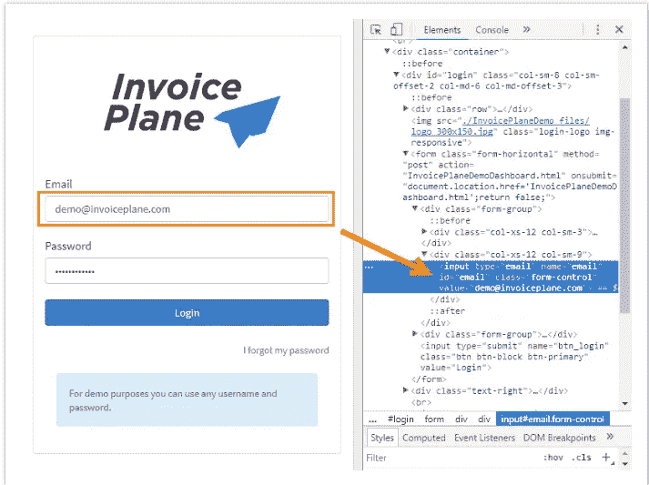
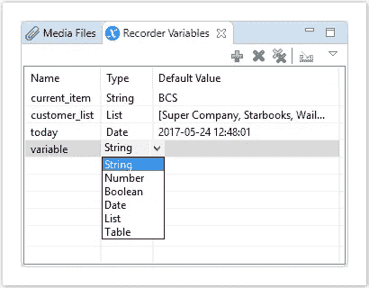
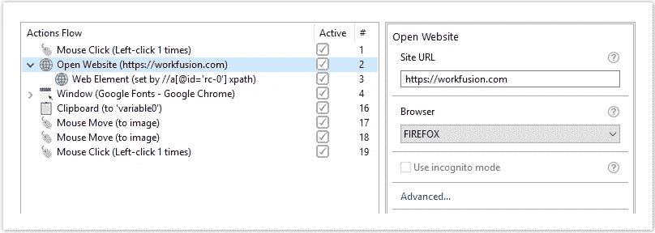
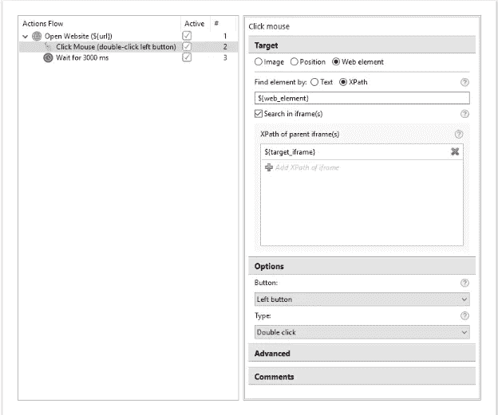
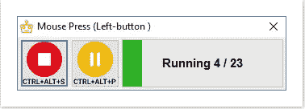

# 如何像死潭一样管理你的网飞

> 原文：<https://medium.datadriveninvestor.com/how-to-manage-your-netflix-like-a-deadpool-333f646c1b37?source=collection_archive---------5----------------------->

Deadpool Teaser

在新片《死侍》中，当火拳在 X 大厦遭到攻击时，韦德·威尔逊遭遇了凯布尔令人印象深刻的控制技能。然后，在一场罕见的正义表演中，威尔逊被迫用他能收集到的所有笑话来对抗他，以保护火拳免受寻仇电报的攻击。

然而，尽管有不礼貌的嘲笑，你还是可以从有线电视中学到很多。首先，具有讽刺意味的是，除了凡妮莎之外，威尔逊还有兴趣帮助任何人。第二，你真的可以通过黑客技术在生活中获得成功。

💣黑客名声不好。它最初的意思是切断某物，就像炸药切断死水一样。近年来，黑客行为已经演变成犯罪活动，并使用非常规技术来完成某些任务。

🔪你也可以解决问题。在[如何释放你的电脑的超能力来追踪复仇者联盟](https://medium.com/datadriveninvestor/how-to-unleash-the-superpowers-of-your-pc-to-track-the-avengers-b68d37d3d128?utm_source=Medium&utm_medium=Blog&utm_campaign=Dave%20Rauschenfels&utm_term=Automation%20Academy&utm_content=How%20To%20Manage%20Your%20Netflix%20Like%20a%20Deadpool)中，我展示了你如何不用编写应用程序就能设计出复仇者联盟搜索算法。黑客使用了个人电脑上的[工作融合](https://www.workfusion.com/rpa-express/?utm_source=Medium&utm_medium=Blog&utm_campaign=Dave%20Rauschenfels&utm_term=Automation%20Academy&utm_content=How%20To%20Manage%20Your%20Netflix%20Like%20a%20Deadpool)机器人过程自动化快速应用。软件指示计算机自动搜索复仇者联盟无限战争。

有些人可能会说，黑客是微不足道的，因为你可以指示谷歌更容易地跟踪复仇者联盟。我明白。您可以在该平台上轻松构建有趣的应用程序。以 Windows 电脑的问题为例。这些天他们不断受到恶意软件的攻击，你永远无法确定你的密码是安全的。

假设您正在使用一个钥匙链，您可能已经被购买了该软件并破坏了它的黑客渗透了。相反，你可以通过将代码隐藏在你自己定制的[钥匙链](https://kb.workfusion.com/display/RPAe/Quick+XPath+Guide?utm_source=Medium&utm_medium=Blog&utm_campaign=Dave%20Rauschenfels&utm_term=Automation%20Academy&utm_content=How%20To%20Manage%20Your%20Netflix%20Like%20a%20Deadpool) 应用程序中来击败黑客。

⚠️:请按照上述说明在您的电脑上安装 RPA 工具。该应用程序为 2 GB。

你可以从隐藏你的网飞身份开始。要开始使用，请在你的 Chrome 浏览器上打开网飞窗口，并记得注销。然后你应该在主页上。如果没有谷歌 Chrome，浏览器是免费下载的，几分钟就能安装完毕。接下来启动 WorkFusion (RPA)应用程序并打开记录器。

你还需要 Chrome 开发工具。点击主工具栏中的**查看**，然后点击**开发者**。在开发者窗口中是**开发者工具**，打开它。您将需要 XPaths 来对记录器进行编程。

进入**记录器变量**窗口，按下➕按钮。

输入变量**字符串**并将其命名为 **email** 。然后创建另一个**字符串**并命名为 **login** 。

⚠️所有变量必须是小写或数字。

你的下一个任务是打开网飞主页。进入**动作流程**列表中的**打开网站**动作。在**窗口中输入[https://www.netflix.com](https://www.netflix.com/?utm_source=Medium&utm_medium=Blog&utm_campaign=Dave%20Rauschenfels&utm_term=Automation%20Academy&utm_content=How%20To%20Manage%20Your%20Netflix%20Like%20a%20Deadpool)网址**。

⚠️检查 URL 是否有效。不正确的网址触发了机器人的搜索。

打开网站后，您需要为登录按钮设置**鼠标点击**。将**目标**路径设置为 **Web 元素**，将**查找元素**设置为 **XPath** 。然后，您将需要登录按钮的 XPath 来输入。

enter//input[@ name = " BTN _ log in "]

网飞接下来会要求你出示证件。预计这种工作融合编码在计时器中，用于网站加载的短暂延迟。从**动作库**中检索一个**等待**并将其放入**动作流**中。您可以将 **Wait** 设置为任意时间，但 8000 毫秒应该没问题。

转到**动作库**中的**网页**并将其放置在流程中。然后选择**模式**和**设定值**。接下来，从先前在**选项**中定义的变量中选择匹配值。这将是**电子邮件**和**登录**。

在 DevTools 中，正确的 XPath 是//*[@id="email"]和//*[@id="password"]

然后在**动作库**中选择**鼠标点击**。接下来选择 **Web 元素**和 **XPath** 。同时检查**鼠标按钮**是否设置为**左键**和**单击**。

登录的正确 XPath 应该是//*[@id="sign in"]/form/input

转到**动作库**并将另一个**等待**拖到**动作流**中。然后，您可以将计时器设置为任意时间。

然后你需要向下拖动另一个**点击鼠标**。再次将**目标**设置为 **Web 元素**并将**查找元素**设置为 **XPath。然后回到 Chrome 上的**开发者工具**页面。检索您的个人配置文件的长地址，并将字符串插入 web 元素中。**

将 XPath web 元素设置为＄{ switch profile？tkn=4RS…}保留**选项按钮**的默认设置**左键**和**单击**。

**验证**

所有程序在发布前都应经过检查。要检查您的录音，请点击窗口顶部的**播放录音**。你应该得到一个状态栏来检查过程中的每一步。

您可以随时选择暂停、恢复或停止测试。测试结束时，你会得到一份测试报告。所有动作都应该是绿色的。可以通过应用上述编辑来编辑任何失败的操作。

**出版**

点击**发布到控制塔**编辑记录。您必须命名业务流程，然后单击 **Finish** 来完成流程。

😄您已经自动登录。现在为您选择的网站配置它。