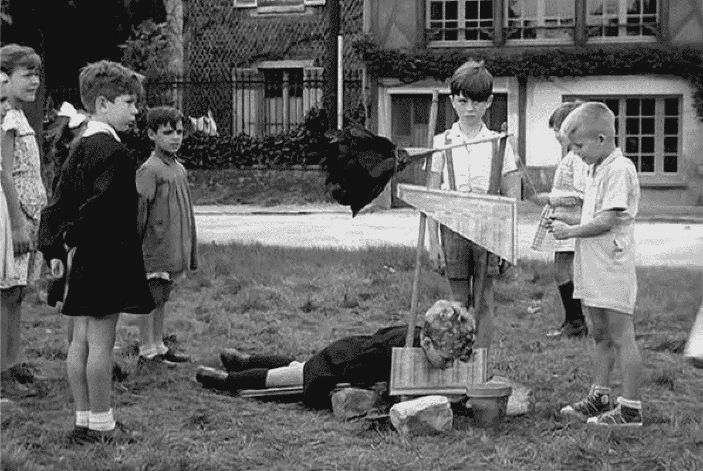
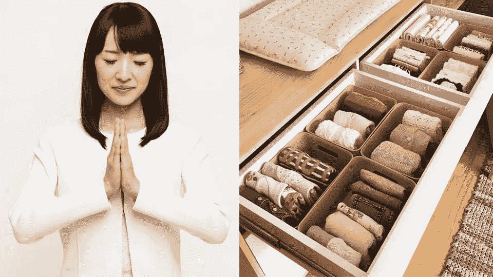
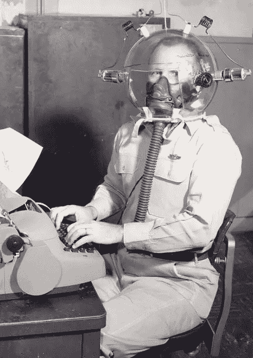

# 信息卫生学

> 原文：<https://medium.datadriveninvestor.com/how-to-marie-kondo-your-social-media-2fd7c1ef34be?source=collection_archive---------4----------------------->

***Podiem 论文#5:如何清理你的社交媒体饮食***

*# the diempets 是一个正在进行的短文系列，旨在围绕新闻和社交媒体交叉的核心问题加强公众对话。*

__________________________________________________________________

我们的新闻和信息饮食让我们生病了。空卡路里含量让我们心理营养不良。从快速的糖刺激中获得快感，而不是精神和心理上的支持。

美国媒体现在发现自己处于 80 年代末和 90 年代美国饮食的相同位置。大型企业集团用廉价食品充斥着杂货店的过道，这些食品富含糖、脂肪、盐和防腐剂。与此同时，关于饮食健康的公共教育被留在了黑暗时代。当然，在国际大都市的一次性健康食品店外，也有一些健康食品的鼓吹者。但是没有全食超市或全食超市。没有健康播客和健康博客。除了激增的糖尿病和心脏病流行病，还有便餐和大口大口的食物。可以找到高质量的食物，但它的销量不如幸运符和多力多滋。

这就是我们今天看到的现代新闻和信息的大致状况

对于这种信息腐败，大部分责任可以合理地归咎于科技公司。脸书和推特取代了雀巢和可口可乐。设计他们的产品来掠夺我们的冲动奖励系统。某种技术上等同于脂肪/糖/盐的科学怪人食物混合物。

但是，就像我们的饮食危机一样，我们仍然是买单的人。我们是吃“食物”的人，与我们的朋友分享，喂给我们的孩子。在我们能够改变我们的信息饮食之前，科技公司将一如既往地为我们提供信息。

我并不声称拥有一个人应该采用的理想的信息饮食。然而，最近在看《玛丽·近藤》的一集时，我有了一个不太明显的想法。我们迫切需要一套连贯的信息消费准则。标准化的协议可以很容易地在所有信息场景之间转移，为如何在社交媒体上处理和分享信息建立了一种“最佳实践”。这是一个社交媒体和新闻消费的食物金字塔，在全国的小学和高中都有教授。就像数学和体育一样是课程的一部分。(特里斯坦·哈里斯的[时间花得其所](http://www.tristanharris.com/tag/time-well-spent/)运动在这方面有了一个良好的开端)

我想象一份好的*信息食谱*可能看起来有点像 **W-A-S-H** 协议。一种在将信息传输给其他人之前，让*洗去*信息的方法。

> 等待
> 
> 一个**sk**
> 
> 增强力量
> 
> 欧塞克普

**1。)等待**——尽量拖长、延缓你的信息愤怒。大多数真正值得我们道德谴责的新闻故事都有很长的保质期。如果一条新闻内容激起了你的愤怒，试着给主流记者一个机会，让他们在转贴或转发自己之前查明其准确性。

问问你自己，你所愤怒的内容是否会成为年底前 20 篇文章。开始在更长的时间线上聚合和查看新闻，而不仅仅是传播新闻的 24 小时周期。科技公司和新闻媒体的整个利润结构依赖于我们在 24 小时窗口内的超反应能力。问问你自己，你从这种交换中获得了什么价值。

**2。)提问**——在分享或评论某个内容之前，问问自己该内容是否至少有以下一项:

**。改变主意？**

****b.*** *给一个话题带来新的启发？**

****c .****[*“火花欢乐”？*](https://www.youtube.com/watch?v=9AvWs2X-bEA)**

**如果一个内容没有真诚地跨过 **a** 、 **b** 或 **c** 这三个门槛，为什么要分享它呢？如果它没有改变你对某个话题的看法，那么它改变别人看法的可能性有多大呢？如果它没有给你带来新的启示，诚实地告诉自己它有多大可能为你的朋友破土动工。如果它没有在你的世界里创造真正的快乐(对我来说是狗视频)，那么它为其他人创造快乐的可能性有多大呢？**

**社交媒体上其他不属于这三个类别的东西通常以某种政治活动的形式出现。一种社会说服或推销。推销政治立场、生活方式、产品、社会形象等。不管多么公开或有意识，这都是广告。现在，社交媒体让我们淹没在一个充满信息的汽车推销员和女人的世界里。**

****3。强化/钢铁侠**——在回应对手之前，尝试强化他们的最佳论点。对一个给定的话题有一个坚定的理性立场，对一个观点有强烈的感觉是非常健康的。但是对于我们持有的每一个强势地位，我们应该能够以一种他们不会反对的方式总结我们对手的工作。否则就是在进行一种不严肃的、病态的自我安慰。成人版的吮吸拇指信息。**

****4。最后，我们应该致力于在大脑中培养一个原始的信息空间。目标是拥有完美的信息卫生协议。对我们接触到的信息要特别和细致。提前把你要读的文章挑出来，做书签。****

**按照近藤小姐的说法，我们应该把我们消费的信息想象成我们用来装饰心理家园的艺术品和家具。在一个堆满*宜家*残羹剩饭和杂乱小摆设的房子里，摆放几件漂亮的家具和极简主义美学要好得多。信息整理应该成为我们日常清洁仪式的一部分，保护我们的大脑不被意识形态的杂乱和噪音淹没。**

****

**我是第一个承认这些黑客读起来像可爱的 *Huff Po* wellness 文章的人；" *6 种让你的沙滩身材为夏天做好准备的方法！"。但是如果我们将这些指导方针归入俗气的点击诱饵的世界，我们就会忽视它的实际效用，这对我们自己不利。***

**我们这一代发现自己陷入了一个陌生的历史。在这个地方，一个人的生产力和生计并不取决于他们对信息的获取，而是取决于他们破译哪些信息是相关的能力。取决于他们对购物信息的辨别能力。**

**每一个点击标题都在掠夺我们猴子大脑的愤怒冲动，我们对脂肪、糖和盐贪得无厌的渴望，而不顾健康成本。这正是为什么玛丽·近藤的风气如此具有先见之明。**

**MK 并不是突然变得如此受欢迎，因为每个人都对日本的组织管理技术着迷。相反，近藤的受欢迎是她的哲学如何令人信服地超越了房屋清洁领域的直接结果。一个直接面对互联网时代最紧迫困境的哲学框架。你会选择在哪里以及如何花费你的注意力？在一个不必要的富足世界里，你如何更有选择性？你怎样才能重新控制你的身体和精神环境？和*，你怎样才能最好地让你的生活充满有目的的“项目”？***

**社交媒体让我们所有人陷入了有史以来最激烈、最具侵略性的信息交流。玛丽·近藤迫使我们不断问自己，“我真的需要买那个吗？”。也许更深刻的是，*“我真的需要试着把它卖给别人吗？”***