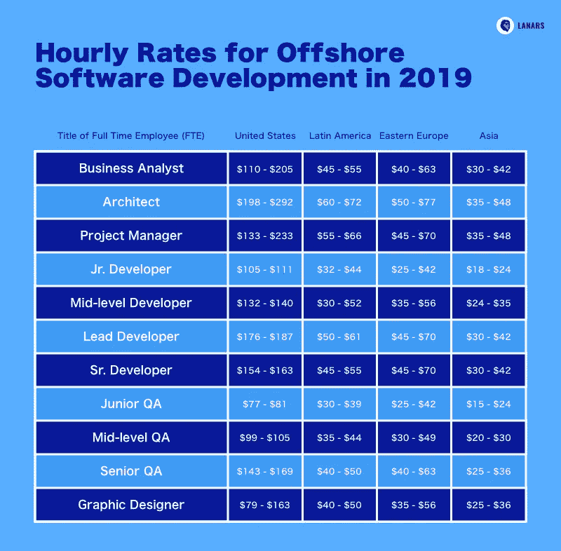
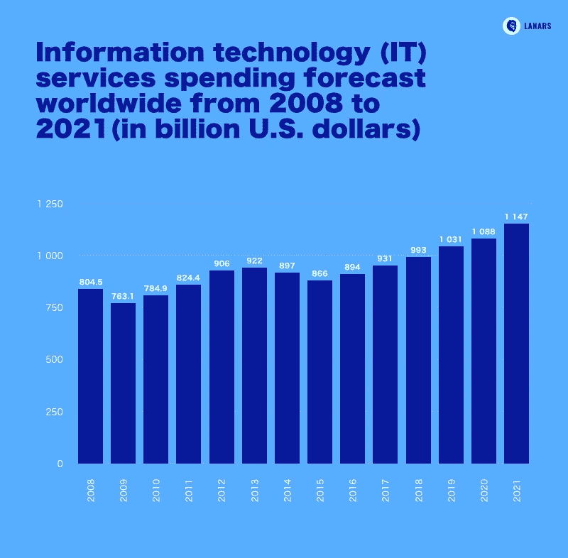
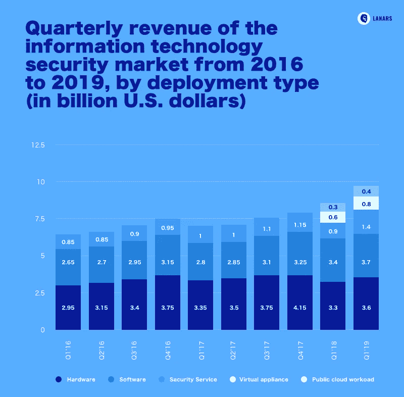

# 如何将应用开发离岸外包的风险降至最低

> 原文：<https://medium.datadriveninvestor.com/how-to-minimize-risks-in-app-development-offshoring-lanars-56da19911c08?source=collection_archive---------12----------------------->

你很难否认开发外包会给你的项目带来显著的成本节约效果。然而，总有一些移动应用程序开发外包风险很可能会破坏公司内部已建立的流程。

在本文中，我们不打算讨论离岸软开发优势，如全球人才渠道、加速项目实施或保持低预算。我们的任务将是找到一种如何用较少的资源减轻外包风险的方法。

# 离岸应用开发中的常见风险

首先，让我们弄清楚什么是海上开发。实际上，它是一种在办公室外的第三方团队的帮助下执行与您的项目相关的软件开发任务的形式。

外包开发只是调用过程的另一种方式。它的主要优势是显而易见的——如果你不局限于你的办公室所属的地理区域，你可以接触到具有更广泛专业知识的员工，因为他们所在的国家和你所在的国家的时薪不同，你的成本可能会更低。

 [## 数据科学和软件工程哪个更有前途？数据驱动的投资者

### 大约一个月前，当我坐在咖啡馆里为一个客户开发网站时，我发现了这个女人…

www.datadriveninvestor.com](https://www.datadriveninvestor.com/2019/01/23/which-is-more-promising-data-science-or-software-engineering/) 

有没有可能把 app 开发风险降到最低？当然可以！但是请注意，每种近海开发形式都有其独特之处和故障。

app 开发外包有三种形式。

你可以雇佣远程人员来加强你的内部团队。你可以将项目分成几个部分(设计、开发、营销和其他),然后**将内部很难执行的特定服务**外包出去。你可能会发现**有一个专门的开发团队**来分配整个项目。

第三个概念意味着，尽管你在项目的中间阶段参与程度较低，但最终，你会得到现成的产品。

什么外包类型更符合你的项目理念？阅读我们的文章[如何雇用专门的开发人员](https://lanars.com/../blog/how-to-hire-dedicated-developers)了解更多！

为了减轻应用程序开发风险，您需要研究它们。这里，我们列出了上述所有海上开发形式中最常见的形式。

# 选择合适的应用开发离岸目的地

在您决定将一些项目执行任务离岸后，选择开发外包目的地是您可能面临的关键问题之一。

最终决定将影响应用程序开发的生产率、及时性和预算。请记住，不管公司的能力和规模如何，你都可以在几个方面列出候选人:

如何规避外包的风险？寻找被认为是成熟的数字外包定义的国家，因为它们能够为您提供熟练的工人，并在小时工资和质量表现之间保持平衡。2020 年，东欧、中东和拉丁美洲就是这种定义。

我们建议您密切关注东欧国家，如乌克兰、波兰和保加利亚，以及它们的邻国，这些国家的外包业务仍然受到美国、西欧和加拿大客户的青睐。

来自东欧的公司可以用具有良好英语水平和工作态度的各种能力的高素质员工来加强你的项目。那里的平均时薪大约是 50 美元。

# 公司规模很重要

乍一看，你工作的公司的规模似乎不是问题。然而，当涉及到罕见的技能、复杂的任务和沟通不畅的风险时，从外包公司方面选择几个候选人总是更好的。所以你可能需要一个大供应商。

相反也是公平的——大公司有更复杂的外包流程和管理，他们的服务更昂贵，并且您的团队中存在错误或技能较低的远程员工的风险。

那么正确的答案在哪里呢？以下是与不同规模的外包供应商合作的最常见优势和劣势:

# 小公司

*少于 100 名员工*

***加上***——更低的成本，发展过程的额外灵活性(你可以在途中改变正在进行的任务)，取悦你的高动力，良好的沟通

***缺点***——经验有限，没有扩大规模的机会(团队太小)，与顶级专家合作的机会更少(小公司很难吸引有技能和经验的人才)

# 中型公司

*从 100 名员工到 1000 名员工*

***plus***——与不同领域和规模的公司(初创公司和巨头)合作的丰富经验、成熟的开发流程、有助于公司吸引熟练工人的品牌声誉、扩展远程项目团队的能力、没有因破产而突然关闭公司的风险、仍有一定的灵活性

***减去***——如果你已经雇佣了一个庞大的外包团队，你就不能立刻扩大项目规模

# 大型公司

*从 1000 名员工中*

*****缺点*** —高成本、官僚主义、复杂的管理和沟通、对小型或短期项目不感兴趣、质量可能不同(因为公司里不可能每个人都是顶级专家)**

**我们的建议是评估外包的潜在影响，你想要达到的目标和你的需求。如果你正计划创办一家小型创业公司，或者你只有少数几项任务无法由你的内部团队完成，那么选择中小型外包供应商。如果你需要覆盖一个巨大的项目，大公司会更适合你。**

**然而，黄金法则是选择与你规模相当的公司。在这种情况下，你有更多的机会来匹配你的工作风格和管理问题。**

# **外包 IT 服务:建立有效的管理流程**

**软件开发外包市场正在持续增长，这意味着明年我们可以期待市场上有更多的公司。如何选择最适合自己项目的？**

**正如我们上面所写的，从定义你的任务开始，从技术要求、时间表和预算着手，找到更适合你的目的的地区和公司规模。要了解更多关于如何寻找开发供应商、候选人名单和入围名单的信息，请阅读我们的文章[如何外包应用开发](https://lanars.com/../blog/how-to-outsource-app-development)。**

**选择一家公司来开发你的产品，你可能会问自己的一个基本问题是，如何从项目合作的第一天起就建立有效的管理。有一些提示:**

****

# **不要忘记沟通**

**选择离岸开发，你需要考虑与通信相关的移动应用程序开发外包风险。**

**公司雇佣内部员工是因为他们易于管理、跟踪和教育。远程团队可以使用电子邮件、各种在线团队管理工具、视频聊天服务与您交流。然而，与在同一个办公空间工作相比，你无法建立同样密集的交流。**

**下面，我们列出了开发外包时你可能面临的常见困难，以及如何达成完美合作以克服这些困难的想法。**

# **#1 您说 A，远程工作人员听到 B**

**糟糕的英语口语技能、缺乏动力、某些员工普遍不负责任以及不完善的流程都可能导致合作伙伴之间的误解。**

***建议***

# **#2 你的要求被忽略了**

**你试图找出你的项目工作处于哪个阶段，做出改变或补充，但是没有人回应你。另一种选择——他们会回答你，但会有很长的延迟。**

***建议——在交谈后或交谈前立即以书面形式发送要求，并转发给参与合作的其他人(首席执行官、客户经理或其他人)***

# **#3 没有人询问细节——结果与你的预期不符**

**远程开发的结果与您想象的现成产品不匹配。在你的技术文档中，似乎有太多有争议的问题是执行者自己决定的。**

***建议——持续关注项目进展，降低应用开发风险，每周至少召开一次会议和讨论***

# **使用正确的合作模式**

**使用正确的合作模式，你可以最小化外包的风险。理解每种模式都有其优点和缺点也很重要。你需要做的是利用模型的优势节省预算，精益求精。**

**使用项目目标列表，考虑你对管理风格的偏好，不要忘记关于你的创业领域的风险。**

***适合小型项目、MVP、有具体需求的产品***

**这种类型的合作是基于一个固定价格的协议，客户将支付一个固定的价格，并等待与他们的期望完全匹配的结果。在这种情况下，客户必须使用项目规范和要求分享最终产品的清晰愿景。**

**该模型适用于具有高度可预测的开发过程的项目，这些开发过程可以很容易地进行评级和评估。根据固定价格概念，额外的持续需求是不可接受的，否则可能需要额外的费用。同时，该项目易于计划、管理和检查。**

*****时间和材料模型*** *适用于长期项目或合作、范围未知和动态需求的初创企业***

**外包信息技术与时间和材料的概念是关于灵活性。作为一个客户，你应该为员工完成你的任务所花费的实际时间付费，也应该支付材料费用(设备、许可、订阅等)。).**

**在时间和材料合同的情况下，客户可以改变正在进行的目标，设置新的任务，尽可能多地与远程员工合作，并改变方向。虽然动态工作范围是这一概念的主要优势，但也有更好的项目时间安排，因为您将不断了解每个应用程序功能实现所需的时间。**

**从我们的[时间和材料 vs 固定价格 vs 里程碑定价模型](https://lanars.com/../blog/time-and-materials-vs-fixed-price-vs-milestone-pricing-models)博客文章中了解更多信息。**

# **请特别注意安全**

**外包管理，以及其他与您的产品相关的任务，都涉及使用安全数据。有几种类型的信息对第三方团体(网络罪犯以及您的竞争对手)很有价值:**

*   *****项目文档*** —想法、计划、推广策略**
*   *****公司安全数据*** —员工人数、内部流程信息、利润、银行账户、员工个人数据**
*   *****用户的个人信息*** —姓名、银行账户、电话号码、电子邮件、应用内的活动**

**数据安全可能会出现两大风险。首先，数据可能会被有目的地窃取，并被用来对付您的公司。第二，您的外包合作伙伴可能会开发薄弱的数据操作算法，从而导致错误并导致数据存储失败。这两种选择都不利于你的业务，那么有机会克服它们吗？有一些提示:**

*   **在合同中加入隐私条款(对你、你的投资者和用户的安全保证)**
*   **选择值得信赖的 IT 供应商(其产品组合中有良好的推荐人和庞大的客户)**
*   **使用信息安全标准 ISO/IEC 27001 制定您的项目**
*   **检查您的合作伙伴使用哪种软件，他们提供什么数据保护机制**
*   **考虑一般数据保护法规(GDPR ),并在完成软件开发生命周期的同时进行早期安全评估、差距分析和风险评估**

**为了降低与商业或用户数据丢失相关的外包风险，您也可以保留负责安全测试的内部 PM 和 QA 经理。另一种方法是要求永久访问远程员工的硬件，以检查他们的活动。**

**您还可以限制外包开发人员可以访问的私有数据，或者在几个公司之间分割项目。**

****

# **结论**

**完全避免出问题的风险是不可能的。在与远程团队合作时，预测哪些风险对项目至关重要甚至更加困难。然而，在 2020 年，这款游戏似乎得不偿失。外包给了企业很多。降低成本、获得更有资格的专家和专家以及扩大项目规模的能力是最大的好处**

**与此同时，外包过程中最常见的风险仍然是通信的不可预测性和信息安全问题。我们的建议是深思熟虑地进行信息技术外包——最大限度地注意选择公司，选择与团队互动的模式，并经常与远程员工沟通。**

*****准备好与可靠的远程团队一起构建您的应用了吗？联系 LANARS 来评估你的想法。*****

***最初发表于*[*【https://lanars.com】*](https://lanars.com/blog/how-to-minimize-risks-in-app-development-offshoring)*。***