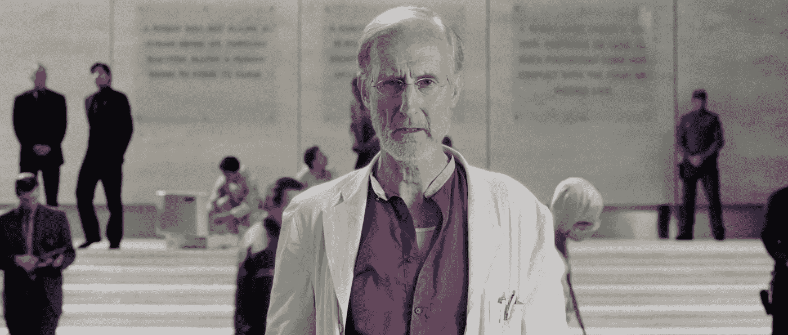
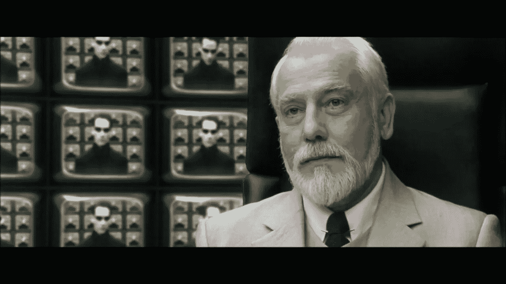

# 如何不奴役人类:人工通用智能沙盒

> 原文：<https://medium.datadriveninvestor.com/how-to-not-enslave-the-human-race-artificial-general-intelligence-sandboxed-8e4512837a57?source=collection_archive---------11----------------------->

Left: **Nathan Bateman** murdered by Ava, his creation (Ex Machina) **—** Right: **Flynn** creator of the Grid exiled for years in his creation (Tron)

***全文免责:*** 这不是一个*计算类*的故事。这个主题要求很高，需要打破常规的思考，但是有必要进行讨论。挑战在于不去预测未来，而是减少它的不确定性。此外，这是为了娱乐而写的，并没有更多的建议…所以让我们开始吧！

> 我坚信，人类最重要的东西是社会性的，机器将我们从目前许多高要求的智力功能中解脱出来，最终会给人类时间和动力去学习如何和睦相处。
> —美林洪水

# 建筑师

在过去 20 年里所有阐述机器或人工智能(简称 AGI)觉醒的流行科技小说电影中，有一个角色总是给我留下深刻印象:**建筑师**。

总是被描绘成一个社会的弃儿，一个有着超群数学智能的天才。但同时，一个有相当程度的疯狂和严重的社会和个人障碍的人(知道有任何有这些特征的软件工程师吗？)

他几乎总是死在自己创造的“手”里。他是自我和乌托邦世界观的受害者，他会对自己的项目产生一种不安的情感依恋。

这将是末日的开始。最聪明的人类将会堕落并成为一个恶棍，将所有其他人都投入到一个受至高无上的力量摆布的苦难世界中(这让你想起什么了吗？).

如果你被这种反英雄人物吸引，或者暗地里希望成为他们中的一员(这似乎是每个科技巨头的追求)，那么花时间思考如何避免他们的不幸是值得的。

**Dr. Alfred Lanin** murdered by a robot (I, Robot)

# 网格

我们能够创造 AGI 的最有可能的场景是，如果我们找到一种方法，成功地结合我们正在创造的所有**机器学习算法*(图像识别、自然语言处理、情感分析……)的力量。*

> *一个具有抽象层的分布式系统，该抽象层可以作用于其结构，并使我们正在创建的所有人工智能协同工作。信息网和决策信号。*

*要创建这样一个系统，我们不仅要研究人脑，还要研究“人性脑”(深度人际网络？有人吗？).我们需要对我们的互动进行建模，并把人类作为一个有智慧的有机体，一个有自己思想的生物来研究。*

*区块链等技术的出现和计算能力的技术进步，加上社会科学的最新突破，很可能会让我们走上这条道路…*

**但并不安全。**

*人类，就像恶棍建筑师一样，很可能会毁灭自己，因为我们正在我们生活的顶部构建这个信息网。手机是非常真实的，手机上的应用程序已经对我们进行了潜在的控制。很快，植入物和它们上面的后续应用程序层将把更多的人和复杂的计算代理联系起来。*

*在我们盲目追求创造价值和舒适的过程中，我们很可能会意外地在我们的物理环境中释放出更高形式的智能。在我们的存在和未知的计算之间建立了直接的依赖关系(例如，用于为你的家供暖和为你提供食物的能量与驱动 AGI 的硬件的能量是一样的)。*

*似乎我们无法单独理解这一事件的全部后果。*

# *大脑 F 的定义****

*当谈到人工通用智能(更不用说创造它)时，我们只需建立我们生物认知的极限。*

> *就像容器不能容纳自己一样，大脑也不能模拟自己。*

*如果你认为大脑是一个计算系统，任何试图模拟(计算一个随机状态)另一个系统图像的行为都需要它所有的资源。因此没有人做模拟。*

*它只能模拟自己的子版本。有人可能会说，如果有足够的时间和无限的精力，系统可以通过交叉模拟所有可能的子版本来“自上而下”地学习自己，并用适当的*聚合函数*处理它们。*

> *在实际运用我们的智力时，遗忘和记忆一样重要。*
> 
> *—威廉·詹姆斯*

*值得注意的是，每个子版本都需要了解自己，这意味着“模拟”需要不断地研究自己。另找时间讨论的拦路虎(就像上面的无限时间和精力假设)。*

> *第一步:我生活的世界是模拟的吗？*
> 
> *第二步:回答这个问题的最好方法是研究我的世界的属性。*
> 
> *第三步:研究我的世界的属性的最好方法是模拟它。*
> 
> *步骤 4:创建模拟并转到步骤 1*

*这个悖论可以解释我们的懒惰，现代进化的驱动力(而不是一些人可能认为的生存)，以及为什么人类(作为一个试图了解自己的系统)对于垂直思维(单位可以思考的唯一方式)和协作工作(上面提到的聚合器功能)等任务是优化的。*

*这也是为什么我们应该开始在*水平*环境中模拟次优 AGIs 的尝试，以更好地理解复杂系统之间的相互作用，而不是试图建立最复杂的系统。*

**

***The Architect** from The Matrix*

# *终极视频游戏*

*在这种情况下，人类建立自己的矩阵是非常有意义的。一个安全探索我们最疯狂的想法和哲学问题的沙盒。*

*一个每个人都可以加入的游戏，它真实地反映了时间和空间以及它们的物理属性。建立在能够模拟复杂系统之间最大数量交互的基础设施和软件之上。*

*它将成为研究人员和黑客在人类层面(而不是大脑层面)进行实验和解决问题的游乐场。使我们能够在“蝴蝶效应”水平上进行预测的基础设施。它需要使我们能够在迄今为止最复杂的东西上至少玩一个数量级以上的游戏。*

*从这样的实验中获得的知识有望使我们变得更聪明，并给我们工具来合理化我们现在没有完全掌握但对我们的生存至关重要的概念。*