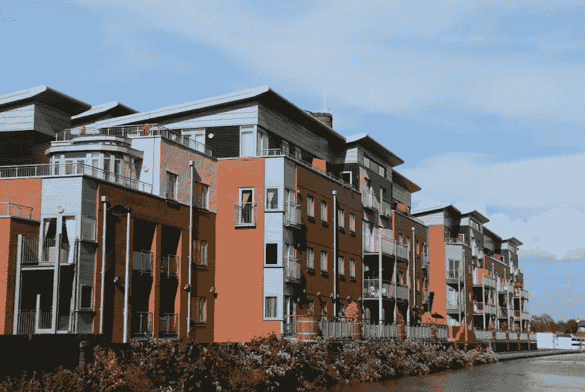

# 如何克服缺乏经验时，辛迪加你的第一笔交易

> 原文：<https://medium.datadriveninvestor.com/how-to-overcome-lack-of-experience-when-syndicating-your-first-deal-6be1cfa5ce02?source=collection_archive---------7----------------------->

如果你以被动投资者的身份参与了一笔房地产交易，你就有机会获得第一手资料，了解辛迪加或主要投资者是如何运作的。他们从其他人那里寻求投资，研究美国不同市场的投资机会，完成交易，获得融资并管理房产(很多时候是通过房产管理公司)。

要成为辛迪加，你需要获得经验，因为你会发现没有经验很难达成交易或筹集资金，但你需要投资和资金来完成第一笔交易。基本上，你在这里处理的是“鸡和蛋的问题”，哪个先出现。然而，有几种创造性的方法可以绕过体验问题。

**什么是辛迪加？**

辛迪加是交易中的主要投资者。他或她通常也是房地产交易中的普通合伙人，他们为一群被动投资者带来投资机会，这些被动投资者也被称为有限合伙人。正如本文开头提到的，辛迪加做了大部分繁重的工作。作为对所有辛勤工作和参与交易的知识的回报，辛迪加正通过[费用](https://www.ellieyogev.com/blog/what-is-a-syndication-and-how-does-it-work)和交易中的部分股权得到补偿。

在最典型的辛迪加交易中，辛迪加与有限合伙人进行股权分配，通常是 80-20 或 70-30。投资者最终会获得 5-10%的优先回报，平均回报率为 8%。大多数投资者通过租金收入和物业升值赚钱。一个辛迪加也是平均收成交时 2%的收购费，每年收入的 2%。

***为什么经历真的很重要***

任何房地产辛迪加的基石是钱。没有投资者提供资金，你不可能去银行或其他贷款机构要求 1，000 万或 2，000 万美元。没有经验，你很难找到潜在的投资者，请他们帮助你的房地产辛迪加融资。

经验是在正确的市场上找到正确的房产的关键，有正确的数字来证明从贷款人那里借大笔钱是合理的。没有经验知道如何识别这些市场，以及丰富的经验知道如何评估财产，你很大程度上是在玩猜谜游戏。你打算用别人的钱来做这件事。

看一处房产并判断它是否能以一个允许它被翻新或重新定位并变成一个有利可图的企业的价格被收购，这需要知识和经验。这比看资产负债表和计算数字要复杂得多。

你必须了解物业所在的市场，以及物业周围的区域，人口是否扩张到足以避免高空置率以及(希望)物业升级完成后更高的租金。经验丰富的辛迪加有一个跟踪记录，依靠这种知识和专业技能。

这里还有一点需要考虑:不仅仅是贷方希望有一个有经验的辛迪加来领导投资。也是有限合伙人。没有经验，很难让任何人投资你的项目——包括你的朋友和家人。

***第一选项:被动投资***

被动投资是一个很好的进入游戏的方式，并为成为辛迪加铺平了道路。当你成为被动投资者时，你会坐在一个有经验的辛迪加旁边，这样你就可以观察和学习他们做什么，以及他们是如何做的。你将能够直接看到他们为什么选择一个特定的地理位置，为什么他们认为市场可以处理一个升级的财产，并了解如何将所有的数字聚集在一起，进行诱人的投资，将提供公平的回报。

作为一个被动的投资者，你会学到所有你想知道的关于联合房地产投资交易的知识。不是每个投资者都想这么做；毕竟，这就是他们被称为“被动”投资者的原因。但是，因为你想成长，并在某个时候成为辛迪加，你要吸收你可用的知识。

当你作为一个被动的投资者来到谈判桌前时，你不会想和任何一个辛迪加合作。你想和最好的人一起工作并向他们学习，因为他们的知识和成功的记录将为你提供正确的方法，一旦你开始自己的辛迪加。如果你知道去哪里找，你可以找到一个[顶级辛迪加](https://www.ellieyogev.com/blog/the-top-3-ways-to-find-the-best-syndicators)。

***第二种选择:与经验丰富的辛迪加合作***

如果你正在探索通过与有经验的辛迪加合作来学习辛迪加，这句格言“经验是最好的老师”再正确不过了。这样做将为您提供一个机会，观看第一手的辛迪加如何与他的投资者交谈，并争取资金投资于拟议的房地产交易。

请记住，根据美国证券交易委员会的规定，你不能招揽交易，因为你必须是普通合伙人，才能为其他辛迪加出售证券。通过合作，你将从他们的经验中获益，并开始建立自己的记录。在你建立了一个跟踪记录之后，你将能够告诉其他投资者你知道如何在正确的市场选择正确的资产，并利用你的经验成为一个辛迪加。

当你寻找被动投资者参与你自己的交易时，从征求你的家人和朋友的意见开始。其他潜在的投资者包括商业伙伴、投资财产所有者和专业熟人，包括医生、会计师和律师。当你开始辛迪加自己的交易时，你将获得与投资者交谈的宝贵经验。

***第三种选择:聘请导师***

我已经讨论了两种选择，你可以成为一个辛迪加；从被动投资者开始，与有经验的辛迪加合作。另一个选择是聘请一个导师，他可以帮助和指导你成为一个辛迪加。

为什么是导师？

你需要一个成功经营辛迪加业务的人给予你个性化的关注、帮助和指导。这不是雇佣一个生活教练或职业指导(尽管不会有坏处)；这是关于学习多家庭财产辛迪加的复杂性。

导师可以教你如何筛选交易、营销交易以及与投资者构建交易，从而实现利润潜力最大化，这是整个过程的关键部分。但是你如何找到一个拥有你想要的资格证书的导师呢？一个可以信任的人，一个可以传授你需要的知识的人？

有多种方法可以找到合格的导师。忘记那些提供“免费指导”的导师吧，因为他们只是在他们的项目上寻找免费的帮助。我的观点是，为了得到一个专注的导师，如果你想要高质量的教育，你很可能会付钱，这是非常值得的投资。

你可以从询问朋友和商业伙伴是否知道提供指导的联合组织开始。你要确保他们在多家庭联合中有成功的记录。获取参考资料。你也可以参加全国各地的聚会。在那里，你会遇到其他辛迪加和投资者，他们可以为成功的导师提供信息和推荐。

如果你参加辛迪加，问问辛迪加推荐谁。听听房地产辛迪加的播客，看看他们的投资理念和风格是否符合你的需求。在 Twitter 和其他社交媒体上关注成功的辛迪加，阅读他们发布的内容。如果你做足功课，你会找到一个合格的导师。

***概要***

底线是，没有任何经验，作为一个房地产辛迪加不应该阻止你实现你的梦想。使用本文中概述的步骤，绘制一条从投资者到辛迪加的路径，并遵循这条路径。一路积累你的知识和经验，你会成功实现你的梦想。

**要获得免费的*被动投资者终极指南*，请访问**[www.ellieperlman.com](http://www.ellieperlman.com)

[**下载**](https://www.ellieyogev.com/podcast) ***那个 REllie 发生了*？！难以置信的房地产播客**

**关于作者**

埃莉是蓝湖资本的创始人，这是一家专门在美国进行多户投资的房地产公司。她也是名为“[REllie happen？！Ellie](https://www.ellieyogev.com/podcast) 的难以置信的房地产故事”，这是一个播客，它带来了交易背后的真实故事，来自全球最成功的房地产投资者。Ellie 的职业生涯始于一名商业房地产律师，为以色列一家领先的开发公司领导房地产交易。后来，作为以色列最大的能源公司的物业经理，她监管着价值超过 1 亿美元的物业。此外，Ellie 是一位经验丰富的企业家，她通过改善业务运营来帮助建立和扩大公司。她拥有以色列 Bar-Ilan 大学的法律硕士学位和麻省理工学院斯隆管理学院的 MBA 学位。

你可以在 www.bluelake-capital.com[了解更多关于蓝湖资本](http://www.bluelake-capital.com/)的信息，在 www.ellieperlman.com[了解更多关于埃莉的信息](http://www.ellieperlman.com)