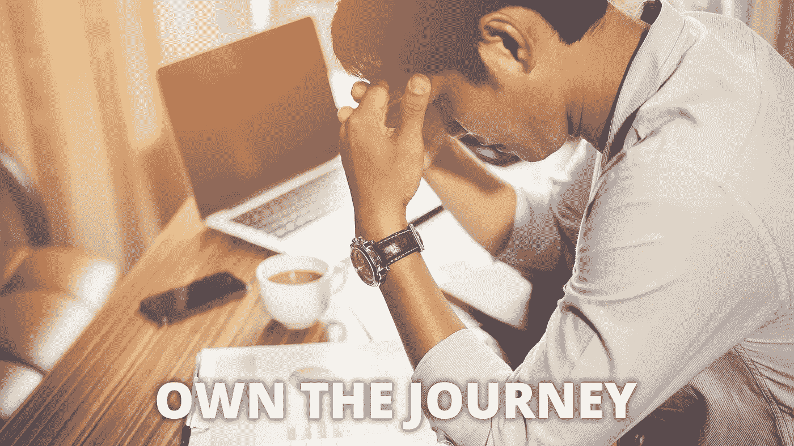

# 作为企业家，如何克服你的不安全感

> 原文：<https://medium.datadriveninvestor.com/how-to-overcome-your-insecurities-as-an-entrepreneur-d9c7ed5d11bf?source=collection_archive---------4----------------------->

你有没有觉得你应该在你的创业生涯中走得更远？

人们有没有对你说过类似这样的话，“为什么我觉得你应该比实际上更被认可和了解？”

一方面，很高兴知道人们对你评价这么高。这可以增强信心。

另一方面，你可能会开始感到气馁，因为你不确定自己做错了什么。你不知道为什么你没有比现在更进一步。

如果这些想法得不到控制，它们会成为压力的来源，也会侵蚀你的自信。你可能开始对你的处境感到沮丧，因为你希望你现在已经完成了更多。

你开始看着其他已经取得巨大成就的人，你对自己的现状感到不安全。我知道我有时会有这种感觉，也知道其他企业家也有这种感觉。

你可能觉得你目前所完成的事情并不重要。但这并不意味着它不是。这只意味着你在拿自己和别人比较。所以，我想鼓励你…

# 停止比较

[攀比是一切不快乐的根源](https://medium.com/@davidawiebe/comparison-is-the-root-of-all-unhappiness-90b9bbafbda1)。

不管你怎么想，但最终，比较是不健康的，因为你的旅程就是你的旅程。它不会和任何人的一样，即使你以你心目中的英雄为榜样。

当我们比较时，我们很少对自己公平。我们最终会将自己的失误与别人的精彩片段进行比较。而且，一个精彩片段就是一个人最精彩瞬间的集合。请放心，他们也犯了一些错误，也许比你犯过的错误更大。

我喜欢看滑冰录像。但我明白，我正在看的是那位滑冰运动员最精彩时刻的汇编。为了捕捉这些瞬间，他们必须经历难以置信的艰难。他们不得不冒险。

我知道，有很多人已经取得了惊人的成就，你想成为其中的一员。但并不一定是更多的智力、更多的聪明或更多的天赋让他们达到了现在的位置。通常情况下，只是他们发现了一些你没有发现的事情。

# 冒险

努力工作并不能保证成功。但是在所有条件相同的情况下，冒更多险的人可能比冒更少险的人有更好的成功机会，你同意吗？那么，让我问一句——你是否承担了足够的风险？

我知道拿自己和别人以及他们的成就做比较很诱人，但是我鼓励你不要这样想。相反，关注你今天能做什么来朝着你的目标和梦想前进。

你也应该花些时间…

# 反思你抓住的机会

如果你已经做了一段时间的企业家，你可能已经尝试过很多事情。不管结果如何，你都应该为自己的所作所为受到表扬。

如果没有人因为你认为他们应该拥有的东西而认可你，现在我在这里向你伸出认可之手——干得好。

这也是我说服自己看待事物的方式。

如果一切按计划进行，我现在可能已经是百万富翁了。谁知道我会在哪里或者在做什么。也许我仍然会通过创造内容来为这个世界增加价值。也许我会转向其他项目。

现在重要的不是我能去哪里。重要的是，我决心坚持下去，每天做一些让我热爱生活的事情。

我经历过很多人生的磨难，我相信你也经历过，有些挑战让我想放弃。但是我没有放弃。我一直在寻找重塑自我和方法的方法。

我之所以说我现在可能已经是百万富翁了，是因为我反思了我所抓住的机会。我的音乐生涯很长。我创办了许多企业、网站、博客和 YouTube 频道。我投资过企业。我已经出版了相当多的音乐，许多电子书和课程，甚至几本平装书。我也参与了几个社区项目。

# 你在你应该在的地方

尽管如此，我还没有在一年内突破六位数。但是你知道吗？这并不困扰我。我现在就在我需要的地方，学习我需要学习的课程。我有一个目标，那就是为我所在的地方服务，即使有时我可能会忽略这个事实。

有些事情我想去完成，有些人我想去见，有些地方我想去。但不管出于什么原因，我现在所处的位置是我旅程中重要的一部分。而且，如果我不喜欢这个旅程，当我到达目的地时，我真的会满足吗？号码

依我看，没有必要着急。我不是说我想延长旅程，也不是说我想慢慢到达我想去的地方。

但是也没有理由无限期地推迟满足和享受。明天不一定。我不会大手大脚花钱，因为我在乎我的未来，但有些机会不会出现两次。这也是我 2017 年 11 月去日本的原因之一。

生活不仅仅是工作。所以，今天我会刻意去寻找一些让我开心的事情。但我也不会为开车道歉。我将继续前进，因为我相信我自己和我与世界分享的东西。

# 结论

如果你现在感到不安全，记住你的旅程就是你的旅程。这是独一无二的你，没有人会有和你一样的经历。这才是值得活下去的原因。一路上你会经历一些磨难，它们会让你步履蹒跚。但是不要放弃——你的梦想是值得的。