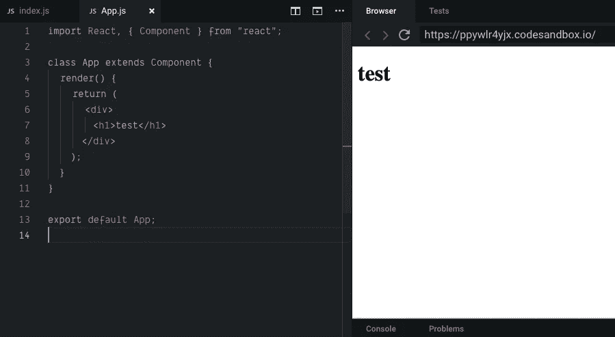
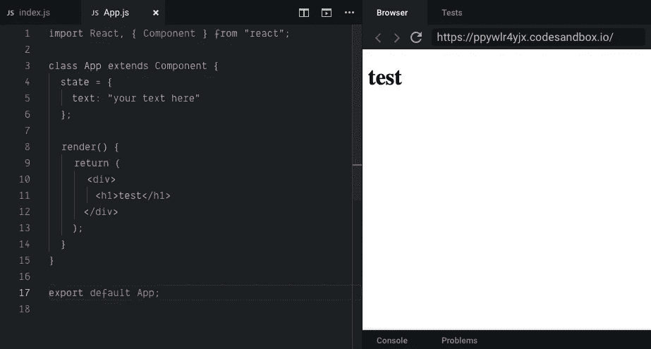
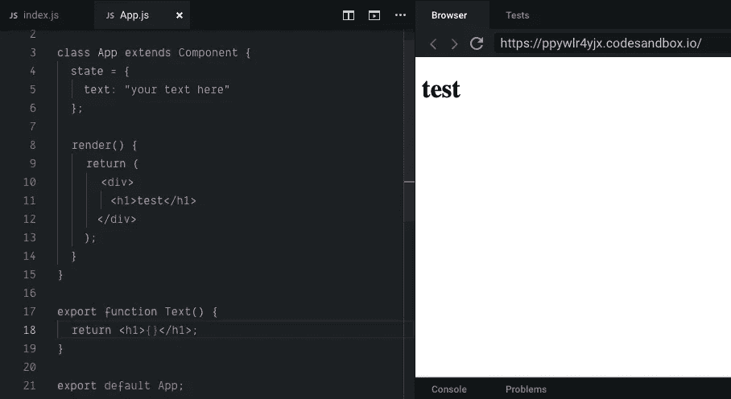
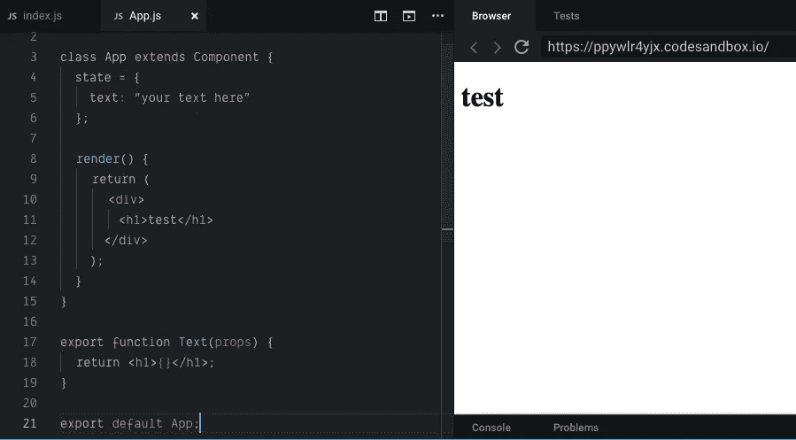
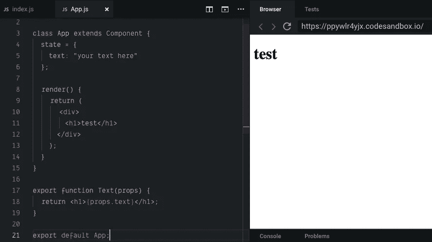
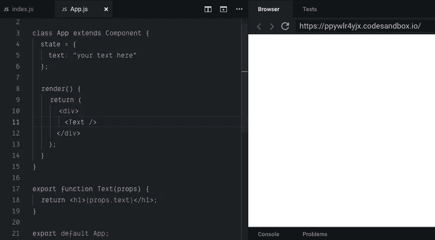
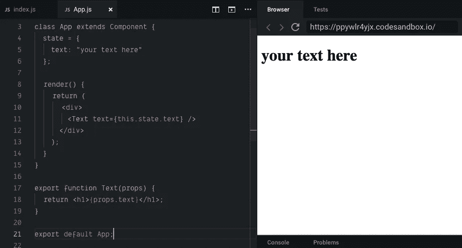
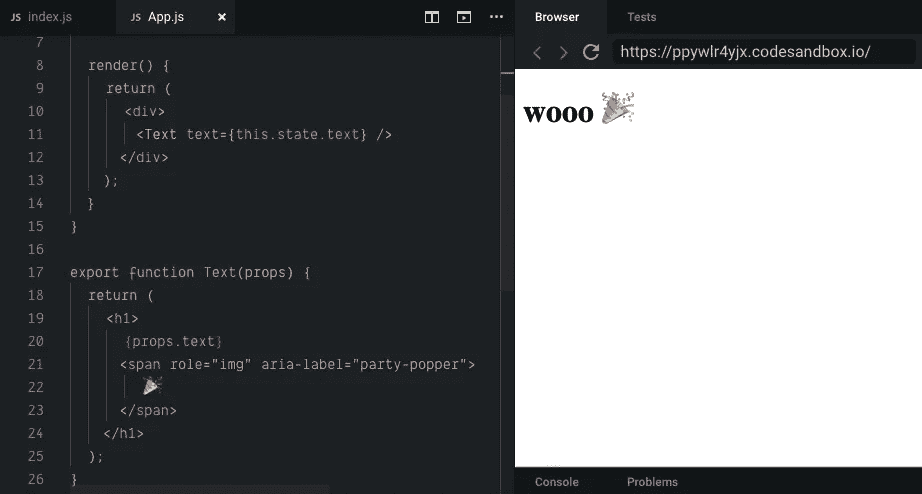

# 如何在 React 中传递状态

> 原文：<https://medium.datadriveninvestor.com/how-to-pass-state-in-react-e2945dcca324?source=collection_archive---------9----------------------->

[](http://www.track.datadriveninvestor.com/1B9E)

俗话说，除非你能教，否则你不会真正理解一件事。所以这里什么都没有…

要在 React you 中传递状态:

1.  设置一个反应组件。



2.在组件顶部声明状态。这可以是任何东西。

```
state = {
  name: “Awesome person”,
  phone number: 6054756968,
  life motto: “I love rabbits.”
}
```

都可以接受。



3.在您的组件下面，但在导出默认值之前，声明一个将消耗(即使用)您的状态的功能组件。



4.传入道具。



5.使用花括号通过功能组件中的 props 消费传递的状态。

**翻译**:把传入的道具放到花括号里的函数里。



6.使用类组件中的功能组件。没事的时候不要慌。



7.告诉功能组件您想要使用状态中的哪些属性。



8.庆祝—状态已通过。



最后…这是一个可以玩的沙盒:

 [## 通过状态-代码沙盒

### CodeSandbox 是一个为 web 应用程序量身定制的在线编辑器。

codesandbox.io](https://codesandbox.io/embed/ppywlr4yjx?fontsize=14) [](https://www.datadriveninvestor.com/2019/02/21/best-coding-languages-to-learn-in-2019/) [## 2019 年最值得学习的编码语言——数据驱动的投资者

### 在我读大学的那几年，我跳过了很多次夜游去学习 Java，希望有一天它能帮助我在…

www.datadriveninvestor.com](https://www.datadriveninvestor.com/2019/02/21/best-coding-languages-to-learn-in-2019/)