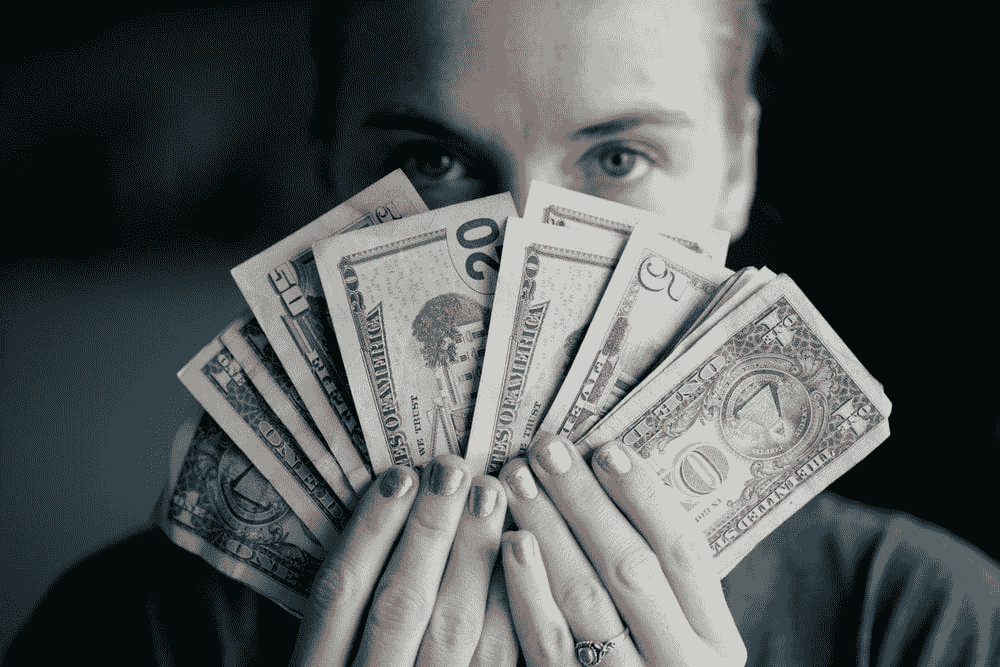

# 如何用你的钱和平合法地摧毁这个系统

> 原文：<https://medium.datadriveninvestor.com/how-to-peacefully-and-legally-destroy-the-system-with-your-money-da1c70bcbdf4?source=collection_archive---------17----------------------->

金钱是他们听到的唯一声音。所以，这就是如何用你自己的钱和平合法地摧毁这个系统。

**不要向银行借钱，停止使用信用卡(错误的方式)。**

唯一的例外是如果你把它们用于你的利益而避开所有利益。否则，你就是在免费送钱。你有没有注意到信用卡的利息有多高？因为这是信用卡公司赚钱的方式。你的债务对他们有好处。然而，我使用我的信用卡做任何事情，因为我积累了奖励里数，但是为了避免所有利息，我逐月全额付清账户。这是关于最大化你的宽限期。如果你在报表期开始时购买，那么在付款到期前你还有将近两个月的时间。这是两个月的免费贷款。只要避开所有的利息，你就会好的。你应该向银行借钱的唯一时机是抵押贷款。
 **学会以物易物。**

有人想要你拥有的东西来换取某种东西吗？我的副业之一是辅导数学和商业相关的话题。我辅导一个在数学上苦苦挣扎的十几岁的男孩，他的妈妈是一个单亲妈妈，尽管她打两份工，也只是勉强度日。我一生中想学的事情之一是如何弹钢琴。她知道怎么玩。作为对我辅导服务的回报，她一直在教我钢琴的基础知识以及如何读谱。这很好，因为它把所有的钱都排除在等式之外。她正在帮助她的儿子，我正在学弹钢琴。试着做更多的交易。你可能会对一些人能给你的东西感到惊讶。

 [## 外汇投资如何帮助偿还债务|数据驱动的投资者

### 外汇是对外汇市场的投资，不同国家的货币在外汇市场上进行兑换

www.datadriveninvestor.com](https://www.datadriveninvestor.com/2019/02/13/how-forex-investment-helps-to-repay-your-debts/) 

试着去当地的杂货店购物。

尽你所能让你的钱在你自己的城镇里流通。50 美元对一个小企业来说可能会有所不同，而 50 美元对沃尔玛来说根本不算什么。我大部分时间都尽量在当地商店购物。我知道这并不总是最可行的选择，但是当你可以的时候就去做，因为你不仅得到了你所需要的，而且你也支持了你所在城镇中真正需要那项业务的小企业主。

**避开大型企业商店，如沃尔玛或任何其他中国进口商店。**

中国物价低的代价是什么？失控的通货膨胀。现在，通货膨胀和失控的通货膨胀是有区别的。“通货膨胀”这个词经常被认为是不好的。然而，通货膨胀是一件大事，因为它意味着一个强大的/不断增长的经济。另一方面，失控的通货膨胀是指增长非常快并且几乎不可能降低的通货膨胀。这导致商品和其他商品的价格迅速上涨。你可能会问，“难道我们不能在保持经济强劲的同时，努力抑制商品通胀吗？”为了控制通货膨胀，美联储不得不通过降低债券价格和提高利率来减少经济中的货币供应。低利率会产生资产泡沫。如果美联储提高利率，那将使银行别无选择，只能也提高利率。因此，想借钱的人会减少，支出会下降，价格会下降，这意味着通货膨胀会放缓。然而，由于货币供应减少，经济将陷入困境。

**尽可能多种粮食。**

知道你的食物来自哪里。这是我在过去的一年中一直有意为之的事情。种植自己的农产品省钱+你甚至可以学到一项新技能。我不能告诉你有多少次我吃了一些东西，我完全不知道我在我的身体里放了什么。我想我们大多数人都可以这么说。已有多种食品因污染而被召回。小心点。当你种植自己的食物时，你知道它在哪里。你很清楚它的状况。但是你也很清楚你在吃什么。另外，你不必把钱给公司所有的商店。

**回收旧物品。**

回收旧物品做新用途省钱。下次你要扔掉某样东西的时候，想想你还能用它做什么。如果它服务于其他目的，那么你不必去那些公司拥有的商店浪费金钱。

**少吃快餐。几乎所有的快餐都是公司所有的。另外，这对你的健康也有好处。你可能会惊讶快餐连锁店一天能赚多少钱。我知道把这些都删掉是不现实的。但是越做越好，偶尔做一次，肯定会有所不同。这个世界可以变得更好，但是贪婪阻碍了它。**