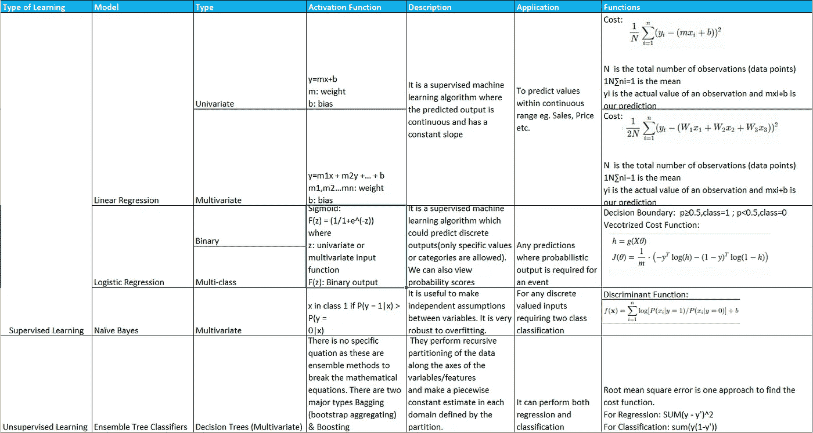
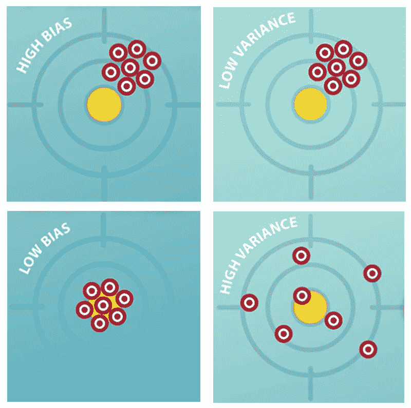
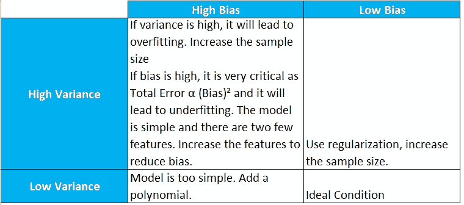

# 如何对机器学习模型进行质量保证？

> 原文：<https://medium.datadriveninvestor.com/how-to-perform-quality-assurance-for-ml-models-cef77bbbcfb?source=collection_archive---------3----------------------->

我在某处读到过—

“不要担心测试包含机器学习算法的产品，你只需要确保它返回准确的结果”

-有多矛盾？

最近，在量化 ML 模型的质量保证方面，我面临着一个两难的选择。机器学习和人工智能正在快速发展，然而，随着该领域复杂性的增加，执行 QA 是一个挑战。我观察到 QA 团队在从事人工智能项目时完全走错了方向。甚至客户也不清楚在将人工智能模型整合到他们的产品中之前如何处理 QA 方面。
我遇到过的一些问题有:
-如何对 AI 模型进行回归？(回归:回归测试是重新运行功能性和非功能性测试，以确保先前开发和测试的软件在发生变更后仍然能够执行)
——如何确保生产中的现有模型在底层变更发布时不会崩溃？
-如何确保在生产中保持精确度？

我将根据我的阅读和建模的实践经验来回答这些问题。
但在此之前，从质量保证的角度讲一些机器学习概念的背景。

*“机器学习是一个研究领域，它赋予计算机学习的能力，而无需明确地***编程。”**

*如果我们看看黑盒测试方法，任何机器学习模型都类似于任何其他基于算法的方法。
有一些输入产生一些输出。这些输出可以对照一些预期结果进行验证。*

*对于白盒测试来说，哲学是不同的，而且有点复杂。关键区别在于:
1。代替算法，有一个函数被写成
2。该函数由给定数据上的特定算法拟合。*

*因此，仍然可以使用经典方法通过模型系数来测试 ETL，但是不可能对输出应用相同的原理。除此之外，在每次运行期间，对于相同的输入，模型可以表现出不同的行为。*

*所以我们来分解一下整个 QA 流程。*

*代码评审:
应该基于给定数据的模型选择的最佳实践来执行模型评审。这类似于执行代码评审和识别编码的基线最佳实践。下面显示的与模型相关的一些细节有助于符合最适合的模型。*

**

*你仍然需要一个优秀的数据科学家来根据具体情况提供服务。还有另外两个参数可以帮助识别 QA 准确性。偏差和方差。*

**

***偏倚:**
这是模型的统计偏倚或预测偏倚。在激活函数中不使用偏置。预测偏差是我们的模型的预期预测准确性和真实预测准确性之间的差异。
**方差:**
这是模型的统计方差。如果我们在训练集中有小波动的情况下多次重复学习过程，方差就是我们模型预测的可变性的度量。建模过程对这些波动越敏感，方差就越大。*

**

*我的另一个观察是在评估模型性能时使用精确度和召回率，而不仅仅是精确度。假设我们正在为电子邮件建立一个垃圾邮件过滤器，在过滤 150 封电子邮件后观察下面的场景。
准确度方程= (TP + TN)/(TP + TN + FP + FN)*

*TP =真阳性*

*TN =真阴性*

*FP =假阳性*

*FN =假阴性*

*执行 1:*

**

*对于上述模型，精确度= 73.3%。这似乎是一个体面的准确性。然而，让我们假设分类器是哑的，并且将所有电子邮件分类为非垃圾邮件，即负面的*

*执行 2:*

**

*对于上述模型，精确度= 83.3%。这就是[精度悖论](https://en.wikipedia.org/wiki/Accuracy_paradox)。
为了避免这种情况，我们应该使用精确度或阳性预测值以及回忆或灵敏度。*

*精度= TP/(TP + FP)
召回= TP/(TP + FN)*

*理想情况下，精确度=召回率=应该是 1.0*

*人们甚至可以通过 F1 分数使用精确度和召回率组合作为调和平均值:*

> *F1 = 2*(精度*召回)/(精度+召回)*

*对于典型的 QA，让我们回顾一些场景:*

*1.有一个使用底层机器学习模型的 web 服务。发布了一个更新的模型。在这种情况下，这是一种黑盒测试场景。加载测试数据集，并验证它具有可接受的 F1 分数输出。它可能不完全匹配，但是在可接受的色散率内。所以你需要事先设置这些阈值。
2。部署了机器学习功能，需要验证数据处理是否正确。
在这种情况下，这是一种白盒测试场景。使用单元测试方法找到每个阶段的模型值。用这些值创建测试用例，在每个阶段将其标记为通过/失败。
3。评估生产数据变化的影响，并找到处理它的理想方案。
在一个受控的环境中，随机播种可以帮助你找到持续生产投入的结果。然而有时在生产中，同样的投入会产生不同的产出。在这种情况下，请多次运行该模型。确定 F1 分数的阈值并捕获异常值。如果异常值在可接受的限制范围内，则继续模型，否则，拒绝代码以进行进一步的微调。
4。一个客户想要运行 UAT，需要一个完整的回归测试用例
向客户描述黑盒。提供所有的测试数据和 web 服务来观察输出。描述白盒测试层和每个级别的预期输出。创建一个模型质量报告(从你的数据科学家那里获取，或者告诉我我可以帮助你。)
5。客户希望确保生产中的模型不会因即将发布的
而中断，使用测试数据执行黑盒冒烟测试。使用新数据运行多次迭代。评估 F1 分数，并确定每次运行的 F1 分数是否可接受，异常值是否未超过阈值。
6。我如何知道为模型评估保留的阈值是否足够
这更多地与数据科学有关，本质上是模型的可接受标准偏差集。一些模型使用类别输出或概率输出。他们中的一些人使用混淆矩阵。其他一些方法是使用曲线下的面积。使用与这些方法相关的数据可视化来找出误差最小值。*

*这些是我从模型构建练习中学到的一些观察和行动。这一地区幅员辽阔，有巨大的进化空间。请在评论中告诉我你的经历。*

**Dhaval Mandalia 喜欢数据科学、项目管理、高管培训，并撰写管理战略方面的文章。他也是古吉拉特邦管理协会社区的贡献成员。在*Twitter 和 [LinkedIn](https://www.linkedin.com/in/dhavalmandalia/) 上关注他。*