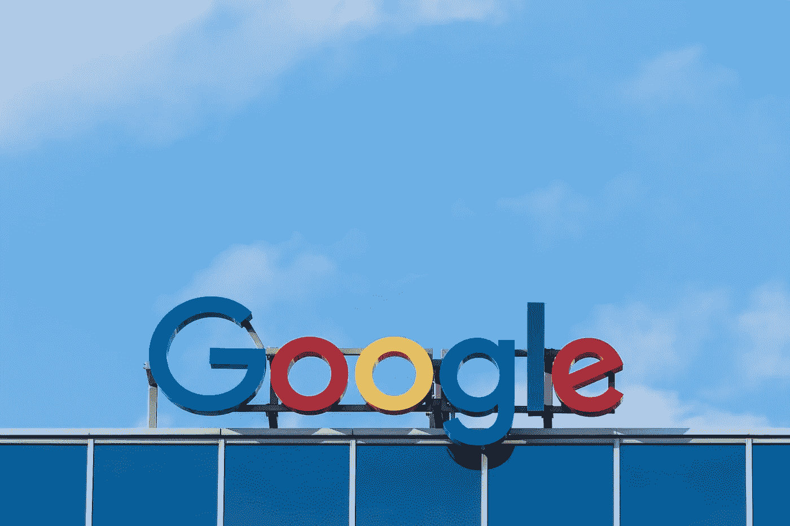

# 如何选择一个成功的企业名称

> 原文：<https://medium.datadriveninvestor.com/how-to-pick-a-winning-business-name-7407aea7c5f2?source=collection_archive---------12----------------------->

给自己的公司命名似乎是拥有自己公司的道路上最简单的任务之一。本应是有趣的锻炼实际上可能会相当有压力。你要确保你选择的名字经得起时间的考验，如果可能的话，包含你个人的核心价值观和你公司的价值观。让我们来看看在决定最终的名字之前需要考虑的一些重要的事情。

# 命名您的公司

作为一名企业家，你可能愿意大胆选择名字。以下是一些方法，可以将你的直觉转化为一个名副其实的品牌名称:

首先，一个好名字应该简单。它应该容易拼写和发音，对你的客户和经销商有意义，而不仅仅是对你。任何时候你不得不解释你的名字或者为此道歉，你都在降低你品牌的价值。例如，以我第一个公司的名字 MD-Advantages 为例。我数不清有多少次我不得不向客户或潜在的合作伙伴澄清，在 MD 和优势之间有一个连字符。

> “我真诚地向高价值顾客先生道歉；你的电子邮件没有得到通过，因为优势是复数，你已经离开了“s”

我很快意识到需要做出改变，因此我开始在所有的互动中称该公司为 MDA。

不要做跟屁虫。

利用一个已经建立的、受欢迎的品牌名称的力量，并对其稍加调整，这可能很有诱惑力。但是，即使你避开了商标警察(不是真的)，精明的客户仍然会看到你的所作所为:你完全缺乏创造力，商业行为可疑。唯一能侥幸逃脱的人是杂货店的普通品牌产品，这些产品试图尽可能看起来像他们的名牌产品:他们有 Toasty-Os，而不是 Cheerios 他们有雷电博士，而不是胡椒博士…你明白了吧。

**避免“混搭”的命名方法。**

当一个正常的有文化和理智的有抱负的企业主把一个形容词的一部分打碎成一个名词时，就会发生这种情况。例如，“QualiServe”代表你全新的服务型公司或 Ameri——后面是 Tech、Corp 或 Tron 或任何其他类似的蠢话。通过在 MD-Advantages 中使用连字符，我部分犯了这个罪。幸运的是，我的第二家公司 Modern Workspace 在这方面做得很好。

事实上，让我们现在就制定一个规则:如果你在任何正常的文字处理程序中的拼写检查说你的名字拼错了，那就想一个新的。

**避免商业命名的陈词滥调。**

当想到一个企业名称时，你的大脑很可能会从一系列字面名称开始。一旦你用尽了这些，你将继续寻找描述性的名字。在那之后，你会开始思考隐喻。停下来。回到起点，重新开始。恕我直言，隐喻很糟糕。每个人都认为他们的业务处于行业的顶端，或者很快就会，所以像 Apex、Summit 和 Pinnacle 这样的公司不断涌现。这种命名约定已经过时了。继续搜索。

最后，抵制用自己的名字给公司命名的冲动。

在*业务*名称中使用*你的*名称会发出该公司是一个人经营的信号。此外，“弗兰克的家具”并没有很好地讲述你公司的背景故事。你需要考虑一下未来。到时候，如果你的名字与公司无关，出售公司和套现会更容易。唯一能侥幸逃脱的人是专业服务行业的人；像美林这样的投资公司，像 Pulaski & Roberts 这样的律师事务所，以及某些医生和牙医。

This is, perhaps, the best business name that I’ve ever seen…

# 你应该申请商标吗？

这里有一个常见的误解:“你必须为你的企业名称或标志注册商标，以保护它免受侵权。”不对。如果你在美国、加拿大或英国经营企业，就没有必要申请。除了在您的商品或服务中使用您的商标之外，您不需要做任何事情来获得商标权和保护您的品牌。你自动获得这些权利。当你写作或创作一部书面的创造性作品时，情况也是一样的:版权是即时授予的。

那么联邦商标注册有什么意义呢？可以这样想:如果一个人未经我的许可试图使用我的品牌，我想对他提起诉讼，如果我没有得到联邦保护，在法庭上赢得侵权案件会更麻烦。麻烦赢了，是的；但并非不可能。如果我在联邦政府注册了一个商标，那么我的姓名权和商标权何时生效就一目了然了。没有正式注册，我将不得不找出一堆商业文件来证明我已经交易了一段时间。我很有可能赢得这场官司，但这可能会消耗掉赢得这场官司的额外时间，而在律师界，时间就是金钱。

现代工作空间做了什么？嗯，作为一个资金有限的小企业初创公司，我认为没有必要获得官方商标。一旦你开始营业，你就可以在你的名字或商标后加上“”,向全世界表明你认为“X 公司”是受保护的。这通常足以吓跑任何潜在的侵权者。然而，在你通过联邦商标程序之前，你不能使用圆圈 R。除此之外，我是一个一丝不苟的记录员。如果我被迫捍卫我的商标，我可以提供显示我的历史商业交易的文件。

> “我听到了，韦斯。但我想格外小心，无论如何都要得到联邦政府的保护。”

没问题。让我们来看看商标优势的类别，这样你就可以选择一个符合你需求的类别。

# 选择一个可辩护的商标

商标实力最终分为五类，而你公司的名称所属的类别决定了你能在多大程度上保护你的商标免受寄生虫的侵害。

如果你最终真的上了法庭，一个由多个部分组成的测试将被用来评估消费者将你的商标和其他人的混淆的可能性。第一项测试衡量两个商标在视觉、声音和意义上的相似性，而第二项测试则考虑所售商品或服务的相似性。

令人惊讶的是，许多小企业只是简单地选择一个名字，而没有做实质性的研究，看看是否有人已经为它持有商标。

首先在这里搜索你公司的名字:【https://www.uspto.gov/ 

如果你恰当地保护了商标，那么在你续展或失去它之前，你会持有它 5 到 10 年，这取决于你的所在地。

# 是什么决定了一个商标的强弱？

商标强度可以通过将商标归入以下类别之一来确定:

**奇特的标志**——杜撰。没有字典意义。稀奇古怪的商标完全是杜撰的，也就是说它们在被用作商标之前没有任何意义。这被认为是最强的商标类型，因为它仅指带有该商标的商品和服务的来源。例子包括埃克森、施乐、柯达、CHEX、HYDROX 和宝丽来。

**任意标记** —断章取义的任意用词。这些由常用英语单词组成，这些单词的正常含义与它们所应用的商品和服务没有关系。例子包括果汁的海洋喷雾和香烟的骆驼。

**暗示性标志** —暗示性暗示或暗示产品的性质/属性。这些间接指的是与它们相关的商品和服务，需要消费者的一些想象力。例子包括汉堡助手，这是晚餐组合和减肥快速，这是代餐饮料。

**描述性标记** —描述产品、成分或属性。这些标志描述了它们被用来销售的商品和服务。尽管这些商标最初很弱，但如果你能证明消费者只将它们与一家公司联系起来，它们就可以被注册。这通常只有在做了五年的大量广告后才能成功注册。例子包括视觉中心，这是一个光学中心和额外的力量，这是阿司匹林。

**通用商标**——这些商标根本不受保护，也不能注册，因为它们描述的是一整组商品或服务，这使得无法区分该组中的产品。例如，如果你的公司叫小苏打或电话，试着注册你的公司名称。

# 保护你的标记

当一个企业家遇到另一家企业使用与你相似的商标，并可能使用你的名字进行交易时，这就像是在踢他的胃。

首先，你应该首先联系你的律师，让他或她给侵权公司写一封停止信。然而，你需要先做你的功课，绝对确定你已经使用这个标志很久了。如果没有，你已经踢开了邀请其他公司控告你侵犯他们的大门！

好消息是，大约三分之二的这些纠纷可以在庭外解决。无论如何，如果出现这种情况，请遵循优秀商业律师的建议。

# 域名

根据谷歌的说法，域名(通常简称为域)是与特定 IP 地址相关联的易于记忆的名称。例如，域名 example.com 可以翻译成 198.102.434.8。这使得记住网站的统一资源定位符(URL)变得容易得多。

选择正确的域名对企业的成功至关重要，尤其是在电子商务店面进行网上交易时。

如果你有一个好主意，你想给你的公司起什么名字，并且你已经在 USPTO 网站上进行了商标搜索，以确保你和一个已经存在的公司之间不会有冲突，那么有几个域名注册商可供选择。

***这里有一些创建强域名的思路:***

在大多数情况下，您的公司名称、网站名称和域名都应该相同。

做空。不幸的是，短域名越来越难找到，因为大多数已经被抢光了。不要期望找到少于六个字母的域名。说了这么多，还是尽量简短吧。

不要成为潮流猎人。这些天，太多的重点被放在把关键字放在您的域名。钨品牌创始人菲利普戴维斯(Phillip Davis)表示，“这是一项基于当前谷歌算法的短期战略，谷歌已经多次改变其算法”。

“真正的”网络问题。很多人认为，如果你的域名不是以。在某种程度上，它是二流的。这是完全错误的。毕竟，我们很久以前就用完了 1-800 个号码，似乎没有人会被 866、877 或 888 所困扰。

# 最后一件事！

如果你有资金，这是一个好主意，买下所有的域名扩展与你的名字一样。网，。信息，。商业。这样做的原因是，一旦你成长并开始变得令人讨厌，你的竞争对手就会买下带有你公司名称的域名，然后是可用的扩展，并使用它们将人们重定向到他们的网站。这个想法是，当客户搜索你的时候，他们偶然发现你的名字，一切看起来都是合法的，他们点击它，然后直接进入你的竞争对手的手中；我要补充的是，他们精心制作了一个目标明确的登录页面，误导的客户会被发送到这个页面。那就是你失去销售的时候。

> *“但是等等！有人这样对我，不是侵犯了我的商标吗？”*

非常敏锐的观察…事实上，《反域名抢注消费者保护法》( ACPA)规定，如果一方恶意注册域名，意图从品牌商誉中获利，则可获得 1，000 至 100，000 美元的损害赔偿。然而，不要忘记诉讼，即使你是对的，也是昂贵的。

# 你怎么想呢?你准备好开始自己的事业了吗？

*原文发布于:*[*https://in military . com/the-veteran-entrepreneur-w-wes-odon nell-pick-a-winning-business-name/*](https://inmilitary.com/the-veteran-entrepreneur-w-wes-odonnell-pick-a-winning-business-name/)