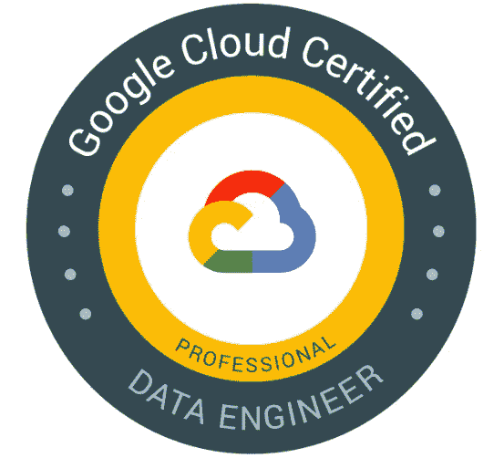
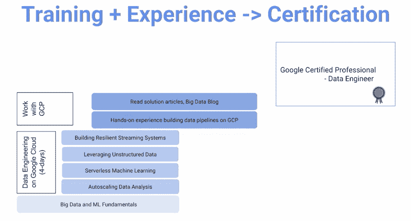
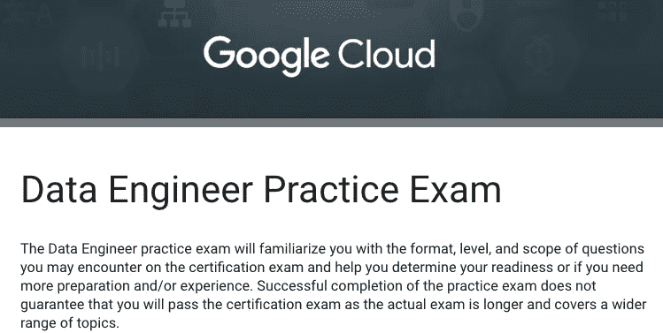
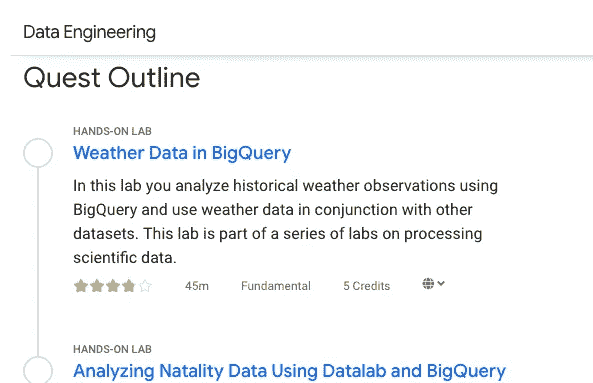
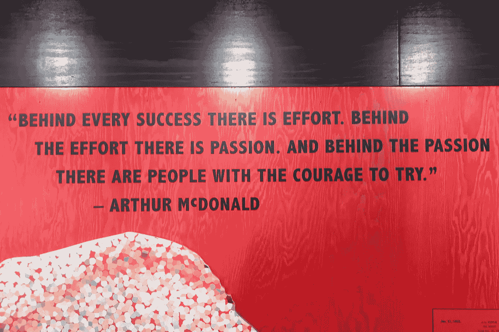

# 如何准备谷歌云认证专业数据工程师考试并在第一次尝试中通过

> 原文：<https://medium.datadriveninvestor.com/how-to-prepare-for-google-cloud-certified-professional-data-engineer-exam-and-pass-it-on-your-a7bdef8aa8d0?source=collection_archive---------1----------------------->

在想新年计划吗？把谷歌云证书加入你的职业组合怎么样？云平台上的数据工程是当今机器学习管道中至关重要的一步。如果你想知道如何更好地准备谷歌云[专业数据工程师](https://cloud.google.com/certification/data-engineer)认证考试，并在第一次尝试中通过考试，这篇文章可以帮助你。在文章的最后，我将分享我的一个个人笔记作为准备。

GCP 数据工程师考试是一个 2 小时的考试，包含 50 道选择题。在您从考试中心提交考试结果后，我们会立即通知您。带有谷歌云首席执行官签名的证书将在一周内通过电子邮件发送给您。

以下是我希望有人在我去考试前告诉我的 4 个建议。根据你在云数据工程方面的经验和背景，你可能需要一到三个月的准备时间。

**1。就拿谷歌云平台上的** [**数据工程专业来说吧**](https://www.coursera.org/specializations/gcp-data-machine-learning#about)**Coursera 上的**

该专业有 5 门课程，包括:

*   谷歌云平台大数据和机器学习基础
*   通过 Google 云平台上的云 Dataproc 利用非结构化数据
*   使用 Google BigQuery 和云数据流进行无服务器数据分析
*   Google 云平台上基于 Tensorflow 的无服务器机器学习
*   在谷歌云平台上构建弹性流媒体系统

Photo credit to Coursera

通过这些课程提供的演示和动手实验室的结合，您将学习如何设计数据处理系统，建立端到端的数据管道，分析数据和在 GCP 上训练机器学习模型。这些课程涵盖结构化数据、非结构化数据和流数据，这是您在行业中会用到的三种数据类型。

**2。参加数据工程师实践考试**

谷歌提供的[数据工程师实践考试](https://docs.google.com/forms/d/e/1FAIpQLSc_5CCKpgL2g41qOc7YDcbW8_BvnQgRQKC1A2-im3hd-LTo_A/viewform)将让你熟悉认证考试中可能遇到的各种问题。孙子曰:“知己知彼，百战不殆。如果你了解自己但不了解敌人，那么每一次胜利都会让你遭受失败。不知己知彼，百战不殆”(《孙子兵法》)。备考期间至少过三遍模拟考试，尤其是考前一晚预热大脑。

模拟考试也有助于确定你的准备情况。准备就绪到底是什么意思？一个衡量标准是准确性。参与者应正确回答至少 80%的问题。另一个指标是速度。写试卷的时候给自己计时是很重要的。在真正的考试中，每道题有 2.4 分钟。考虑到我们在真正的考试中可能会紧张，最好在练习中达到每题 1.5 分钟左右的速度。

Photo credit to Google Cloud

**3。与 Qwiklabs 一起完成所有动手项目**

用 Qwiklabs 完成所有关于[数据工程谷歌云培训](https://google.qwiklabs.com/quests/25?utm_source=gcp&utm_medium=site&utm_campaign=certification)的动手项目，尤其是如果你在日常工作/学习中不使用 GCP 的话。从大查询，到数据流，到 Dataproc，到 BigTable，到 Tensorflow，练习这种高级的探索会增加你的技能和能力。

考试很有挑战性，强烈推荐外部学习、经验和云数据工程背景。我想在这里重复一遍:如果你在日常工作中不使用 GCP，重要的是通过这些动手项目来建立对 GCP 服务的实际而深刻的理解。

Photo credit to Google Cloud Traning

**4。查看案例研究样本**

GCP 提供了两个示例案例研究，描述了一个虚构的业务和解决方案概念，为考试问题提供了额外的背景。

*   [物流物流](https://cloud.google.com/certification/guides/data-engineer/casestudy-flowlogistic)
*   [MJTelco](https://cloud.google.com/certification/guides/data-engineer/casestudy-mjtelco)

提前复习这些案例研究，因为考试中可能会用到它们。注意业务需求和技术需求。您提供的解决方案应该能够解决场景中的特定问题。

最后但同样重要的是，我想分享一份我个人关于 GCP 数据工程师考试准备的[笔记，其中包含了你可能在上面的提示一中遇到的问题。笔记里的问题和考试在格式和语境上完全不一样。分享这篇笔记的目的是为你提供一种方法来评估你对 GCP 服务的理解，包括 BigQuery、DataProc、DataFlow 等。](https://docs.google.com/document/d/1HlnMZ67aSPrsSyrjElq7Ba16_OvXOjmP6i8lmVtR2e8/edit?usp=sharing)

恭喜你！如果你完成了这四个步骤，你就准备好了。但是如果第一次考试没有通过呢？这很痛苦，但这不是你故事的结尾。尝试第二/第三/第四次！因为这是一个证明你不可阻挡的机会，你有足够的毅力去得到你想要的，你可以成为你渴望成为的人。

新年快乐

Shot at Ontario Science Centre