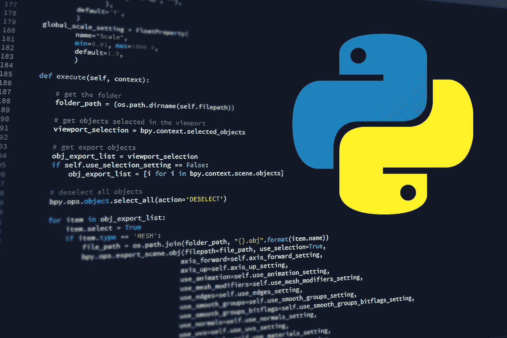
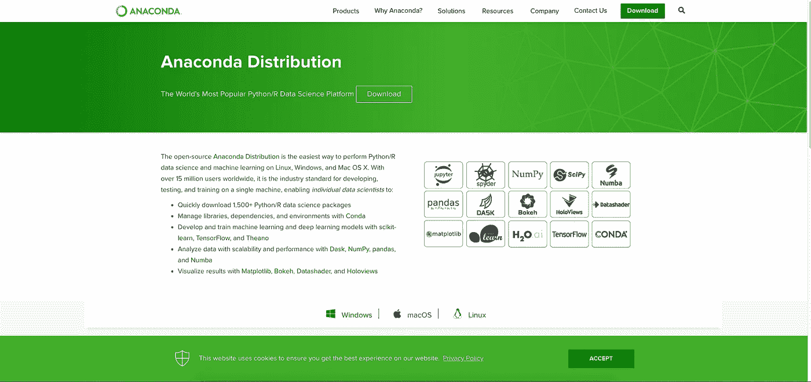
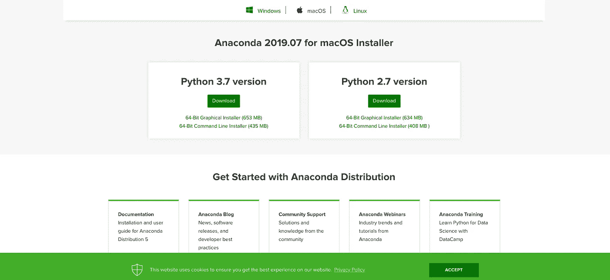
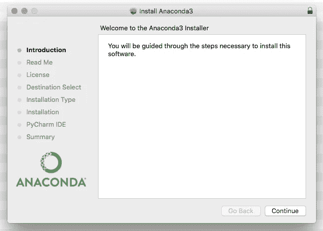
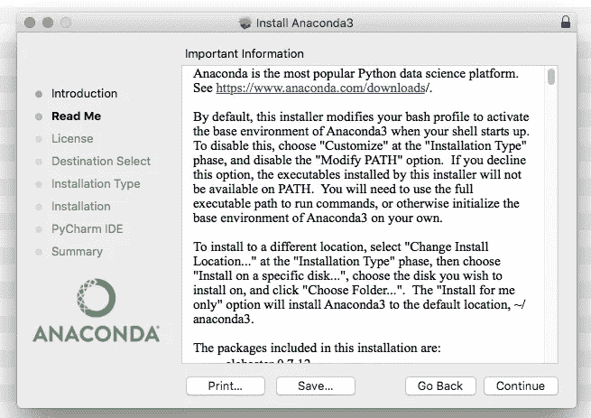
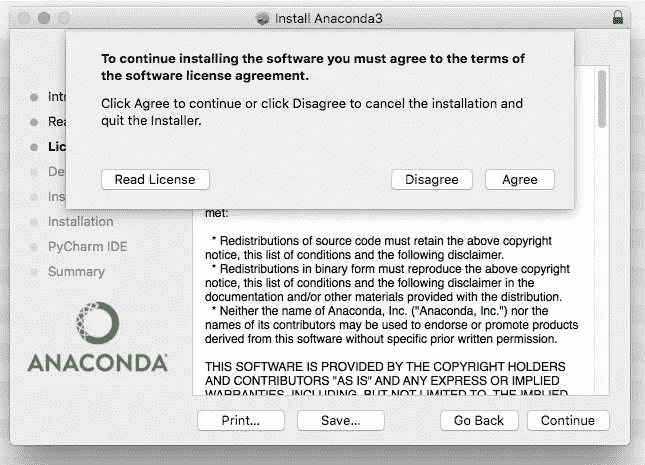
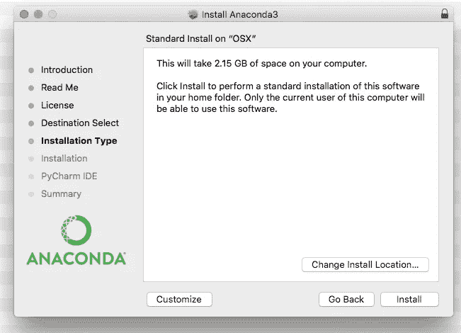
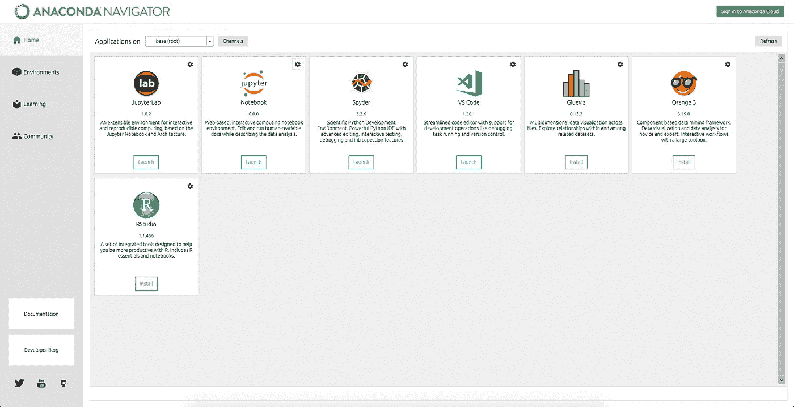
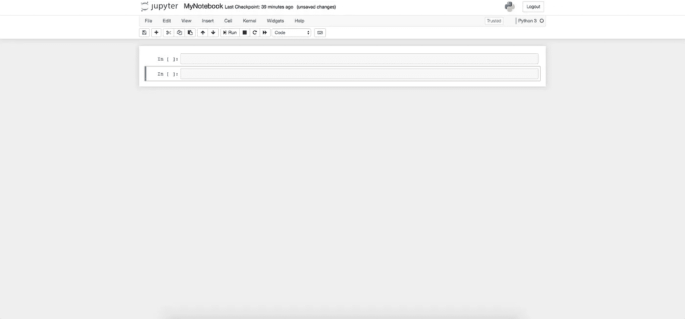
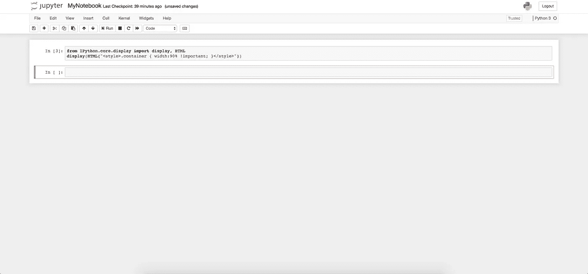

# 如何为 python 编码准备您的计算机？

> 原文：<https://medium.datadriveninvestor.com/how-to-prepare-your-computer-for-python-coding-52fa61582278?source=collection_archive---------0----------------------->

本指南将帮助您为 python 编程准备您的机器。无论是算法交易还是数据分析，Python 都是你的最佳选择。

# 蟒蛇

如果你想在你的桌面上使用 Python，你必须下载 Anaconda。正如他们在自己的网站上描述的那样，Anaconda 是..

> ..在 Linux、Windows 和 Mac OS X 上执行 Python/R 数据科学和机器学习的最简单方法。它在全球拥有超过 1500 万用户，是在单台机器上进行开发、测试和培训的行业标准，使个人数据科学家能够:快速下载 1，500 多个 Python/R 数据科学包使用 Conda 管理库、依赖项和环境使用 scikit-learn、TensorFlow 和 Theano 开发和培训机器学习和深度学习模型使用 Dask、NumPy、pandas 和 Matplotlib 分析具有可扩展性和性能的数据，使用 Numba 可视化结果

# 如何..

Go to [https://www.anaconda.com](https://www.anaconda.com/)

Click on download or go to [https://www.anaconda.com/distribution/](https://www.anaconda.com/distribution/).

After the download has finished click on the installer so that this window will appear. Then click on ‘Continue’.

Read the ‘Read Me’ notes.

Click on ‘Continue’ and then on ‘Agree’.

You’ll need 2.15GB free space on your hard drive. Then click on ‘Install’

This is the main ‘Anaconda Navigator’ window. From here you can start a new ‘Jupyter Notebook’ or the ‘Visual Studio Code’ or even the ‘R Studio’.

## 快速提示..

如果你想在 Jupyter 笔记本上工作，有时你会想你会希望单元格大一点。如果是，那么复制、粘贴并运行以下代码..

> 从 IPython.core.display 导入显示，HTML
> 显示(HTML(" < style >)。容器{宽度:90%！重要；} < /style >))

最近，我试着使用上面的片段，但是我不得不把双引号字符改成简单的引号，这样才能正常工作。

> 从 IPython.core.display 导入显示，HTML
> 显示(HTML(' < style >)。容器{宽度:90%！重要；}</style>’))

Before

After

*更新*

【2020 年 2 月 22 日—添加了该片段的另一个版本。