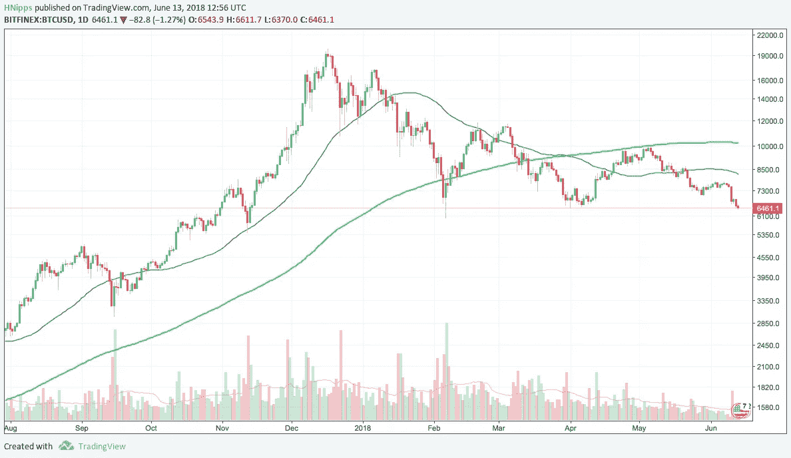
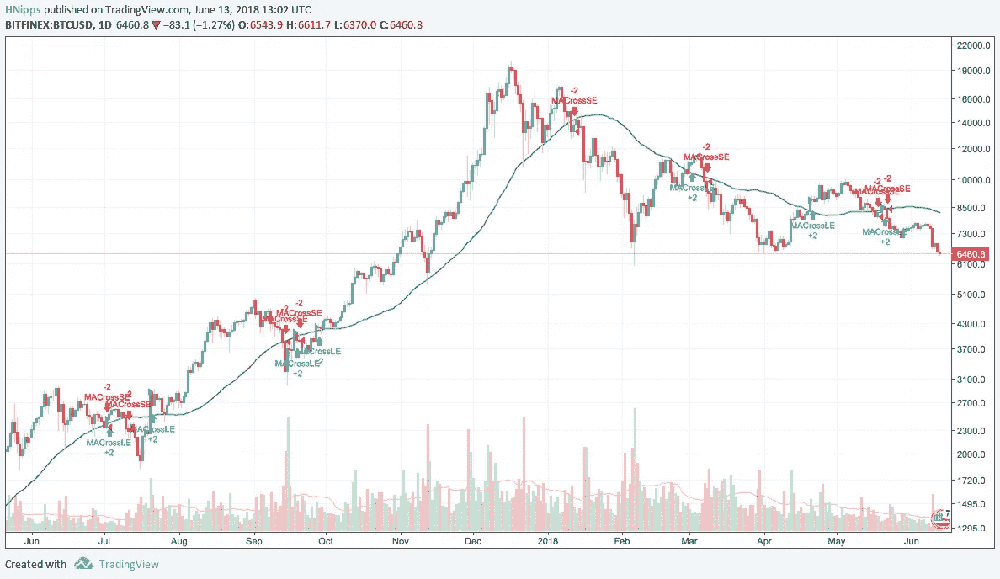
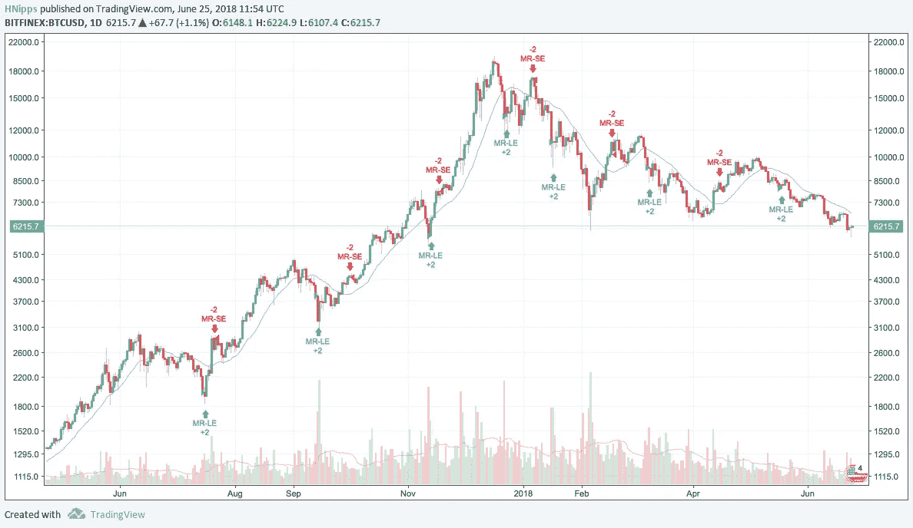
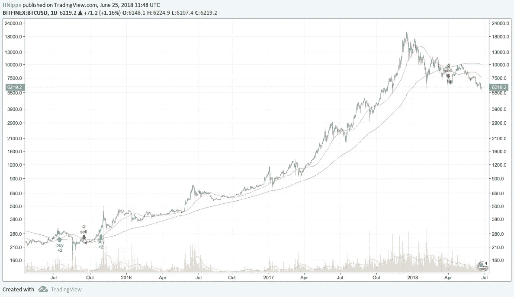
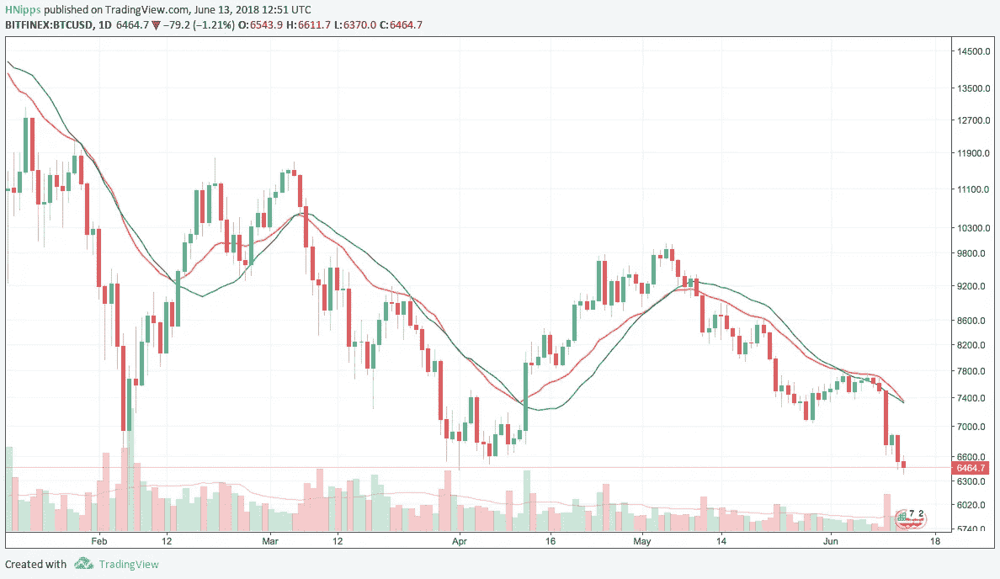

# 如何从均线中获利

> 原文：<https://medium.datadriveninvestor.com/how-to-profit-from-moving-averages-677fc6b600b3?source=collection_archive---------0----------------------->

## 想知道如何从一个最简单的交易指标中赚钱？在这篇文章中，我们将讨论移动平均线，以及如何使用它们来创造利润。

Photo by [Ramiro Mendes](https://unsplash.com/@thisisramiro?utm_source=medium&utm_medium=referral) on [Unsplash](https://unsplash.com?utm_source=medium&utm_medium=referral)

现在有很多很多的技术指标都是由复杂的数学和理论支持的。今天，我想回到基础，谈谈技术分析中最简单的指标。它是许多其他交易策略和技术指标的支柱。

没错，就是均线。

# **什么是简单均线？**

维基百科将移动平均线定义为:

> “移动平均(滚动平均或移动平均)是一种通过创建完整数据集的不同子集的一系列平均来分析数据点的计算方法”

它是一系列值的*子集*的平均值。在交易中，它通常是收盘价的子集。

要完全定义移动平均线，我们需要知道这个子集有多大。你会经常听到人们谈论 50 天移动平均线和 200 天移动平均线。这是两种常见的移动平均线。

“50 天”和“200 天”部分是指平均值分别从前 50 天和 200 天的收盘价计算得出。

*BTCUSD 50-SMA (blue line) and 200-SMA (green line)*

具有较大子集的移动平均线通常对具有较小子集的移动平均线的每日价格变化不太敏感。这是因为随着子集变大，每天对平均值的影响越来越小。

在较大的集合中，平均值受单个结果的影响较小。你会在均线的平滑度上看到这一点。

*The 200-SMA (green line) is much smoother than the 50-SMA (blue line)*

从上图可以看出，50 日均线比 200 日均线更频繁地改变方向。

# **你如何从中获利？**

涉及 MAs 的最简单的策略是 MA 交叉。

当价格穿过均线，比如 50 日均线，从下往上，你买入。当价格自上而下穿过 50 毫安时，你卖出。

当价格高于均线时，表明价格可能会继续上涨，当价格低于均线时，反之亦然。价格可能会继续下跌。

*50-SMA crossover strategy: blue arrows = long entry, red arrows = short entry*

我不是说这是一个有利可图的策略，但这是一个你应该知道的策略。上述 50 毫安交叉策略在 3 年的时间里取得了约 11%的收益…

第二种策略是均值回归策略。记住，移动平均线只是一段时间内收盘价子集的平均值。

当价格上涨超过均线一定百分比时，你卖出。因为你预计价格会*回到均值*。均线代表一段时间内价格的平均值，所以如果它高于均线一定幅度，那么你可以预期价格会回到平均值，即回到平均值。

当价格低于均线一定幅度时，情况正好相反。你可以预期价格会回复到均值，然后上涨，所以你在这个点买入。

再说一次，这可能不是一个特别有利可图的策略，但是值得了解。为什么不在 TradingView 中试用一下，看看效果如何？

Mean reversion strategy, goes short when close is 10% above the 20-MA, and goes long when price is 10% below the 20-MA

我想和你分享的第三个简单策略是双均线交叉。

当你的图上有 2 个均线时，比如 50-MA 和 200-MA，小心它们交叉。

如果 50 毫安在 200 毫安之上，我们处于上升趋势。当 50 毫安低于 200 毫安时，我们处于下降趋势。

你应该在较短的均线(即 50 毫安)从下向上穿过较长的均线(即 200 毫安)时买入，在较短的均线从上向下穿过较长的均线时卖出。交叉表明趋势已经改变并转换方向。

Moving average crossover strategy

这 3 个策略很容易实现，并且经常在交易软件中作为例子。所以它们开箱即用并不特别有用。但我相信你可以通过实验优化参数，从中获得一些合理的回报。

**指数移动平均线**

简单移动平均线的一个缺陷是它们会受到价格大幅变动的影响。他们可以非常迅速地对消极(或积极！)价格暴涨。

这些峰值可能只是异常现象、噪音和对市场真实情况的干扰。

指数移动平均线(EMAs)提供了这个问题的解决方案！

EMAs 更重视最近的价格，对价格变化的反应更快。看一下这张图表:

*Comparison of a 20-SMA (blue line) and a 20-EMA (orange line)*

均线比均线更能跟踪最近的价格变化。这既是 EMAs 的魔咒，也是超能力。

EMAs 能比 SMAs 更快地帮助你识别趋势变化，让你更早地进入趋势，这样你就能赚更多的钱。但是他们也更容易造假。在趋势被确认之前，你可能进入得太早了，所以小的突破有更多的机会反转。

另一方面，SMA 的反应要慢得多，所以不容易造假，因此当趋势被证实后，你就会进入趋势。这意味着如果趋势结束，你从交易中赚的钱会减少，但趋势真正结束的可能性更大，而不仅仅是伪造的。

> “简单是最复杂的”——莱昂纳多·达芬奇

总的来说，均线是你交易工具箱中的一个很好的工具，但是它们本身不太可能让你长期赚钱。

均线最适合用来确认市场状况，而不是用来确定入市时机。

简单移动平均线容易受到剧烈价格变动的影响，但也比指数移动平均线更能反映长期趋势。

指数移动平均线可以帮助你更早发现趋势，更早进场，但是它们也容易造假。因此，如果你打算使用 EMAs，你应该有好的风险管理实践来防止累积太多的损失。

不要低估最简单工具的威力。

如果这篇文章有帮助或者有趣，请点击拍手按钮👏所以更多的人可以看到它！

***随意分享这篇文章，因为你认识的人可能会觉得有用！***

**免责声明:**本文中的信息仅用于教育目的。我不是理财顾问，这篇文章也不包含理财建议。自己决定风险，或者咨询专业的财务顾问。

