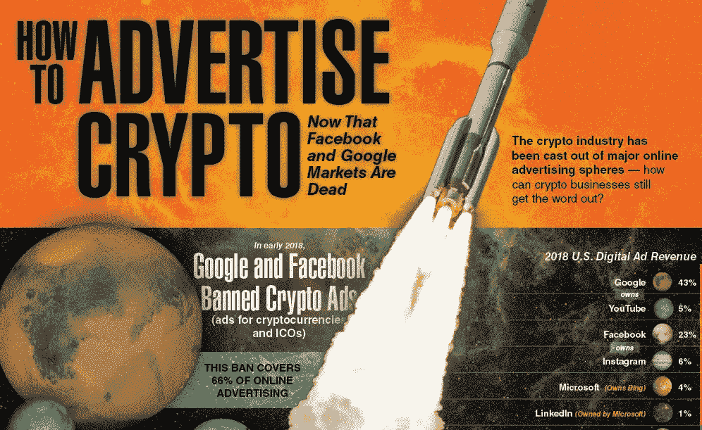

# 广告被禁止后，如何在 Crypto 中推广

> 原文：<https://medium.datadriveninvestor.com/how-to-promote-in-crypto-now-that-advertising-is-banned-6fa661eb188c?source=collection_archive---------2----------------------->

2018 年初，脸书禁止所有基于加密货币的产品和服务在该网站上做广告，称加密“经常与误导或欺骗性的促销活动联系在一起”。Twitter、Google 和 LinkedIn 也都开始禁止加密广告。Snapchat 禁止 ico 广告，但仍允许其他加密广告，包括交易所、钱包和交易建议。随着 66%的在线广告空间禁止加密货币和区块链，新项目将如何传播这个消息？

虽然大多数社交媒体网站不允许加密广告，但仍然有选择在这些平台上吸引观众。为了在社交媒体网站上赢得观众，你需要创建内容来吸引用户的注意力:原创帖子、信息图表、视频和图像。建立一个引人入胜的社交媒体，你甚至可以在 reddit 和 slack 等平台上加入加密社区的讨论。

另一种增强你的社交媒体信号的方法是与那些会推广你的项目的有影响力的人合作。找到一个已经从事技术和加密工作的有影响力的人。有影响力的人会提升你的受众，并让你获得他们的信任。例如，约翰·迈克菲将向他的 80.5 万名粉丝推广加密货币，每条推文 10.5 万美元。

阅读此信息图，了解更多关于[广告加密货币](https://coincentral.com/how-to-advertise-in-crypto-info/)的信息:

