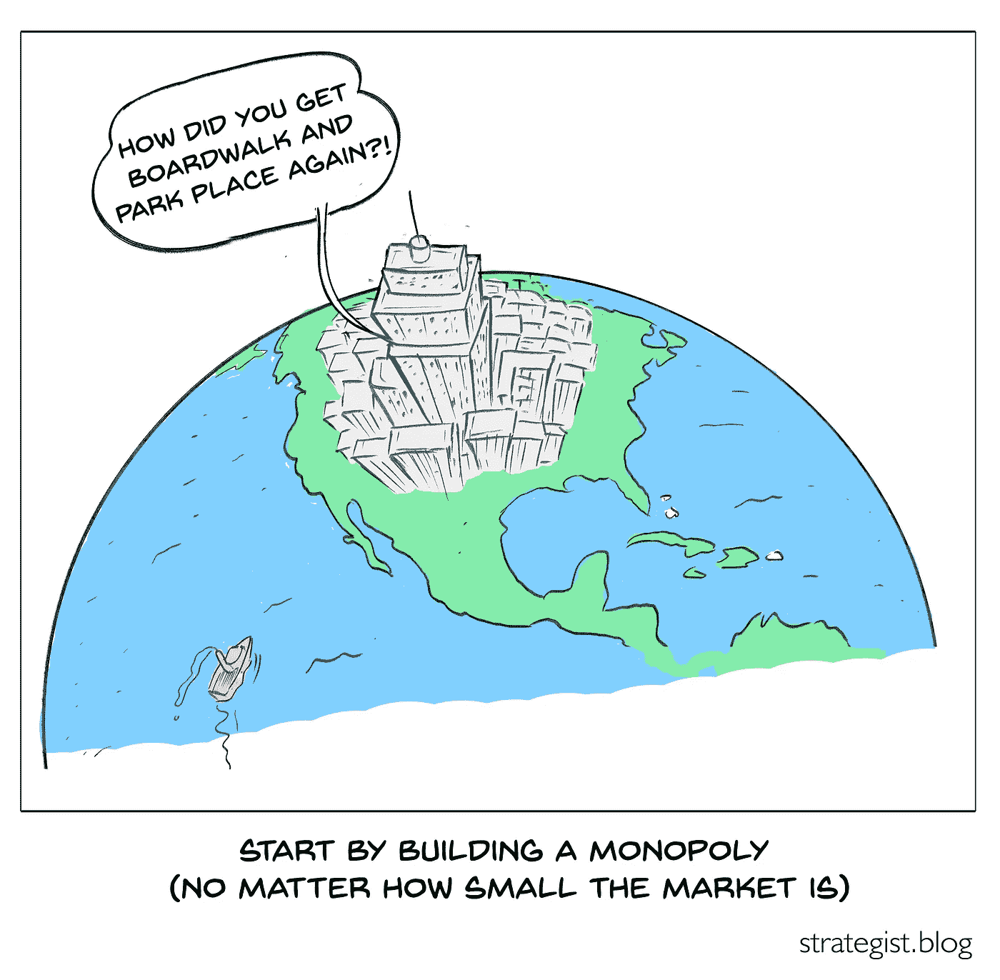

# 如何为你的创业公司筹集资金

> 原文：<https://medium.datadriveninvestor.com/how-to-raise-funds-for-your-startup-2c8b468f9ea4?source=collection_archive---------13----------------------->

*这是“如何建立一个创新的新产品或公司”系列的第 9/18 部分，主题是创业融资，专门针对种子期*

# 你如何筹集 500 万美元？

好消息是——这是可能的。我曾是融资 400 万至 1700 万美元的初创公司的一员。我观察并建议同事们在几个月内为他们的第一次创业筹集了 200 万到 500 万美元。

我也见过有伟大想法和激情的企业家努力筹集资金。

 [## 金融科技初创公司正在颠覆全球银行业|数据驱动的投资者

### 传统的实体银行从未真正从金融危机后遭受的重大挫折中恢复过来…

www.datadriveninvestor.com](https://www.datadriveninvestor.com/2018/10/20/fintech-startups-are-disrupting-the-banking-industry-around-the-world/) 

有什么区别？

主要的区别在于(a)你的策略，(b)你组建的团队的记录和承诺，包括你自己，以及(c)你讲述这个故事的能力。

就(a)而言，一些基金只投资 B2B 公司，因为他们知道在 B2C 模式下获得客户的风险和成本很高。投资者也可能只投资于当地的公司以及投资者熟知的行业。例如，如果你的企业是一家减少医院病人跌倒的企业，那么如果你与曾经当过护士或在医院担任领导职务的投资者交谈，你肯定会找到更强的接受者，因为他们知道这个问题的存在。如果这不可能，找到那些能证明问题的人，让他们以顾问的身份参与进来，这样投资者就能看到对问题和你的解决方案的独立验证。如果这些顾问承诺将投资作为本轮投资的一部分，这一点会更强。

进一步建立在(a)的基础上——你的战略应该立足于价值池。投资者更喜欢大型价值池中的创业公司。话虽如此…

## 一个聪明的企业家从价值池的一小部分开始，并在扩大自己的范围之前寻求主导它

在这方面，投资者可能需要一点教育。如果他们不接受你的观点，也许他们会接受贝宝创始人彼得·泰尔的观点(斜体是原文)，摘自他的书《从零到一》:

> 每个创业公司开始时都很小。每一个垄断者都控制着其市场的很大一部分。*因此，每个创业公司都应该从一个非常小的市场开始。*起步过小总是稳妥的。原因很简单:统治一个小市场比统治一个大市场更容易。如果你认为你的初始市场可能太大，那几乎可以肯定。

我最近观察到的一位同事的创业公司有一个聪明的策略:拿一个他们已经有证据的产品，在第一阶段简单地扩大它，以主导一个 3000 万美元的市场。然后在第二阶段建立在用户基础上，扩展到价值超过 1 亿美元的市场。没有一种战略说你会通过获得大市场的一小部分而获胜；这只是避免真正思考你将如何获胜。不幸的是，一些投资者看到了第一期的市场规模，没有看得更远。

作为一个企业主，你的目标是赢。通用汽车的创新汽车品牌土星(Saturn)是半心半意地追求大市场的经典案例。当所有竞争对手都在为生存而战时，通用汽车的投资(在承诺、动力和资源方面)只够让土星成为市场上的一员。作为一家初创公司，你唯一的选择就是在一个小的、可以赢的领域获胜，然后扩展到更大的领域。

## 与投资者的关系

对于一轮种子/天使投资来说，另一个区别在于你是否与私人投资者建立了基于信任的关系。对于一轮风险投资来说，这通常适用于收入超过 500 万美元，并希望筹集 1000 万至 3000 万美元以达到更高水平的情况，其难易程度取决于你所追求的价值池的规模、团队的实力以及你当前的收入/客户基础。

筹集资金是一项全职工作。它需要几个星期和几个月每天几个小时。

我在以前的文章中谈到让创始团队的成员深入了解买家和用户是多么重要。募集资金也差不多；如果你认识投资者，事情就简单多了。如果你个人没有，考虑在你的团队或董事会中为那些能建立这些联系的人保留一个位置，这可能是一条捷径。

一些公司的创始人出生在一个充满关系的世界。我知道有一家公司，其创始人的祖父创办了一家公司，当他去创办一家公司时，这家公司成了他孙子的主要客户。如果你有这样紧密的联系，你可能不需要再往下读了。

# 寻找投资者

一个法律上的注意事项:你如何吸引投资是有限制的。事实上，公司可以在公开市场之外筹集资金(例如 IPO ),这是由于美国证券交易委员会的一项规则的例外，如果你违反这项规则，将禁止你私下筹集资金。你不太可能打破这条规则——只是不要给人们群发邮件暗示你正在筹集资金。

最好的建议是出去和没有你的演讲台的人交谈。在两分钟内轻松地讲述一个故事，就像上面的大纲。找到当地的企业家，征求他们的意见，告诉他们应该和谁谈。与当地孵化器的经理交谈。寻找与你同行业、规模或位置与你相似的公司，在 CrunchBase 上看看是谁资助了它们。请注意，这可能只揭示了风险基金；天使/种子轮投资人可能不在列。

特别是对于种子期投资，我发现投资者更喜欢投资当地和与他们有私人关系的企业家。部分原因可能是，即使是经验丰富的投资者也很难真正知道一家公司是否会起飞，因此这是一种筛选潜在选项的好方法。

gust.com 和 AngelList(angel.co)是可以帮助初创公司和天使投资者牵线搭桥的网站，尽管我还没有见过谁成功地使用过它们，也许是因为投资者很难从它们上面的众多机会中筛选出来。

最终有人会听到你的故事并说“我需要把你介绍给某某人。”如果没有，继续完善和尝试。没有捷径。筹集资金是一项繁重的工作——但不比发现问题、制定解决方案、寻找、服务和取悦客户更多的工作……这一切都同样艰难。如果你放弃了这一步，很可能你已经放弃了后面的一步。

如果你是一家拥有一些资产和收入的公司，并且正在寻求发展，你能通过贷款来实现吗？贷款避免了赠送股本。Chobani 酸奶其实就是这么开始的。阿里巴巴也是在没有资本的情况下成长的。“1995 年，我白手起家创业。资本由集体意志和团队合作组成。许多企业家说，没有钱，他们什么也做不了。这是错误的。阿里巴巴创始人马云在 2008 年阿里巴巴第五届电子商务冠军颁奖典礼上说:“企业家应该以责任和团队合作为导向，而不是金钱。”。

坚持但有礼貌。人们很忙。如果可以的话，记下他们的手机号码和短信——通过电子邮件往往能更快得到答复。每隔三到五周，与你在这个过程中的每一个人分享一次更新——你已经签署的销售合同、产品更新、你已经建立的关系。随着时间的推移，讲述一个持续增长的故事是让潜在投资者保持兴奋的好方法。

# 大学和联邦研究基金

如今，许多大学都有商业化和天使投资网络。这些群体通常是当地投资者，他们每月出现一两次，听取经过审查的大学附属创业公司的推介。他们可以选择个人投资或集体投资。

我从未使用过 SBIR/STTR 基金，但我的同事用它们创建了公司。这些是提供多轮免费资金的联邦拨款项目。具体来说，它们是为小公司提供的非稀释性基金，这些小公司将政府机构感兴趣的主题的创新解决方案商业化，并解决了大客户的棘手问题。换句话说，他们和其他投资者有着完全相同的优先权。

大部分资助/合同来自国防部、HHS/国立卫生研究院和教育部。其他机构包括美国宇航局、国家科学基金会、美国农业部、环境保护局、交通部和 DHS。就市场潜力而言，国防部、国家航空航天局和其他机构可能是项目结束时的潜在客户(即他们给你一份合同)；其他机构要求您识别您的客户(即，他们给你一笔赠款)。

STTR 需要一个大学研究伙伴；SBIR 没有这种限制。两者都要求你有一个有资格证书的团队成员(例如，但不一定，一个博士或一个大公司的领先研究职位)来进行核心研究。有了 STTR，你可以利用大学伙伴来满足这一要求；SBIR 要求一旦拨款发放，此人主要受雇于你的团队。

三年内资金总额可达 175 万美元。

高通和 23andme 就是靠这些资助起家的创业公司的例子。浏览这些项目需要一点专业知识，但北卡罗来纳州像许多州一样，有一个非营利性的小企业技术发展中心，为申请资助的初创公司提供无偿咨询。

# 融资回合流程

他们可能会问的三个问题是:

(1)你筹集了多少资金？

*   为了确定你需要筹集多少资金，制定一个季度一个季度的财务计划(尽管在实践中，你的目标应该是向客户学习，而不是遵循计划)。你需要多少薪水？你什么时候雇佣那些员工？你的预期销售额是多少？如果销售需要更长时间才能实现呢？如果是这样的话，你需要多少累计现金来确保你不会耗尽现金，从而不需要在紧急情况下再次筹集资金？你将如何花这笔钱？不要提高超过你所需要的；投资者希望你花掉他们给你的钱。

(2)什么是钱前估值？

*   根据我的经验，一家 B2B/B2C SaaS 企业的投资前估值为 700 万至 1200 万美元(截至 2018 年)，其创始人经验丰富，收入较低或为零，但未来 3 至 4 年的收入预期为 500 万至 1000 万美元。我提到这一点只是因为这似乎是基于市场格式塔，而不是数学。

(3)你的估值是怎么得来的？

*   通常没有精确的机制来设定它，除非你有几百万的收入和增长历史，在这种情况下，可以应用收入倍数。如果你能尽早找到一个大投资者，让他们设定估值，这是锁定投资的一个好方法。

在我所在的公司的种子期，以及我观察到的一个同事的一轮融资中，我们把这轮融资分成了两部分。让第一批窗口开放，比如说三个月，让任何能够在那个时候获得资金的人都可以这样做。任何承诺将部分资金放入第二批(比如说再开放 6 个月)的人，都可以让公司提前获得资金，同时消除所有投资者要求尽快获得所有资金的压力。承诺投资第二批但没有这样做的投资者失去了他们的 A 类股票——即使是对早期投入的基金而言，因此创业公司的风险是有限的。

第一次融资的另一个选择是可转换债券:他们现在买入该公司，但适用于该项投资的投资前估值要到下一轮才确定。

# 获得主要投资者

当你可以说，“我有一个投资者已经承诺投资 25 万美元，并且已经设定了投资前估值”，所有这些步骤都会变得容易得多。根据未来两到三个月的时间安排，第一阶段将会结束。”让投资者利用其他人的尽职调查……创造一个现在行动而不是六个月后行动的理由……创造社会证明的证据……这些是让投资者从“有趣的想法”变成“我如何以及何时进入？”

也发表在[strategic . blog](http://strategist.blog/)上，在那里我分享了关于构建基于分析的产品和业务的想法(例如“产品策略”)。本文中提及或参考的任何书籍或其他资源都列在[这里](https://strategist.blog/further-resources-and-acknowledgements/#20)。