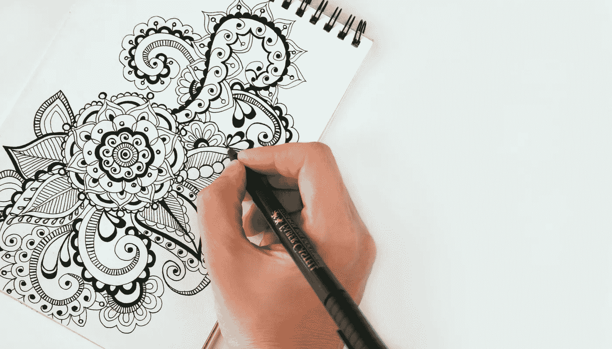

# 如何挽回你损失的利润？

> 原文：<https://medium.datadriveninvestor.com/how-to-recover-your-lost-profits-8f840136586d?source=collection_archive---------4----------------------->

“Digital market place”

数字时代目前正处于成长阶段，从家庭、工作到商业需求，生活的方方面面都受到影响。社交媒体广告市场最近创下新高。仅在 2017 年，eMarketer 估计该行业就产生了 350 亿美元的收入。科技巨头谷歌和脸书目前的广告收入也高达数十亿美元。

“Illustrator”

## **有什么问题吗？**

想象你是一名专业摄影师或插图画家，通过他们的作品被出版、出售或出租来满足他们的需求。这个巨大的市场为策划作品的每一种工艺提供了巨大的赚钱机会，也存在允许未经授权复制、分发和转售原创内容的陷阱。令人不安的不仅是它的使用没有适当的信用，而且“可能”的收入也丢失了。

**那么如何保护你的经常性收入呢？**

根据 FushionCharts.com 的数据，2017 年，超过 1700 万张图片和其他工艺文章被上传到网上，平均每天 46 740 张

在发现侵权后向 DMCA(数字千年版权法案，政府机构)提起诉讼并游说索赔可能会花费大量时间、财富(750-150，0 00 美元)和其他资源，包括精神健康费用。不是所有的策展人都能负担得起。

“Recovering your lost income”

解决方案可以是 [Image Protect，Inc .(IMTL)](https://www.imageprotect.com/)开发的 **IPShare 技术**。这种创新为内容创建者提供了以下任何好处:

**1。未经授权的使用货币化-** 在你的作品通过他们的数字注册获得许可后，不是你提出索赔，而是他们的全球许可专家将获得适当的赔偿或利润。

**2。内容的公平货币化-** 授予策展人的许可权让他可以轻松安全地处置自己的作品，从而增加利润。

**3。权利管理-** 要求权利可能需要数月或数年时间；因此，这个与专家合作的平台是为了更方便地合法主张版权而建立的。

**4。使用可见性** -该平台允许广泛监督机构或个人在线合法使用你的作品。这意味着，你将能够了解它是如何被使用的，以及上传的每件作品的货币增长。

**5。销售/许可历史证明和法律证据-** 通过他们的技术，给予原创者永久的归属。每件作品都有真品证书，以证明对作品无可争议的所有权。