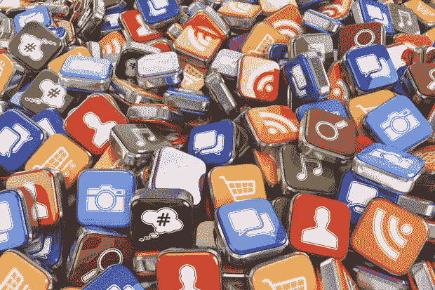

# 如何重振垂死的社交媒体

> 原文：<https://medium.datadriveninvestor.com/how-to-rejuvenate-a-dying-social-media-presence-190ff8dbd66c?source=collection_archive---------7----------------------->

你的社交媒体账户正在积灰吗？好消息是这不是一个不寻常的现象。开始使用社交平台建立在线业务的企业通常会在第一次尝试中失败。这种新鲜感过一段时间后就会消失，很快就没有人能吸引用户了。简介经常以杂草丛生的新闻结束。

虽然社交媒体是一种非常有效的营销工具，但它无法独自发挥作用。它不够聪明。你不能只做一个侧写，然后任其自生自灭。您需要持续定期地与每个客户接洽，以充分利用他们。以下是一些你可以做到的方法:

1.  *坚持策略*

如果你对自己的社交媒体存在有一个目标，那就给你更多的力量。然而，这仅仅是开始。一旦你意识到你想要达到的结果，你需要想出能让你达到的步骤。

你需要做的第一件事是指定个人成为你的社交媒体团队的一部分。除了任命他们，你还应该给他们具体的角色和职责，这样每个人都知道他们应该做什么。此外，这也将为您提供精确的结果，可以根据需要随时进行微调。

社交媒体是关于参与的，越频繁越好。要做到这一点，创建一个日历，可以帮助你计划每天的文章。这样你就不会错过每天与访客交流的机会。要使日历满足您的需求，它应该包含以下元素:

*   你的观众类型。
*   你可以用来吸引这些观众的内容。
*   他们感兴趣的话题和科目。
*   您需要管理和创建的内容类型。
*   您将使用哪些平台来发布内容。

*2。创建内容创作或策展计划*

当谈到创建引人入胜的社交媒体内容时，了解你的受众对成功至关重要。他们的兴趣和需求将决定你应该分享的内容类型，以及你如何与关注者互动。

我们举一个简单的例子来理解这一点。假设你拥有一家面包店，你的目标人群对烘焙技巧和食谱感兴趣。要了解他们来自哪里，你需要了解他们的年龄、所在地、性别、需求、行为、面临的挑战以及具体的痛点。这将为您的发布日历内容提供主题思路。

不管你的受众是什么类型，你的内容都应该是高质量的，并且与你的受众相关。尽可能优先考虑视频和其他基于图像的内容。这些现在更受欢迎，这意味着它们可以大大提高你在社交媒体上的地位。

*3。使用视觉媒体*

Pinterest、Instagram、Snapchat 有什么共同点？这三个社交媒体平台都是视觉驱动的，数字说明了一切。Instagram 用户每天发布 20 万次，Pinterest 每天发布超过 2500 张图片，而 Snapchat 每天的活跃用户超过 1.9 亿。这些数字令人震惊，这也是你应该在社交媒体活动中使用视觉媒体的主要原因。

为什么这些数字如此之高？视觉内容比书面内容更常被分享。把它想象成一个巨大的节目，告诉你的新闻。分享图片和视频，观众可以在个人层面上联系起来，这表明你知道他们在寻找什么，并对此感兴趣。创造一个强大的视觉营销体验，他们会成群结队地回到你的个人资料，这只会扩大你的影响范围。

*4。优先考虑你的听众*

有没有试过和一个自恋狂交谈？不好玩吧？好吧，如果你只在社交媒体上谈论自己，你的观众也不会欣赏。过度宣传的内容或仅描述特定组织的帖子不涉及个人层面。你如此自豪地分享销售数据，你的观众会怎么做？

你的目标应该是保持 80/20 的平衡。换句话说，至少 80%的内容应该吸引你的观众，而 20%的内容应该是你想推广的内容。日历将确保发布不会延迟，但你可能会被相关内容的想法难住。

激活 Google Alerts，让事情变得更简单。它会监控网络上的新闻，让你的观众欣赏，你可以用它来创造更多感兴趣的话题。此外，利用促销日，周和月，如情人节，圣诞节，感恩节以及特殊的日子，如友谊日，器官捐赠月等。另外，订阅与你的业务和行业相关的时事通讯和出版物。

*5。再利用和回收内容*

你可以用多种方式使用一篇博客文章。如果你把它用于你的社交媒体账户，内容可以有其他的形式和大小。例如，你可以以视频或教程的形式重新撰写一篇文章，访问者会更愿意在他们自己的个人资料上分享。你也可以用其他渠道的新闻稿和时事通讯做同样的事情。

如果你没有可分享的内容，这一策略将被证明是有用的。确保使用多种设备来分享这些内容，如 YouTube 和 Instagram，以重复使用这些内容并增加您的影响力。

**smart cut Marketing LLC 如何提供帮助**

如果你没有时间更新你生病的社交媒体，你需要专业人士站在你这边。SmartCut Marketing LLC 可以帮助您发现社交媒体营销解决方案和策略，为您带来您想要的结果。无论您想要增加参与度还是提升您的在线形象，[今天就联系](https://www.smartcutmarketing.com/contact)我们。