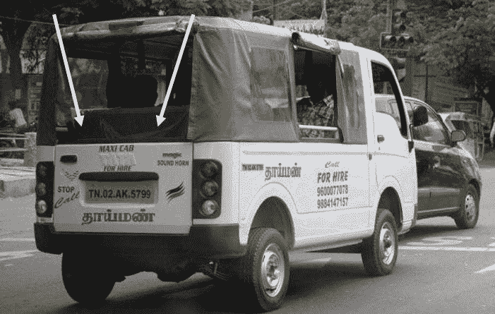

# 共享经济先行者的 4 堂商业课！

> 原文：<https://medium.datadriveninvestor.com/how-to-run-a-business-like-a-share-auto-c816f185c7f1?source=collection_archive---------21----------------------->

几个月前我在钦奈，那里最受欢迎的交通方式之一是拼车——人们付钱坐在人力车里。我愿称共享汽车为共享经济的先行者！:)

当我骑着它的时候，我试图通过我的观察和与司机的交谈来了解他们的运作。我试图将这些见解与一些商业经验联系起来。以下是我在分享汽车行业寻找商业经验的一点微薄之力

**节俭**

驾驶员总是希望尽可能早地达到更高的档位，并试图避免过于频繁地换档以获得更高的燃油效率。像司机一样，公司应该始终保持节俭——亚马逊的核心价值观之一是“节俭”——门桌是亚马逊的象征！

**寻找利基**

钦奈的每辆共享汽车都不会在整个城市中提供服务——它们会发现需求，并选择一条固定的路线，每天都沿着这条路线行驶(我乘坐的汽车只从火车站到最近的科技园)。

像汽车司机一样，处于早期阶段的初创公司应该在市场上找到一个合适的位置，只专注于迎合这部分市场，而不是试图为“每个人”提供“一切”而分散注意力。

**高效的资产利用**

共享汽车在一天内由两个不同的司机驾驶两个班次——汽车实际上从不停止！试图完全最大化他们的资产利用率。

**智能货币化策略**

这是我的最爱！

一些共享汽车在后备箱里放了两把塑料椅子来增加座位容量——这个小小的举动增加了他们 25%的收入！

非常令人惊讶的是，像 share autos、paan waalas 和每个街头小贩这样的人是如何掌握他们的商业基本原则的，这是我们每个人都要学习的。

希望你读得开心！

我写的是商业，而且只写商业。争取每周至少发表一篇新文章。

干杯！

维沙克·艾扬格

我写关于商业的文章

[https://www.linkedin.com/in/vyshakiyengar/](https://www.linkedin.com/in/vyshakiyengar/)