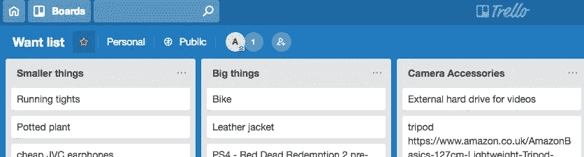

# 如何不用电子表格省钱

> 原文：<https://medium.datadriveninvestor.com/how-to-save-money-without-spreadsheets-4eaddb7b029e?source=collection_archive---------22----------------------->

“laptop computer on glass-top table” by [Carlos Muza](https://unsplash.com/@kmuza?utm_source=medium&utm_medium=referral) on [Unsplash](https://unsplash.com?utm_source=medium&utm_medium=referral)

## 纪律=自由。

我怀疑很多人会用自律这个词来形容我，但我对钱一直非常谨慎。这让我可以自由地承担重大风险[(比如创办自己的企业)](http://www.abbrightman.com)、经常旅行，并且不用担心每个月都要付房租——这对我的实际生活质量影响相对较小。

我的问题是，我不做预算，我不经常检查我的支出，我只是有一种让我总是量入为出的经营方式。如果你想要储蓄带来的自由，但发现紧缩预算和监控对你也不起作用，那么也许我的一些方法会帮助你。

# 1.列一份需求清单

老实说，我们都想要——并且认为我们需要——东西。除非你真的打算彻底摆脱唯物主义本能，否则你最好找到最有建设性的方式来接受它。对我来说，这意味着有一个“想要清单”，这只是一个简单的 Trello 板(如下图所示)，每当我意识到我想要什么，我就把它放在其中一个清单上(你可以按照你喜欢的方式组织它们；我通过小事情，大的投资，然后连接到我的相机的齿轮)然后等待它结束。仔细想想。

Want List Trello Board

通常我可以在一周左右的时间里认为你想要某样东西，但之后我就不再关心它了。太棒了，从需求列表中删除，省钱又不损失快乐！其他时候，一些东西可以在我想要的清单上放 6 个月，突然以很低的价格出售——嘣，抢购吧！用一大笔钱来奖励我自己的耐心感觉很棒，比起第一次想要它时冲动地买下它，我更感激能够在渴望了很久之后拥有它。我认为感恩是一种比你从即时满足中获得的多巴胺更持久的积极情绪，所以让我的钱获得最大的情感冲击也是明智的。

# 2.住在好地方

住在好的地方通常会多花一点钱，所以这似乎与省钱的直觉相反…对吗？我不同意。在住了几年简陋的公寓(20 多岁的生活在一个昂贵的城市，哟)后，我终于有了一个超级好的房子——它比我的朋友为更差的地方支付的租金低得多，但它比我的旧房子每月增加 100 多英镑。感觉很陡。然而，我意识到，当我住在一个冷酷的地方时，我想出去社交、吃饭或工作，以避免在那个地方呆太久，这真的会增加。

现在处于一个可爱的生活环境中意味着我渴望有朋友来喝一杯，而不是和他们一起在酒吧里兑现，我很高兴在家工作，而不是买无数杯咖啡待在外面，从头开始烹饪又是一件有趣的事情，而不是没有一个干净的表面，甚至连案板都放不下。我想我住在这里的第一个月就存了 150 多英镑，而且我的生活质量一天比一天高，所以这真的值得。对你来说，也许这根本不意味着搬家——也许这意味着投资更多的家居用品(地毯，男人),或者不再吝啬在冬天开暖气。

# 3.优先购买多种福利

当你不能把钱花在所有事情上时，你必须明确地分清轻重缓急。最简单的方法是找出你最重视的“东西”，比如购买艺术用品或健身，在这上面花钱，然后在其他地方做出牺牲。不过，最具战略性的做法是，优先花钱购买那些能影响你多个优先领域的项目/服务/体验，而不是只影响一个领域的项目/服务/体验。例如，我喜欢旅行，但我也喜欢制作视频，因此，如果我能想到一部在家里拍不到的电影，我就可以花钱去旅行。

如果你不确定从哪里开始，那么最容易挤出来的第二个好处可能是社交元素；无论是在健身房看到人们而不是独自在家购买健身设备，还是通过每月为朋友举办筛查派对从网飞会员中获得最大价值。

# 4.Hustle 应用程序和免费邮件列表

带一杯咖啡、饮料或食物出去是一种奢侈——但令人惊讶的是，许多品牌都非常乐意赠送其中之一，以换取你的电子邮件地址或下载他们的应用程序。特别是如果你喜欢工作或看朋友出去，这可以为你节省很多钱，给你很多社交或生产时间。如果你做了调查，随时了解谁在提供什么，那么很容易就能以保罗的[免费咖啡&羊角面包开始你的一天，从](https://www.paul-uk-loyalty.com/)[的 Krispy Kreme](https://www.krispykreme.co.uk/Friends-Of-Krispy-Kreme)买一份小吃，然后从[的 Youngs 酒吧买一品脱免费啤酒。](http://www.youngs.co.uk/app)

# 5.计划你的食物

我认为食物是最大的秘密持续支出之一，如果你呆在外面，很容易养成午餐吃点东西，然后晚餐吃点别的东西的习惯。如果你喜欢食物，那就太棒了，但是如果它只是你继续生活的一个工具，你可能需要花点力气来计划什么时候吃什么。这可能是跟随 youtube 上那些令人羡慕的准备饭菜的视频，连续几天进行分类，或者是我过去经常做的事情，即有一个每天要吃什么的想法，以防止自己让东西变质或过度购买，并在我的办公室里保留我可以快速制作成一顿饭的食物(如微波米饭或燕麦饼和 PB)，以便下班后如果我要出去的话可以轻松组装。

哦，对了，永远带着零食，以应对那些突然的崩溃时刻。

— — — — — — — — — — — — —

请在评论中告诉我你对这些的看法——不管你以前有没有尝试过，会不会做些调整，或者有没有自己的方法可以分享。