# 如何在 AWS Lambda 函数中设置层(Python)。

> 原文：<https://medium.datadriveninvestor.com/how-to-set-up-layers-python-in-aws-lambda-functions-1355519c11ed?source=collection_archive---------0----------------------->

当构建无服务器应用程序时，跨 Lambda 函数共享代码是很常见的。它可以是您的自定义代码，由多个函数使用，也可以是标准库(例如:Pandas、NLTK、pyspellchecker 等)，您添加这些代码是为了简化业务逻辑的实现。

以前，您必须将这个共享代码与使用它的所有功能打包并部署在一起。现在，你可以把通用组件放在一个 ZIP 文件中，并把它作为 Lambda 层上传。您的函数代码不需要更改，并且可以像平常一样引用层中的库。

 [## 2019 年最值得学习的编码语言|数据驱动的投资者

### 在我读大学的那几年，我跳过了很多次夜游去学习 Java，希望有一天它能帮助我在…

www.datadriveninvestor.com](https://www.datadriveninvestor.com/2019/02/21/best-coding-languages-to-learn-in-2019/) 

在函数的配置中，您可以引用多达五层，其中一层可以是运行时。当该功能被调用时，层按照您提供的顺序安装在 **/opt** 中。

让我们开始创建我们自己的具有 python 代码的 lambda 函数层。我假设您已经在本地机器上安装了 Python 和 pip。我用的是 Python 3.6。如果不是，那么[点击这里。](https://www.digitalocean.com/community/tutorials/how-to-install-python-3-and-set-up-a-programming-environment-on-an-ubuntu-18-04-server)

(操作系统:Ubuntu 18.04)

1.  **建立虚拟环境。**

打开终端并复制该命令。

> **pip3 安装 virtualenv**

安装后，我们可以检查它是否安装正确。

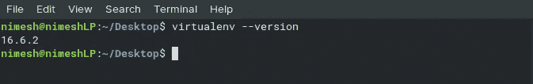

现在，通过键入以下命令创建一个虚拟环境。

> virtualenv my_package

运行该命令后，将创建一个名为 ***my_package*** 的目录。这个目录包含使用 Python 项目所需的包所需的所有可执行文件。这是 Python 包将被安装的地方。

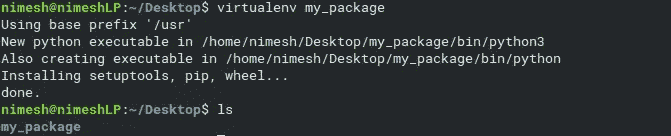

可以看到，已经创建的目录名为 ***my_package*** 。现在通过终端进入文件夹。

> cd **我的 _ 包**

创建虚拟环境后，您需要激活它。这可以使用以下命令来完成:

> 。绑定/激活

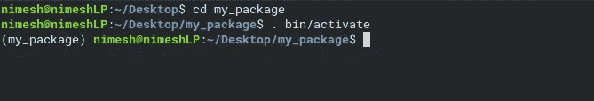

一旦虚拟环境被激活，虚拟环境的名称将出现在终端的左侧。这将让您知道虚拟环境当前是活动的。在上图中，名为 virtual environment 的 my _ pacakge 处于活动状态。

**2。安装软件包**

现在我们将安装 NLTK 库。

> pip3 安装 nltk

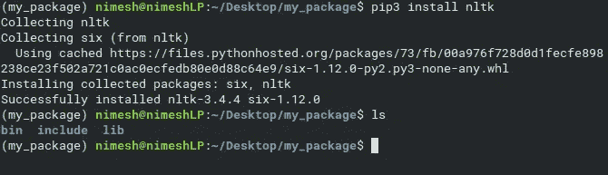

一旦安装完成，这个包将被安装在 lib/python3.6/site-packages 中。

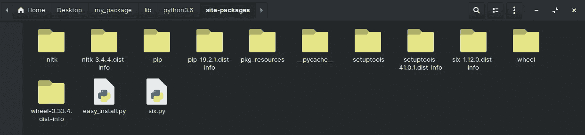

nltk package is installed.

现在停用虚拟环境。

> 复员

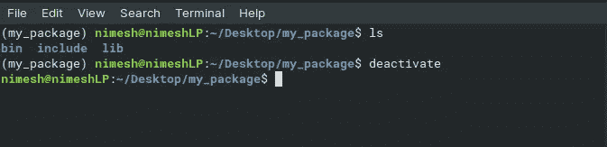

**3。删除 bin 和 include 目录**

现在删除 **bin** 和 **include** 目录，创建一个名为 **python 的空目录。**必须将目录命名为“python”。

移动 python 目录中的 lib 目录。

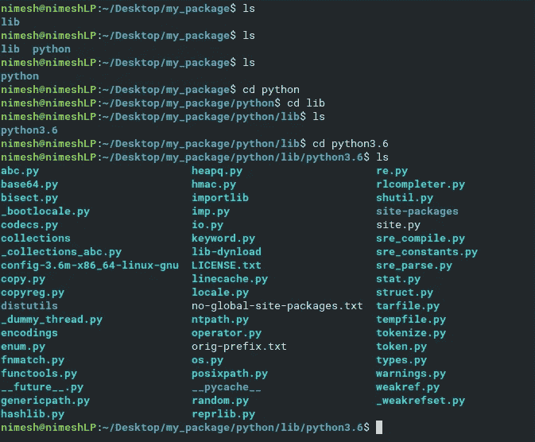

所以路径是 my _ package/python/lib/python 3.6

**4。压缩 python 文件夹**

转到 my_package 目录并键入以下命令:

> zip -r 包 _nltk.zip。

**packag_nltk:** 压缩文件的名称

**。:**这意味着压缩那个目录里的所有东西。

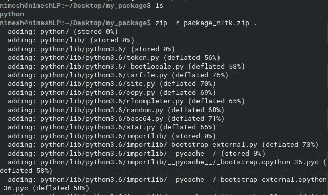

现在，我们将把名为 package_nltk.zip 压缩文件放入 my_package 目录中。

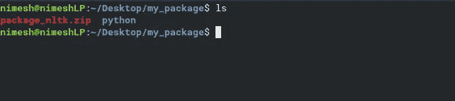

The zipped file named package_nltk.zip

**5。上传压缩文件到 S3 水桶。**

如果压缩文件的大小超过 10 兆，然后上传到 S3 桶。我的是 68.9MB。

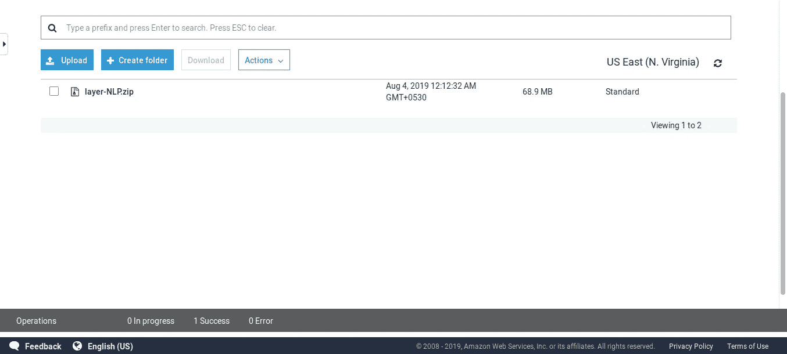

现在复制 zip 文件的对象 URL。

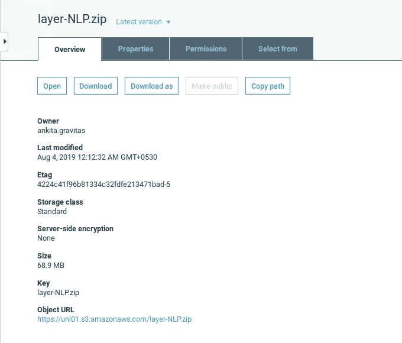

Copy the Object URL.

**6。创建你的层**

a)转到λ

b)点击层

c)点击创建层

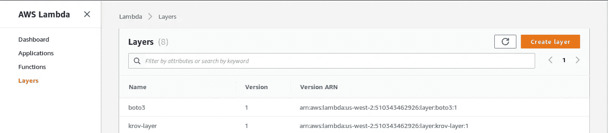

给你的层命名，粘贴 zip 文件的对象 URL，选择兼容的运行时 Python3.6 并点击创建。

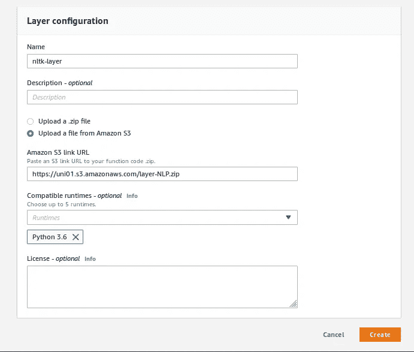

现在你已经成功地创建了一个层。:)

将这一层添加到你的 lambda 函数中，你就可以开始了。