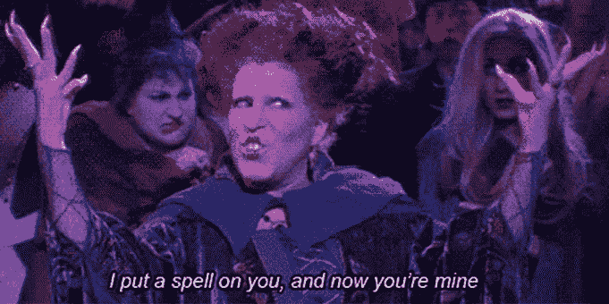

# 如何分享你业务的一切而不放弃任何东西

> 原文：<https://medium.datadriveninvestor.com/how-to-share-everything-about-your-business-without-giving-anything-away-33d936e7e30?source=collection_archive---------14----------------------->

你是否有过这样的感觉:当某人寻求“帮助”时，他故意不真诚地说出他真正想要的是什么？是不是感觉他们更像是在“泄露”你所有的秘密？我相信许多企业主都会有同感，但我承认，如果有人对增加或改进他们所知道的东西不感兴趣，那就更奇怪了。问题是，在分享他们的业务时，没有人真正是一本“打开”的书。即使是声称他们放弃了一切的人，也有所保留！这不是种族主义的事情，当然也不是自私的事情，这是常识性的事情。

为什么认为有人会保护人们愿意花钱购买的东西是一种想象的延伸呢？这就是为什么即使是最好的免费内容也会让你觉得缺少了什么。

观察这一切让我意识到，有一种方法可以保护你赚钱的本质，而不会感觉到你在牺牲你所分享的价值。

# 像蛇一样聪明，像鸽子一样无害

我从那些成功创建在线内容的人身上观察到了 5 个关键点。他们通常非常有意地宣传他们的产品(他们的服务)，宣传的形式(基于真实经验的可行建议，那些还没有准备好和他们一起工作的人仍然可以从中学习)，以及他们分享多少信息(吸引潜在客户的诱饵有价值的东西【只有 T2**)。他们也用反馈来衡量他们努力的价值。**

例如，如果你经历过有人因为你创造的内容而成为你的客户，或者看到“欣赏你写的文章中的诚实和语气”的人的电子邮件时的喜悦，这些统计数据可以帮助你确定你的哪些广告努力比其他人更有价值，让你可以忽略更多自私的请求。

这让你有点害怕吗？残酷的事实是，你真的对界限有问题，为没有界限找借口要容易得多，比如“不想拒绝不合适的人”，而不是把不合理的期望与界限的缺乏联系起来。

但你为什么不想“拒绝不合适的人”呢？你真的想和那些让你的工作变得困难的人一起工作吗？作为一个遇到过地狱客户的人来说，拒绝错误的人是我的一个目标。这让我想到了我观察到的关于那些成功在线创作内容的人的最后一件事。他们也用内容来创造界限。

我知道你可能从来没有这样看过，但是根据它的形式，内容可以用来完成三件特定的事情。它可以为那些无法负担你的人服务，而不会挤占那些有能力的人的空间，同时也排斥那些你不想与之有任何关系的人！听起来像是界限！

# **对自己的经营方式保持坚定**

最终，由你来决定分享在哪里结束，何时有人需要雇佣你。在过去，我做过没有人决定成为客户的设计，我和他们一起做过设计，只是口头上决定成为客户，我也做过设计被批准了，但从来没有付款，只是几个月后才知道客户改变了主意。这是一个难以接受的现实，所有这些情况都是我自己管理不善的结果。但是，当我学习的时候，它让我寻找更有效的方法来做我的工作和帮助别人。现在，如果有人想让我帮他们设计他们的网络形象，我有一个设计面试，正好可以满足他们的需求。我控制了自己的冲动，并通过设定界限给自己一点空间。尽管如此，有时还是很难说服客户实施他们自己的安全网，尽管他们有过被烧伤的经历。如果我清楚地采纳了自己的建议，这就不是信任的问题，但这种冷漠的体验永远不会令人舒服。

然而，如果你从一个母亲对她的新生儿的角度来思考这个问题，就更容易理解保护你的企业并不是一件坏事，也更容易理解这听起来有多荒谬(即使你只是私下里这么想)。

所以，最后，如果我想让你从这篇文章中学到一件事，那就是你的工作方式有界限是可以的，只要你能合理地衡量它立即提供的价值。

我是 [**、品牌桶**](http://bit.ly/TheBrandTUB) 的创始人和视觉品牌策略师