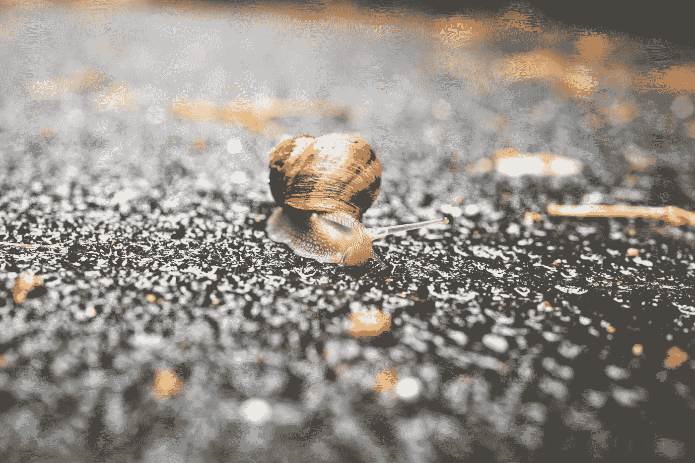

# 如何放慢脚步:献给没有时间做这件事的人的颂歌

> 原文：<https://medium.datadriveninvestor.com/how-to-slow-down-an-ode-to-people-who-aint-got-time-for-that-9131a0c511b5?source=collection_archive---------18----------------------->

Photo by [Erwan Hesry](https://unsplash.com/@erwanhesry?utm_source=medium&utm_medium=referral) on [Unsplash](https://unsplash.com?utm_source=medium&utm_medium=referral)

作为一个长期(并且正在恢复)做事情的人，除了忙碌，我几乎不知道还有什么别的方式——毕竟，滚石不生苔(或者类似的东西)。要做的事情数不胜数。我什么都迟到了。浪费我时间的人是最坏的一类人。我有点喜欢/讨厌这种生活方式的每一分钟，因为在大多数情况下，它很好地服务于我:我把事情做完。我做我想做的任何事情。我全身心地投入到我的追求中。它使我能够实现我的目标。而且，这种生活方式已经让我无数次濒临绝境。筋疲力尽、精神崩溃、争吵——我全都见过。我开始意识到，我很难放慢脚步，只是*在我所在的地方，我是谁，以及我正在经历的事情。对我来说，放慢脚步甚至让 T4 注意到花朵都很难，更别说停下来闻闻它们了。*

我花了 20 多年才意识到我甚至有能力放慢脚步，又花了 30 多年才意识到这种能力实际上是我拥有的一块肌肉(我们都有)，通过适当的锻炼，我可以锻炼这块肌肉，并用它来深刻地改变我的生活方式，同样重要的是，改变我体验生活的方式。

> [DDI 编辑推荐——积极心理学:马丁·e·p·塞利格曼的视觉科学](http://go.datadriveninvestor.com/mindset1/matf)

这是我学到的一件事，也是我尝试过的一件事，它帮助我放慢了脚步，也为我打开了大门。

## 我们如何度过我们的日子，就是我们如何度过我们的一生。

安妮·狄勒德在她的散文集《写作生活》中与我们分享了她对生命意义和美好生活的思考。在书中，她写道:“我们如何度过每一天，当然也就如何度过我们的一生”。

好好想想。

你是如何度过你的日子的？它们是否充满了丰富性？意识到并感激你在哪里，你是谁，你和谁在一起，你在做什么？还是他们充满了压力，充满了“应该”,充满了落后感，觉得自己是涂在太多面包上的太少的黄油？

当我为自己思考这个问题并意识到我的答案是什么时，我故意决定停止像乘坐喷气式飞机一样在世界上移动，不顾一切地在尽可能短的时间内覆盖尽可能多的地方(并忍受随之而来的时差)，而是决定开始像一个徒步的小旅行者一样在世界上移动，慢到足以注意到甚至停下来闻每个地方以及中间的花。

## 放慢生活的脚步，实际上就是放慢你的日子(哪怕一次一分钟)

我通常的做法是咬下一大块我认为我可能咀嚼的东西，然后再多吃一些。要么做大，要么回家。在某些情况下，这对我真的很有效，但是我知道，当我真的陷入困境时，比如放慢速度，我需要从小事做起。

所以，我开始了一个小练习，打算每周尽可能多的完成它，即使只是几个星期。我为自己开发的实践看起来像这样:

1.  下班回家，走得尽可能慢。没有公共汽车，没有自行车，没有出租车，没有汽车。路上不要在 iPhone 上盲目滚动。最重要的是，不要匆忙。
2.  走路的时候，注意你的步伐。尽可能地慢，直到你开始感觉到不耐烦或急迫。用这种感觉作为一个触发器来注意你周围的东西——一个景象、一个声音、一种气味、一些其他的感觉——并记下你欣赏它的地方。再次放慢你的步伐，重复直到你回家。
3.  在一天结束的时候，反思一下你觉得迫切需要去做的事情——如果你慢下来，你担心会落后于什么？如果你落后了，你担心会发生什么？为了慢下来并欣赏你现在所处的位置，你不得不放下什么？如果你能在生活中像这样放慢脚步，会有什么可能？

在尝试这个练习时，我了解到行走部分很容易。把我的速度放慢到正常人的速度是很棘手的。把它放慢到真正的漫步是一个巨大的挑战。但是，通过练习和思考，我开始注意到我明显没有了不耐烦，没有了去做下一件事的强烈欲望，这样我就可以继续过我的生活，做所有的事情。取而代之的是，我开始感受到一种前所未有的轻松和充实感；一种就在(并欣赏)我在的地方的感觉。我的亲人和朋友注意到了。我开始能够把更多的精力放在我周围重要的事情上。

这不是一夜之间发生在我身上的事情；事实上，这根本不是发生在我身上的事情。这是我开发的一块肌肉——这是一种放慢速度并更频繁地获得这种感觉的能力。这是一种微妙但强大的肌肉，我仍在探索它的力量。

当你放慢生活节奏的时候，甚至是以很小的方式，开始意识到你正在做什么和还有什么要做的时候，你能提供给你的东西，你能闻到的、尝到的、感觉到的、经历的东西，实际上是令人惊讶的。试一试，享受那些花的味道。

编辑披露:编辑有时会发布有用资源的链接。如果你发现它们有用并购买，我们会赚很多钱。不，我不是说要把我的薯条做大。我说的是超大披萨上的意大利香肠。感谢您一直以来的支持，我们将继续为 p̶e̶p̶p̶e̶r̶o̶n̶i̶出版而努力。