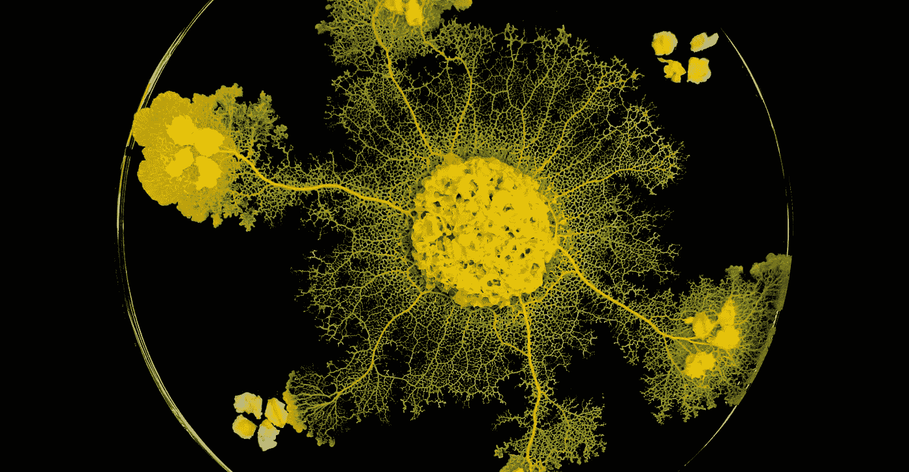
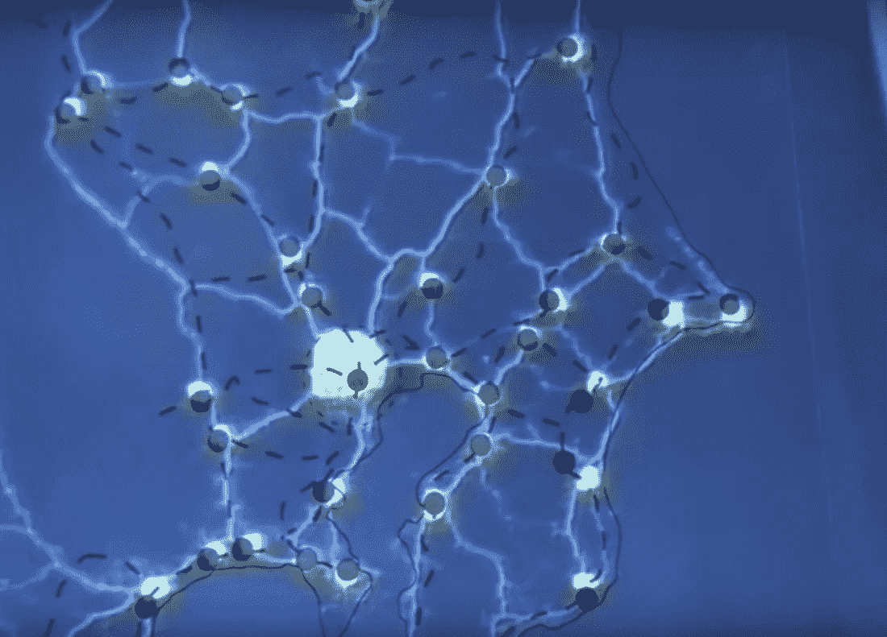
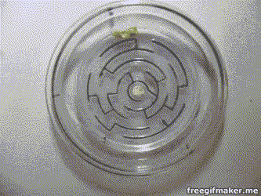
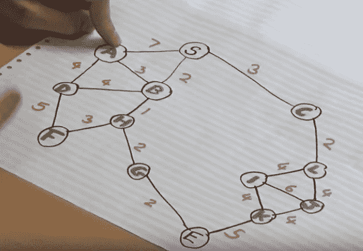
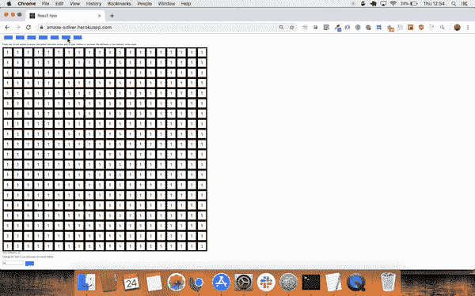

# 用 Javascript 中的 A-star 算法解决迷宫

> 原文：<https://medium.datadriveninvestor.com/how-to-solve-a-maze-with-an-a-star-algorithm-javascript-if-you-are-not-a-slime-mold-8eae685cb018?source=collection_archive---------2----------------------->



最近，巴黎一家动物园展示了一种独特的生物——多头绒泡菌。它属于原生生物的范畴，包括所有难以分类的生物。这种单细胞生物有 720 种性别，并具有一些显著的特征。例如，如果被切成两半，它可以在几秒钟内自愈。它还具有记忆事物、将记忆转移给同类其他人以及解决复杂任务的能力。

这种生物确实不同寻常，因为它能够在不拥有大脑或神经系统的情况下完成所有这些任务。这让科学家们感到困惑，他们试图理解这是如何发生的，并产生了一种新的智能形式的想法。

这种黏菌能够完成的令人难以置信的壮举之一是解决复杂的迷宫，并找到最短的路径或最有效的方式来连接食物来源。在一项实验中，研究人员使用食物作为地标，复制了东京主要城市的位置。为了模拟山脉、湖泊和其他障碍物，他们使用了光线，因为绒泡菌会避开强光。结果与实际的东京铁路网惊人地相似，工程师们花了很长时间来规划。这里有一段视频，展示了实验过程中的黏菌。

下图对比东京铁路网和黏菌网，惊人的相似。



在迷宫实验中，黏菌会找到最有效的路径。如果路径的一部分被切割并加入到另一个黏菌中，则信息被传输，并且该霉菌将使用收集的信息直接继续到终点。



slime mold solving a maze

最近我开始练习算法，偶然发现了黏菌实验的描述。实验让我想起了 Dijkstra 的算法，该算法用于在考虑每条路径难度的同时，寻找从起点到终点的最短路径。例如，在街道网络中，难度可以表示道路的速度限制。谷歌地图使用 Dijkstra 的算法来找到到达目的地的最佳方式。

该算法从第一个节点开始，分析它们的邻居，将它们添加到一个列表中，该列表从开始按最短的总距离排序。每个节点都会跟踪它来自的节点。一旦一个节点从列表中添加了它的所有邻居，它就从列表中消失，下一个节点被分析。



例如，考虑上图中的节点 A。节点 A 和 S(代表起点)之间的距离是 7。但是，如果我们通过节点 B 去 A，我们可以行进的总距离是 3 + 2，小于 7。因此，先前从起点到节点 A 的总距离被覆盖，并且它来自的节点也被新节点(在本例中为 B)覆盖。

这个过程一直持续到端点节点从列表中消失，并且可以通过读取最佳路径来自的节点来回溯最短路径。

该算法的一个有效实现是 A 星搜索。该算法考虑一个启发式值，例如从每个点到终点的空中距离，并将其加到从起点到终点的距离上。这有助于提高算法的速度，因为距离端点较远的节点在分析中会受到惩罚，并且在排序时会在列表中下移。但如果是实际最短路径，最终还是要分析的。

所以我试图挑战这位法国无脑小天才，用我自己的方式写出他天生的作品。



[T3【https://amaze-solver.herokuapp.com/】T5](https://amaze-solver.herokuapp.com/)

我用面向对象的方式处理了这个问题，使用了两个类:AStar 和 NodeElement。第一个负责实现通用算法，而第二个负责表示迷宫的每个单元。

下面是 NodeElement 类:

```
class NodeElement {constructor(row, col, difficulty, isWall, aStarInstance){
 this.row = row
 this.col = col
 this.wall = isWall
 this.difficulty = difficulty
 this.through = ‘’
 this.heuristic = Infinity
 this.eucledianDistance = Infinity
 this.difficultySums = ‘’
 this.aStar = aStarInstance
 this.neighbours=[]
 }heuristicCalculation(node) {
 this.eucledianDistance = this.aStar.eucledianDistance(this)
 let difficultySums
 difficultySums = this.difficulty + Number(node.difficultySums)
 if( this.difficultySums === ‘’ ) {
 this.difficultySums = difficultySums
 this.through=node
 }else if(this.difficultySums > difficultySums){
 this.difficultySums = difficultySums
 this.through=node
 }else{}return this.heuristic = this.eucledianDistance + this.difficultySums
 }neighboursCalculation(openQueue){
 let neighbours = []
 let enqueuedNode
 let newNodeif(this.row < this.aStar.matrixLenght-1) {
 enqueuedNode = openQueue.find(node=>node.row===this.row+1 && node.col===this.col)
 if(!enqueuedNode){
 newNode = this.aStar.nodes.find(node=>(node.row===this.row+1 && node.col===this.col))
 if(newNode.wall===false && !this.aStar.alreadyChecked.includes(newNode) && !this.aStar.openQueue.includes(newNode) ) {
 newNode.heuristicCalculation(this)
 neighbours.push(newNode)
 }
 }else{
 enqueuedNode.heuristicCalculation(this)
 }
 }
 if(this.col < this.aStar.matrixLenght-1) {
 enqueuedNode = openQueue.find(node=>node.row===this.row && node.col===this.col+1)
 if(!enqueuedNode){
 newNode = this.aStar.nodes.find(node=>(node.row===this.row && node.col===this.col+1))
 if(newNode.wall===false && !this.aStar.alreadyChecked.includes(newNode) && !this.aStar.openQueue.includes(newNode) ){
 newNode.heuristicCalculation(this)
 neighbours.push(newNode)
 }
 }else{
 enqueuedNode.heuristicCalculation(this)
 }
 }
 if(this.row > 0) {
 enqueuedNode = openQueue.find(node=>node.row===this.row-1 && node.col===this.col )
 if(!enqueuedNode){
 newNode = this.aStar.nodes.find(node=>(node.row===this.row-1 && node.col===this.col))
 if(newNode.wall===false && !this.aStar.alreadyChecked.includes(newNode) && !this.aStar.openQueue.includes(newNode) ){
 newNode.heuristicCalculation(this)
 neighbours.push(newNode)
 }
 }else{
 enqueuedNode.heuristicCalculation(this)
 }
 }
 if(this.col > 0) {
 enqueuedNode = openQueue.find(node=>node.row===this.row && node.col===this.col-1)
 if(!enqueuedNode){
 newNode = this.aStar.nodes.find(node=>(node.row===this.row && node.col===this.col-1))
 if(newNode.wall===false && !this.aStar.alreadyChecked.includes(newNode) && !this.aStar.openQueue.includes(newNode) ){
 newNode.heuristicCalculation(this)
 neighbours.push(newNode)
 }
 }else{
 enqueuedNode.heuristicCalculation(this)
 }
 }
 return neighbours}}
```

第二类用于编排算法的规则:

```
class AStar {constructor(start, end, grid){
 this.grid = grid
 this.matrixLenght = this.grid.length
 this.nodes =[]
 for(let i=0;i<grid.length;i++){
 for(let j=0;j<grid[0].length;j++){
 if(i==start[0] && j==start[1]){
 this.start = new NodeElement(i, j, grid[i][j].difficulty, grid[i][j].wall, this)
 this.nodes.push(this.start)
 } else if(i==end[0] && j==end[1]){
 this.end = new NodeElement(i, j, grid[i][j].difficulty, grid[i][j].wall, this)
 this.nodes.push(this.end)
 } else {
 this.nodes.push(new NodeElement (i,j,grid[i][j].difficulty,grid[i][j].wall,this))
 }
 }
 }
 this.openQueue = [this.start]
 this.alreadyChecked = []this.optimalPath=[]
 }startAlgorithm(){
 this.openQueue[0].heuristicCalculation(this.openQueue[0])while(this.openQueue.length>0 ){
 if(this.openQueue[0]===this.end){
 break
 }
 let neighbours = this.openQueue[0].neighboursCalculation(this.openQueue)
 let queue = this.openQueue
 this.alreadyChecked.push(queue.shift())
 let newQueue = queue.concat(neighbours)
 let sortedNeighbours = newQueue.sort(function(a, b){return a.heuristic — b.heuristic})
 this.openQueue = sortedNeighbours
 }
 if(this.openQueue.length !== 0){this.retrieveOptimalPath(this.openQueue[0])}
 }retrieveOptimalPath(node){
 this.optimalPath.push(node)
 if(node.through!==this.start){
 this.retrieveOptimalPath(node.through)
 }else{
 this.optimalPath.push(this.start)
 }
 }eucledianDistance(node){
 return Math.sqrt(Math.pow(Math.abs(node.row-this.end.row),2)+Math.pow(Math.abs(node.col-this.end.col),2))
 }} 
```

为了获得最佳路径，我们可以使用上面创建的具有以下输入的类:

```
let aStarInstance = new AStar (start, end, grid)
 aStarInstance.startAlgorithm()
 let optimalPath = aStarInstance.optimalPath
```

在上面的代码中，AStar 的一个实例是使用起点和终点坐标以及一个网格创建的。“网格”是包含代表每个元素的对象的矩阵。每个对象都有一个布尔值来表示它是否代表一面墙，如果不是一面墙，还有一个难度级别。一个示例对象是:

```
{wall:false, difficulty: 1}
```

`start`和`end`是具有两点的笛卡尔坐标的数组。

这是 heroku 主机的 github repo。

[https://github.com/nuclear-pasta/AstarAlgorithmTest](https://github.com/nuclear-pasta/AstarAlgorithmTest)

如果你有兴趣将这种算法与其他算法进行比较，有一个很棒的网站可以让你比较不同的算法，并看到被分析细胞的可视化。这可以帮助你更好地理解它们是如何工作的。请点击这里查看:

[https://qiao.github.io/PathFinding.js/visual/](https://qiao.github.io/PathFinding.js/visual/)

此外，如果你想更好地了解 Dijkstra 的算法是如何工作的，在 Computerphile YouTube 频道上有一个由 Mike Pound 主演的精彩视频。我在创建算法时使用了这个视频作为参考(甚至在之前的一张图片中包含了他双手的照片！).

[https://www.youtube.com/watch?v=GazC3A4OQTE](https://www.youtube.com/watch?v=GazC3A4OQTE)