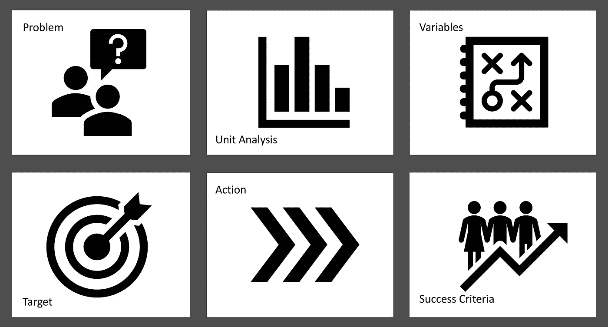

# 如何通过数据科学解决业务问题

> 原文：<https://medium.datadriveninvestor.com/how-to-solve-business-problems-by-data-science-1e1657205238?source=collection_archive---------6----------------------->

Six Steps to Formulate Problems as Data Science Project

正如我在上一篇文章中提到的[，我想讨论将业务问题转化为数据科学项目的方法。上周我花了几个小时研究这个话题。在这篇文章中，我将分享我在成功的数据科学项目的准备阶段所学到的东西。**有些内容是我从谷歌数据科学项目的最佳实践中总结出来的。**请不要忘记，任何与数据相关的学科都没有严格定义的规则。这就是为什么最好假设这是一个建议，而不是指导方针。](https://medium.com/@grkmjfn/my-first-months-as-a-data-scientist-406519898e42)

数据科学这个术语有两个部分:数据+科学。

 [## 数据科学和软件工程哪个更有前途？数据驱动的投资者

### 大约一个月前，当我坐在咖啡馆里为一个客户开发网站时，我发现了这个女人…

www.datadriveninvestor.com](https://www.datadriveninvestor.com/2019/01/23/which-is-more-promising-data-science-or-software-engineering/) 

理科部分多与数学和计算有关。在个人的尺度上，学习数学基础和发展计算能力的途径有很多。我也会在后面的文章中讨论这些。如果你正在经营一家企业，如果有足够的财力和时间，你可以重新培训员工、雇佣新人才或投资新技术。

数据类似于水。可能是倾盆大雨，也可能是撒哈拉的一片绿洲。有时是苏必利尔湖，有时是瓶装水。有时候需要磨浆机喝，有时候马上开始灌水。在个人的范围内，你可以公开访问大量数据来启动一个项目。如果你正在经营一家企业，那么大部分时间负担都在你自己的肩上。

顾名思义，当企业面临问题时，数据科学可能是武器之一。科学部分带来了解决方案。然而，数据是通过科学的应用而变得神奇的药剂。如果你用错了药剂，你会得到一只丑陋的青蛙。如果你有正确的药剂，你会得到一只天鹅(有时甚至是一只黑色的)。

**这就是为什么结果取决于问题定义和可用数据之间的联系强度。**现在，让我们仔细看看增强这些联系的步骤。

## **1。陈述你的业务问题**

这一切都始于一个明确定义的业务问题。你应该提出一个预测性的问题来为你的组织创造/提高商业价值。而且，你还应该知道预测结果的影响。

您的业务问题可能在以下设计中定义:**我们如何(实现目标)以便(影响/结果)？**

**示例:**

我们如何**根据我们现有的投资组合为潜在客户**设定促销/折扣，以便我们能够**增加我们在他们支出中的份额**？

## 2.进行单元分析

问题越详细，就越清晰。单元分析大部分时间是从业务问题中衍生出来的。您应该根据可用数据定义单位，并且它们应该在整个数据集中保持一致。您必须确定每一行在数据中的含义。

**举例:**

**业务问题:**在**提前**几个周期，预计**需求**有多少，以便我们能够有效地管理**库存**？

**单位分析:**需求**(订单数量，SKU 等。)、**时间**(日/周/月)、**库存 **(SKU、桶数、包裹数等。)**

## 3.定义您的变量

变量是做出预测的关键。将变量视为数据中的列。你的变量应该与单元分析相关联。

所有变量在衡量时应该一致，例如，如果价格是一个变量，货币应该事先定义为美元等。

所有变量的规格也应该一致。例如，如果性别是一个变量，既有女性又有男性违反了一致性。

变量在大多数时候可能没有结构。例如，您的变量集可能是图像中的像素，这些像素也可能具有不同的大小。在这种情况下，您应该标准化图像以确保一致性。

**例如:**

商务问题:网上顾客可能有兴趣购买什么样的鞋子？

**变量:** **品牌、颜色、尺码、价格、折扣率、库存 _YN 等。**

## 4.定义你的目标

目标是我们要预测的。它还应该与单元分析相关联。它可以是分类的，例如热/暖/冷，或者是连续的，例如摄氏度/华氏度。

**例如:**

**商业问题:**我们应该如何预测宠物在被收养前在收容所待的时间？

**变量:**类型、品种、性别、颜色、名称、健康状况、宠物形象、简介描述等。

**目标:宠物被收养前在收容所度过的天数**

## 5.设定动作

计划你将如何从预测中获益。行动是用户在得到预测后应该做的事情。你的行动应该源于一个业务问题，并与目标相关联。根据结果，可能需要多个替代操作。

**示例:**

商业问题:优步应该如何为特定的旅程定价？

**变量:**距离、拥堵程度、预计出行时间、客户历史、周边供需等。

**目标:**向潜在客户展示旅程的总成本

**措施:将客户的回应(接受/拒绝)反馈给优步算法，以优化定价。**

## 6.定义成功标准

必须定义您的成功标准，以衡量解决方案对问题的影响。可能是最小化或最大化。它可能来自统计标准。你最好用金钱、时间或人力来表现它。成功标准应该与目标相关联。

**举例:**

**业务问题:**开始生产的库存数量多少合适？

**目标:**每个产品在每个配送中心的库存限额

**成功标准:最小化平均库存(通过持有成本货币化)，最大化短缺数量减少百分比(货币化短缺)**

我喜欢上面展示的简化的、不切实际的优步例子。下面是这种情况的完整示例:

**商业问题:**优步应该如何为特定的旅程定价，以便他们可以最大化他们的每日收入？

**变量:**距离、拥堵程度、客户历史、预计出行时间、周边供需等。

**目标:**向潜在客户展示旅程的总成本

**措施:**将客户的回应输入优步算法，以优化定价。

**成功标准:**通过最大化客户接受度(或目标价格)，与静态定价模式相比，每日收入增加 15%。

**单位分析:**

*   价格:(美元)
*   距离:(起点和目标位置之间的英里数)
*   拥堵级别:(低、中、高、非常。由另一个模型生成)
*   客户历史:(A 代表接受，D 代表拒绝。A-D-阿-阿)
*   预计行驶时间:(分钟)
*   周围的供应/需求:(3 名免费司机，7 名客户要求。3/7)

希望你喜欢这篇文章。下一场见！

这篇文章的土耳其语版本[可以在这里找到。](https://medium.com/@grkmjfn/i%CC%87%C5%9F-problemlerini-veri-bilimiyle-nas%C4%B1l-%C3%A7%C3%B6zeriz-d9d32c523b07)