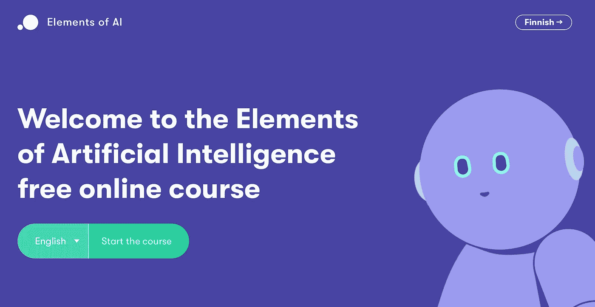
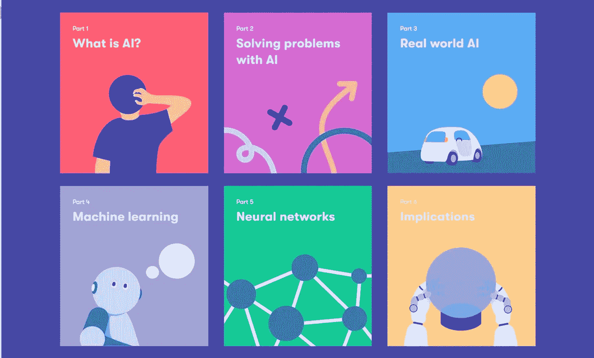
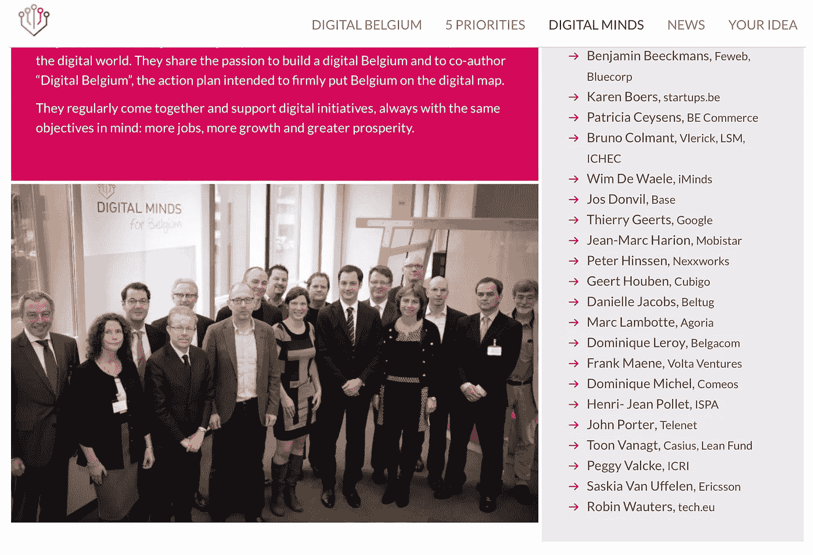

# 如何点燃有价值的终身学习篝火？

> 原文：<https://medium.datadriveninvestor.com/how-to-spark-a-valuable-lifelong-learning-bonfire-d448753fbb23?source=collection_archive---------19----------------------->

## 世界各地的政府和公司需要在终身学习方面采取更有力的行动

你能想象一个国家，私营公司、大学和政府共同努力，在人工智能方面培训其人口吗？一个投资教育各个年龄段的人的国家？

听起来好得难以置信？一点也不！芬兰证明了这是可能的。

看看免费的在线课程“人工智能的元素”就知道了。他们的最终目标是让整个芬兰人了解人工智能及其机遇，https://www.elementsofai.com/.。一个雄心勃勃又令人兴奋的项目！

这种在线课程有多种用途。首先，你可以在短时间内以几乎为零的边际成本接触到很多人。

更重要的是，当然对于人工智能(AI)这样的主题，人们可以学习真正理解这样一种新技术是怎么回事。它能做什么，不能做什么。它有助于区分小麦和谷壳，信号和噪音。更好的见解导致更好的想法和更好的人工智能在不同商业领域的实际应用。芬兰人说他们希望在这方面成为世界领袖。

在一个中国和美国都在人工智能研究和开发上投资数十亿美元的世界里，其他国家应该寻找替代方法，以确保他们在“人工智能”的桌子上占有一席之地。当芬兰人开始他们激动人心的项目时，他们很清楚这一点。他们的倡议是可能的，不需要像中国和美国那样花费同样多的钱。

聪明的芬兰，非常聪明！它始于对人的真正投资。相信未来的机会和增长。政府、大学和私人公司一起。

那么比利时等其他国家还在等什么呢？

由于(新)技术的进步，世界发展速度比以往任何时候都快，世界各地的政府和公司都知道他们需要在这个世界上保持竞争力。与此同时，每个人都知道世界各地的人们都在努力跟上数字化的步伐，因为他们不再了解所有这些新技术是什么。已经部分危及某些国家未来的竞争力。

是的，有很多关于终身学习重要性的讨论。我们可以在 20 岁出头就毕业，而不必在职业生涯的剩余时间里学习任何新东西，这样的时代已经过去很久了。我们大多数人现在开始意识到这一点。这是一件好事，因为意识是让奇迹发生的必要的第一步。

然而，对大多数人来说，将终身学习付诸实践仍然是一个更难跨越的障碍。通常是一个非常困难的问题。

导致不愉快的结果，比如最近在比利时。1 月初，移动电信公司 Proximus 宣布了一项重组计划，通过该计划，他们将裁掉当前员工的很大一部分。令比利时政府感到惊讶和不满的是。很大一部分现有员工根本无法在未来几年提供公司要求的附加值。所有这些都是由数字化转型的快速步伐和人工智能等技术的进步推动的。

在沟通中，Proximus 不止一次强调了说服员工在职业生涯的整个时间范围内保持学习变得多么重要的困难。在当今的工作环境中，这一点变得至关重要。

员工经常忽视终身学习，这对他们来说绝对是一个错误。毫无疑问。每个人都有责任关心自己的个人发展。尽管如此，私营公司本身以及政府和其他相关利益攸关方应确保消除目前阻碍人们充分实现这一目标的所有可能障碍。

这也是现在比利时和其他许多国家应该改进的地方:公司应该投入更多的时间和金钱为他们的员工预见正确的教育计划。大多数时候，还没有一个坚实的基础来进一步发展。

事情应该从谈论终身学习和“敏捷”劳动力的必要性转向真正开始以结构化的方式和长远的眼光来预见学习计划。

例如，根据员工的业绩记录和个人历史，公司应该不难清楚地发现知识差距并安装必要的培训程序。是的，这需要投资，而投资的收益只有在以后才会产生，这是真的。然而，每个农民都知道，在播种和收获果实之间有相当长的时间。公司需要将类似的思维模式付诸实践。困难但并非不可能。那些愿意以这种方式投资的人将会在 5 到 10 年内成为赢家。毫无疑问。

在政府的支持下，企业与大学之间的更多合作也可能是向前迈出的一大步。是什么阻碍了其他国家和公司智能复制芬兰的例子？

例如，人们可以为前比利时数字议程部长亚历山大·德·克鲁(Alexander De Croo)几年前发起的“数字思维”倡议喝彩。这可以被认为是朝着正确方向迈出的第一小步，现在将由亚历山大的继任者菲利普·德·巴克进一步培育。

这一倡议需要导致采取行动，重点解决与终身学习有关的一些现有问题的核心。导致实际解决方案的集中行动。你可以从一群聪明的人那里得到一些东西，比如彼得·辛森、多米尼克·勒罗伊、约翰·波特、蒂埃里·吉茨、帕特里夏·塞申斯等等。，所有“数字头脑”成员(http://digitalbelgium.be/en/digital-minds/)

芬兰的例子表明，有很多机会可以把握。复制或为其他数字和技术领域做出类似的东西一点也不困难。

例如，政府和像“数字头脑”这样的团体可以预见针对人们终身学习重要性的交流活动和教育意识计划。向人们展示明天，当然还有后天，将会和他们今天生活的地方完全不同。让人们意识到并对未来感到兴奋，这样所有人都会相信保持自我教育的重要性。最终目标应该是人们不再选择忽视终身学习，就像 Proximus 的首席执行官 Dominique Leroy 最近声称的那样。人们会主动掌握自己的事情。

当启动这种公司或全国范围的项目时，了解受众并相应地解决他们的问题是很重要的。不要用所有这些困难的术语来淹没人们，这些术语是“技术精英”急切使用的，如深度学习、机器学习、区块链等。

使用影响人们日常生活的实用实例。准确定位附加值和巨大的机会。邀请大家一起思考。预见木材和安全火柴，让人们自己点燃篝火。公司和政府应该提供氧气来维持火势。

别说这是在做梦。芬兰的情况正好相反。所有利益相关者需要开始越来越有效地合作。现在，不是明天。为人们铺平了通往未来的道路，在未来，他们都可以保持生产力，为公司的未来、国家的未来做出贡献。

为了他们自己，他们的子孙。以及整个世界的未来。因此，像芬兰的“人工智能元素”这样的倡议是如此美丽。最后一次:其他国家和公司还在等什么？

与此同时，对于那些迫不及待想开始学习人工智能的人来说:芬兰人也用英语提供他们的课程。全世界的人都可以报名。

所以去争取吧。就像我一样。