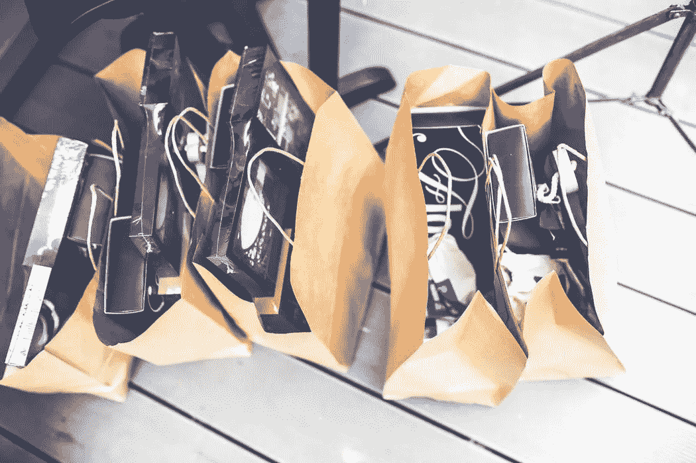

# 如何在购物时少花钱？必读

> 原文：<https://medium.datadriveninvestor.com/how-to-spend-less-while-shopping-for-anything-must-read-df9fd37cf8e3?source=collection_archive---------24----------------------->

冲动购物是大多数人在理财时面临的问题之一。当我们得到加薪时，很容易将额外的钱分配到我们不需要的东西上。

我们靠薪水过活，不知道我们的钱去了哪里。我们冲动地买东西。

我们能做些什么来避免冲动购买？继续读..

# 1.列出你的需求

出门购物前，列出你需要买的东西。限制清单上的项目数量，只包括你真正需要的东西。

> ***“冲动购买弥补了你的大部分开销。列出你真正需要的物品，避免冲动购买。”***

如果你在去购物前带着一份物品清单，你告诉你的潜意识只买清单上的东西。你的潜意识会避免你购买清单上没有的东西。

所以在你去购物之前，准备一份你需要的物品清单。

# 2.过度研究

如果你尝试一下，你会大吃一惊。如果你稍微研究一下，你会在不同的商店或不同的电子商务网站上找到不同价格的相同商品。

在购买任何东西，尤其是大型电器之前，要做好充分的调查。这样做你可以省下一大笔钱。也说明你在乎自己的血汗钱。给自己一些时间来看看产品是否能以最实惠的价格买到是值得的。

# 3.你一做完就走

所以，如果你带着你需要购买的物品清单，你应该在完成后尽快离开超市。

> ***“不要落入美化产品外观的陷阱。这是一种迫使你冲动购买产品的营销策略。”***

不要因为产品呈现的方式好或者有额外的功能就冲动购买。一旦你完成了你的购物清单，就离开超市。

# 4.对销售代表说不

很多时候，当我们计划购买大型家用电器或汽车，如摩托车和汽车时，我们通常会被销售代表跟随，他们会向我们解释产品或汽车的各种功能。他们被训练来说服消费者购买他们想卖的产品。

他们考虑他们的利润。因此，他们说服你购买利润丰厚的产品。

> ***“举个手机的例子。你认为价格为什么定为 499 美元、799 美元或 999 美元？为什么不是 500 美元、800 美元或 1000 美元？这是一种营销策略。500 美元实际上是 500 美元，但 499 美元从 4 美元开始，这是为了让消费者相信产品是便宜的，买得起的。我们作为消费者没有意识到的是，499 美元和 500 美元差不多。我们不会花 500 美元买它，但会花 499 美元再考虑一下。”***

这年头都是营销。如果你擅长营销，你可以以最好的价格销售你的普通产品。大部分有折扣的产品其实并没有折扣。这种产品的价格首先被提高，然后被标记为打折并以原价出售，并在最高价上划线作为标签。当心这种折扣和营销策略。

# 5.寻找最短的结账队伍

那么，一旦你买完清单上的东西，你还在等什么呢？站在最短的退房队伍里，尽早退房。

不要在商场里乱逛，到处找不需要的东西。如果你到处闲逛，冲动购物，最终会身无分文。站在最短的结账队伍里结账就行了。

# 6.永远不要饿着或渴着去购物

无论何时外出购物，确保你已经填饱了肚子，以避免街上昂贵和不健康的食品。

确保你很好地照顾自己的健康和个人财务，避免在外面吃东西或喝水。

> ***“出去购物，饿了或渴了，是你在街上购买不健康食品的另一个机会，这除了影响你的个人财务外，还会影响你的健康。”***

# 7.在你想去某个地方之前，先去购物

如果你要参加某个场合或你某个朋友的生日聚会，就在参加生日聚会之前去购物。这样你会花更少的时间购物，只买需要的东西。

在任何场合之前去购物会让你加快速度，只买你需要的东西，而不是到处逛。你意识到你应该在要求的场合出现的时间，并且提前完成你的购物。这样可以避免你买不必要的东西。

# 8.千万不要在购物网站上存信用卡

储值卡让你可以随时轻松地在网上购买不必要的东西，只需点击一个按钮。避免在购物网站上存卡。特别是信用卡。

> ***“知道如何明智地使用你的信用卡。我们购买的大多数物品都是我们不需要的，用我们没有的钱，只是用我们的信用卡。”***

避免在购物网站上保存信用卡。如果你在购物网站上有信用卡或借记卡，当你坐在舒适的沙发上时，买东西就变得很容易。更喜欢货到付款，因为它会让你从自动提款机中提取现金，如果你是一个拖延者，你会避免这种情况。

如果您对个人理财和资金管理有任何疑问，我希望收到您的来信。

**感谢阅读。如果你喜欢这篇文章，请随意点击那个按钮👏帮助其他人找到它。**

# 然后..

 [## 改善个人财务状况的 10 大最佳理财哲学

### 在之前的一篇关于财务负责人特质的文章中，我提到了几个特征…

medium.com](https://medium.com/@abhilashgupta8149/10-best-financial-philosophies-to-improve-your-personal-finances-18426eb080f9) 

*原载于* [*FinCalC 博客*](https://fincalc-blog.blogspot.com/2018/10/how-to-spend-less-while-shopping-for-anything-fincalc.html)