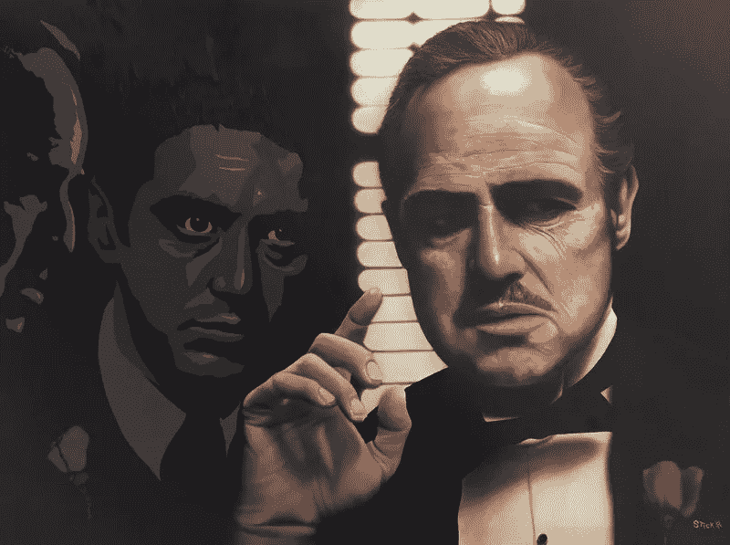

# 如何识别懦夫？

> 原文：<https://medium.datadriveninvestor.com/how-to-spot-a-coward-fd56e0919844?source=collection_archive---------17----------------------->

## 找“标题”，“你知道我是谁吗？”

[Source](https://www.michaelgodardartgallery.com/shop-stickman-gallery/rol2znh6a5j3ive0ooeumruru1e7fm)

我的一个朋友问我是否可以帮他一个忙，为他进行一次审计，我这些天没做什么，所以我想为什么不呢。

曾经有一段时间，我是一名苦苦挣扎的实习生，试图让收支平衡；对付空虚的自我。

一切似乎都很顺利，直到我遇到了这种类型的绅士。

他立刻变得有防御性，消极好斗，并且刚刚对我的外表发表了评论。

**他的打破僵局的方式是，*“你这里谈完了没有？”***

现在，我不会读心术——但有时我认为我的直觉不会让我失望。

我想， ***“这家伙，他在隐藏什么。”***

> “先生我只需要一个快速的网络取证审计。大约五分钟后我就不烦你了。只需要插入程序并运行它以发现任何不一致之处。”
> 
> “那你的徽章呢？”
> 
> “我没有徽章，我是分析师。”*(这家伙以为我是 FBI？)*
> 
> “好的。我不明白你为什么需要这样做。”
> 
> “先生，做安全测试是我的工作。我需要报告所有系统都是安全的。”
> 
> “我知道我的电脑是安全的，我已经安装了杀毒软件。挺好的。很安全。”
> 
> "好的，先生，我将不得不在我的报告中提到你没有遵守."
> 
> “你想在这里做什么，伙计？”
> 
> "先生，如我所说，我正在测试系统的安全漏洞."
> 
> “好的。那么这是怎么回事，你为什么要提到我的名字？”
> 
> “先生，以防你的雇主抱怨我们没有做好审计工作。我们需要能够报告这是因为不合规。”
> 
> “别废话了伙计，去别的地方做你的工作吧。让我们这些人工作吧。”*(“我们”？还有其他人没有大惊小怪，伙计！)*
> 
> “没问题，先生。谢谢你的时间。我能不能把电脑上的序列号快速拍下来？”
> 
> “你知道我是世卫组织吗？”他怒视着我。(该死，我真的触到你的痛处了)
> 
> “是的，我愿意，先生。你(他的名字)，负责证券交易台。”
> 
> “是的……所以也许你应该更清楚你在和谁说话，我是这层楼最资深的人。”
> 
> “好的，先生。我道歉。”

我径直走回去，从资产日志上拿到了序列号。

**容易解决。**

当我在收集完审计数据后要离开，以便稍后移交给我的伙伴— **时，我接到电话，嘿，是我的伙伴！**

> “嘿，我们刚接到投诉。你威胁过某某吗？”
> 
> “嗯……不，有一位先生没有遵守。我在报告里提到过。我会在几个小时内为你准备好。”
> 
> “好的，你确定？我们接到一个非常愤怒的电话，伙计。”
> 
> “哦……什么？没有人。我没有。那里有摄像头，你可以去看看。我为什么要威胁那个家伙？”
> 
> “显然那家伙显然认为你威胁了他。你想让我把我们通过电子邮件收到的正式投诉转发给你吗？”
> 
> “好的，送过来。如果你愿意，我可以回去道歉？”
> 
> “不，这很好。我们会解决的。办公室见。”

我到达后不久，我们都聚在一起；通读一封极度愤怒的邮件。

那不是满足的人使用的语言，那是有所隐瞒的人使用的语言；*是我的怀疑。*

当然，我可能错了——***也许我是个混蛋？***

因此，为了补偿——我决定，我要回去。

我的朋友决定陪我去，我们一起解决这个问题。

我们遇到了 a 组的人，他们需要知道我做了什么让他们最生气的**【资深交易员】**。

记住，房间里声音最大的人往往是最弱的。

如果个人要建立自己的权威，唯一可以依靠的就是他们的**“职位”来保持他们的权利感；你没什么好担心的。**

**我们有一个来回，我解释我的立场——这位先生不能让自己打断我。**

**因此，意识到如果这个人有另一个脑细胞，它将是孤独的——我决定，管它呢，这不值得争论。**

**我道歉，试图讲和，走上前和他握手； ***停战？*****

**他对我不屑一顾，告诉我“滚开，你是个懦夫”。**

**这触发了我，他把我的沉默误解为懦弱。**

**现在我体内的疯子接管了我，我决定——我们开始吧。**

> *****“介意我完成我的审计吗？”*****
> 
> **负责判断我行为的小组同意了。**
> 
> **我说“谢谢你”。**
> 
> **这位先生爆发了，“你不可能做审计。我保证你再也不工作了，伙计！”**
> 
> **我的朋友现在决定让他们知道，“他并不完全为我们工作”。**
> 
> **“那他为什么在这里做审计？!"*番茄说。***
> 
> **“先生，这是纳比尔·塔希尔博士。他是我的老板，他拥有这家公司。”哎呀，我正玩得开心呢，我的朋友毁了它！**
> 
> **“是的，先生。继续审计。”团队中出现了理性的声音。**

**简单地说，审计结果并不完全有利于这位先生；不得不耐着性子看完半辈子的色情电影并不是我最自豪的时刻。**

****说真的，哥们？他们现在有一种叫做智能手机的东西！****

***你是迈克尔·法斯宾德的什么“耻辱”？时不时在办公室打飞机？我心里想。***

**哦，这是多么美好的生活啊，每当我想到自己所有的希望都失去了；因果报应会想办法提醒我。**

> ****保持冷静，保持谦逊。****

****时刻注意个人姓名的下降以建立权威。****

> **卡瓦诺家族、温斯坦家族、麦道夫家族，都因为声音太大而走上了同一条路；他们都很虚弱，内心空虚。**

**以我最喜欢的电影中我最喜欢的一个场景来结束这篇文章，**

> ****吹嘘自己是莫·格林没有任何意义&弗雷多，永远不要站在家庭的对立面——除非你有防弹眼镜。****

****Source: The Godfather (1972)****

****感谢您的阅读！****